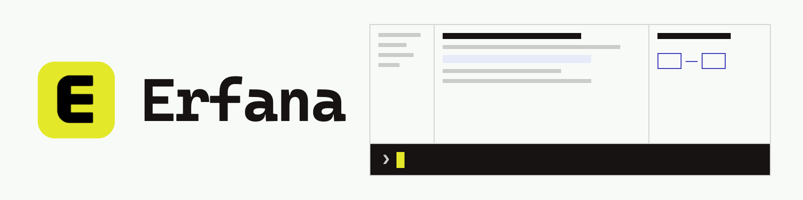
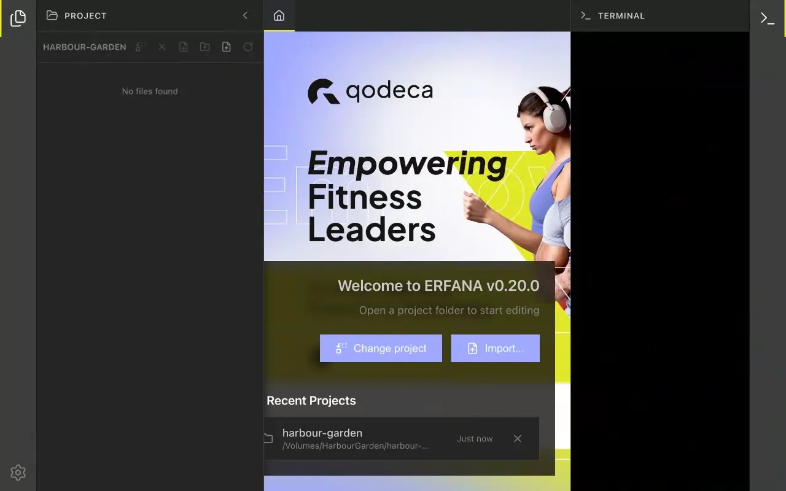

<h1 align="center">
  <picture>
    <source media="(prefers-color-scheme: dark)" srcset="docs/assets/readme/banner-dark.png">
    <source media="(prefers-color-scheme: light)" srcset="docs/assets/readme/banner-light.png">
    
  </picture>
</h1>

<strong>The open-source, agent-native Markdown workspace.</strong> 
Editor, live preview, project tree and a terminal running Claude Code – or any CLI agent – in one window.

   
  macOS (Apple silicon) · Windows · no Linux build · free and open source (GPL-3.0-only) 
  <a href="docs/user-guide/README.md">User guide</a> · <a href="docs/CHANGELOG.md">Changelog</a> · <a href="https://github.com/qodeca/erfana/discussions">Discussions</a> · <a href="CONTRIBUTING.md">Contributing</a>

  <picture>
    <source media="(prefers-reduced-motion: reduce)" srcset="docs/assets/readme/demo-still.png">
    
  </picture> 
  A real Claude Code session in Erfana. The agent's working time is sped up.

  
  
  

## How it works

Erfana puts a coding agent beside your Markdown work – one window holds the editor, live preview, project tree, and a terminal running your agent. Open a project and they share one loop:

- **Run the agent in your editor** – a clean top-level `claude` session (or any CLI agent) in the integrated terminal, in your project's context.
- **Watch its context** – for a Claude Code session, a per-panel meter shows the model, its 200k/1M context window, and how full it is, live.
- **Turn Markdown into prompts** – right-click a selection for prompt templates (Explain, Modify, Ask, Visualize); the prompt goes straight to the agent.
- **Edits land in your file** – mutation prompts apply the agent's changes back into the document.

Erfana hosts the agent; it has no AI of its own. [How Erfana works with agents](docs/user-guide/how-erfana-works-with-agents.md).

## Features

- **[Integrated terminal](docs/user-guide/reference/terminal.md)** – Claude Code or any CLI agent in an xterm.js terminal, with file links, drag-and-drop paths, and screenshot and camera capture.
- **[Markdown editor](docs/user-guide/reference/editor.md)** – Monaco with live preview, scroll sync and [Mermaid diagrams](docs/user-guide/how-to/work-with-mermaid-diagrams.md).
- **[Project tree](docs/user-guide/reference/project-tree.md)** – live git status and drag-and-drop file management.
- **[Import](docs/user-guide/how-to/import-a-document.md) and [export](docs/user-guide/reference/export.md)** – import 50+ formats with local OCR (LiteParse); export to PDF and Word with diagrams.
- **[HTML preview](docs/user-guide/reference/html-preview.md)** – open a `.html` file as a live page, with a per-host prompt before any remote request.
- **[Image viewer](docs/user-guide/reference/image-viewer.md)** – zoom, pan and full screen, repainting when the file changes on disk; export to PNG, PDF or the clipboard.
- **[Media transcription](docs/user-guide/how-to/transcribe-audio-or-video.md)** – audio and video to text through the OpenAI API or fully offline with `whisper.cpp`.

Everything else, with screenshots, is in the [user guide](docs/user-guide/README.md).

## Get started

1. Download the signed build for your OS from **[Releases](https://github.com/qodeca/erfana/releases/latest)** – [verify it](#release-verification) before installing.
2. Install it (macOS: open the `.dmg`; Windows: run the setup `.exe`).
3. Launch Erfana and open a project folder – the editor, project tree, and terminal open in context.

Then follow [your first ten minutes](docs/user-guide/first-ten-minutes.md). Prefer to build from source? See [Contributing and building](#contributing-and-building).

## Support

Questions and help: [GitHub Discussions](https://github.com/qodeca/erfana/discussions). Bugs and feature requests: the [issue templates](.github/ISSUE_TEMPLATE). [SUPPORT.md](SUPPORT.md) says where each kind of request goes; security issues stay private (below).

## Release verification

Every release on or after `v0.9.5` ships signed artifacts: a minisign-signed `SHA256SUMS`, macOS notarization, and Windows Authenticode. Verify downloads before installing – the public keys and the `minisign` + `sha256sum` recipe are in [`docs/security.md`](docs/security.md#release-signing-v095-174) and [`docs/build/release.md`](docs/build/release.md), with the keys mirrored in [`docs/release-pubkey.txt`](docs/release-pubkey.txt).

## Security

Erfana enables context isolation, disables node integration in the renderer, exposes a sandboxed `contextBridge` IPC layer with input validation on every channel, and applies a Content Security Policy – details in [`docs/security.md`](docs/security.md). Report vulnerabilities **privately** via [GitHub's private advisory reporting](https://github.com/qodeca/erfana/security/advisories/new) – see [SECURITY.md](SECURITY.md); please do not open a public issue for an unfixed vulnerability.

## Built by Qodeca

Erfana is built by **[Qodeca](https://qodeca.com)**, a Warsaw-based software team building software since 2014 for the fitness, sport, and healthcare industries. [More about Erfana and Qodeca](docs/about.md) · [LinkedIn](https://www.linkedin.com/company/qodecasoftwaredevelopment) · [hi@qodeca.com](mailto:hi@qodeca.com)

## License

Erfana is free software, licensed under the **GNU General Public License v3.0 only** (`GPL-3.0-only`) – see [LICENSE](LICENSE), [COPYRIGHT](COPYRIGHT), and bundled third-party notices in [THIRD-PARTY-LICENSES.md](THIRD-PARTY-LICENSES.md). Per-file licensing follows the [REUSE specification](https://reuse.software) (SPDX headers + `REUSE.toml`). Contributions are accepted under a [Contributor License Agreement](CLA.md) that does **not** restrict your rights under the GPL ([why](docs/about.md#why-open-source-and-how-its-licensed)).

Copyright (c) 2025-2026 Qodeca sp. z o.o.

## Trademarks

The GPL covers Erfana's **code**, not its **name or branding**. "Erfana" and "Qodeca", and the associated logos, are trademarks of Qodeca sp. z o.o. You may use and fork the software under the GPL, but distributions of modified versions must be **renamed** – see [TRADEMARKS.md](TRADEMARKS.md). Qodeca publishes the official signed builds.

"Claude" and "Claude Code" are trademarks of Anthropic. Erfana is not affiliated with, sponsored by, or endorsed by Anthropic – it simply runs the `claude` CLI like any other terminal program. See [TRADEMARKS.md](TRADEMARKS.md#third-party-trademarks) for the full third-party trademark notice, including OpenAI and Whisper.

## Contributing and building

Contributions are welcome – see [CONTRIBUTING.md](CONTRIBUTING.md) and our [Code of Conduct](CODE_OF_CONDUCT.md). Contributions are accepted under **GPL-3.0-only** and require agreeing to the project [Contributor License Agreement](CLA.md) – by opening a pull request you agree to its terms (your Git author identity is your record). Building from source – prerequisites, `npm ci`, and which branch to work from – is in [CONTRIBUTING.md](CONTRIBUTING.md#local-setup).

Developer docs: **[docs/](docs/README.md)** · [Architecture](docs/architecture.md) · [Build](docs/build/README.md) · [Testing](docs/testing/README.md) · [Changelog](docs/CHANGELOG.md).
