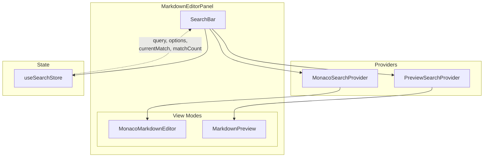
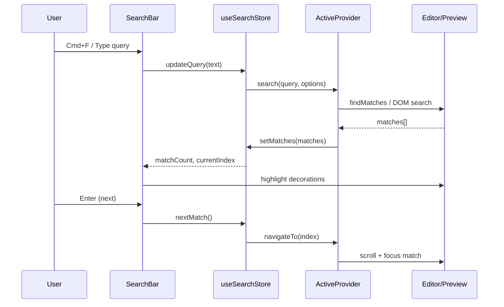
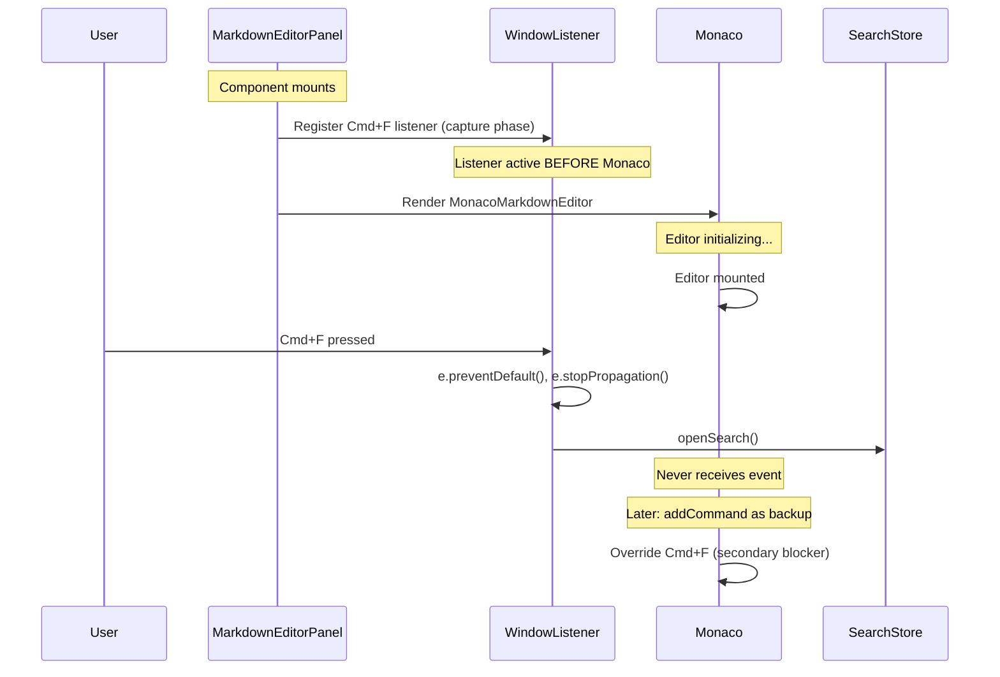

# ADR-BRS001-001: Unified in-file search architecture

**Date:** 2025-12 | **Status:** Proposed

## Context

Erfana needs unified search functionality across its markdown editor (Monaco-based) and rendered preview (DOM-based). Users expect consistent `Cmd/Ctrl+F` behavior regardless of which view mode is active (editor, preview, or split). The current Monaco Editor has built-in search functionality, but it only works in the editor pane and uses Monaco's native widget styling that doesn't match Erfana's design system.

### Current state

- **MonacoMarkdownEditor.tsx**: Wraps Monaco Editor with `useImperativeHandle` pattern for method exposure
- **MarkdownPreview.tsx**: Renders markdown to DOM with line-range tracking (`data-line-start/end`)
- **MarkdownEditorPanel.tsx**: Manages view modes (editor/preview/split/split-horizontal)
- **State management**: Zustand stores for global state (`useSettingsStore`, `useProjectStore`)
- **UI patterns**: Design tokens in `design-tokens.css`, no border-radius, CSS modules

### Problem statement

1. Monaco's built-in find widget cannot be disabled cleanly (per [microsoft/monaco-editor#2732](https://github.com/microsoft/monaco-editor/issues/2732))
2. No search exists for the preview pane
3. No unified search experience across view modes
4. Different views require fundamentally different search implementations

## Decision drivers

From BRS requirements:

- **NFR-001**: <100ms search latency for 10K lines
- **NFR-002**: Full keyboard accessibility
- **NFR-003**: Design tokens only (no hardcoded values)
- **NFR-004**: Provider pattern for extensibility
- **NFR-005**: >=80% test coverage

## Considered options

### Option 1: Extend Monaco's find widget

| Pros | Cons |
|------|------|
| Native Monaco integration | Cannot disable built-in `Cmd+F` reliably |
| No additional UI code | Styling conflicts with design system |
| Good performance | No preview search integration |
| | Breaks extensibility requirement |

### Option 2: Custom unified SearchBar with provider pattern

| Pros | Cons |
|------|------|
| Full control over UI/UX | More implementation effort |
| Consistent design tokens | Must intercept Monaco keybindings |
| Extensible to future previews | DOM search performance considerations |
| Single search experience | State coordination complexity |

### Option 3: Separate search per view

| Pros | Cons |
|------|------|
| Simpler per-view implementation | Inconsistent UX |
| Independent state | Violates unified search requirement |
| | Duplicate code |
| | Users must learn two interfaces |

## Decision outcome

**Chosen option: Option 2 - Custom unified SearchBar with provider pattern**

This option provides the best balance of user experience, extensibility, and alignment with Erfana's design system while meeting all NFRs.

## Architecture design

### Component diagram



### Data flow sequence



### SearchProvider interface

```typescript
/**
 * Search provider interface for implementing view-specific search logic.
 * Each view type (Monaco, Preview, future viewers) implements this interface.
 */
interface SearchProvider {
  /** Unique provider identifier */
  readonly id: string

  /** Human-readable name for debugging */
  readonly name: string

  /**
   * Execute search with given parameters.
   * Should be debounced internally if needed.
   * @returns Array of match results with position info
   */
  search(query: string, options: SearchOptions): Promise<SearchMatch[]>

  /**
   * Navigate to and highlight a specific match.
   * Provider is responsible for scrolling and visual focus.
   * @param index Zero-based match index
   */
  navigateTo(index: number): void

  /**
   * Clear all search highlights and reset state.
   * Called when search is closed or query cleared.
   */
  clearHighlights(): void

  /**
   * Update visual distinction between current and other matches.
   * @param currentIndex Currently focused match index
   */
  updateCurrentMatch(currentIndex: number): void

  /** Cleanup resources (decorations, observers, etc.) */
  dispose(): void
}

interface SearchOptions {
  caseSensitive: boolean
  wholeWord: boolean
}

interface SearchMatch {
  /** Provider-specific identifier for this match */
  id: string
  /** Zero-based line number (for Monaco) or element index (for DOM) */
  line: number
  /** Character offset within line (Monaco) or text offset (DOM) */
  startColumn: number
  endColumn: number
  /** Matched text content */
  text: string
  /** Provider-specific metadata for navigation */
  meta?: unknown
}
```

### Zustand store structure

```typescript
interface SearchState {
  // Core state
  isOpen: boolean
  query: string
  options: SearchOptions

  // Match state
  matches: SearchMatch[]
  currentIndex: number

  // Active provider
  activeProviderId: string | null

  // Per-provider state cache (for split mode pane switching)
  providerStates: Map<string, { query: string; matches: SearchMatch[]; currentIndex: number }>

  // Focus restoration
  previousFocusElement: HTMLElement | null

  // Actions
  openSearch: () => void
  closeSearch: () => void
  resetSearch: () => void  // Full reset on file change
  updateQuery: (query: string) => void
  updateOptions: (options: Partial<SearchOptions>) => void
  setMatches: (matches: SearchMatch[]) => void
  nextMatch: () => void
  previousMatch: () => void
  setActiveProvider: (id: string | null) => void
  savePreviousFocus: (element: HTMLElement | null) => void
  restoreFocus: () => void
  cacheProviderState: (providerId: string) => void
  restoreProviderState: (providerId: string) => void
}

const useSearchStore = create<SearchState>((set, get) => ({
  isOpen: false,
  query: '',
  options: { caseSensitive: false, wholeWord: false },
  matches: [],
  currentIndex: 0,
  activeProviderId: null,
  providerStates: new Map(),
  previousFocusElement: null,

  openSearch: () => {
    // Save current focus before opening
    const activeElement = document.activeElement as HTMLElement | null
    set({ isOpen: true, previousFocusElement: activeElement })
  },
  closeSearch: () => set({ isOpen: false, query: '', matches: [], currentIndex: 0 }),

  // Full reset for file changes - clears everything including provider cache
  resetSearch: () => set({
    isOpen: false,
    query: '',
    options: { caseSensitive: false, wholeWord: false },
    matches: [],
    currentIndex: 0,
    activeProviderId: null,
    providerStates: new Map(),
    previousFocusElement: null
  }),

  updateQuery: (query) => set({ query, currentIndex: 0 }),
  updateOptions: (options) => set((state) => ({
    options: { ...state.options, ...options }
  })),
  setMatches: (matches) => set({ matches }),
  nextMatch: () => set((state) => ({
    currentIndex: state.matches.length > 0
      ? (state.currentIndex + 1) % state.matches.length
      : 0
  })),
  previousMatch: () => set((state) => ({
    currentIndex: state.matches.length > 0
      ? (state.currentIndex - 1 + state.matches.length) % state.matches.length
      : 0
  })),
  setActiveProvider: (id) => {
    const state = get()
    // Cache current provider state before switching
    if (state.activeProviderId && state.isOpen) {
      state.cacheProviderState(state.activeProviderId)
    }
    set({ activeProviderId: id })
    // Restore new provider's state if cached
    if (id) {
      state.restoreProviderState(id)
    }
  },
  savePreviousFocus: (element) => set({ previousFocusElement: element }),
  restoreFocus: () => {
    const { previousFocusElement } = get()
    if (previousFocusElement && typeof previousFocusElement.focus === 'function') {
      previousFocusElement.focus()
    }
    set({ previousFocusElement: null })
  },
  cacheProviderState: (providerId) => {
    const { query, matches, currentIndex, providerStates } = get()
    const newCache = new Map(providerStates)
    newCache.set(providerId, { query, matches, currentIndex })
    set({ providerStates: newCache })
  },
  restoreProviderState: (providerId) => {
    const { providerStates } = get()
    const cached = providerStates.get(providerId)
    if (cached) {
      set({ query: cached.query, matches: cached.matches, currentIndex: cached.currentIndex })
    } else {
      // New provider, start fresh but keep search open
      set({ query: '', matches: [], currentIndex: 0 })
    }
  }
}))
```

### Monaco search provider implementation

```typescript
import * as monaco from 'monaco-editor'

// Decoration options for match highlighting
const MATCH_DECORATION: monaco.editor.IModelDecorationOptions = {
  isWholeLine: false,
  className: 'search-match-decoration',
  overviewRuler: {
    color: 'var(--color-brand-lime-muted)',
    position: monaco.editor.OverviewRulerLane.Center
  }
}

const CURRENT_MATCH_DECORATION: monaco.editor.IModelDecorationOptions = {
  isWholeLine: false,
  className: 'search-match-current-decoration',
  overviewRuler: {
    color: 'var(--color-brand-lime)',
    position: monaco.editor.OverviewRulerLane.Center
  }
}

class MonacoSearchProvider implements SearchProvider {
  readonly id = 'monaco'
  readonly name = 'Monaco Editor'

  private editor: monaco.editor.IStandaloneCodeEditor | null = null
  private decorations: string[] = []
  private cachedMatches: { range: monaco.Range; text: string }[] = []

  constructor(editorRef: React.RefObject<MonacoEditorHandle>) {
    // Get editor instance via existing getEditor() method
    this.editor = editorRef.current?.getEditor() ?? null
  }

  async search(query: string, options: SearchOptions): Promise<SearchMatch[]> {
    if (!this.editor || !query) {
      this.cachedMatches = []
      return []
    }

    const model = this.editor.getModel()
    if (!model) return []

    try {
      // Escape special regex characters in query for safe literal search
      const escapedQuery = query.replace(/[.*+?^${}()|[\]\\]/g, '\\$&')

      // Use Monaco's findMatches API
      const matches = model.findMatches(
        escapedQuery,
        true,                  // searchOnlyEditableRange
        false,                 // isRegex (false - we escaped special chars)
        options.caseSensitive,
        options.wholeWord ? 'boundary' : null, // wordSeparators
        false                  // captureMatches
      )

      this.cachedMatches = matches.map(m => ({
        range: m.range,
        text: model.getValueInRange(m.range)
      }))

      return matches.map((match, i) => ({
        id: `monaco-${i}`,
        line: match.range.startLineNumber,
        startColumn: match.range.startColumn,
        endColumn: match.range.endColumn,
        text: model.getValueInRange(match.range),
        meta: { range: match.range }
      }))
    } catch (error) {
      // Graceful degradation: log and return empty
      console.warn('MonacoSearchProvider.search error:', error)
      this.cachedMatches = []
      return []
    }
  }

  navigateTo(index: number): void {
    if (!this.editor || index < 0 || index >= this.cachedMatches.length) return

    const match = this.cachedMatches[index]
    this.editor.setSelection(match.range)
    this.editor.revealLineInCenter(match.range.startLineNumber)
    this.editor.focus()
  }

  clearHighlights(): void {
    if (this.editor) {
      this.decorations = this.editor.deltaDecorations(this.decorations, [])
    }
    this.cachedMatches = []
  }

  updateCurrentMatch(currentIndex: number): void {
    if (!this.editor || this.cachedMatches.length === 0) return

    // Build decoration array: current match gets distinct style
    const newDecorations = this.cachedMatches.map((match, i) => ({
      range: match.range,
      options: i === currentIndex ? CURRENT_MATCH_DECORATION : MATCH_DECORATION
    }))

    this.decorations = this.editor.deltaDecorations(this.decorations, newDecorations)
  }

  dispose(): void {
    this.clearHighlights()
    this.editor = null
  }
}
```

### Preview search provider implementation

```typescript
class PreviewSearchProvider implements SearchProvider {
  readonly id = 'preview'
  readonly name = 'Markdown Preview'

  private containerRef: React.RefObject<HTMLDivElement>
  private highlightRanges: Range[] = []
  private cssHighlight: Highlight | null = null
  private currentHighlight: Highlight | null = null
  private fallbackClassName = 'search-highlight-fallback'
  private currentFallbackClassName = 'search-highlight-current-fallback'

  constructor(containerRef: React.RefObject<HTMLDivElement>) {
    this.containerRef = containerRef
  }

  async search(query: string, options: SearchOptions): Promise<SearchMatch[]> {
    if (!this.containerRef.current || !query) {
      this.clearHighlights()
      return []
    }

    const matches: SearchMatch[] = []
    const container = this.containerRef.current

    try {
      // Use TreeWalker for efficient DOM traversal
      const walker = document.createTreeWalker(
        container,
        NodeFilter.SHOW_TEXT,
        {
          acceptNode: (node) => {
            // Skip script, style, and empty nodes
            const parent = node.parentElement
            if (!parent) return NodeFilter.FILTER_REJECT
            if (['SCRIPT', 'STYLE', 'NOSCRIPT'].includes(parent.tagName)) {
              return NodeFilter.FILTER_REJECT
            }
            if (!node.textContent?.trim()) return NodeFilter.FILTER_REJECT
            return NodeFilter.FILTER_ACCEPT
          }
        }
      )

      // Build regex for search - escape special characters for safe literal search
      const flags = options.caseSensitive ? 'g' : 'gi'
      const escapedQuery = query.replace(/[.*+?^${}()|[\]\\]/g, '\\$&')
      const pattern = options.wholeWord
        ? `\\b${escapedQuery}\\b`
        : escapedQuery
      const regex = new RegExp(pattern, flags)

      let node: Node | null
      let matchIndex = 0

      // Clear previous ranges before building new ones
      this.highlightRanges = []

      while ((node = walker.nextNode())) {
        const text = node.textContent || ''
        let match: RegExpExecArray | null

        // Reset regex lastIndex for each node
        regex.lastIndex = 0

        while ((match = regex.exec(text)) !== null) {
          const range = document.createRange()
          range.setStart(node, match.index)
          range.setEnd(node, match.index + match[0].length)

          this.highlightRanges.push(range)

          matches.push({
            id: `preview-${matchIndex++}`,
            line: 0, // DOM doesn't have line numbers
            startColumn: match.index,
            endColumn: match.index + match[0].length,
            text: match[0],
            meta: { range }
          })
        }
      }

      // Apply highlights
      this.applyHighlights()

      return matches
    } catch (error) {
      // Graceful degradation: log and return empty
      console.warn('PreviewSearchProvider.search error:', error)
      this.highlightRanges = []
      return []
    }
  }

  private applyHighlights(): void {
    // Use CSS Custom Highlight API for zero-DOM-mutation highlighting
    if ('Highlight' in window && 'highlights' in CSS) {
      this.cssHighlight = new Highlight(...this.highlightRanges)
      CSS.highlights.set('search-results', this.cssHighlight)
    } else {
      // Fallback: add class to ancestor elements (NOT mutating React's DOM tree)
      // This uses a data attribute approach instead of wrapping with <mark>
      this.applyFallbackHighlights()
    }
  }

  /**
   * Fallback highlighting for browsers without CSS Highlight API.
   * Instead of mutating the DOM with <mark> elements (which would break React),
   * we add a class to the nearest ancestor element and use CSS to highlight.
   * This is less precise but safe for React reconciliation.
   */
  private applyFallbackHighlights(): void {
    // Clear previous fallback highlights
    this.clearFallbackHighlights()

    // Add highlight class to ancestor elements
    const highlightedElements = new Set<Element>()
    for (const range of this.highlightRanges) {
      const element = this.getAncestorElement(range.startContainer)
      if (element && !highlightedElements.has(element)) {
        element.classList.add(this.fallbackClassName)
        highlightedElements.add(element)
      }
    }
  }

  private clearFallbackHighlights(): void {
    if (!this.containerRef.current) return
    const highlighted = this.containerRef.current.querySelectorAll(`.${this.fallbackClassName}`)
    highlighted.forEach(el => el.classList.remove(this.fallbackClassName))
    const currentHighlighted = this.containerRef.current.querySelectorAll(`.${this.currentFallbackClassName}`)
    currentHighlighted.forEach(el => el.classList.remove(this.currentFallbackClassName))
  }

  /**
   * Get the ancestor Element from a Node (handles TextNodes correctly)
   */
  private getAncestorElement(node: Node): Element | null {
    if (node.nodeType === Node.TEXT_NODE) {
      return node.parentElement
    }
    if (node.nodeType === Node.ELEMENT_NODE) {
      return node as Element
    }
    return null
  }

  navigateTo(index: number): void {
    if (index < 0 || index >= this.highlightRanges.length) return

    const range = this.highlightRanges[index]
    if (!range) return

    // Get the element to scroll to (handle TextNode correctly)
    const element = this.getAncestorElement(range.startContainer)
    if (element) {
      element.scrollIntoView({
        behavior: 'smooth',
        block: 'center'
      })
    }
  }

  clearHighlights(): void {
    if ('highlights' in CSS) {
      CSS.highlights.delete('search-results')
      CSS.highlights.delete('search-current')
    }
    this.clearFallbackHighlights()
    this.highlightRanges = []
    this.cssHighlight = null
    this.currentHighlight = null
  }

  updateCurrentMatch(currentIndex: number): void {
    if (currentIndex < 0 || currentIndex >= this.highlightRanges.length) return

    // CSS Highlight API path
    if ('Highlight' in window && 'highlights' in CSS) {
      const currentRange = this.highlightRanges[currentIndex]
      if (currentRange) {
        this.currentHighlight = new Highlight(currentRange)
        CSS.highlights.set('search-current', this.currentHighlight)
      }
    } else {
      // Fallback: add current class to ancestor element
      this.clearCurrentFallbackHighlight()
      const range = this.highlightRanges[currentIndex]
      const element = this.getAncestorElement(range.startContainer)
      if (element) {
        element.classList.add(this.currentFallbackClassName)
      }
    }
  }

  private clearCurrentFallbackHighlight(): void {
    if (!this.containerRef.current) return
    const currentHighlighted = this.containerRef.current.querySelectorAll(`.${this.currentFallbackClassName}`)
    currentHighlighted.forEach(el => el.classList.remove(this.currentFallbackClassName))
  }

  dispose(): void {
    this.clearHighlights()
  }
}
```

### SearchBar component structure

```typescript
interface SearchBarProps {
  provider: SearchProvider | null
}

function SearchBar({ provider }: SearchBarProps) {
  const inputRef = useRef<HTMLInputElement>(null)
  const {
    isOpen, query, options, matches, currentIndex,
    openSearch, closeSearch, updateQuery, updateOptions,
    nextMatch, previousMatch, setMatches
  } = useSearchStore()

  // Debounced search execution
  const debouncedSearch = useMemo(
    () => debounce(async (q: string, opts: SearchOptions) => {
      if (!provider) return
      const results = await provider.search(q, opts)
      setMatches(results)
    }, 100),
    [provider, setMatches]
  )

  // Execute search when query or options change
  useEffect(() => {
    if (query && provider) {
      debouncedSearch(query, options)
    }
  }, [query, options, provider, debouncedSearch])

  // Navigate when currentIndex changes
  useEffect(() => {
    if (matches.length > 0 && provider) {
      provider.navigateTo(currentIndex)
      provider.updateCurrentMatch(currentIndex)
    }
  }, [currentIndex, matches, provider])

  // Keyboard handlers
  const handleKeyDown = useCallback((e: KeyboardEvent) => {
    if (e.key === 'Escape') {
      closeSearch()
      provider?.clearHighlights()
    } else if (e.key === 'Enter') {
      e.shiftKey ? previousMatch() : nextMatch()
    }
  }, [closeSearch, nextMatch, previousMatch, provider])

  if (!isOpen) return null

  return (
    <div className="search-bar" role="search">
      <input
        ref={inputRef}
        type="text"
        value={query}
        onChange={(e) => updateQuery(e.target.value)}
        onKeyDown={handleKeyDown}
        placeholder="Search..."
        aria-label="Search in document"
      />

      <div className="search-toggles">
        <button
          className={options.caseSensitive ? 'active' : ''}
          onClick={() => updateOptions({ caseSensitive: !options.caseSensitive })}
          aria-pressed={options.caseSensitive}
          title="Case sensitive (Alt+C)"
        >
          Aa
        </button>
        <button
          className={options.wholeWord ? 'active' : ''}
          onClick={() => updateOptions({ wholeWord: !options.wholeWord })}
          aria-pressed={options.wholeWord}
          title="Whole word (Alt+W)"
        >
          ab
        </button>
      </div>

      <span className="match-count" aria-live="polite">
        {matches.length > 0
          ? `${currentIndex + 1} of ${matches.length}`
          : query ? 'No results' : ''}
      </span>

      <div className="search-navigation">
        <button
          onClick={previousMatch}
          disabled={matches.length === 0}
          aria-label="Previous match (Shift+Enter)"
        >
          <ChevronUp size={16} />
        </button>
        <button
          onClick={nextMatch}
          disabled={matches.length === 0}
          aria-label="Next match (Enter)"
        >
          <ChevronDown size={16} />
        </button>
      </div>

      <button
        onClick={closeSearch}
        className="close-button"
        aria-label="Close search (Escape)"
      >
        <X size={16} />
      </button>
    </div>
  )
}
```

### Keyboard shortcut handling

```typescript
// In MarkdownEditorPanel.tsx or a dedicated hook
useEffect(() => {
  const handleKeyDown = (e: KeyboardEvent) => {
    const isMac = navigator.platform.toUpperCase().includes('MAC')
    const modKey = isMac ? e.metaKey : e.ctrlKey

    // Cmd/Ctrl+F - Open search
    if (modKey && e.key === 'f' && !e.shiftKey && !e.altKey) {
      e.preventDefault()
      e.stopPropagation()
      openSearch()
      // Focus search input
      setTimeout(() => {
        document.querySelector('.search-bar input')?.focus()
      }, 0)
    }
  }

  // Capture phase to intercept before Monaco
  window.addEventListener('keydown', handleKeyDown, { capture: true })
  return () => window.removeEventListener('keydown', handleKeyDown, { capture: true })
}, [openSearch])
```

### Monaco keybinding override

```typescript
// In MonacoMarkdownEditor.tsx, after editor mount
const handleEditorDidMount: OnMount = (editor, monacoInstance) => {
  // ... existing setup ...

  // Disable built-in find widget
  // Use null command to unbind the shortcut
  editor.addCommand(monacoInstance.KeyMod.CtrlCmd | monacoInstance.KeyCode.KeyF, () => {
    // Do nothing - let the window-level handler take over
    // Alternatively, directly call openSearch() here
  })

  // Also override Cmd+G (find next) and Cmd+Shift+G (find previous)
  editor.addCommand(monacoInstance.KeyMod.CtrlCmd | monacoInstance.KeyCode.KeyG, () => {
    useSearchStore.getState().nextMatch()
  })
  editor.addCommand(
    monacoInstance.KeyMod.CtrlCmd | monacoInstance.KeyMod.Shift | monacoInstance.KeyCode.KeyG,
    () => {
      useSearchStore.getState().previousMatch()
    }
  )
}
```

### Keybinding timing: preventing Monaco's built-in search

The window-level capture listener must be registered BEFORE Monaco mounts to prevent any flash of Monaco's built-in search widget.



### SearchBar positioning in split mode

In split mode, the SearchBar must appear in the active pane's container:

```
┌─────────────────────────────────────────────────┐
│                markdown-toolbar                  │
├───────────────────────┬─────────────────────────┤
│                       │                         │
│    .editor-pane       │    .preview-pane        │
│    (position:relative)│    (position:relative)  │
│                       │                         │
│   ┌──────────────┐    │   ┌──────────────┐     │
│   │  SearchBar   │    │   │  SearchBar   │     │
│   │  (hidden)    │    │   │  (visible)   │     │
│   └──────────────┘    │   └──────────────┘     │
│                       │                         │
│                       │                         │
│                       │                         │
└───────────────────────┴─────────────────────────┘
```

**Implementation approach**:

```tsx
// In MarkdownEditorPanel.tsx
const [activePaneId, setActivePaneId] = useState<'editor' | 'preview'>('editor')

// Click handlers on panes
<div
  className="editor-pane"
  onClick={() => setActivePaneId('editor')}
  onFocus={() => setActivePaneId('editor')}
>
  <MonacoMarkdownEditor ... />
  {activePaneId === 'editor' && <SearchBar provider={monacoProvider} />}
</div>

<div
  className="preview-pane"
  onClick={() => setActivePaneId('preview')}
  onFocus={() => setActivePaneId('preview')}
>
  <MarkdownPreview ... />
  {activePaneId === 'preview' && <SearchBar provider={previewProvider} />}
</div>
```

**CSS positioning**:

```css
.editor-pane,
.preview-pane {
  position: relative;  /* Establish positioning context */
}

.search-bar {
  position: absolute;
  top: var(--space-4);   /* 8px from top */
  right: var(--space-8); /* 16px from right */
  z-index: var(--z-fixed);
}
```

### CSS for search highlighting

```css
/* SearchBar.css - using design tokens */
.search-bar {
  position: absolute;
  top: var(--space-4);
  right: var(--space-8);
  display: flex;
  align-items: center;
  gap: var(--space-2);
  padding: var(--space-2) var(--space-3);
  background: var(--color-bg-elevated);
  border: var(--border-width) solid var(--color-border-default);
  box-shadow: var(--shadow-md);
  z-index: var(--z-fixed);
}

.search-bar input {
  width: 200px;
  height: var(--input-height-sm);
  padding: var(--space-2) var(--space-3);
  background: var(--color-bg-input);
  border: var(--border-width) solid var(--color-border-default);
  color: var(--color-text-primary);
  font-size: var(--text-base);
  font-family: var(--font-sans);
}

.search-bar input:focus {
  outline: none;
  border-color: var(--color-border-focus);
  box-shadow: var(--shadow-focus);
}

.search-toggles button {
  padding: var(--space-1) var(--space-2);
  background: transparent;
  border: var(--border-width) solid var(--color-border-subtle);
  color: var(--color-text-secondary);
  font-size: var(--text-sm);
  cursor: pointer;
  transition: var(--transition-fast);
}

.search-toggles button.active {
  background: var(--color-bg-selected);
  border-color: var(--color-accent-primary);
  color: var(--color-text-primary);
}

.match-count {
  font-size: var(--text-sm);
  color: var(--color-text-secondary);
  min-width: 80px;
  text-align: center;
}

/* CSS Custom Highlight API styling */
::highlight(search-results) {
  background-color: var(--color-brand-lime-muted);
  color: var(--color-text-primary);
}

::highlight(search-current) {
  background-color: var(--color-brand-lime);
  color: var(--color-brand-black);
}

/* Monaco decoration classes */
.search-match-decoration {
  background-color: var(--color-brand-lime-muted);
}

.search-match-current-decoration {
  background-color: var(--color-brand-lime);
  color: var(--color-brand-black);
}

/* Fallback highlighting for browsers without CSS Highlight API */
/* Uses ancestor class approach - less precise but React-safe */
.search-highlight-fallback {
  background-color: var(--color-brand-lime-muted);
}

.search-highlight-current-fallback {
  background-color: var(--color-brand-lime);
  color: var(--color-brand-black);
}
```

## File structure

```
src/renderer/src/
  components/
    Search/
      SearchBar.tsx              # Main search overlay component
      SearchBar.css              # Styles using design tokens
      SearchBar.test.tsx         # Component tests
      index.ts                   # Barrel export
  providers/
    search/
      SearchProvider.ts          # Interface definition
      MonacoSearchProvider.ts    # Monaco Editor implementation
      MonacoSearchProvider.test.ts
      PreviewSearchProvider.ts   # DOM-based preview implementation
      PreviewSearchProvider.test.ts
      index.ts                   # Barrel export
  stores/
    useSearchStore.ts            # Zustand search state (with providerStates cache)
    useSearchStore.test.ts       # Store tests
  hooks/
    useSearchKeyboard.ts         # Global Cmd+F keyboard handling
    useSearchKeyboard.test.ts
    useSearchContentChange.ts    # Debounced re-search on content change
    useSearchContentChange.test.ts
    useActivePane.ts             # Track active pane in split mode
    useActivePane.test.ts
```

### Modified existing files

```
src/renderer/src/
  components/
    Panels/
      MarkdownEditorPanel.tsx    # Add SearchBar, active pane tracking
      MarkdownEditorPanel.css    # Add .search-bar positioning
    Editor/
      MonacoMarkdownEditor.tsx   # Add Cmd+F keybinding override
      MarkdownPreview.css        # Add fallback highlight classes
```

## Consequences

### Positive

- **Unified UX**: Single search interface across all view modes
- **Design consistency**: Uses Erfana design tokens, matches existing UI
- **Extensibility**: Provider pattern allows adding search to future views (e.g., PDF preview, diagram search)
- **Performance**: TreeWalker + CSS Highlight API is faster than DOM mutation
- **Testability**: Pure functions and clear interfaces enable comprehensive testing
- **Accessibility**: ARIA labels, keyboard navigation, live regions for screen readers
- **Split mode support**: Pane switching preserves per-provider state
- **Focus management**: Proper focus trap and restoration
- **Error resilience**: Graceful degradation on search errors

### Negative

- **Monaco interception complexity**: Must intercept keyboard events before Monaco sees them; timing-sensitive
- **CSS Highlight API browser support**: Requires class-based fallback (less precise highlighting)
- **State coordination**: Multiple providers with cached state increases complexity
- **Initial implementation effort**: More code than extending Monaco's widget
- **File change handling**: Must reset search state on file navigation

### Neutral

- **Per-pane state in split mode**: Each pane has independent search context (per FR-008)
- **No replace functionality**: Initial scope is find-only (can be added later)
- **No regex search**: Kept simple for MVP (can be added as toggle)
- **Auto re-search on content change**: Debounced 200ms (FR-012)

## Migration considerations

No migration needed - this is new functionality.

## Enforcement

- **Lint rules**: Add ESLint rule to ensure SearchBar imports from correct location
- **Code review**: Ensure new search-related code uses provider pattern
- **Testing**: Require unit tests for any search provider implementation
- **Design review**: Verify CSS uses design tokens only

## References

- [Monaco Editor: Disabling find widget discussion](https://github.com/microsoft/monaco-editor/issues/2732)
- [CSS Custom Highlight API](https://developer.mozilla.org/en-US/docs/Web/API/CSS_Custom_Highlight_API)
- [react-css-highlight: TreeWalker performance](https://github.com/yairEO/react-css-highlight)
- [Zustand + React Context pattern](https://tkdodo.eu/blog/zustand-and-react-context)
- [TreeWalker API](https://developer.mozilla.org/en-US/docs/Web/API/TreeWalker)
