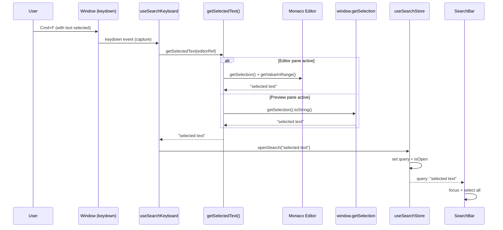

# ADR-Spec001-002: Populate search input with selected text

**Date:** 2025-12 | **Status:** Proposed

## Context

When users press Cmd/Ctrl+F to open search, they often have text selected that they want to search for. Currently, the search input opens empty, requiring users to manually type or paste the text they want to find. This is a common UX pattern in text editors like VSCode, which auto-populates the find input with selected text.

### Current architecture

The search system consists of:

1. **`useSearchKeyboard` hook** - Listens for Cmd/Ctrl+F at window level (capture phase) and calls `openSearch()`
2. **`useSearchStore`** - Zustand store with `openSearch()` action that sets `isOpen: true` and saves previous focus
3. **Search toolbar buttons** - In `MarkdownEditorPanel.tsx`, buttons that call `openSearch()`
4. **SearchBar component** - Renders when `isOpen` is true, auto-focuses input on mount

### Selection sources

| Source | API | Notes |
|--------|-----|-------|
| Monaco Editor | `editorRef.current.getEditor().getSelection()` + `model.getValueInRange(selection)` | Must check if selection is empty |
| Preview Pane | `window.getSelection()?.toString()` | Standard DOM selection API |

### Related existing code

- `MarkdownEditorPanel.tsx` line 51: `const [selectedText, setSelectedText] = useState<string>('')` - Already tracks Monaco selection
- `MonacoMarkdownEditor.tsx` line 80-84: `onDidChangeCursorSelection` callback updates selection
- `MarkdownPreview.tsx` line 863, 892, 926: Uses `window.getSelection()` for context menu

## Decision drivers

1. **Consistency with VSCode behavior** - Users expect find to pre-populate with selection
2. **Minimal API changes** - Avoid breaking existing code paths
3. **Support both selection sources** - Monaco and preview pane
4. **Maintain separation of concerns** - Selection detection should not couple store to specific UI components

## Considered options

### Option 1: Modify `openSearch(initialQuery?: string)` in store

| Pros | Cons |
|------|------|
| Single point of modification | Caller must know how to get selection |
| Clean store API | Logic duplicated in every caller |
| Simple implementation | No fallback behavior |

### Option 2: Selection getter function passed to store

| Pros | Cons |
|------|------|
| Store-agnostic selection logic | Complex callback management |
| Works with any selection source | Timing issues (selection may clear before callback) |
| Testable | Over-engineered for simple use case |

### Option 3: `openSearchWithSelection(getSelection: () => string | undefined)` action

| Pros | Cons |
|------|------|
| Explicit intent | Adds another action to store |
| Caller provides selection logic | Callback timing issues |
| Store remains UI-agnostic | Unnecessary indirection |

### Option 4: Selection detection at call site, pass to `openSearch(initialQuery?)`

| Pros | Cons |
|------|------|
| Simple, explicit | Logic duplicated (but minimal) |
| No store changes beyond signature | N/A |
| Caller has full context | N/A |
| Works synchronously | N/A |

## Decision outcome

**Chosen option: Option 4 - Selection detection at call site with optional `initialQuery` parameter**

This approach:
- Keeps the store simple (single optional parameter)
- Places selection logic where context is available (keyboard handler has pane info)
- Avoids timing issues by getting selection synchronously before opening
- Follows existing patterns in the codebase

## Implementation design

### 1. Store API change

```typescript
// useSearchStore.ts
openSearch: (initialQuery?: string) => {
  const activeElement = document.activeElement as HTMLElement | null
  set({
    isOpen: true,
    previousFocusElement: activeElement,
    query: initialQuery ?? ''  // <-- Set initial query if provided
  })
}
```

### 2. Selection helper utility

Create a pure function for getting selected text from either source:

```typescript
// src/renderer/src/utils/selectionHelpers.ts

import type { MonacoEditorHandle } from '../components/Editor/MonacoMarkdownEditor'

/**
 * Get selected text from either Monaco editor or DOM selection.
 *
 * @param editorRef - Optional ref to Monaco editor (for editor pane)
 * @returns Selected text or undefined if no selection
 */
export function getSelectedText(
  editorRef?: React.RefObject<MonacoEditorHandle | null>
): string | undefined {
  // Try Monaco editor first (if ref provided and has selection)
  if (editorRef?.current) {
    const editor = editorRef.current.getEditor()
    if (editor) {
      const selection = editor.getSelection()
      const model = editor.getModel()
      if (selection && model && !selection.isEmpty()) {
        const text = model.getValueInRange(selection)
        if (text.trim()) {
          return text
        }
      }
    }
  }

  // Fall back to DOM selection (preview pane or any selected text)
  const domSelection = window.getSelection()?.toString().trim()
  if (domSelection) {
    return domSelection
  }

  return undefined
}

/**
 * Get selected text from Monaco editor only.
 * Use when you know the active pane is the editor.
 */
export function getEditorSelection(
  editorRef: React.RefObject<MonacoEditorHandle | null>
): string | undefined {
  const editor = editorRef.current?.getEditor()
  if (!editor) return undefined

  const selection = editor.getSelection()
  const model = editor.getModel()
  if (!selection || !model || selection.isEmpty()) return undefined

  const text = model.getValueInRange(selection)
  return text.trim() || undefined
}

/**
 * Get selected text from DOM (preview pane).
 * Use when you know the active pane is the preview.
 */
export function getPreviewSelection(): string | undefined {
  const text = window.getSelection()?.toString().trim()
  return text || undefined
}
```

### 3. Keyboard handler update

```typescript
// useSearchKeyboard.ts
import { useCallback, useEffect, useRef } from 'react'
import { useSearchStore } from '../stores/useSearchStore'
import type { MonacoEditorHandle } from '../components/Editor/MonacoMarkdownEditor'
import { getSelectedText } from '../utils/selectionHelpers'

interface UseSearchKeyboardOptions {
  /** Optional ref to Monaco editor for selection detection */
  editorRef?: React.RefObject<MonacoEditorHandle | null>
}

/**
 * Hook for handling global search keyboard shortcuts.
 *
 * Listens for Cmd/Ctrl+F at the window level during capture phase
 * to open the search bar. When text is selected, it populates the
 * search input with the selection.
 */
export function useSearchKeyboard(options?: UseSearchKeyboardOptions): void {
  // Store options in ref to avoid effect re-runs
  const optionsRef = useRef(options)
  optionsRef.current = options

  useEffect(() => {
    const handleKeyDown = (e: KeyboardEvent): void => {
      const isMac = navigator.platform.toUpperCase().includes('MAC')
      const modifierKey = isMac ? e.metaKey : e.ctrlKey

      if (modifierKey && e.key.toLowerCase() === 'f') {
        e.preventDefault()
        e.stopPropagation()

        // Get selected text before opening (selection may clear on focus change)
        const selectedText = getSelectedText(optionsRef.current?.editorRef)

        useSearchStore.getState().openSearch(selectedText)
      }
    }

    window.addEventListener('keydown', handleKeyDown, { capture: true })

    return () => {
      window.removeEventListener('keydown', handleKeyDown, { capture: true })
    }
  }, [])
}
```

### 4. MarkdownEditorPanel integration

```typescript
// MarkdownEditorPanel.tsx - Update useSearchKeyboard call
// Pass editorRef so keyboard handler can get Monaco selection

useSearchKeyboard({ editorRef })

// Update toolbar button handlers to also populate selection
const handleSearchClick = useCallback(() => {
  const selectedText = getSelectedText(editorRef)
  useSearchStore.getState().openSearch(selectedText)
}, [])

// Use in toolbar buttons instead of inline openSearch():
<button
  className="toolbar-btn"
  onClick={handleSearchClick}
  title="Find (Cmd/Ctrl+F)"
>
  <Search size={16} strokeWidth={2} />
</button>
```

### 5. SearchBar auto-select behavior

When search opens with pre-populated text, the input should select all text so users can:
- Start searching immediately (text already in input)
- Replace it by just typing (selection replaces content)

The SearchBar already has this behavior (line 110-111):
```typescript
inputRef.current?.focus()
inputRef.current?.select() // Already selects all text
```

### Data flow diagram



## Edge cases and error handling

| Edge Case | Handling |
|-----------|----------|
| Empty selection | `openSearch()` called with undefined, input stays empty |
| Whitespace-only selection | `trim()` returns empty, treated as no selection |
| Multi-line selection | Included as-is (user may want to search multiline) |
| Selection clears before handler | `getSelectedText()` called synchronously before `openSearch()` |
| Monaco not ready | `editorRef.current` null check, falls back to DOM selection |
| Selection spans elements | `window.getSelection().toString()` handles this natively |

## File changes summary

| File | Change |
|------|--------|
| `src/renderer/src/stores/useSearchStore.ts` | Add `initialQuery` parameter to `openSearch()` |
| `src/renderer/src/utils/selectionHelpers.ts` | NEW - Selection helper functions |
| `src/renderer/src/hooks/useSearchKeyboard.ts` | Add editorRef option, call `getSelectedText()` |
| `src/renderer/src/components/Panels/MarkdownEditorPanel.tsx` | Pass editorRef to hook, update button handlers |

### Test files to create/update

| File | Coverage |
|------|----------|
| `src/renderer/src/utils/selectionHelpers.test.ts` | NEW - Test all selection scenarios |
| `src/renderer/src/hooks/useSearchKeyboard.test.ts` | Update - Test selection population |
| `src/renderer/src/stores/useSearchStore.test.ts` | Update - Test `openSearch(initialQuery)` |

## Consequences

### Positive

- **Matches user expectations** - Follows VSCode convention users know
- **Minimal code changes** - Only adds optional parameter to existing API
- **Backward compatible** - Existing `openSearch()` calls continue to work
- **Testable** - Pure helper function easy to unit test
- **Both selection sources supported** - Monaco and DOM

### Negative

- **Selection helper needs editorRef** - Slightly couples keyboard hook to editor
- **Multi-line selections may be unexpected** - Could search for multi-line text

### Neutral

- **No setting to disable** - Unlike VSCode's `seedSearchStringFromSelection`, always enabled

## Migration

No migration needed - this is additive functionality. Existing code paths remain unchanged.

## Enforcement

- **Code review** - Ensure any new search triggers use the selection pattern
- **Testing** - Unit tests for helper functions and integration tests for behavior

## References

- [VSCode Basic Editing - Find and Replace](https://code.visualstudio.com/docs/editing/codebasics)
- [VSCode GitHub Issue #30131 - Find in Selection](https://github.com/microsoft/vscode/issues/30131)
- Existing ADR: `/docs/architecture/adrs/adr-spec-001-001-unified-search.md`
