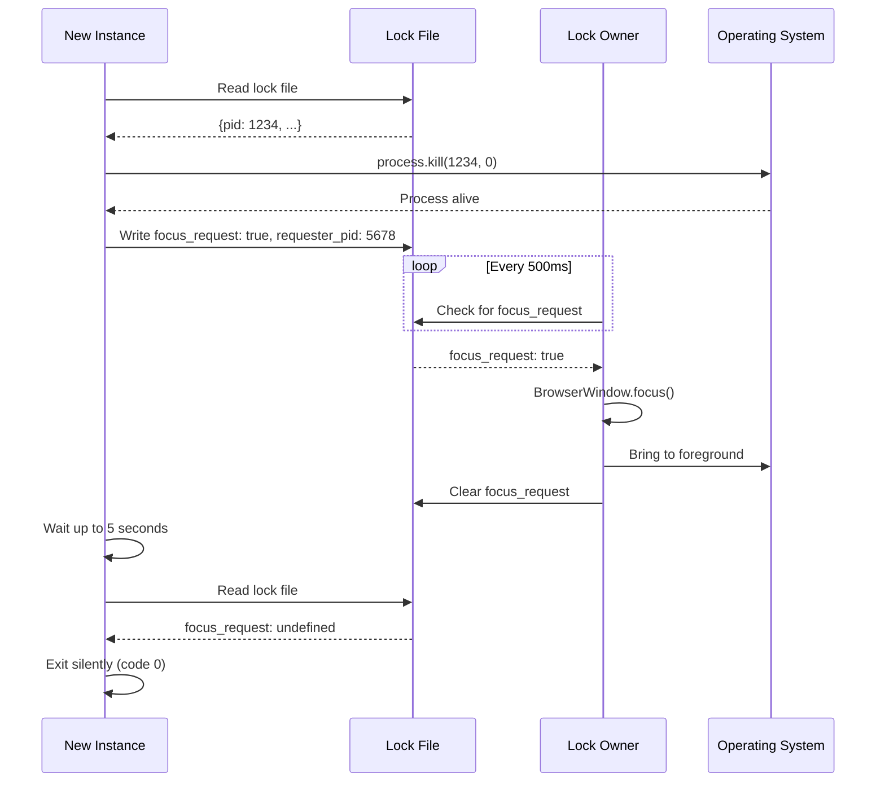
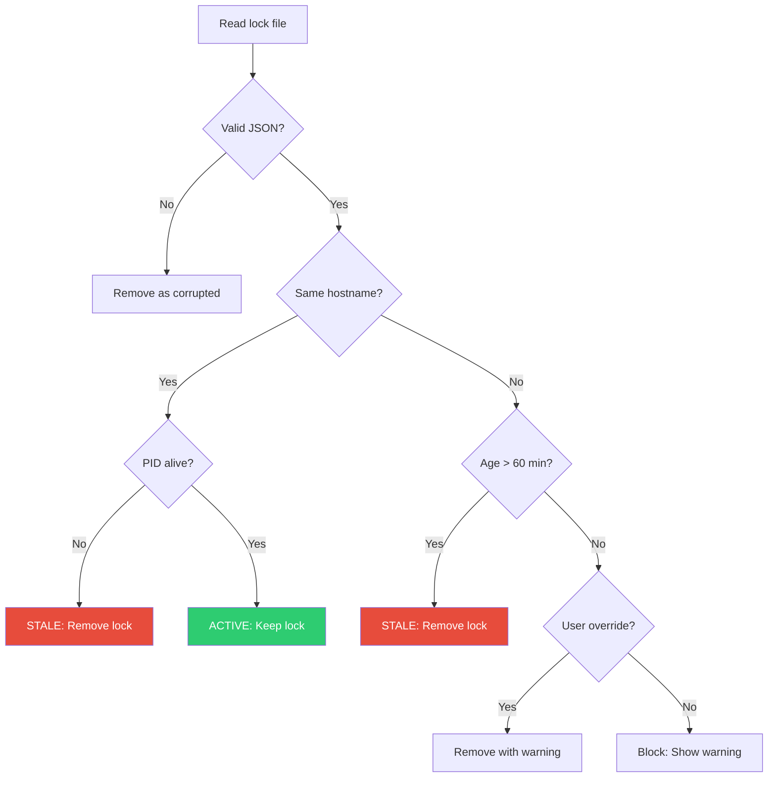
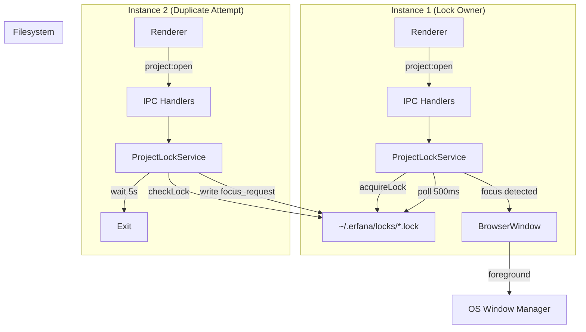
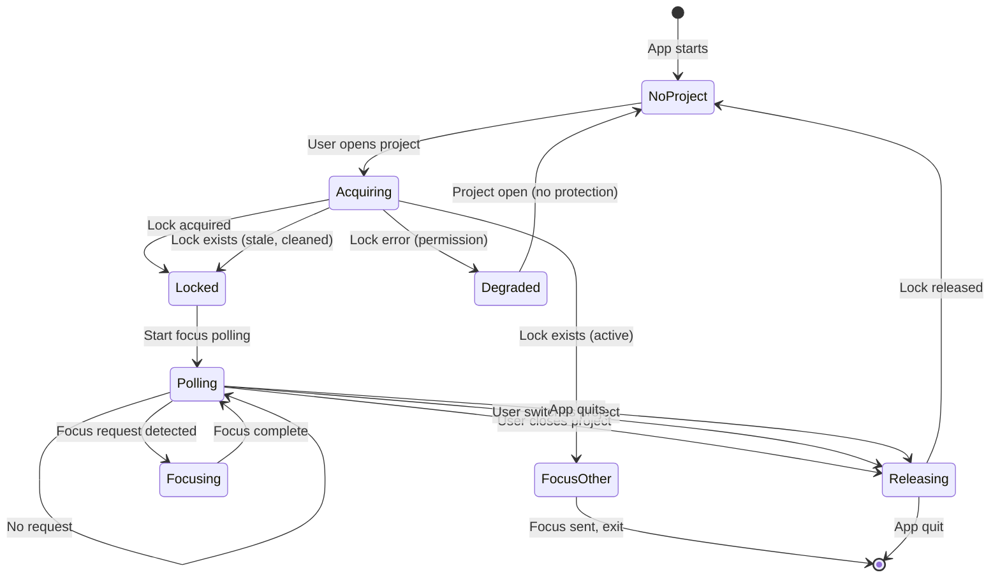
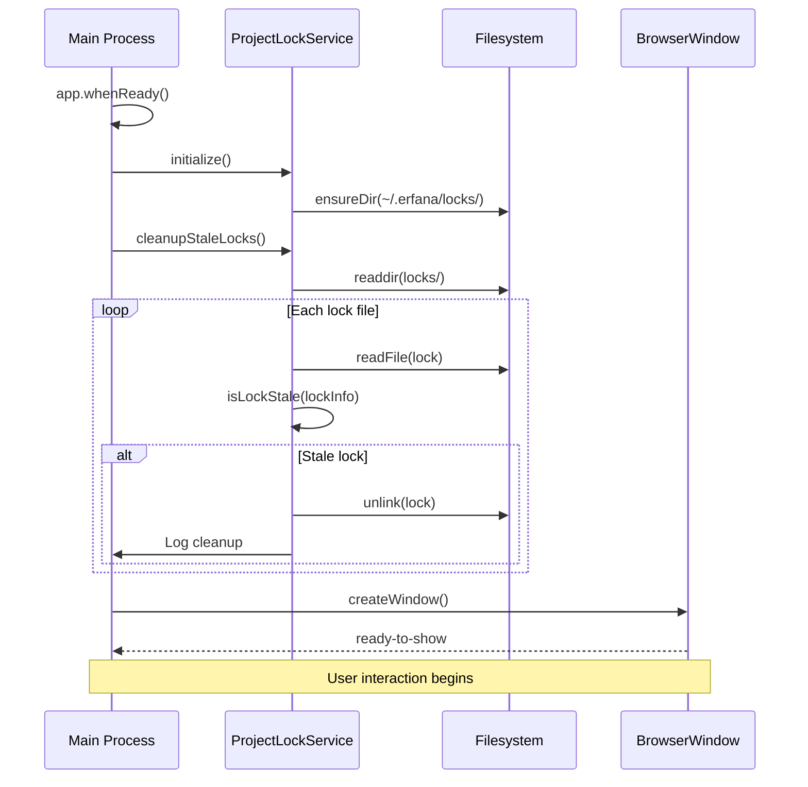
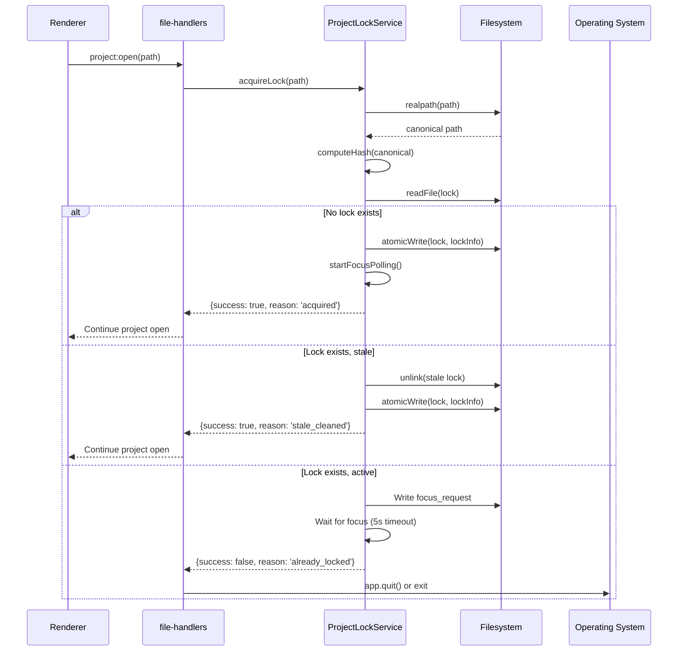

# ADR-Spec010-001: Multi-instance architecture

**Date:** 2025-12 | **Status:** Proposed

## Table of contents

1. [Context](#context)
2. [Decision drivers](#decision-drivers)
3. [Architectural decisions](#architectural-decisions)
   - [Decision 1: Lock mechanism](#decision-1-lock-mechanism)
   - [Decision 2: Cross-instance communication](#decision-2-cross-instance-communication)
   - [Decision 3: Stale lock detection](#decision-3-stale-lock-detection)
   - [Decision 4: Window focusing](#decision-4-window-focusing)
   - [Decision 5: Service architecture](#decision-5-service-architecture)
4. [System design](#system-design)
5. [Implementation patterns](#implementation-patterns)
6. [Consequences](#consequences)
7. [Migration considerations](#migration-considerations)
8. [Risk analysis](#risk-analysis)
9. [Enforcement](#enforcement)
10. [References](#references)

---

## Context

### Problem statement

Erfana currently operates as a single-window application per Electron process. Modern development workflows require working across multiple related projects simultaneously (frontend + backend, microservices, monorepos). Users must repeatedly switch contexts, reducing productivity. Additionally, without coordination between instances, the same project could be opened in multiple windows, leading to file conflicts and data loss.

### Current architecture

```
Current State (v0.6.x)
=====================

[Erfana Instance 1]          [Erfana Instance 2]
       │                            │
       │ Independent                │ Independent
       │ Electron Process           │ Electron Process
       │                            │
   ┌───┴───┐                    ┌───┴───┐
   │Project│                    │Project│
   │   A   │                    │   A   │  ← Same project!
   └───────┘                    └───────┘     No conflict detection

Shared via electron-store:
- Settings (~/.erfana/settings.json)
- Recent projects list

Independent per process:
- File watchers (Chokidar)
- Terminal sessions (node-pty)
- Editor state (Monaco)
- Git watchers
```

### Requirements from Spec #010

| Requirement | Description | Priority |
|-------------|-------------|----------|
| FR-001 | Multiple independent Erfana instances | P0 |
| FR-009 | Lock file on project open | P0 |
| FR-016 | Duplicate project focuses existing window | P0 |
| FR-029 | Stale lock detection via process check | P0 |
| FR-037 | Cross-instance signaling for focus | P0 |
| NFR-001 | Lock acquisition < 50ms | P0 |
| NFR-007 | Survive app crashes without permanent lock | P0 |
| NFR-015 | Works on macOS 12+, Windows 10+, Linux | P0 |

### Industry comparison

| Application | Approach | Coordination method |
|-------------|----------|---------------------|
| VS Code | Single instance per workspace | `requestSingleInstanceLock()` + file locks |
| Atom | Multi-window | Socket-based coordination |
| Sublime Text | Multi-window | File-based project locks |
| IntelliJ IDEA | Multi-project | File-based with lock files |

VS Code uses `app.requestSingleInstanceLock()` for single-window behavior, but Erfana requires multiple windows (one per project). The file-based approach from Sublime Text and IntelliJ aligns better with our requirements.

---

## Decision drivers

### Primary drivers

1. **Cross-platform compatibility**: Must work identically on macOS, Windows, and Linux without platform-specific dependencies.

2. **Process isolation**: Electron processes are fully independent with no shared memory; coordination must use filesystem or network.

3. **Crash resilience**: System must recover gracefully from crashes without orphaned locks blocking users.

4. **Performance**: Lock operations must not introduce noticeable latency (< 50ms target).

5. **SOLID principles**: Implementation should follow established patterns (SRP for services, DIP for coordination).

### Secondary drivers

1. **Network drive support**: Enterprise users may have projects on NFS/SMB mounts.

2. **No external dependencies**: Solution uses only Electron and Node.js built-in modules.

3. **Minimal UI disruption**: Duplicate project handling should be seamless (no error dialogs).

4. **Backward compatibility**: Existing single-instance workflows remain unchanged.

---

## Architectural decisions

### Decision 1: Lock mechanism

#### Options considered

| Option | Description | Pros | Cons |
|--------|-------------|------|------|
| **A: File-based locks** | Lock files in `~/.erfana/locks/` | Cross-platform, simple, no dependencies, survives process crashes | Requires polling for coordination, atomic write complexity |
| B: IPC-based | Named pipes or local sockets | Real-time communication, no polling | Platform-specific (pipes vs sockets), complex lifecycle, doesn't survive crashes |
| C: SQLite database | Shared database for lock tracking | ACID transactions, rich querying | Heavyweight dependency, potential contention, database corruption risk |
| D: Redis/external service | Network-based lock coordination | Distributed-ready, real-time | External dependency, network latency, operational complexity |

#### Decision: Option A - File-based locks

**Rationale:**
- Works across all platforms with identical implementation
- Node.js `fs` module provides all necessary primitives
- Lock files persist across process boundaries (visible to other instances)
- Survives network disconnections and process crashes
- Simple debugging (lock files are human-readable JSON)
- No external dependencies (critical for offline operation)

#### Lock file specification

**Location:** `~/.erfana/locks/`

**Filename:** `{hash}.lock` where hash is first 32 characters of SHA-256 of canonical project path.

**Content (JSON):**

```json
{
  "instanceId": "550e8400-e29b-41d4-a716-446655440000",
  "pid": 12345,
  "timestamp": "2025-12-25T17:30:00.000Z",
  "hostname": "developer-macbook.local",
  "path": "/Users/dev/projects/frontend"
}
```

| Field | Type | Purpose |
|-------|------|---------|
| `instanceId` | UUID v4 | Unique identifier for Erfana instance (survives PID reuse) |
| `pid` | number | Process ID for liveness check |
| `timestamp` | ISO 8601 | Creation time for stale detection |
| `hostname` | string | Machine identifier for network drives |
| `path` | string | Original project path for debugging |

**Path hashing algorithm:**

```typescript
import { createHash } from 'crypto';
import { realpath } from 'fs/promises';

async function computeLockHash(projectPath: string): Promise<string> {
  // Step 1: Resolve symlinks to canonical path
  const canonical = await realpath(projectPath);

  // Step 2: Normalize path separators and case (Windows compatibility)
  const normalized = process.platform === 'win32'
    ? canonical.toLowerCase().replace(/\\/g, '/')
    : canonical;

  // Step 3: Hash with SHA-256 (collision-resistant)
  return createHash('sha256')
    .update(normalized, 'utf8')
    .digest('hex')
    .substring(0, 32); // 128 bits sufficient for uniqueness
}
```

**Why SHA-256 with 32-character truncation:**
- Full 64-character hash is overkill for filename uniqueness
- 128 bits (32 hex chars) has negligible collision probability (< 10^-38 for 1M projects)
- Shorter filenames improve filesystem performance
- Avoids path length issues on Windows (260 char limit)

---

### Decision 2: Cross-instance communication

#### Options considered

| Option | Description | Pros | Cons |
|--------|-------------|------|------|
| **A: Lock file polling** | Lock owner polls for `focus_request` flag | Simple, uses existing lock file, no additional infrastructure | Polling overhead, up to 500ms latency |
| B: File system watchers | Chokidar on lock file | Real-time notification | Additional watcher per lock, unreliable on some filesystems |
| C: Named pipes | FIFO pipes for messaging | Real-time, bidirectional | Platform-specific (Windows vs POSIX), complex lifecycle |
| D: Local HTTP server | Each instance runs HTTP server | Real-time, flexible | Port conflicts, firewall issues, complex |

#### Decision: Option A - Lock file polling

**Rationale:**
- Reuses lock file infrastructure (no additional files)
- 500ms polling interval provides acceptable responsiveness
- Minimal CPU overhead (single stat + read per interval)
- Works identically across platforms
- No port allocation or firewall concerns
- Simpler error handling than real-time alternatives

#### Focus request protocol



**Extended lock file during focus request:**

```json
{
  "instanceId": "550e8400-e29b-41d4-a716-446655440000",
  "pid": 12345,
  "timestamp": "2025-12-25T17:30:00.000Z",
  "hostname": "developer-macbook.local",
  "path": "/Users/dev/projects/frontend",
  "focus_request": true,
  "requester_pid": 67890
}
```

---

### Decision 3: Stale lock detection

#### Options considered

| Option | Description | Pros | Cons |
|--------|-------------|------|------|
| A: PID check only | `process.kill(pid, 0)` | Instant detection for local crashes | Doesn't work across machines (network drives) |
| B: Timeout only | Remove locks older than N minutes | Works for network drives | Slow recovery for local crashes (waits full timeout) |
| **C: Hybrid (PID + timeout)** | PID check for same host, timeout for different host | Best of both approaches | Slightly more complex logic |

#### Decision: Option C - Hybrid approach

**Rationale:**
- Process liveness check provides instant crash recovery on local machine
- 60-minute timeout handles network drive scenario (different hostname)
- Hostname comparison determines which strategy to use
- Covers all failure modes with appropriate recovery time

#### Stale detection algorithm



**Process liveness check implementation:**

```typescript
function isProcessAlive(pid: number): boolean {
  try {
    // Signal 0 checks process existence without sending actual signal
    process.kill(pid, 0);
    return true;
  } catch (err) {
    const errno = (err as NodeJS.ErrnoException).code;
    if (errno === 'ESRCH') {
      return false; // No such process
    }
    if (errno === 'EPERM') {
      return true; // Process exists but we lack permission
    }
    // Unknown error - assume dead for safety
    return false;
  }
}
```

**Why 60-minute timeout:**
- Typical work session involves active use; 60 min without activity suggests abandoned
- Long enough to avoid false positives during lunch break (< 60 min)
- Short enough to recover within reasonable time
- 5-minute clock skew tolerance built into comparison

---

### Decision 4: Window focusing

#### Platform-specific challenges

| Platform | Challenge | Solution |
|----------|-----------|----------|
| macOS | Window may be minimized to dock | `app.dock.bounce('informational')` before `focus()` |
| Windows | Focus stealing prevention blocks `focus()` | `setAlwaysOnTop(true)` trick then immediately `false` |
| Linux | Wayland restrictive, X11 permissive | Best-effort with `show()` + `focus()` |

#### Decision: Platform-adaptive focusing

**Implementation:**

```typescript
function focusWindow(window: BrowserWindow): void {
  // Step 1: Restore if minimized
  if (window.isMinimized()) {
    window.restore();
  }

  // Step 2: Platform-specific attention
  if (process.platform === 'darwin') {
    // macOS: Bounce dock icon for minimized/hidden windows
    app.dock.bounce('informational');
  }

  // Step 3: Show and focus
  window.show();
  window.focus();

  // Step 4: Windows workaround for focus stealing prevention
  if (process.platform === 'win32') {
    // Briefly set always-on-top to force focus
    window.setAlwaysOnTop(true);
    setTimeout(() => window.setAlwaysOnTop(false), 100);
  }
}
```

**Windows focus stealing prevention:**

Windows implements "Focus Stealing Prevention" (since Windows 2000) which prevents applications from grabbing focus unexpectedly. The `setAlwaysOnTop` trick temporarily elevates the window, forcing the OS to bring it to front, then immediately removes the flag.

**Wayland limitations:**

Wayland's security model restricts window raising without user gesture. On Wayland, `focus()` may only flash the taskbar entry. This is a platform limitation documented in Electron's issues. We accept this degraded behavior on Wayland as it affects minimal users.

---

### Decision 5: Service architecture

#### Options considered

| Option | Description | Pros | Cons |
|--------|-------------|------|------|
| A: Extend FileService | Add lock methods to existing service | Less code, reuse existing patterns | Violates SRP, FileService already handles files |
| **B: Dedicated ProjectLockService** | New singleton service for lock management | Clean separation, testable, single responsibility | Additional service to coordinate |
| C: Static utility functions | Stateless lock functions | Simple, no lifecycle | No state management for polling, harder to test |

#### Decision: Option B - Dedicated ProjectLockService

**Rationale:**
- Single Responsibility Principle: Lock management is distinct from file operations
- Lifecycle management: Service tracks current lock, manages polling interval
- Testability: Isolated service can be unit tested with mocked filesystem
- Consistent with existing patterns (GitWatcherService, FileWatcherService)

#### Service interface

```typescript
// src/main/interfaces/IProjectLockService.ts

interface LockResult {
  success: boolean;
  reason?: 'acquired' | 'already_locked' | 'stale_cleaned' | 'error';
  existingLock?: LockInfo;
  error?: Error;
}

interface LockStatus {
  locked: boolean;
  ownedByUs: boolean;
  lockInfo?: LockInfo;
  stale?: boolean;
}

interface CleanupResult {
  cleaned: number;
  errors: string[];
}

interface IProjectLockService {
  // Core operations
  acquireLock(projectPath: string): Promise<LockResult>;
  releaseLock(): Promise<void>;
  checkLock(projectPath: string): Promise<LockStatus>;

  // Stale detection
  cleanupStaleLocks(): Promise<CleanupResult>;

  // Focus coordination
  requestFocus(lockPath: string): Promise<boolean>;
  startFocusPolling(): void;
  stopFocusPolling(): void;

  // Lifecycle
  dispose(): Promise<void>;
}
```

#### Service architecture diagram

```
Main Process
============

┌─────────────────────────────────────────────────────────────────┐
│                        App Lifecycle                             │
│                                                                  │
│  app.whenReady()  ─────────────────────────────────────────────►│
│        │                                                         │
│        ▼                                                         │
│  ┌─────────────────────┐     ┌─────────────────────┐            │
│  │ ProjectLockService  │     │ GlobalSettingsService│            │
│  │  - initialize()     │     │                      │            │
│  │  - cleanupStale()   │     │                      │            │
│  └─────────┬───────────┘     └──────────────────────┘            │
│            │                                                      │
│  ┌─────────▼───────────┐     ┌─────────────────────┐            │
│  │ project:open IPC    │────►│ ProjectLockService  │            │
│  │ (file-handlers.ts)  │     │  - acquireLock()    │            │
│  └─────────────────────┘     │  - startPolling()   │            │
│                               └─────────────────────┘            │
│                                                                  │
│  project:changed IPC  ────►  releaseLock() + acquireLock()      │
│                                                                  │
│  before-quit event    ────►  releaseLock() + dispose()          │
│                                                                  │
└─────────────────────────────────────────────────────────────────┘

Filesystem
==========

~/.erfana/
├── settings.json           (GlobalSettingsService)
├── logs/                   (LoggingService)
└── locks/                  (ProjectLockService)
    ├── a1b2c3d4e5f6.lock   (project hash -> lock file)
    └── ...
```

---

## System design

### Component interaction



### Lock lifecycle state machine



### Startup sequence



### Project open sequence



---

## Implementation patterns

### Atomic file writes

Lock file writes must be atomic to prevent corruption during concurrent access or crash.

```typescript
import { writeFile, rename, unlink, mkdir } from 'fs/promises';
import { randomUUID } from 'crypto';
import { dirname, join } from 'path';

async function atomicWriteJSON(path: string, data: object): Promise<void> {
  const dir = dirname(path);
  const tempPath = join(dir, `.${randomUUID()}.tmp`);

  try {
    // Step 1: Ensure directory exists
    await mkdir(dir, { recursive: true, mode: 0o700 });

    // Step 2: Write to temporary file
    const content = JSON.stringify(data, null, 2);
    await writeFile(tempPath, content, { mode: 0o600 });

    // Step 3: Atomic rename (POSIX guarantees atomicity)
    await rename(tempPath, path);
  } catch (err) {
    // Cleanup temp file on failure
    await unlink(tempPath).catch(() => {});
    throw err;
  }
}
```

**Why atomic writes matter:**
- Concurrent read during write sees complete old file OR complete new file
- Process crash during write leaves only temp file (cleaned on next startup)
- Prevents JSON parse errors from partial writes

### Service singleton pattern

Following existing patterns in Erfana (GitWatcherService, FileWatcherService):

```typescript
// src/main/services/ProjectLockService.ts

import { app } from 'electron';
import { join } from 'path';
import { randomUUID } from 'crypto';
import { logger } from './LoggingService';

class ProjectLockService implements IProjectLockService {
  private readonly locksDir: string;
  private readonly instanceId: string;
  private currentLockPath: string | null = null;
  private pollingInterval: NodeJS.Timeout | null = null;

  constructor() {
    this.locksDir = join(app.getPath('home'), '.erfana', 'locks');
    this.instanceId = randomUUID();
  }

  async acquireLock(projectPath: string): Promise<LockResult> {
    const canonical = await this.resolveCanonical(projectPath);
    const hash = this.computeHash(canonical);
    const lockPath = join(this.locksDir, `${hash}.lock`);

    // Check existing lock
    const status = await this.checkLock(projectPath);

    if (status.locked && !status.stale) {
      // Active lock exists - request focus
      await this.requestFocus(lockPath);
      return {
        success: false,
        reason: 'already_locked',
        existingLock: status.lockInfo
      };
    }

    // Clean stale lock if exists
    if (status.locked && status.stale) {
      await this.removeLock(lockPath);
      logger.info('Cleaned stale lock', { path: projectPath });
    }

    // Acquire new lock
    const lockInfo: LockInfo = {
      instanceId: this.instanceId,
      pid: process.pid,
      timestamp: new Date().toISOString(),
      hostname: require('os').hostname(),
      path: canonical
    };

    await atomicWriteJSON(lockPath, lockInfo);
    this.currentLockPath = lockPath;
    this.startFocusPolling();

    return { success: true, reason: 'acquired' };
  }

  async releaseLock(): Promise<void> {
    if (!this.currentLockPath) return;

    this.stopFocusPolling();

    try {
      await unlink(this.currentLockPath);
      logger.debug('Lock released', { path: this.currentLockPath });
    } catch (err) {
      if ((err as NodeJS.ErrnoException).code !== 'ENOENT') {
        logger.warn('Failed to release lock', {
          error: err instanceof Error ? err.message : String(err)
        });
      }
    }

    this.currentLockPath = null;
  }

  startFocusPolling(): void {
    if (this.pollingInterval) return;

    this.pollingInterval = setInterval(async () => {
      await this.checkAndHandleFocusRequest();
    }, 500);
  }

  private async checkAndHandleFocusRequest(): Promise<void> {
    if (!this.currentLockPath) return;

    try {
      const content = await readFile(this.currentLockPath, 'utf-8');
      const lockInfo = JSON.parse(content);

      if (lockInfo.focus_request) {
        logger.info('Focus request received');

        // Clear request before focusing (prevent re-trigger)
        delete lockInfo.focus_request;
        delete lockInfo.requester_pid;
        await atomicWriteJSON(this.currentLockPath, lockInfo);

        // Focus window
        const window = BrowserWindow.getAllWindows()[0];
        if (window) {
          focusWindow(window);
        }
      }
    } catch (err) {
      // Ignore read errors during polling
    }
  }

  async dispose(): Promise<void> {
    await this.releaseLock();
  }
}

// Singleton export
export const projectLockService = new ProjectLockService();
```

### Integration with quit handlers

The lock service integrates with existing quit confirmation flow:

```typescript
// src/main/ipc/quit-handlers.ts (modified)

import { projectLockService } from '../services/ProjectLockService';

app.on('before-quit', async () => {
  logger.info('App quitting, releasing project lock');

  // Release lock synchronously before other cleanup
  await projectLockService.releaseLock();

  // Existing cleanup
  await fileWatcherService.dispose();
  await directoryWatcherService.dispose();
  await terminalService.dispose();
  await gitWatcherService.dispose();
  gitPollingService.dispose();
});
```

### Integration with file handlers

Project opening must acquire lock before proceeding:

```typescript
// src/main/ipc/file-handlers.ts (modified)

import { projectLockService } from '../services/ProjectLockService';

ipcMain.handle('project:open', async (_event, projectPath: string) => {
  // Step 1: Acquire lock BEFORE any project operations
  const lockResult = await projectLockService.acquireLock(projectPath);

  if (!lockResult.success) {
    if (lockResult.reason === 'already_locked') {
      // Focus request sent, exit this instance
      app.quit();
      return { success: false, reason: 'focused_existing' };
    }

    // Permission error - warn and continue (degraded mode)
    logger.warn('Lock acquisition failed, continuing without protection', {
      error: lockResult.error?.message
    });
  }

  // Step 2: Release previous lock if switching projects
  // (acquireLock handles this internally)

  // Step 3: Continue with existing project open logic
  fileService.setProjectPath(projectPath);
  directoryWatcherService.setProjectPath(projectPath);
  // ... existing code
});
```

---

## Consequences

### Positive consequences

| Benefit | Description |
|---------|-------------|
| Multi-project workflow | Users can work on multiple projects simultaneously |
| Conflict prevention | Same project cannot be opened in multiple instances |
| Crash resilience | Stale locks automatically cleaned up |
| Cross-platform | Identical behavior on macOS, Windows, Linux |
| No dependencies | Uses only Node.js built-in modules |
| Backward compatible | Single-instance workflows unchanged |
| Debuggable | Lock files are human-readable JSON |

### Negative consequences

| Drawback | Mitigation |
|----------|------------|
| Polling overhead | 500ms interval is low CPU impact (< 0.1%) |
| Focus latency | Up to 500ms delay acceptable for this use case |
| Network drive complexity | 60-minute timeout handles most scenarios |
| Additional service | Follows existing service patterns, well-tested |
| Lock directory growth | Stale cleanup keeps directory small |

### Neutral consequences

| Aspect | Notes |
|--------|-------|
| Settings not synced live | Already documented as non-goal; visible on restart |
| Lock files visible to user | Useful for debugging; documented location |
| Wayland focus limitations | Platform limitation; documented in known issues |

---

## Migration considerations

### Upgrade path

1. **No settings migration**: Lock mechanism is purely additive
2. **First launch creates locks directory**: Transparent to user
3. **Existing workflows unchanged**: Single-instance users notice no difference

### Rollback plan

If issues are discovered post-release:

1. Remove `ProjectLockService` initialization from `index.ts`
2. Remove lock acquisition from `file-handlers.ts`
3. Lock files remain but are ignored (no harm)

### Testing migration

1. Fresh install: Verify locks directory created on first project open
2. Upgrade from v0.6.x: Verify existing projects open normally
3. Downgrade: Verify locks directory doesn't break older version

---

## Risk analysis

| Risk | Probability | Impact | Mitigation |
|------|-------------|--------|------------|
| Lock race condition (two instances acquire simultaneously) | Low | Medium | Atomic writes + check-before-acquire pattern |
| Stale lock blocks user permanently | Very Low | High | 60-min timeout + manual override option |
| Focus fails silently (user confused) | Medium | Low | 5s timeout with fallback notification |
| Network drive latency causes timeout | Medium | Low | Longer timeout (60 min) for cross-host locks |
| Permission error blocks project | Low | Medium | Graceful degradation (open without protection) |
| Hash collision (different projects, same hash) | Negligible | High | SHA-256 with 128 bits is collision-resistant |
| PID reuse causes false liveness detection | Very Low | Medium | Instance UUID provides secondary check |

### Risk: PID reuse

Operating systems may reuse PIDs after process termination. This could cause a stale lock to appear active if:
1. Original process (PID 1234) crashes
2. New unrelated process starts with PID 1234
3. Stale detection incorrectly reports lock as active

**Mitigation**: The `instanceId` (UUID) in the lock file provides a secondary check. If the PID is alive but the process is not an Erfana instance with the matching `instanceId`, treat as stale. This can be verified by comparing against `process.pid` in a development-only check, or by accepting the small risk in production (PID reuse to same app is extremely rare).

---

## Enforcement

### Code review checklist

- [ ] All project open paths go through `ProjectLockService.acquireLock()`
- [ ] All project close/switch paths call `ProjectLockService.releaseLock()`
- [ ] Lock operations use `atomicWriteJSON()` for writes
- [ ] Error handling gracefully degrades (don't block user)
- [ ] Logging includes sufficient context for debugging

### Testing requirements

| Test type | Coverage | Location |
|-----------|----------|----------|
| Unit tests | > 90% | `src/main/services/ProjectLockService.test.ts` |
| Integration tests | Key scenarios | `src/main/services/ProjectLockService.integration.test.ts` |
| E2E tests | Cross-instance | Manual + automated where possible |

### Unit test cases

```typescript
describe('ProjectLockService', () => {
  describe('computeLockHash', () => {
    it('should produce consistent hash for same path');
    it('should resolve symlinks before hashing');
    it('should normalize case on Windows');
    it('should handle special characters in path');
  });

  describe('acquireLock', () => {
    it('should create lock file when none exists');
    it('should detect and clean stale locks');
    it('should return already_locked for active locks');
    it('should handle permission errors gracefully');
  });

  describe('isProcessAlive', () => {
    it('should return true for current process');
    it('should return false for non-existent PID');
    it('should return true for EPERM (process exists, no permission)');
  });

  describe('stale detection', () => {
    it('should detect dead local process as stale');
    it('should detect old cross-host lock as stale');
    it('should preserve recent cross-host lock');
    it('should treat corrupted JSON as stale');
  });

  describe('focus coordination', () => {
    it('should write focus_request when duplicate detected');
    it('should handle focus request within 500ms');
    it('should clear focus_request after processing');
  });
});
```

### Performance benchmarks

| Metric | Target | Measurement |
|--------|--------|-------------|
| Lock acquisition | < 50ms (p95) | `performance.now()` around `acquireLock()` |
| Stale cleanup (10 locks) | < 100ms | Startup timing |
| Focus response | < 600ms | End-to-end measurement |
| Polling CPU overhead | < 0.1% | Process monitoring |

---

## References

### Internal references

- Spec #010 overview (archived)
- Spec #010 requirements (archived)
- Spec #010 use cases (archived)
- Spec #010 acceptance criteria (archived)
- Spec #010 implementation notes (archived)
- [ADR-Spec003-001: Git watcher architecture](/docs/architecture/adrs/adr-spec-003-001-git-watcher-architecture.md) - Service pattern reference
- [Erfana Architecture](/docs/architecture.md) - Overall system design

### External references

- [Electron BrowserWindow.focus()](https://www.electronjs.org/docs/latest/api/browser-window#winfocus)
- [Electron app.dock.bounce()](https://www.electronjs.org/docs/latest/api/app#appbounceonce-macos)
- [Node.js process.kill()](https://nodejs.org/api/process.html#processkillpid-signal) - Process liveness check
- [Node.js fs.realpath()](https://nodejs.org/api/fs.html#fsrealpathpath-options-callback) - Symlink resolution
- [Node.js crypto.createHash()](https://nodejs.org/api/crypto.html#cryptocreatehashalgorithm-options)
- [VS Code Multi-Instance Issue](https://github.com/microsoft/vscode/issues/41691) - Reference implementation discussion
- [Windows Focus Stealing Prevention](https://docs.microsoft.com/en-us/windows/win32/winmsg/window-features#foreground-activation)

### Similar implementations

| Application | Source | Notes |
|-------------|--------|-------|
| VS Code | Closed source | Uses `requestSingleInstanceLock()` + workspace file locks |
| Atom | [GitHub](https://github.com/atom/atom) | Socket-based (deprecated) |
| Sublime Text | Closed source | File-based project locks |
| IntelliJ IDEA | Closed source | `.lock` files in project directory |

---

## Appendix A: Lock file examples

### Normal lock

```json
{
  "instanceId": "550e8400-e29b-41d4-a716-446655440000",
  "pid": 12345,
  "timestamp": "2025-12-25T17:30:00.000Z",
  "hostname": "developer-macbook.local",
  "path": "/Users/dev/projects/frontend"
}
```

### Lock with focus request

```json
{
  "instanceId": "550e8400-e29b-41d4-a716-446655440000",
  "pid": 12345,
  "timestamp": "2025-12-25T17:30:00.000Z",
  "hostname": "developer-macbook.local",
  "path": "/Users/dev/projects/frontend",
  "focus_request": true,
  "requester_pid": 67890
}
```

### Lock from network drive (different host)

```json
{
  "instanceId": "a1b2c3d4-e5f6-7890-abcd-ef1234567890",
  "pid": 98765,
  "timestamp": "2025-12-24T10:00:00.000Z",
  "hostname": "office-workstation.corp.local",
  "path": "/mnt/shared/projects/backend"
}
```

---

## Appendix B: Error handling matrix

| Error | Detection | Response | User-visible |
|-------|-----------|----------|--------------|
| Lock dir not writable | `EACCES` on mkdir | Log warning, continue without protection | Unobtrusive notification |
| Lock file not readable | `EACCES` on readFile | Treat as "no lock", acquire new | None |
| Lock file corrupted | JSON.parse throws | Remove file, acquire new | None |
| Lock file write fails | `EACCES` on writeFile | Log warning, continue without protection | Unobtrusive notification |
| Focus request timeout | 5 seconds elapsed | Show notification, allow override | "Could not focus window" |
| Process check fails | Unknown error from kill | Assume dead, remove lock | None |

---

## Appendix C: Glossary

| Term | Definition |
|------|------------|
| Lock file | JSON file in `~/.erfana/locks/` indicating project is open |
| Lock owner | The Erfana instance that created the lock |
| Stale lock | Lock whose owning process has terminated |
| Focus request | Signal written to lock file requesting owner to focus window |
| Canonical path | Absolute path with symlinks resolved |
| Instance ID | UUID assigned to each Erfana process on startup |
| Polling | Periodic check of lock file for focus requests |
| Atomic write | Write operation that completes fully or not at all |
| Graceful degradation | Continue operation with reduced functionality on error |
