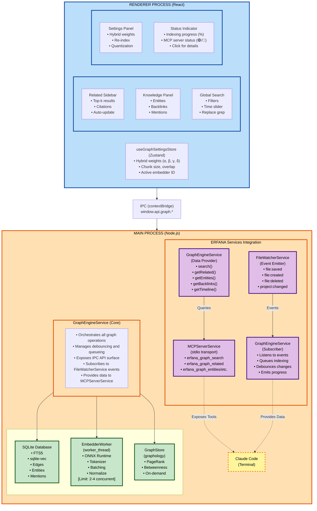
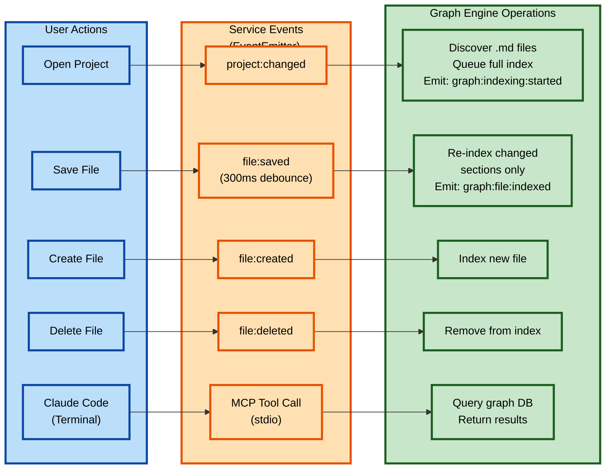
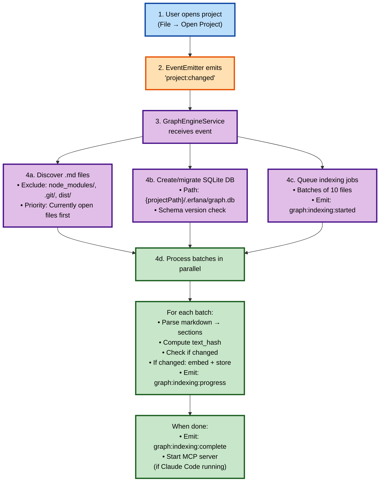
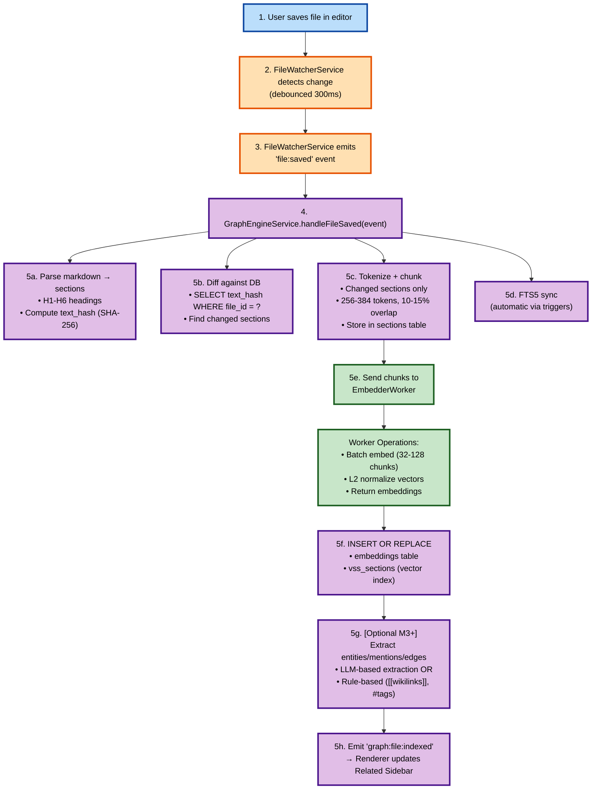
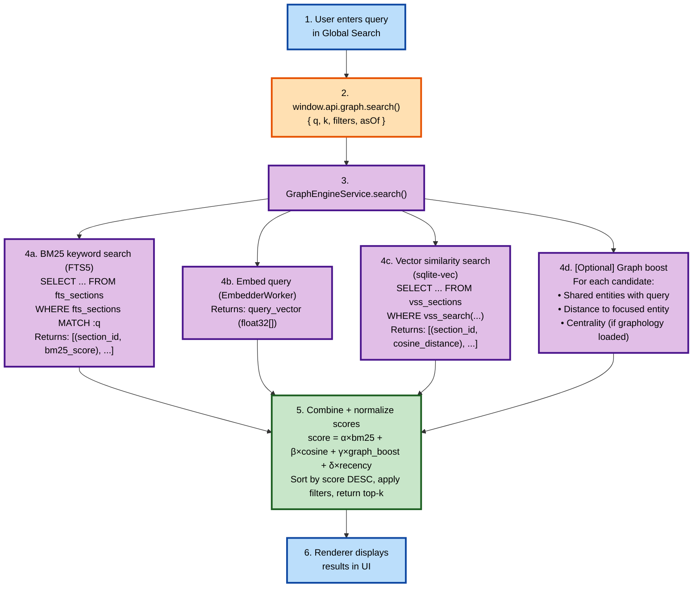
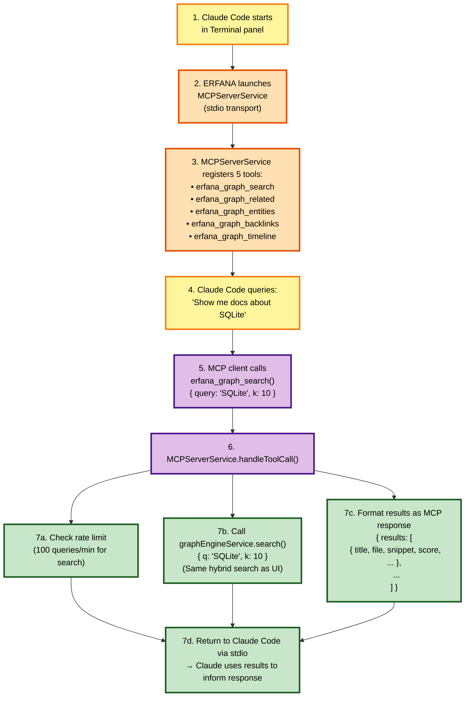

# Graph Engine Architecture

> ⚠️ **WORK IN PROGRESS - NOT READY FOR DEVELOPMENT**
>
> This documentation is currently under active development and review. The Graph Engine specification, architecture, and implementation details are subject to significant changes. **DO NOT start implementation work based on these documents.**
>
> **Status**: Draft specification being refined
> **Expected Ready**: TBD pending architectural review and wireframe finalization

**Last Updated:** October 2025
**Status:** Design Specification

This document details the system architecture, component interactions, and key design decisions for the Erfana Graph Engine.

---

## Table of Contents

1. [System Overview](#system-overview)
2. [Component Architecture](#component-architecture)
3. [Technology Stack Justification](#technology-stack-justification)
4. [Process Model (Electron)](#process-model-electron)
5. [Data Flow](#data-flow)
6. [Key Design Decisions](#key-design-decisions)
7. [Security Considerations](#security-considerations)

---

## System Overview

The Erfana Graph Engine is a **local-first, embedded knowledge graph** that combines three retrieval paradigms:

1. **Keyword Search (BM25)**: SQLite FTS5 for fast, precise keyword matching
2. **Semantic Search (Vector)**: sqlite-vec for meaning-based similarity
3. **Graph Traversal**: Lightweight entity-relationship graph with temporal awareness

### Design Philosophy

- **Local-First**: Zero dependencies on external services; fully functional offline
- **Embedded**: Single-process deployment; no separate database server
- **Hybrid**: Combine multiple retrieval strategies for better results
- **Incremental**: Index documents as they're saved; no batch processing required
- **Privacy**: All data stays on device; optional cloud features are explicit opt-in

---

## Component Architecture



### Component Responsibilities

#### Integration with ERFANA Services

The Graph Engine integrates seamlessly with existing ERFANA services through an event-driven architecture:

**FileWatcherService → GraphEngineService**
- GraphEngineService subscribes to FileWatcherService events on initialization
- Events listened to:
  - `file:saved` - Re-index modified file (incremental update)
  - `file:created` - Index new file
  - `file:deleted` - Remove from index
  - `project:changed` - Trigger full project indexing

**GraphEngineService → MCPServerService**
- MCPServerService exposes GraphEngineService data via MCP protocol
- Runs on stdio transport for Claude Code consumption
- 5 MCP tools provided (search, related, entities, backlinks, timeline)
- Rate limiting: 100/min for search, 50/min for entities, 20/min for timeline

**Event Flow Example:**
```typescript
// On app startup
const eventBus = new EventEmitter();
const fileWatcherService = new FileWatcherService(eventBus);
const graphEngineService = new GraphEngineService(eventBus);
const mcpServerService = new MCPServerService(graphEngineService);

// User opens project
eventBus.emit('project:changed', { newPath: '/path/to/project' });
// → GraphEngine discovers all .md files and queues indexing

// User saves file
eventBus.emit('file:saved', { path: '/path/to/file.md' });
// → GraphEngine re-indexes only changed sections (via text_hash)

// Claude Code queries from Terminal
await mcpClient.callTool('erfana_graph_search', { query: 'architecture' });
// → MCPServer calls graphEngine.search() → returns results
```

#### GraphEngineService (Orchestrator)
- **Request Handling**: Processes IPC requests from renderer
- **Event Subscription**: Listens to FileWatcherService events for auto-indexing
- **Debouncing**: Coalesces rapid file saves (e.g., 300ms window)
- **Queue Management**: Serializes indexing operations to prevent contention
- **Error Handling**: Catches errors, logs, returns structured error responses
- **State Coordination**: Tracks indexing progress, worker availability
- **MCP Data Provider**: Exposes search/graph APIs to MCPServerService

#### SQLite Database
- **Schema Management**: DDL migrations, version tracking
- **FTS5**: Keyword search with BM25 ranking
- **sqlite-vec**: Vector similarity search (brute-force initially)
- **Graph Tables**: Entities, edges, mentions, temporal fields
- **WAL Mode**: Write-ahead logging for concurrency

#### EmbedderWorker (worker_threads)
- **Model Loading**: Load ONNX model + tokenizer on initialization
- **Tokenization**: Count tokens, split into chunks (256-384 tokens)
- **Batching**: Process 32-128 chunks per batch (configurable)
- **Embedding**: Generate normalized float32 vectors (L2 norm)
- **Isolation**: Runs off main thread; communicates via postMessage

**⚠️ Critical Limitation:** onnxruntime-node has known stability issues with multiple concurrent workers. **Limit to 2-4 workers max** to avoid random crashes.

#### GraphStore (graphology)
- **In-Memory Graph**: Build from SQLite edges on-demand
- **Centrality Metrics**: PageRank, betweenness, closeness
- **Neighborhood Queries**: Find N-hop neighbors for an entity
- **Lazy Loading**: Only load subgraphs when needed (not full graph)

#### MCPServerService (Claude Code Integration)
- **Protocol**: Model Context Protocol (MCP) over stdio transport
- **Lifecycle**: Started on app launch, stopped on app quit
- **Tools Exposed**:
  - `erfana_graph_search` - Hybrid search (BM25 + vector)
  - `erfana_graph_related` - Find related sections
  - `erfana_graph_entities` - List entities with filters
  - `erfana_graph_backlinks` - Get entity backlinks
  - `erfana_graph_timeline` - Temporal queries
- **Rate Limiting**: Token bucket algorithm per tool
- **Security**: Read-only access, no file system writes

#### UI Components (Renderer Process)

**Related Sidebar**
- **Purpose**: Research assistant showing top-10 related sections
- **Trigger**: Auto-updates on file change or text selection
- **Display**: Citation with score, file path, snippet
- **Actions**: Click to open, copy citation, insert link

**Global Search**
- **Purpose**: Project-wide hybrid search (replaces/augments grep)
- **Input**: Natural language query
- **Filters**: Folder, file type, date range
- **Display**: Results with BM25 score, cosine similarity, combined score
- **Actions**: Click to navigate, "Why this result?" breakdown

**Knowledge Panel** (M3+)
- **Purpose**: Entity mentions and backlinks (Obsidian-like)
- **Display**: Entities in current section, where else mentioned
- **Actions**: Click entity to see backlinks, navigate to mentions

**Settings Panel**
- **Purpose**: Configure hybrid search weights and indexing
- **Controls**: α/β/γ/δ sliders, re-index button, quantization toggle
- **Display**: Current embedder model, corpus size, index status

**Status Indicator**
- **Purpose**: Show indexing progress and MCP server status
- **Display**: Progress bar (e.g., "Indexing: 450/1000 files"), MCP status (🟢/🔴)
- **Location**: Bottom-right status bar
- **Actions**: Click to open indexing details

---

## Technology Stack Justification

### Why SQLite?
- **Embedded**: No separate server; packaged with app
- **Proven**: 30+ years of production use; battle-tested
- **Features**: FTS5, JSON, CTEs, window functions, triggers
- **WAL Mode**: Concurrent reads; single writer

### Why FTS5 over FTS4?
- Better ranking (BM25 built-in)
- Improved tokenization
- More flexible column weighting
- Actively maintained

### Why sqlite-vec over sqlite-vss? (UPDATED October 2025)
**sqlite-vss is deprecated** as of 2024. sqlite-vec is the active replacement:

| Feature | sqlite-vec | sqlite-vss (deprecated) |
|---------|-----------|------------------------|
| **Status** | ✅ Active (v0.1.0 stable) | ⚠️ No longer developed |
| **Dependencies** | Pure C, zero deps | C++ (Faiss) |
| **Binary Size** | ~300KB | 3-5MB |
| **Platform Support** | All (macOS/Linux/Windows/WASM) | macOS/Linux only (reliable) |
| **ANN Indexes** | Planned (HNSW/IVF) | ✅ Via Faiss |
| **Performance (100K docs)** | <100ms (brute-force) | ~50ms (indexed) |
| **Quantization** | ✅ Binary (32x compression) | Limited |

**Decision:** Use sqlite-vec as primary; sqlite-vss only if legacy builds exist.

### Why onnxruntime-node over transformers.js?
- **Performance**: Native C++ execution vs WebAssembly
- **Maturity**: Stable API, widely used
- **Flexibility**: Swap models without code changes

**⚠️ Known Issue:** Worker thread crashes with high concurrency. Mitigation: limit workers, add recovery logic.

**Alternative Considered:** transformers.js (wraps onnxruntime-node, better stability). May revisit if crashes persist.

### Why graphology?
- **Lightweight**: Similar to networkx (Python) / igraph (R)
- **Comprehensive**: PageRank, betweenness, closeness, etc.
- **TypeScript**: First-class TS support
- **Sigma.js Integration**: If we add visualization later

---

## Process Model (Electron)

### Main Process (Node.js)
- GraphEngineService runs here (access to native modules)
- SQLite database (better-sqlite3 is synchronous, main-thread safe)
- Worker threads for embedding (onnxruntime-node)
- File system access

### Preload Script (Secure Bridge)
- Exposes `window.api.graph.*` via contextBridge
- **No direct Node.js access** in renderer (security)
- Type-safe IPC channels

### Renderer Process (Chromium/React)
- UI components (Related Sidebar, Knowledge Panel)
- Zustand stores for settings/state
- Calls `window.api.graph.*` for all operations

### Security Boundary
```
Renderer (untrusted) <--> Preload (bridge) <--> Main (trusted)
```

---

## Data Flow

### Complete Event-Driven Architecture

**Overview:** The Graph Engine integrates with ERFANA through an event-driven architecture where services communicate via an EventEmitter bus.



### Project Initialization Flow



### Indexing Flow (File Save)



### Search Flow (Hybrid Retrieval)



### MCP Server Integration Flow (Claude Code)



**Security & Isolation:**
- MCP server runs in main process (trusted zone)
- Read-only access to graph database
- No file system writes allowed
- Rate limiting prevents abuse
- Separate from renderer process (untrusted zone)

---

## Key Design Decisions

### 1. Synchronous SQLite (better-sqlite3)
**Why:** Simpler code flow; no promise hell for DB ops.
**Trade-off:** Main thread blocking (mitigated by worker threads for embeddings).

### 2. Debounced Indexing
**Why:** Avoid re-indexing on every keystroke.
**Strategy:** 300ms debounce + queue coalescing (one job per file).

### 3. Content-Based Hashing (text_hash)
**Why:** Skip re-embedding unchanged sections.
**How:** Hash normalized text after stripping markdown syntax.

### 4. Temporal Graph (valid_from, valid_to, tx_time)
**Why:** Track how knowledge changes over time.
**Use Case:** "What did the code architecture look like 3 months ago?"

### 5. On-Demand Graph Loading (graphology)
**Why:** Don't load full graph into memory for every query.
**How:** Build subgraph on-demand for specific entities.

### 6. Configurable Hybrid Weights
**Why:** Different query types benefit from different weightings.
**How:** Store α, β, γ, δ in settings; allow per-query override.

### 7. Single Embedder per Project
**Why:** Mixing vector spaces causes poor results.
**Migration:** Re-embed all on model switch (background job with progress).

### 8. Event-Driven Integration with ERFANA
**Why:** Loose coupling; GraphEngine doesn't need to know about FileWatcherService internals.
**How:** GraphEngine subscribes to EventEmitter events (`file:saved`, `project:changed`, etc.).
**Benefits:**
- Easy to add new event sources (e.g., git commits, external file changes)
- Graph engine can be disabled/enabled without code changes
- Clean separation of concerns

### 9. MCP Server for Claude Code Integration
**Why:** Standardized protocol for AI assistant tooling; future-proof for other MCP clients.
**How:** MCPServerService exposes GraphEngineService via stdio transport.
**Benefits:**
- Claude Code gets project knowledge automatically
- Same search API used by both UI and MCP (consistency)
- Rate limiting prevents resource exhaustion
- Read-only access ensures safety

---

## Security Considerations

### 1. No Renderer Node.js Access
- Renderer can't directly call `require()` or `process`
- All file system access goes through IPC

### 2. Content Redaction
- Apply regex patterns before indexing (e.g., remove API keys, secrets)
- Configurable per-project

### 3. SQL Injection Prevention
- Use prepared statements for all queries
- Never concatenate user input into SQL strings

### 4. Optional Cloud Services
- Embeddings/LLMs are opt-in, not default
- API keys scoped per-project (stored in electron-store)

### 5. Content Isolation
- Each project has its own SQLite database
- No cross-project data leakage

---

## Performance Considerations

### Read Performance
- **FTS5**: ~1-10ms for keyword search (typical corpus)
- **sqlite-vec**: ~50-100ms for 100K vectors @ 384 dims (brute-force)
- **Hybrid Search**: ~100-200ms total (parallelizable)

### Write Performance
- **Prepared Statements**: ~0.1ms per row insert
- **WAL Mode**: Concurrent reads while writing
- **Batch Transactions**: Wrap 1000s of inserts in single transaction

### Embedding Performance
- **all-MiniLM-L6-v2**: ~15ms per 1K tokens (single thread)
- **Batching**: 32-128 chunks → ~0.5-2s per batch
- **Concurrency**: 2-4 workers → ~1-4 batches/sec

---

## Failure Modes & Recovery

### Worker Crash (onnxruntime-node)
**Symptom:** Worker thread exits unexpectedly
**Recovery:** Auto-restart worker, retry batch (idempotent ops)
**Prevention:** Limit concurrent workers to 2-4

### SQLite Lock Timeout
**Symptom:** `SQLITE_BUSY` error
**Recovery:** Retry with exponential backoff (max 3 attempts)
**Prevention:** Use WAL mode, keep transactions short

### Corrupt Database
**Symptom:** `SQLITE_CORRUPT` error
**Recovery:** Backup DB, run `PRAGMA integrity_check`, rebuild if needed
**Prevention:** Regular integrity checks on startup

---

## Next Steps

- **[User Guide](./user-guide.md)**: Learn what the graph engine does and how to use it
- **[Data Ingestion](./data-ingestion.md)**: How files are discovered and indexed
- **[MCP Server](./mcp-server.md)**: Claude Code integration details
- **[Data Model](./data-model.md)**: Review SQLite schema details
- **[Vector Search](./vector-search.md)**: Deep dive on sqlite-vec
- **[Embedding Pipeline](./embedding-pipeline.md)**: ONNX integration details

---

**Related:**
- [Main Overview](../graph-engine.md)
- [Performance & Scalability](./performance.md)
- [Production Readiness](./production-readiness.md)
- [Implementation Guide](./implementation-guide.md)
