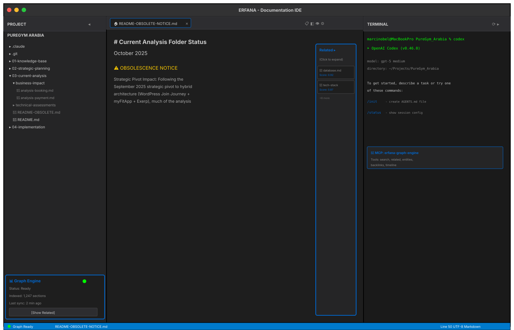
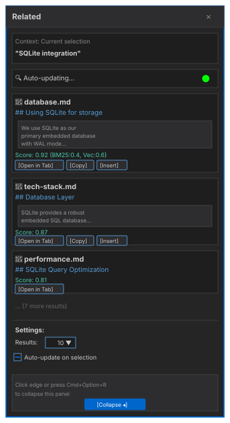
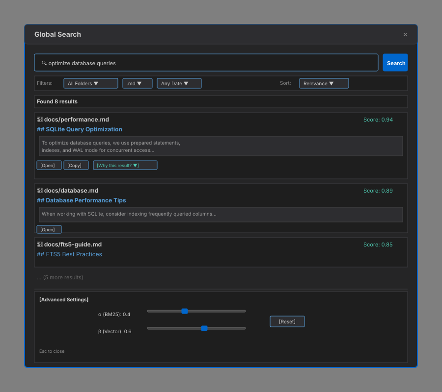
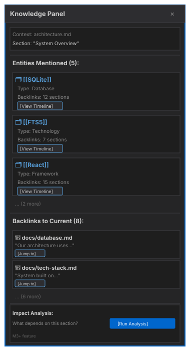
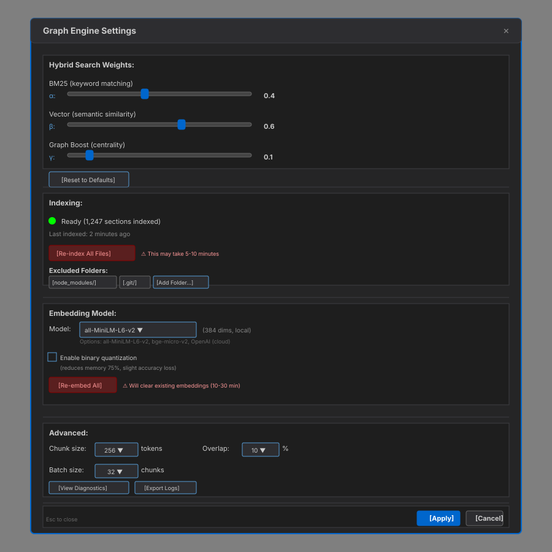
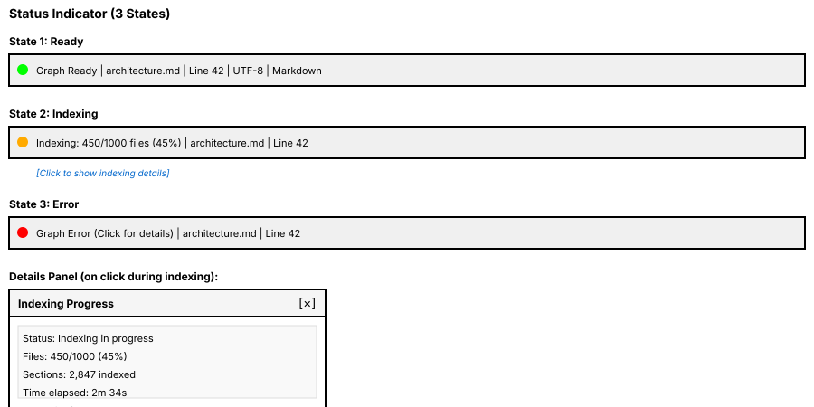
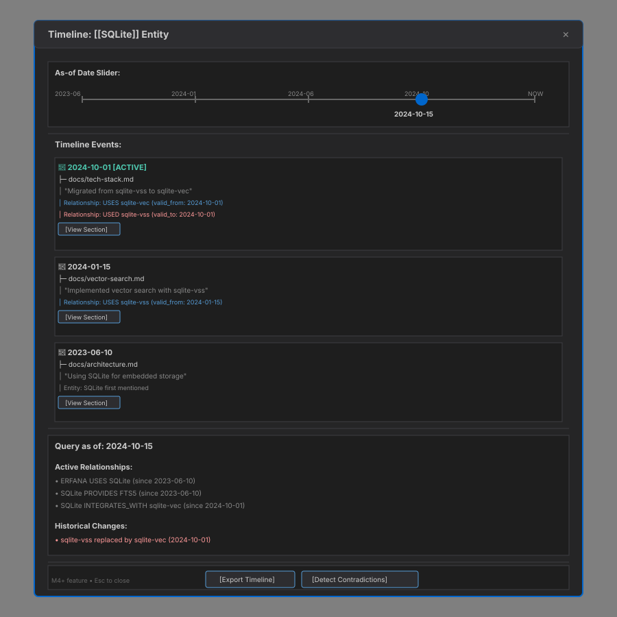

# Graph Engine User Guide

> ⚠️ **WORK IN PROGRESS - NOT READY FOR DEVELOPMENT**
>
> This documentation is currently under active development and review. The Graph Engine specification, architecture, and implementation details are subject to significant changes. **DO NOT start implementation work based on these documents.**
>
> **Status**: Draft specification being refined
> **Expected Ready**: TBD pending architectural review and wireframe finalization

**Last Updated:** October 2025

This guide explains what the Erfana Graph Engine is, how to use it, and what value it provides for your markdown documentation workflow.

---

## Table of Contents

1. [What is the Graph Engine?](#what-is-the-graph-engine)
2. [Key Features](#key-features)
3. [Getting Started](#getting-started)
4. [User Workflows](#user-workflows)
5. [UI Components](#ui-components)
6. [Claude Code Integration](#claude-code-integration)
7. [Best Practices](#best-practices)
8. [Troubleshooting](#troubleshooting)

---

## What is the Graph Engine?

The Erfana Graph Engine is an **intelligent knowledge system** that automatically indexes your markdown documentation and provides AI-powered search, contextual recommendations, and relationship tracking.

### The Problem It Solves

When working on large documentation projects, you face challenges:

- **"Where else did I mention this concept?"** → Hard to find related content manually
- **"What's similar to what I'm writing?"** → No way to discover semantically related sections
- **"Who depends on this component?"** → Difficult to track relationships and impact
- **"How has this evolved over time?"** → No timeline of changes to concepts
- **"How can Claude Code understand my project?"** → No structured knowledge for AI assistants

### The Solution

The Graph Engine automatically:

1. **Indexes** all markdown files in your project
2. **Understands** semantic meaning using vector embeddings
3. **Tracks** entities, relationships, and temporal changes
4. **Surfaces** relevant information while you write
5. **Exposes** knowledge to Claude Code via MCP server

**Result:** You write better docs faster, with AI-powered research assistance built into your IDE.

---

## Key Features

### 1. Related Sidebar (Research Assistant)

**What it does:** Shows sections from your project that are similar to what you're currently editing.

**How it works:**
- Analyzes your current file or selected text
- Uses hybrid search (keyword + semantic similarity)
- Displays top-10 most relevant sections with citations

**Value:**
- Discover related content without manual searching
- Avoid duplicate documentation
- Find inspiration from similar sections
- Insert cross-references easily

**Example:**
```
You're editing: docs/architecture.md (mentions "SQLite", "React")
Related Sidebar shows:
  1. docs/database.md - "Using SQLite for storage" (score: 0.92)
  2. docs/tech-stack.md - "Frontend: React 18" (score: 0.87)
  3. docs/performance.md - "SQLite query optimization" (score: 0.81)
```

### 2. Global Search (Better than Grep)

**What it does:** Hybrid BM25 + vector search that understands meaning, not just keywords.

**How it works:**
- Type query in search box
- System combines keyword matching (BM25) with semantic similarity (vectors)
- Ranks results by relevance (configurable weights)

**Value:**
- Find content even if it uses different wording (synonyms, paraphrases)
- Better ranking than grep or traditional FTS5
- Discover conceptually related content

**Example:**
```
Query: "How do I make search faster?"

Traditional search (grep/FTS5):
  - Matches "search" and "faster" keywords
  - Misses "optimize query performance" (different words)

Hybrid search (Graph Engine):
  - Matches "search faster" keywords
  - ALSO finds "optimize query performance" (semantically similar)
  - Ranks by combined BM25 + vector similarity
```

### 3. Knowledge Panel & Backlinks (Obsidian-like Navigation)

**What it does:** Shows entities mentioned in current section and where else they're referenced.

**How it works:**
- Extracts entities (e.g., `[[SQLite]]`, `#database`, `@username`)
- Tracks mentions across your project
- Displays backlinks (reverse references)

**Value:**
- Navigate your knowledge graph like Obsidian
- Understand impact of changes (what depends on this?)
- Discover connections between concepts

**Example:**
```
Current section mentions:
  - Entity: "SQLite" (database)
  - Entity: "FTS5" (technology)

Backlinks for "SQLite":
  - docs/architecture.md (4 mentions)
  - docs/performance.md (2 mentions)
  - docs/data-model.md (1 mention)
```

### 4. Timeline Queries (Time-Travel for Knowledge)

**What it does:** View how entities and relationships evolved over time.

**How it works:**
- Temporal graph tracks when facts became true/false
- "As-of" queries show knowledge at any point in history
- Timeline slider in UI

**Value:**
- Understand how architecture changed
- Audit trail for decisions
- Detect contradictions (e.g., "still using sqlite-vss?" vs "migrated to sqlite-vec")

**Example:**
```
Timeline for "ERFANA" entity:

2023-06-01: uses React
2024-01-01: uses sqlite-vss
2024-10-01: uses sqlite-vec (sqlite-vss closed)

Query "as of 2024-03-01": ERFANA used sqlite-vss
Query "as of 2024-11-01": ERFANA uses sqlite-vec
```

### 5. Claude Code Integration (MCP Server)

**What it does:** Exposes graph engine to Claude Code (running in Terminal panel) via MCP server.

**How it works:**
- ERFANA runs MCP server in background
- Claude Code connects as MCP client
- Claude can query graph for context

**Value:**
- Claude Code gets project knowledge automatically
- Better code suggestions based on documentation
- Contextual coding assistance

**Example:**
```
You: "Claude, implement a search feature"

Claude Code:
  1. Queries MCP: erfana_graph_search("search implementation")
  2. Finds: docs/search-design.md, docs/performance.md
  3. Reads context from graph engine
  4. Generates code matching your existing architecture
```

---

## Getting Started

### Automatic Indexing

**Graph engine starts automatically when you open a project:**

1. Open project in ERFANA (File → Open Project)
2. Graph engine detects all `.md` files
3. Indexing starts in background (see status indicator)
4. Wait for completion (usually 1-5 minutes for 10K files)

**Status Indicator:**
- 🟢 **Green dot**: Indexing complete, graph engine ready
- 🟡 **Yellow dot**: Indexing in progress
- 🔴 **Red dot**: Error (check logs)

### First-Time Setup

**No configuration required!** Default settings work for most projects.

**Optional tuning (Settings panel):**
- Adjust hybrid search weights (α for BM25, β for vectors)
- Trigger manual re-index (if files changed externally)
- Enable binary quantization (for >100K documents)

---

## User Workflows

### Workflow 1: Research While Writing

**Scenario:** You're writing a new section and want to reference existing content.

**Steps:**

1. Open file in editor (e.g., `docs/new-feature.md`)
2. Start writing about a topic (e.g., "SQLite integration")
3. **Related Sidebar automatically updates** with similar sections
4. Click result to open in new tab
5. Copy relevant snippet or insert cross-reference link

**Result:** You write comprehensive docs without leaving your flow.

### Workflow 2: Semantic Search

**Scenario:** You remember writing about "performance" but forgot the exact file.

**Steps:**

1. Open Global Search (Cmd+Shift+F)
2. Type query: "optimize database queries"
3. Graph engine searches hybrid (BM25 + vectors)
4. Results show:
   - Exact matches ("optimize", "database", "queries")
   - Semantic matches ("improve SQLite performance", "tune FTS5")
5. Click result to jump to file

**Result:** You find content even if you use different words.

### Workflow 3: Backlink Navigation

**Scenario:** You're editing `docs/sqlite.md` and want to know what depends on it.

**Steps:**

1. Open Knowledge Panel (right sidebar)
2. See entities: `[[SQLite]]`, `[[FTS5]]`, `[[WAL mode]]`
3. Click `[[SQLite]]`
4. Knowledge Panel shows backlinks:
   - `docs/architecture.md` (uses SQLite)
   - `docs/performance.md` (SQLite benchmarks)
   - `docs/data-model.md` (SQLite schema)
5. Click backlink to navigate

**Result:** You understand the full context of what you're editing.

### Workflow 4: Coding with Claude Code

**Scenario:** You want Claude Code to implement a feature based on your docs.

**Steps:**

1. Open Terminal panel (Cmd+J)
2. Start Claude Code session
3. Ask: "Implement a search service based on our architecture docs"
4. **Claude Code uses MCP to query graph engine:**
   - `erfana_graph_search("search architecture")`
   - Finds: `docs/search-design.md`, `docs/hybrid-search.md`
5. Claude generates code matching your documented patterns

**Result:** Claude Code understands your project without you copying docs manually.

### Workflow 5: Timeline Review

**Scenario:** You want to audit how your tech stack changed over time.

**Steps:**

1. Open Timeline UI (Settings → Timeline)
2. Select entity: "ERFANA"
3. View timeline:
   - 2023-06: Started using React
   - 2024-01: Added sqlite-vss
   - 2024-10: Migrated to sqlite-vec
4. Use slider to query "as of 2024-03-01"
5. See: ERFANA used sqlite-vss (before migration)

**Result:** You have a complete audit trail of architectural decisions.

---

## UI Components

### Overview: ERFANA Layout with Graph Engine



The diagram above shows how Graph Engine components integrate into the ERFANA IDE:
- **Project Panel** (left): File tree with Graph Engine widget at bottom
- **Editor** (center): Monaco editor with markdown editing and preview
- **Terminal** (right): Terminal with Claude Code and MCP server indicator
- **Related Sidebar**: Collapsible overlay in editor area showing related sections
- **Status Bar**: Graph Engine status indicator (bottom-right)

### Related Sidebar

**Location:** Collapsible overlay in editor area (toggle with Cmd+Option+R)



**Features:**
- Auto-updates based on current file/selection
- Shows top-10 related sections
- Click to open in new tab
- "Copy citation" button
- "Insert link" button

**Settings:**
- Number of results (default: 10)
- Auto-update on selection change (default: on)

### Global Search

**Location:** Cmd+Shift+F (or Search icon in toolbar)



**Features:**
- Hybrid search (BM25 + vector)
- Filters: folder, file type, date range
- "Why this result?" breakdown (shows BM25 score, cosine similarity, boosts)
- Sort by: relevance, date, filename

**Advanced:**
- Query syntax: `"exact phrase"`, `term1 OR term2`, `heading:term`
- Adjust weights (α, β) per query

### Knowledge Panel

**Location:** Collapsible panel in editor area (toggle with Cmd+Option+K)



**Features:**
- Entities in current section
- Backlinks (where else is this mentioned?)
- Impact analysis (what depends on this?)

**Coming in M3+**

### Settings Panel

**Location:** Settings icon in status bar or Settings → Graph Engine



**Features:**
- Hybrid search weights (α, β, γ, δ) with live sliders
- Re-index project (manual trigger with progress)
- Binary quantization toggle
- Model selection (embedding model) with re-embed option
- Excluded folders configuration
- Logs and diagnostics

### Status Indicator

**Location:** Bottom-right status bar



**Features:**
- Indexing progress (e.g., "Indexing: 450/1000 files")
- Click to open indexing details panel
- Error notifications with details
- Real-time ETA and worker status

### Timeline UI (M4+)

**Location:** Knowledge Panel → Timeline tab



**Features:**
- Timeline slider to query "as-of" any date
- Chronological event list showing when entities/relationships changed
- Active relationships at selected date
- Historical change detection
- Contradiction detection (e.g., "still using sqlite-vss?" vs "migrated to sqlite-vec")
- Export timeline as markdown

**Coming in M4+**

---

## Claude Code Integration

### Available MCP Tools

Claude Code (running in Terminal panel) can use these MCP tools to query the graph engine:

#### 1. `erfana_graph_search`

**Purpose:** Hybrid BM25 + vector search.

**Parameters:**
- `query` (string): Search query
- `k` (number, optional): Number of results (default: 10)
- `filters` (object, optional): Folder, file type, date filters

**Example:**
```javascript
// Claude Code usage:
const results = await useMcpTool('erfana_graph_search', {
  query: 'SQLite FTS5 performance',
  k: 5,
  filters: { folder: 'docs/' }
});
```

#### 2. `erfana_graph_related`

**Purpose:** Find sections related to a specific section.

**Parameters:**
- `sectionId` (number): Section ID
- `k` (number, optional): Number of results (default: 10)

**Example:**
```javascript
const related = await useMcpTool('erfana_graph_related', {
  sectionId: 42,
  k: 10
});
```

#### 3. `erfana_graph_entities`

**Purpose:** List entities (with optional filters).

**Parameters:**
- `query` (string, optional): Filter by name
- `type` (string, optional): Filter by type (e.g., 'technology', 'person')
- `limit` (number, optional): Max results (default: 50)

**Example:**
```javascript
const entities = await useMcpTool('erfana_graph_entities', {
  type: 'technology',
  limit: 20
});
```

#### 4. `erfana_graph_backlinks`

**Purpose:** Get backlinks for an entity.

**Parameters:**
- `entityName` (string): Entity name (e.g., "SQLite")
- `limit` (number, optional): Max results (default: 50)

**Example:**
```javascript
const backlinks = await useMcpTool('erfana_graph_backlinks', {
  entityName: 'SQLite',
  limit: 10
});
```

#### 5. `erfana_graph_timeline`

**Purpose:** Get temporal timeline for entity or file.

**Parameters:**
- `entityId` (number, optional): Entity ID
- `fileId` (number, optional): File ID
- `asOf` (number, optional): Unix timestamp for "as-of" query

**Example:**
```javascript
const timeline = await useMcpTool('erfana_graph_timeline', {
  entityId: 5,
  asOf: Date.parse('2024-03-01')
});
```

### Workflow Example

**User:** "Claude, help me understand our search architecture"

**Claude Code:**

```javascript
// 1. Search for architecture docs
const results = await useMcpTool('erfana_graph_search', {
  query: 'search architecture',
  k: 5
});

// 2. Get entities mentioned in top result
const entities = await useMcpTool('erfana_graph_entities', {
  query: 'search',
  limit: 10
});

// 3. Get backlinks for "hybrid search" entity
const backlinks = await useMcpTool('erfana_graph_backlinks', {
  entityName: 'hybrid search',
  limit: 10
});

// 4. Synthesize answer
"Based on your docs, your search architecture uses:
- BM25 for keyword matching (FTS5)
- Vector embeddings for semantic similarity (sqlite-vec)
- Hybrid fusion with α=0.4, β=0.6 weights
- Related docs: architecture.md, hybrid-search.md, vector-search.md"
```

---

## Best Practices

### 1. Use Wikilinks for Entities

**Why:** Helps graph engine extract entities automatically.

**Syntax:**
```markdown
We use [[SQLite]] for the database layer.
The [[FTS5]] extension provides full-text search.
```

**Result:** Graph engine creates entities and tracks mentions.

### 2. Write Descriptive Headings

**Why:** Headings are weighted 3x higher in BM25 search.

**Good:**
```markdown
## SQLite FTS5 Performance Optimization
```

**Bad:**
```markdown
## Optimization
```

### 3. Keep Sections Focused

**Why:** Smaller, focused sections → better embedding quality.

**Guideline:** Aim for 256-384 tokens per section (~150-250 words).

### 4. Use Tags for Classification

**Why:** Helps organize and filter entities.

**Syntax:**
```markdown
#database #performance #optimization
```

### 5. Let Indexing Finish Before Searching

**Why:** Incomplete index → incomplete results.

**Tip:** Wait for status indicator to show green dot before first search.

---

## Troubleshooting

### "Related Sidebar is Empty"

**Cause:** Index not yet complete, or no similar content exists.

**Fix:**
1. Check status indicator (wait for green dot)
2. If indexed, your content may be unique (no related sections)
3. Try adjusting β weight higher (more vector similarity)

### "Search Returns No Results"

**Cause:** Query terms not in index, or filters too restrictive.

**Fix:**
1. Check spelling
2. Try broader terms (e.g., "database" instead of "PostgreSQL")
3. Remove filters (folder, date range)
4. Check that files are markdown (`.md`)

### "Indexing Stuck at X%"

**Cause:** Large file or worker crash.

**Fix:**
1. Wait 5 minutes (large files take time)
2. Check logs (Settings → Diagnostics)
3. Restart ERFANA
4. If persists, report issue with logs

### "MCP Tools Not Working in Claude Code"

**Cause:** MCP server not started, or Claude Code not configured.

**Fix:**
1. Check status indicator (should show MCP server running)
2. Restart Claude Code session
3. Check Claude Code MCP config (should auto-detect ERFANA)

### "Memory Usage High"

**Cause:** Large corpus (>100K documents) without quantization.

**Fix:**
1. Settings → Enable binary quantization
2. Exclude large folders (e.g., `node_modules/`)
3. Consider splitting project into smaller repos

---

**Next Steps:**
- [Data Ingestion](./data-ingestion.md) - How files are indexed
- [MCP Server](./mcp-server.md) - Technical details on Claude Code integration
- [Implementation Guide](./implementation-guide.md) - For developers building the system
