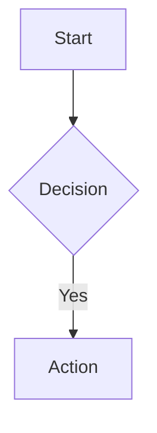

# Markdown Preview

Live preview rendering with GitHub-Flavored Markdown and extended features.

## Supported Features

### Standard Markdown
- Headers with auto-linked IDs
- Bold, italic, strikethrough
- Lists (ordered, unordered, task lists)
- Blockquotes with accent border
- Tables with hover effects
- Code blocks with syntax highlighting
- Links and images

### Extended Features

#### Mermaid Diagrams
22 supported diagram types:
- Flowcharts, Sequence, Class, State
- ER Diagrams, User Journey, Gantt
- Pie Charts, Git Graphs, Mindmaps
- And 12 more (see full list below)

**Usage:**
````markdown

````

**Error Handling:**
- User-friendly error messages
- Bug report button (🐛) sends to Terminal
- Links to documentation

#### Full-Screen Diagram Viewer (v0.5.1)

Expand Mermaid diagrams to full-screen overlay for detailed examination.

**Access:**
- Expand button appears on hover over diagrams (always visible on touch devices)
- Click expand button to open full-screen overlay

**Zoom & Pan:**
- Mouse wheel zoom (10% increments)
- +/- toolbar buttons for zoom control
- Click-drag to pan diagram around viewport
- Zoom indicator displays current percentage (e.g., "125%")
- Custom CSS transform-based implementation (no third-party library)

**Navigation:**
- Fit-to-screen button: Scale diagram to fit viewport
- Reset button: Return to 100% zoom, centered
- Zoom range: 10% to 500%

**Keyboard Shortcuts:**
- `+` or `=`: Zoom in
- `-`: Zoom out
- `0`: Reset zoom to 100%
- `F`: Fit to screen
- `Escape`: Close viewer

**Close Methods:**
- X button in toolbar
- Escape key
- Click backdrop (outside diagram)

**Accessibility:**
- ARIA labels on all controls
- `role="dialog"` with `aria-modal`
- Focus management (trapped in overlay)
- `aria-live` zoom indicator for screen readers

**Architecture:**
- Pure logic extraction: `diagramViewer.logic.ts` (testable)
- React component: `DiagramViewer.tsx`
- SVG rendering uses same innerHTML injection as preview mode (Mermaid strict security)

**Files:**
- `src/renderer/src/components/Editor/DiagramViewer/`

#### HTML Embedding
Safe HTML rendering with security sanitization.

**Allowed Elements:**
- Containers: `<div>`, `<section>`, `<article>`
- Interactive: `<details>`, `<summary>`
- Semantic: `<figure>`, `<figcaption>`
- Tables, lists, inline formatting

**Blocked (Security):**
- `<script>`, `<iframe>`, `<style>`
- Event handlers (`onclick`, etc.)
- JavaScript URLs

**Example:**
```html
<details>
<summary>Click to expand</summary>
Content with **markdown** inside
</details>
```

## Typography

GitHub-inspired professional design:
- Font: Charter, Georgia serif stack
- Body: 15px, line-height 1.5
- Max width: 860px centered
- Dark theme with `#1e1e1e` background

## Line Tracking

All elements have line attributes for:
- Scroll synchronization
- Context menu operations
- Source mapping

Attributes:
- `data-line-start` - Start line
- `data-line-end` - End line
- `data-line` - Legacy start line

## Implementation
- Component: `MarkdownPreview.tsx`
- Mermaid: `MermaidDiagram.tsx`
- Line tracking: Lines 21-28, 143-207
- HTML support: Lines 266-295

## Complete Mermaid Diagram Types
1. Flowcharts (`flowchart`)
2. Sequence Diagrams (`sequenceDiagram`)
3. Class Diagrams (`classDiagram`)
4. State Diagrams (`stateDiagram-v2`)
5. Entity Relationship (`erDiagram`)
6. User Journey (`journey`)
7. Gantt Charts (`gantt`)
8. Pie Charts (`pie`)
9. Quadrant Charts (`quadrantChart`)
10. Requirement Diagrams (`requirementDiagram`)
11. Git Graphs (`gitGraph`)
12. C4 Diagrams (`C4Context`)
13. Mindmaps (`mindmap`)
14. Timelines (`timeline`)
15. Sankey Diagrams (`sankey-beta`)
16. XY Charts (`xychart-beta`)
17. Block Diagrams (`block-beta`)
18. Packet Diagrams (`packet-beta`)
19. Kanban Boards (`kanban`)
20. Architecture (`architecture-beta`)
21. Radar Charts (`radar-beta`)
22. Treemaps (`treemap-beta`)