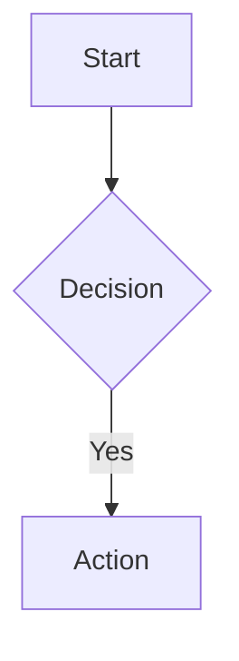

# Markdown Preview

Live preview rendering with GitHub-Flavored Markdown and extended features.

## Supported Features

### Standard Markdown
- Headers with auto-linked IDs
- Bold, italic, strikethrough
- Lists (ordered, unordered, task lists)
- Blockquotes with accent border
- Tables with hover effects
- Code blocks (see the note on syntax highlighting below)
- Links and images

#### Code blocks: no syntax highlighting

Fenced code blocks render in a single flat colour. No highlighter is installed – the
pipeline is `remarkGfm` (plus `remarkBreaks` when `editor.preserveLineBreaks` is on) →
`rehypeRaw` → `rehypeSanitize`, with no `shiki`, `prismjs`, `highlight.js` or
`rehype-highlight` dependency. The `language-*` class **is** emitted onto both `<pre>` and
`<code>` (the sanitizer allows `className` matching `/^language-./`), but no stylesheet
consumes it. Monaco provides highlighting in the **editor** pane only.

#### Math is not supported

`$x$` and `$$…$$` render as literal text. There is no `remark-math` / `rehype-katex`; KaTeX
appears in `node_modules` solely as a transitive dependency of Mermaid, and no KaTeX
stylesheet is loaded.

### Extended Features

#### Mermaid Diagrams
22 documented diagram types:
- Flowcharts, Sequence, Class, State
- ER Diagrams, User Journey, Gantt
- Pie Charts, Git Graphs, Mindmaps
- And 12 more (see full list below)

Erfana passes every `mermaid` fenced block straight to `mermaid.render` and filters nothing, so
any type the bundled Mermaid version supports will render. Verified against Mermaid 11.16.1,
that also includes `info`, `flowchart-elk`, `C4Container` / `C4Component` / `C4Dynamic` /
`C4Deployment`, `wardley-beta`, `cynefin-beta`, `ishikawa`, `treeView-beta`,
`railroad-beta` (and its `-ebnf` / `-peg` variants), `venn-beta`, `swimlane-beta` and
`eventmodeling`. The list of 22 is the documented, supported set – not a technical limit.

**`zenuml` is a known exception.** `src/renderer/src/utils/mermaidDirections.ts` lists it as
a known chart type, but `@mermaid-js/mermaid-zenuml` is not a dependency, so a `zenuml`
fence fails with "No diagram type detected".

**Usage:**
````markdown

```mermaid
graph TD
    A[Start] --> B{Decision}
    B -->|Yes| C[Action]
```
````

**Error Handling:**
- User-friendly error messages
- Bug report button (🐛) sends to Terminal
- Links to documentation

#### Full-Screen Diagram Viewer (v0.5.1)

Expand Mermaid diagrams to full-screen overlay for detailed examination.

**Access:**
- Expand button appears on hover over diagrams (always visible on touch devices)
- Click expand button to open full-screen overlay

**Zoom & Pan:**
- Mouse wheel zoom (10% increments)
- +/- toolbar buttons for zoom control
- Click-drag to pan diagram around viewport
- Zoom indicator displays current percentage (e.g., "125%")
- Custom CSS transform-based implementation (no third-party library)

**Navigation:**
- Fit-to-screen button: Scale diagram to fit viewport
- Reset button: Return to 100% zoom, centered
- Zoom range: 10% to 500%

**Keyboard Shortcuts:**
- `+` or `=`: Zoom in
- `-`: Zoom out
- `0`: Reset zoom to 100%
- `F`: Fit to screen
- `Escape`: Close viewer

**Close Methods:**
- X button in toolbar
- Escape key
- Click backdrop (outside diagram)

**Accessibility:**
- ARIA labels on all controls
- `role="dialog"` with `aria-modal`
- Focus management (trapped in overlay)
- `aria-live` zoom indicator for screen readers

**Architecture:**
- Pure logic extraction: `diagramViewer.logic.ts` (testable)
- React component: `DiagramViewer.tsx`
- SVG rendering uses same innerHTML injection as preview mode (Mermaid strict security)

**Files:**
- `src/renderer/src/components/Editor/DiagramViewer/`

#### HTML Embedding
Safe HTML rendering with security sanitization.

**Allowed elements:**
- Containers: `<div>`, `<section>`
- Interactive: `<details>`, `<summary>`
- Media: ``, `<picture>`, `<source>`
- Tables, lists (including `<dl>`/`<dt>`/`<dd>`), inline formatting

**Blocked (security):**
- `<script>` – element and its text content are both removed
- `<iframe>`, `<object>`, `<embed>` – unwrapped, child content kept
- Event handlers (`onclick`, etc.) and `javascript:` / `data:` / `vbscript:` / `file://` URLs

**Unwrapped, not blocked:** `<article>`, `<aside>`, `<main>`, `<nav>`, `<header>`,
`<footer>`, `<figure>`, `<figcaption>`, `<mark>`, `<abbr>`, `<time>`, `<label>` and
`<style>` are absent from the allowlist, so the tag disappears but its children remain.
For `<style>` that means the CSS text renders as **visible body text** – it is neutralised,
not discarded. The full list and its rationale are in
[rendering/architecture.md](../rendering/architecture.md#allowed-elements).

**Example:**
```html
<details>
<summary>Click to expand</summary>
Content with **markdown** inside
</details>
```

## Typography

GitHub-inspired professional design:
- Font: Charter, Georgia serif stack
- Body: 15px, line-height 1.5
- Max width: 860px centered
- Dark theme with `#1e1e1e` background

## Line Tracking

All elements have line attributes for:
- Scroll synchronization
- Context menu operations
- Source mapping

Attributes:
- `data-line-start` - Start line
- `data-line-end` - End line
- `data-line` - Legacy start line

## Implementation
- Component: `MarkdownPreview.tsx`
- Mermaid: `MermaidDiagram.tsx`
- Line tracking: Lines 21-28, 143-207
- HTML support: Lines 266-295

## Complete Mermaid Diagram Types
1. Flowcharts (`flowchart`)
2. Sequence Diagrams (`sequenceDiagram`)
3. Class Diagrams (`classDiagram`)
4. State Diagrams (`stateDiagram-v2`)
5. Entity Relationship (`erDiagram`)
6. User Journey (`journey`)
7. Gantt Charts (`gantt`)
8. Pie Charts (`pie`)
9. Quadrant Charts (`quadrantChart`)
10. Requirement Diagrams (`requirementDiagram`)
11. Git Graphs (`gitGraph`)
12. C4 Diagrams (`C4Context`)
13. Mindmaps (`mindmap`)
14. Timelines (`timeline`)
15. Sankey Diagrams (`sankey-beta`)
16. XY Charts (`xychart-beta`)
17. Block Diagrams (`block-beta`)
18. Packet Diagrams (`packet-beta`)
19. Kanban Boards (`kanban`)
20. Architecture (`architecture-beta`)
21. Radar Charts (`radar-beta`)
22. Treemaps (`treemap-beta`)