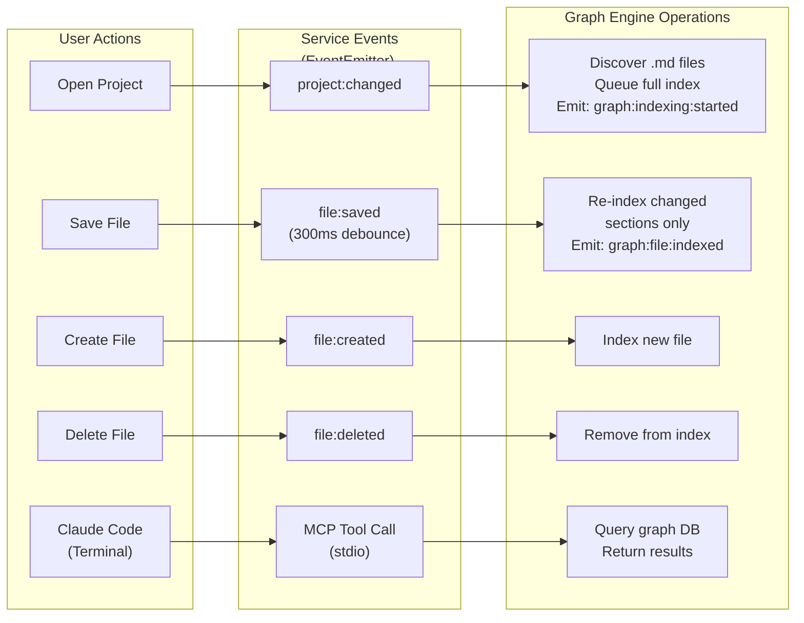
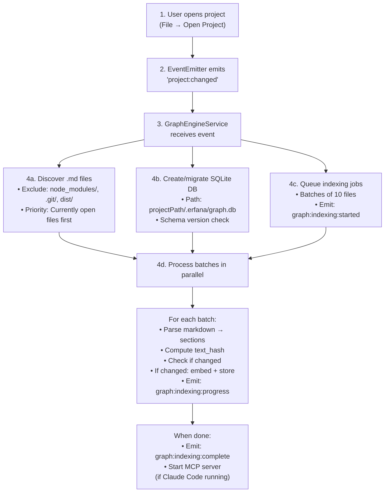
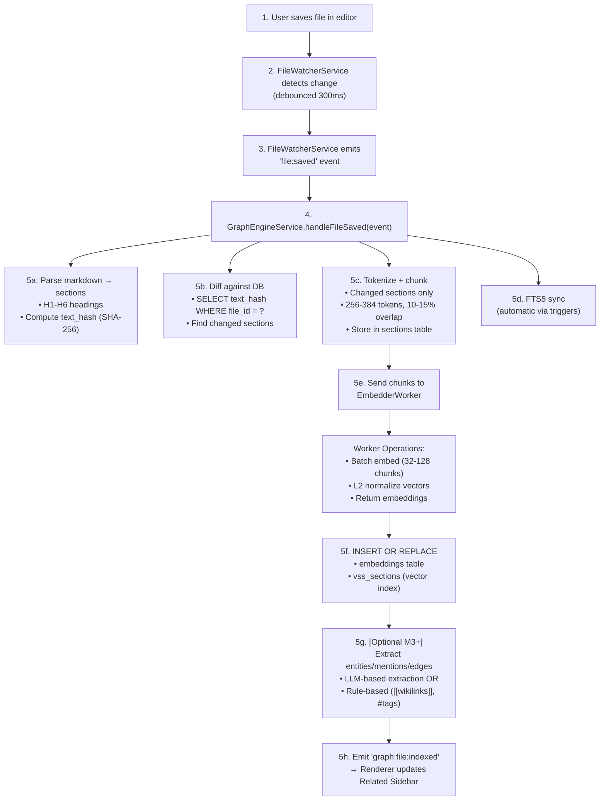
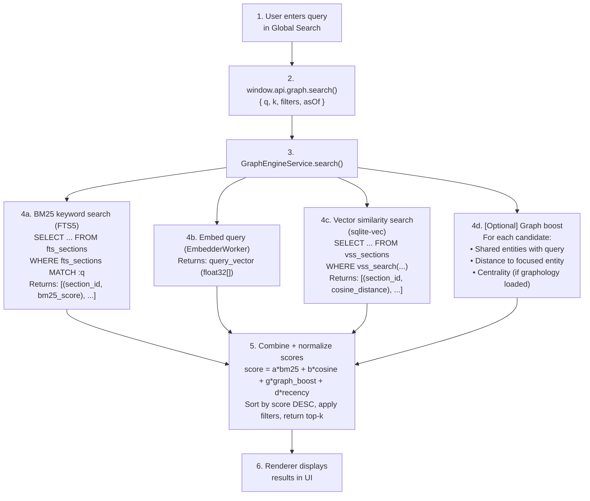
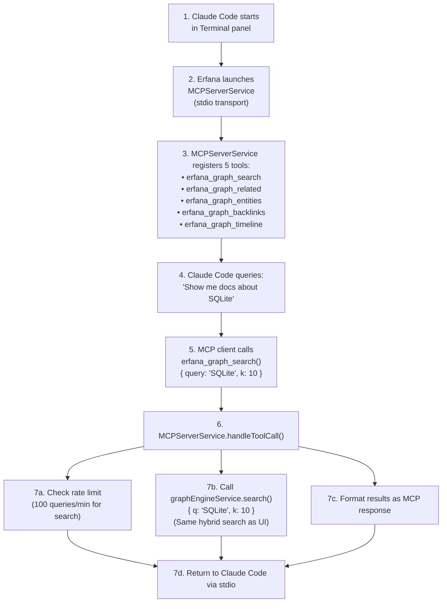

# Graph engine architecture – data flow and design decisions

> This is part 2 of the architecture documentation, split for readability.
>
> **Other parts:**
> - [Architecture – overview and components](./architecture-overview.md)

> ⚠️ **WORK IN PROGRESS – NOT READY FOR DEVELOPMENT**
>
> This documentation is currently under active development and review. The Graph Engine specification, architecture, and implementation details are subject to significant changes. **DO NOT start implementation work based on these documents.**
>
> **Status**: Draft specification being refined
> **Expected Ready**: TBD pending architectural review and wireframe finalization

**Last Updated:** October 2025

---

## Data flow

### Complete event-driven architecture

**Overview:** The Graph Engine integrates with Erfana through an event-driven architecture where services communicate via an EventEmitter bus.

### Project initialization flow

### Indexing flow (file save)

### Search flow (hybrid retrieval)

### MCP server integration flow (Claude Code)

**Security & isolation:**
- MCP server runs in main process (trusted zone)
- Read-only access to graph database
- No file system writes allowed
- Rate limiting prevents abuse
- Separate from renderer process (untrusted zone)

---

## Key design decisions

### 1. Synchronous SQLite (better-sqlite3)
**Why:** Simpler code flow; no promise hell for DB ops.
**Trade-off:** Main thread blocking (mitigated by worker threads for embeddings).

### 2. Debounced indexing
**Why:** Avoid re-indexing on every keystroke.
**Strategy:** 300ms debounce + queue coalescing (one job per file).

### 3. Content-based hashing (text_hash)
**Why:** Skip re-embedding unchanged sections.
**How:** Hash normalized text after stripping markdown syntax.

### 4. Temporal graph (valid_from, valid_to, tx_time)
**Why:** Track how knowledge changes over time.
**Use Case:** "What did the code architecture look like 3 months ago?"

### 5. On-demand graph loading (graphology)
**Why:** Don't load full graph into memory for every query.
**How:** Build subgraph on-demand for specific entities.

### 6. Configurable hybrid weights
**Why:** Different query types benefit from different weightings.
**How:** Store α, β, γ, δ in settings; allow per-query override.

### 7. Single embedder per project
**Why:** Mixing vector spaces causes poor results.
**Migration:** Re-embed all on model switch (background job with progress).

### 8. Event-driven integration with Erfana
**Why:** Loose coupling; GraphEngine doesn't need to know about FileWatcherService internals.
**How:** GraphEngine subscribes to EventEmitter events (`file:saved`, `project:changed`, etc.).
**Benefits:**
- Easy to add new event sources (e.g., git commits, external file changes)
- Graph engine can be disabled/enabled without code changes
- Clean separation of concerns

### 9. MCP server for Claude Code integration
**Why:** Standardized protocol for AI assistant tooling; future-proof for other MCP clients.
**How:** MCPServerService exposes GraphEngineService via stdio transport.
**Benefits:**
- Claude Code gets project knowledge automatically
- Same search API used by both UI and MCP (consistency)
- Rate limiting prevents resource exhaustion
- Read-only access ensures safety

---

## Security considerations

### 1. No renderer Node.js access
- Renderer can't directly call `require()` or `process`
- All file system access goes through IPC

### 2. Content redaction
- Apply regex patterns before indexing (e.g., remove API keys, secrets)
- Configurable per-project

### 3. SQL injection prevention
- Use prepared statements for all queries
- Never concatenate user input into SQL strings

### 4. Optional cloud services
- Embeddings/LLMs are opt-in, not default
- API keys scoped per-project (stored in electron-store)

### 5. Content isolation
- Each project has its own SQLite database
- No cross-project data leakage

---

## Performance considerations

### Read performance
- **FTS5**: ~1-10ms for keyword search (typical corpus)
- **sqlite-vec**: ~50-100ms for 100K vectors @ 384 dims (brute-force)
- **Hybrid Search**: ~100-200ms total (parallelizable)

### Write performance
- **Prepared Statements**: ~0.1ms per row insert
- **WAL Mode**: Concurrent reads while writing
- **Batch Transactions**: Wrap 1000s of inserts in single transaction

### Embedding performance
- **all-MiniLM-L6-v2**: ~15ms per 1K tokens (single thread)
- **Batching**: 32-128 chunks → ~0.5-2s per batch
- **Concurrency**: 2-4 workers → ~1-4 batches/sec

---

## Failure modes & recovery

### Worker crash (onnxruntime-node)
**Symptom:** Worker thread exits unexpectedly
**Recovery:** Auto-restart worker, retry batch (idempotent ops)
**Prevention:** Limit concurrent workers to 2-4

### SQLite lock timeout
**Symptom:** `SQLITE_BUSY` error
**Recovery:** Retry with exponential backoff (max 3 attempts)
**Prevention:** Use WAL mode, keep transactions short

### Corrupt database
**Symptom:** `SQLITE_CORRUPT` error
**Recovery:** Backup DB, run `PRAGMA integrity_check`, rebuild if needed
**Prevention:** Regular integrity checks on startup

---

## Next steps

- **[User Guide](./user-guide-features.md)**: Learn what the graph engine does and how to use it
- **[Data Ingestion](./data-ingestion-discovery.md)**: How files are discovered and indexed
- **[MCP Server](./mcp-server-tools.md)**: Claude Code integration details
- **[Data Model](./data-model.md)**: Review SQLite schema details
- **[Vector Search](./vector-search-overview.md)**: Deep dive on sqlite-vec
- **[Embedding Pipeline](./embedding-pipeline-overview.md)**: ONNX integration details

---

## See also

- [Architecture – overview and components](./architecture-overview.md) – system overview, component architecture, technology stack, process model
- [Main Overview](../graph-engine.md)
- [Performance & Scalability](./performance.md)
- [Production Readiness](./production-readiness-checklist.md)
- [Implementation Guide](./implementation-guide.md)
