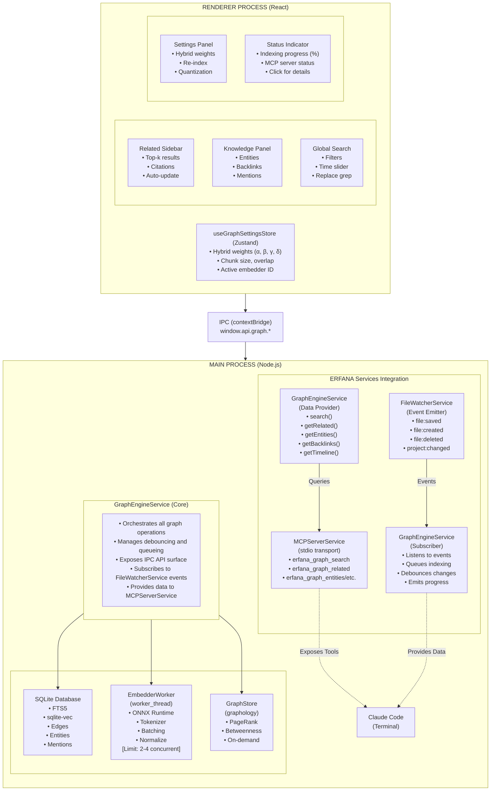

# Graph engine architecture – overview and components

> This is part 1 of the architecture documentation, split for readability.
>
> **Other parts:**
> - [Architecture – data flow and design decisions](./architecture-data-flow.md)

> ⚠️ **WORK IN PROGRESS – NOT READY FOR DEVELOPMENT**
>
> This documentation is currently under active development and review. The Graph Engine specification, architecture, and implementation details are subject to significant changes. **DO NOT start implementation work based on these documents.**
>
> **Status**: Draft specification being refined
> **Expected Ready**: TBD pending architectural review and wireframe finalization

**Last Updated:** October 2025
**Status:** Design Specification

This document details the system architecture, component interactions, and key design decisions for the Erfana Graph Engine.

---

## System overview

The Erfana Graph Engine is a **local-first, embedded knowledge graph** that combines three retrieval paradigms:

1. **Keyword Search (BM25)**: SQLite FTS5 for fast, precise keyword matching
2. **Semantic Search (Vector)**: sqlite-vec for meaning-based similarity
3. **Graph Traversal**: Lightweight entity-relationship graph with temporal awareness

### Design philosophy

- **Local-First**: Zero dependencies on external services; fully functional offline
- **Embedded**: Single-process deployment; no separate database server
- **Hybrid**: Combine multiple retrieval strategies for better results
- **Incremental**: Index documents as they're saved; no batch processing required
- **Privacy**: All data stays on device; optional cloud features are explicit opt-in

---

## Component architecture



### Component responsibilities

#### Integration with ERFANA services

The Graph Engine integrates seamlessly with existing ERFANA services through an event-driven architecture:

**FileWatcherService → GraphEngineService**
- GraphEngineService subscribes to FileWatcherService events on initialization
- Events listened to:
  - `file:saved` – Re-index modified file (incremental update)
  - `file:created` – Index new file
  - `file:deleted` – Remove from index
  - `project:changed` – Trigger full project indexing

**GraphEngineService → MCPServerService**
- MCPServerService exposes GraphEngineService data via MCP protocol
- Runs on stdio transport for Claude Code consumption
- 5 MCP tools provided (search, related, entities, backlinks, timeline)
- Rate limiting: 100/min for search, 50/min for entities, 20/min for timeline

**Event flow example:**
```typescript
// On app startup
const eventBus = new EventEmitter();
const fileWatcherService = new FileWatcherService(eventBus);
const graphEngineService = new GraphEngineService(eventBus);
const mcpServerService = new MCPServerService(graphEngineService);

// User opens project
eventBus.emit('project:changed', { newPath: '/path/to/project' });
// → GraphEngine discovers all .md files and queues indexing

// User saves file
eventBus.emit('file:saved', { path: '/path/to/file.md' });
// → GraphEngine re-indexes only changed sections (via text_hash)

// Claude Code queries from Terminal
await mcpClient.callTool('erfana_graph_search', { query: 'architecture' });
// → MCPServer calls graphEngine.search() → returns results
```

#### GraphEngineService (orchestrator)
- **Request Handling**: Processes IPC requests from renderer
- **Event Subscription**: Listens to FileWatcherService events for auto-indexing
- **Debouncing**: Coalesces rapid file saves (e.g., 300ms window)
- **Queue Management**: Serializes indexing operations to prevent contention
- **Error Handling**: Catches errors, logs, returns structured error responses
- **State Coordination**: Tracks indexing progress, worker availability
- **MCP Data Provider**: Exposes search/graph APIs to MCPServerService

#### SQLite database
- **Schema Management**: DDL migrations, version tracking
- **FTS5**: Keyword search with BM25 ranking
- **sqlite-vec**: Vector similarity search (brute-force initially)
- **Graph Tables**: Entities, edges, mentions, temporal fields
- **WAL Mode**: Write-ahead logging for concurrency

#### EmbedderWorker (worker_threads)
- **Model Loading**: Load ONNX model + tokenizer on initialization
- **Tokenization**: Count tokens, split into chunks (256-384 tokens)
- **Batching**: Process 32-128 chunks per batch (configurable)
- **Embedding**: Generate normalized float32 vectors (L2 norm)
- **Isolation**: Runs off main thread; communicates via postMessage

**⚠️ Critical Limitation:** onnxruntime-node has known stability issues with multiple concurrent workers. **Limit to 2-4 workers max** to avoid random crashes.

#### GraphStore (graphology)
- **In-Memory Graph**: Build from SQLite edges on-demand
- **Centrality Metrics**: PageRank, betweenness, closeness
- **Neighborhood Queries**: Find N-hop neighbors for an entity
- **Lazy Loading**: Only load subgraphs when needed (not full graph)

#### MCPServerService (Claude Code integration)
- **Protocol**: Model Context Protocol (MCP) over stdio transport
- **Lifecycle**: Started on app launch, stopped on app quit
- **Tools Exposed**:
  - `erfana_graph_search` – Hybrid search (BM25 + vector)
  - `erfana_graph_related` – Find related sections
  - `erfana_graph_entities` – List entities with filters
  - `erfana_graph_backlinks` – Get entity backlinks
  - `erfana_graph_timeline` – Temporal queries
- **Rate Limiting**: Token bucket algorithm per tool
- **Security**: Read-only access, no file system writes

#### UI components (renderer process)

**Related Sidebar**
- **Purpose**: Research assistant showing top-10 related sections
- **Trigger**: Auto-updates on file change or text selection
- **Display**: Citation with score, file path, snippet
- **Actions**: Click to open, copy citation, insert link

**Global Search**
- **Purpose**: Project-wide hybrid search (replaces/augments grep)
- **Input**: Natural language query
- **Filters**: Folder, file type, date range
- **Display**: Results with BM25 score, cosine similarity, combined score
- **Actions**: Click to navigate, "Why this result?" breakdown

**Knowledge Panel** (M3+)
- **Purpose**: Entity mentions and backlinks (Obsidian-like)
- **Display**: Entities in current section, where else mentioned
- **Actions**: Click entity to see backlinks, navigate to mentions

**Settings Panel**
- **Purpose**: Configure hybrid search weights and indexing
- **Controls**: α/β/γ/δ sliders, re-index button, quantization toggle
- **Display**: Current embedder model, corpus size, index status

**Status Indicator**
- **Purpose**: Show indexing progress and MCP server status
- **Display**: Progress bar (e.g., "Indexing: 450/1000 files"), MCP status
- **Location**: Bottom-right status bar
- **Actions**: Click to open indexing details

---

## Technology stack justification

### Why SQLite?
- **Embedded**: No separate server; packaged with app
- **Proven**: 30+ years of production use; battle-tested
- **Features**: FTS5, JSON, CTEs, window functions, triggers
- **WAL Mode**: Concurrent reads; single writer

### Why FTS5 over FTS4?
- Better ranking (BM25 built-in)
- Improved tokenization
- More flexible column weighting
- Actively maintained

### Why sqlite-vec over sqlite-vss? (updated October 2025)
**sqlite-vss is deprecated** as of 2024. sqlite-vec is the active replacement:

| Feature | sqlite-vec | sqlite-vss (deprecated) |
|---------|-----------|------------------------|
| **Status** | Active (v0.1.0 stable) | No longer developed |
| **Dependencies** | Pure C, zero deps | C++ (Faiss) |
| **Binary Size** | ~300KB | 3-5MB |
| **Platform Support** | All (macOS/Linux/Windows/WASM) | macOS/Linux only (reliable) |
| **ANN Indexes** | Planned (HNSW/IVF) | Via Faiss |
| **Performance (100K docs)** | <100ms (brute-force) | ~50ms (indexed) |
| **Quantization** | Binary (32x compression) | Limited |

**Decision:** Use sqlite-vec as primary; sqlite-vss only if legacy builds exist.

### Why onnxruntime-node over transformers.js?
- **Performance**: Native C++ execution vs WebAssembly
- **Maturity**: Stable API, widely used
- **Flexibility**: Swap models without code changes

**⚠️ Known Issue:** Worker thread crashes with high concurrency. Mitigation: limit workers, add recovery logic.

**Alternative Considered:** transformers.js (wraps onnxruntime-node, better stability). May revisit if crashes persist.

### Why graphology?
- **Lightweight**: Similar to networkx (Python) / igraph (R)
- **Comprehensive**: PageRank, betweenness, closeness, etc.
- **TypeScript**: First-class TS support
- **Sigma.js Integration**: If we add visualization later

---

## Process model (Electron)

### Main process (Node.js)
- GraphEngineService runs here (access to native modules)
- SQLite database (better-sqlite3 is synchronous, main-thread safe)
- Worker threads for embedding (onnxruntime-node)
- File system access

### Preload script (secure bridge)
- Exposes `window.api.graph.*` via contextBridge
- **No direct Node.js access** in renderer (security)
- Type-safe IPC channels

### Renderer process (Chromium/React)
- UI components (Related Sidebar, Knowledge Panel)
- Zustand stores for settings/state
- Calls `window.api.graph.*` for all operations

### Security boundary
```
Renderer (untrusted) <--> Preload (bridge) <--> Main (trusted)
```

---

## See also

- [Architecture – data flow and design decisions](./architecture-data-flow.md) – data flow diagrams, key design decisions, security, performance, failure modes
- [Main Overview](../graph-engine.md)
- [Performance & Scalability](./performance.md)
- [Production Readiness](./production-readiness-checklist.md)
- [Implementation Guide](./implementation-guide.md)
