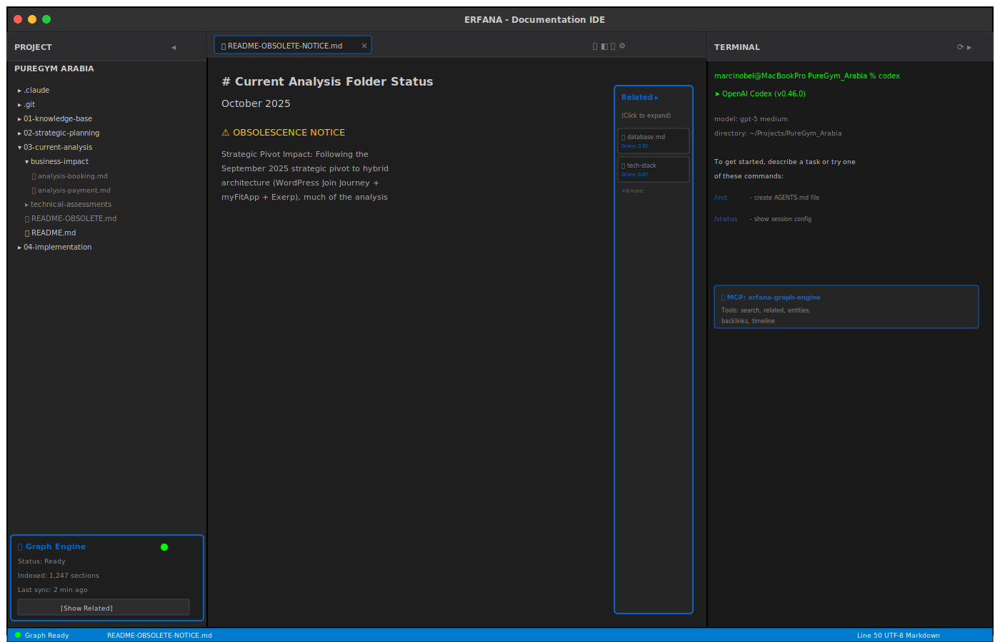
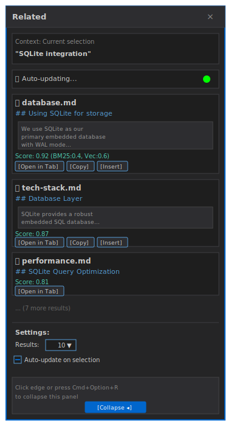
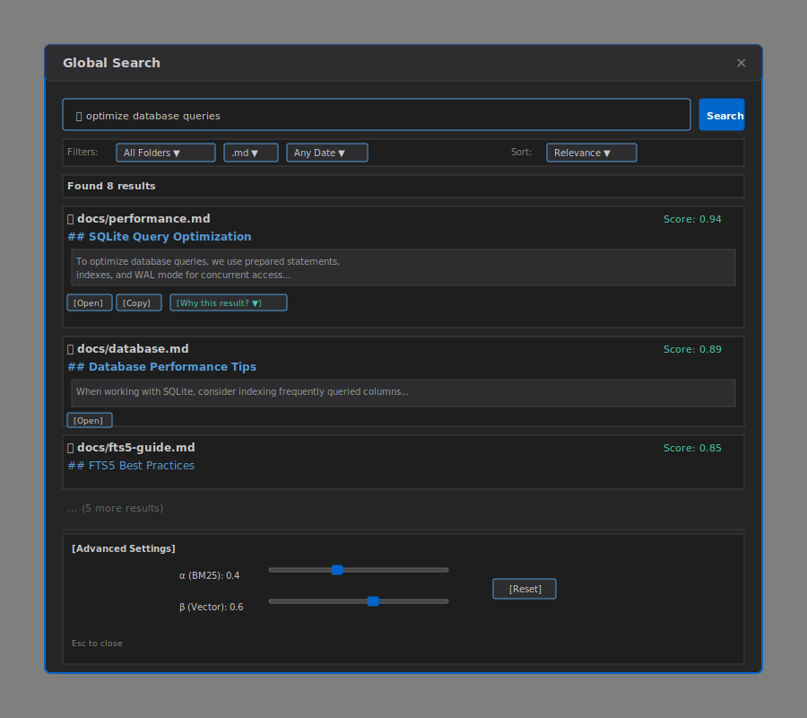
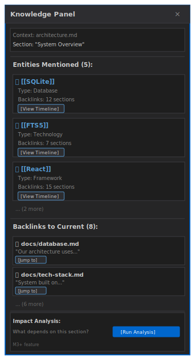
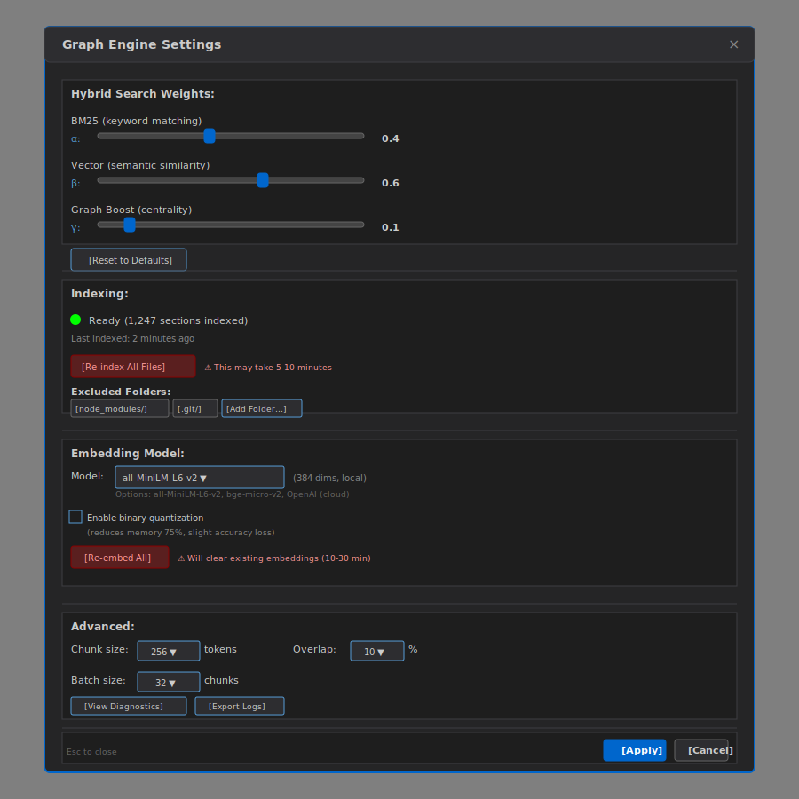
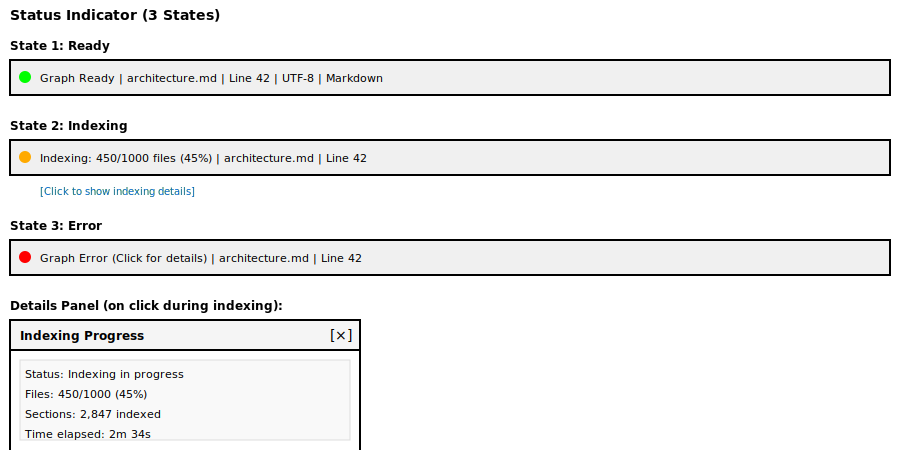
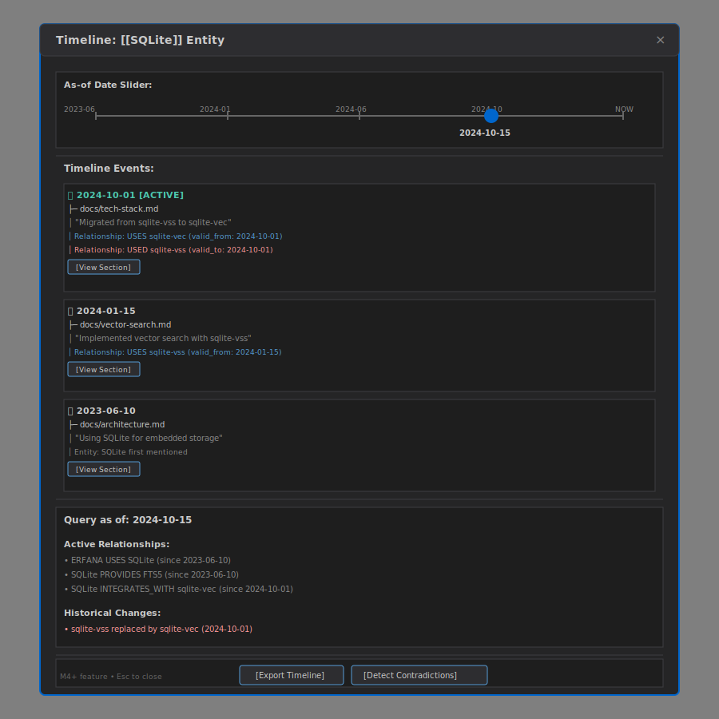

# User guide – UI, Claude Code, and troubleshooting

> This is part 2 of the user guide, split for readability.
>
> **Other parts:**
> - [User guide – features and workflows](./user-guide-features.md)

> ⚠️ **WORK IN PROGRESS – NOT READY FOR DEVELOPMENT**
>
> This documentation is currently under active development and review. The Graph Engine specification, architecture, and implementation details are subject to significant changes. **DO NOT start implementation work based on these documents.**
>
> **Status**: Draft specification being refined
> **Expected Ready**: TBD pending architectural review and wireframe finalization

**Last Updated:** October 2025

---

## UI components

### Overview: Erfana layout with graph engine



The diagram above shows how Graph Engine components integrate into the Erfana IDE:
- **Project Panel** (left): File tree with Graph Engine widget at bottom
- **Editor** (center): Monaco editor with markdown editing and preview
- **Terminal** (right): Terminal with Claude Code and MCP server indicator
- **Related Sidebar**: Collapsible overlay in editor area showing related sections
- **Status Bar**: Graph Engine status indicator (bottom-right)

### Related sidebar

**Location:** Collapsible overlay in editor area (toggle with Cmd+Option+R)



**Features:**
- Auto-updates based on current file/selection
- Shows top-10 related sections
- Click to open in new tab
- "Copy citation" button
- "Insert link" button

**Settings:**
- Number of results (default: 10)
- Auto-update on selection change (default: on)

### Global search

**Location:** Cmd+Shift+F (or Search icon in toolbar)



**Features:**
- Hybrid search (BM25 + vector)
- Filters: folder, file type, date range
- "Why this result?" breakdown (shows BM25 score, cosine similarity, boosts)
- Sort by: relevance, date, filename

**Advanced:**
- Query syntax: `"exact phrase"`, `term1 OR term2`, `heading:term`
- Adjust weights (α, β) per query

### Knowledge panel

**Location:** Collapsible panel in editor area (toggle with Cmd+Option+K)



**Features:**
- Entities in current section
- Backlinks (where else is this mentioned?)
- Impact analysis (what depends on this?)

**Coming in M3+**

### Settings panel

**Location:** Settings icon in status bar or Settings → Graph Engine



**Features:**
- Hybrid search weights (α, β, γ, δ) with live sliders
- Re-index project (manual trigger with progress)
- Binary quantization toggle
- Model selection (embedding model) with re-embed option
- Excluded folders configuration
- Logs and diagnostics

### Status indicator

**Location:** Bottom-right status bar



**Features:**
- Indexing progress (e.g., "Indexing: 450/1000 files")
- Click to open indexing details panel
- Error notifications with details
- Real-time ETA and worker status

### Timeline UI (M4+)

**Location:** Knowledge Panel → Timeline tab



**Features:**
- Timeline slider to query "as-of" any date
- Chronological event list showing when entities/relationships changed
- Active relationships at selected date
- Historical change detection
- Contradiction detection (e.g., "still using sqlite-vss?" vs "migrated to sqlite-vec")
- Export timeline as markdown

**Coming in M4+**

---

## Claude Code integration

### Available MCP tools

Claude Code (running in Terminal panel) can use these MCP tools to query the graph engine:

#### 1. `erfana_graph_search`

**Purpose:** Hybrid BM25 + vector search.

**Parameters:**
- `query` (string): Search query
- `k` (number, optional): Number of results (default: 10)
- `filters` (object, optional): Folder, file type, date filters

**Example:**
```javascript
// Claude Code usage:
const results = await useMcpTool('erfana_graph_search', {
  query: 'SQLite FTS5 performance',
  k: 5,
  filters: { folder: 'docs/' }
});
```

#### 2. `erfana_graph_related`

**Purpose:** Find sections related to a specific section.

**Parameters:**
- `sectionId` (number): Section ID
- `k` (number, optional): Number of results (default: 10)

#### 3. `erfana_graph_entities`

**Purpose:** List entities (with optional filters).

**Parameters:**
- `query` (string, optional): Filter by name
- `type` (string, optional): Filter by type (e.g., 'technology', 'person')
- `limit` (number, optional): Max results (default: 50)

#### 4. `erfana_graph_backlinks`

**Purpose:** Get backlinks for an entity.

**Parameters:**
- `entityName` (string): Entity name (e.g., "SQLite")
- `limit` (number, optional): Max results (default: 50)

#### 5. `erfana_graph_timeline`

**Purpose:** Get temporal timeline for entity or file.

**Parameters:**
- `entityId` (number, optional): Entity ID
- `fileId` (number, optional): File ID
- `asOf` (number, optional): Unix timestamp for "as-of" query

### Workflow example

**User:** "Claude, help me understand our search architecture"

**Claude Code:**

```javascript
// 1. Search for architecture docs
const results = await useMcpTool('erfana_graph_search', {
  query: 'search architecture',
  k: 5
});

// 2. Get entities mentioned in top result
const entities = await useMcpTool('erfana_graph_entities', {
  query: 'search',
  limit: 10
});

// 3. Get backlinks for "hybrid search" entity
const backlinks = await useMcpTool('erfana_graph_backlinks', {
  entityName: 'hybrid search',
  limit: 10
});

// 4. Synthesize answer
"Based on your docs, your search architecture uses:
- BM25 for keyword matching (FTS5)
- Vector embeddings for semantic similarity (sqlite-vec)
- Hybrid fusion with a=0.4, b=0.6 weights
- Related docs: architecture.md, hybrid-search.md, vector-search.md"
```

---

## Best practices

### 1. Use wikilinks for entities

**Why:** Helps graph engine extract entities automatically.

**Syntax:**
```markdown
We use [[SQLite]] for the database layer.
The [[FTS5]] extension provides full-text search.
```

**Result:** Graph engine creates entities and tracks mentions.

### 2. Write descriptive headings

**Why:** Headings are weighted 3x higher in BM25 search.

**Good:**
```markdown
## SQLite FTS5 performance optimization
```

**Bad:**
```markdown
## Optimization
```

### 3. Keep sections focused

**Why:** Smaller, focused sections → better embedding quality.

**Guideline:** Aim for 256-384 tokens per section (~150-250 words).

### 4. Use tags for classification

**Why:** Helps organize and filter entities.

**Syntax:**
```markdown
#database #performance #optimization
```

### 5. Let indexing finish before searching

**Why:** Incomplete index → incomplete results.

**Tip:** Wait for status indicator to show green dot before first search.

---

## Troubleshooting

### "Related sidebar is empty"

**Cause:** Index not yet complete, or no similar content exists.

**Fix:**
1. Check status indicator (wait for green dot)
2. If indexed, your content may be unique (no related sections)
3. Try adjusting β weight higher (more vector similarity)

### "Search returns no results"

**Cause:** Query terms not in index, or filters too restrictive.

**Fix:**
1. Check spelling
2. Try broader terms (e.g., "database" instead of "PostgreSQL")
3. Remove filters (folder, date range)
4. Check that files are markdown (`.md`)

### "Indexing stuck at X%"

**Cause:** Large file or worker crash.

**Fix:**
1. Wait 5 minutes (large files take time)
2. Check logs (Settings → Diagnostics)
3. Restart Erfana
4. If persists, report issue with logs

### "MCP tools not working in Claude Code"

**Cause:** MCP server not started, or Claude Code not configured.

**Fix:**
1. Check status indicator (should show MCP server running)
2. Restart Claude Code session
3. Check Claude Code MCP config (should auto-detect Erfana)

### "Memory usage high"

**Cause:** Large corpus (>100K documents) without quantization.

**Fix:**
1. Settings → Enable binary quantization
2. Exclude large folders (e.g., `node_modules/`)
3. Consider splitting project into smaller repos

---

## See also

- [User guide – features and workflows](./user-guide-features.md) – what the graph engine is, key features, getting started, workflows
- [Data Ingestion](./data-ingestion-discovery.md) – How files are indexed
- [MCP Server](./mcp-server-tools.md) – Technical details on Claude Code integration
- [Implementation Guide](./implementation-guide.md) – For developers building the system
