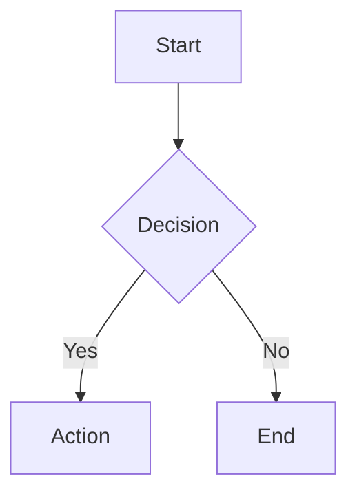
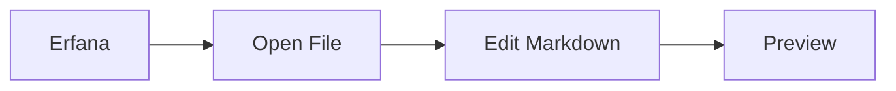
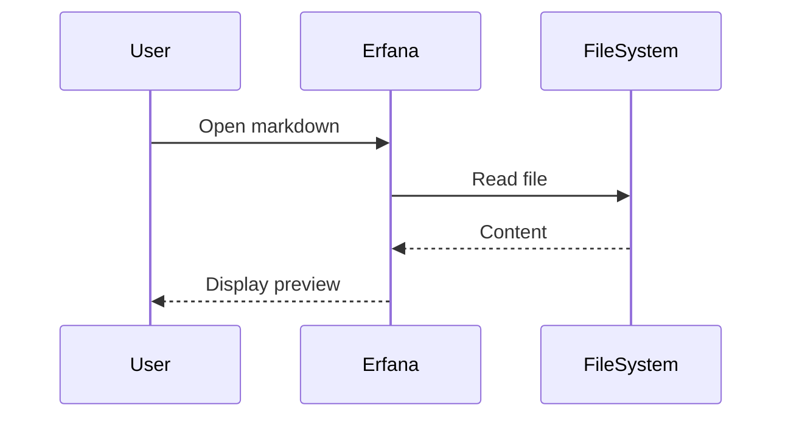

# Markdown Editing Features

## Monaco Editor Configuration

- Language: `markdown`
- Word wrap: `on`
- Line height: `20px` (compact)
- Font size: `13px` (compact)
- Padding: `8px` top/bottom (compact)
- Minimap: `disabled`
- Rulers: `[]` (none)

## Keyboard Shortcuts

**Monaco Built-in Shortcuts** (work when editor is focused):
- Standard text editing (Cmd/Ctrl+C/V/X/Z, etc.)
- Find/Replace (Cmd/Ctrl+F, Cmd/Ctrl+H)
- Multi-cursor (Alt+Click, Cmd/Ctrl+Alt+↑/↓)
- Save file (Cmd/Ctrl+S)

**⚠️ Global App Shortcuts**:
Application-level shortcuts like Cmd/Ctrl+B (toggle sidebar) override Monaco shortcuts. When these keys are pressed, they trigger app actions instead of editor actions.

See: [UI Components](./ui-components.md) for global keyboard shortcuts

## View Modes

1. **Editor Only** (📝): Focus on writing
2. **Split View** (⚡): Source + preview side-by-side with synchronized scrolling
3. **Preview Only** (👁️): Presentation mode

### Scroll Synchronization

In **Split View**, the editor and preview panes are bidirectionally synchronized - scrolling one automatically scrolls the other to the corresponding position.

**Features:**
- **Editor → Preview**: Scrolling in Monaco editor updates preview position
- **Preview → Editor**: Scrolling in preview updates editor position
- **Line Mapping**: Uses `data-line` attributes for precise positioning
- **Smooth Interpolation**: Linear interpolation between known points
- **Debouncing**: 50ms delay prevents scroll loops

**Technical Implementation:**
- Scroll map builds on view mode change (296 entries for CLAUDE.md)
- Maps editor line numbers to preview element positions
- Uses react-markdown's `node.position` API for AST line data
- Attaches scroll listeners when scroll map is ready

**Files:**
- `MarkdownEditorPanel.tsx:217-301` - Scroll map + listeners
- `MarkdownPreview.tsx:20-37` - Line number extraction
- `MonacoMarkdownEditor.tsx` - Exposes scroll API

## Multi-File Tab System

Erfana supports editing multiple markdown files simultaneously with unique panels for each file.

### Features

- **Unique Panel per File**: Each opened file gets its own editor panel with independent state
- **React Key Prop**: `<MonacoMarkdownEditor key={currentFile.path} />` forces remount when switching files
- **Tab Management**: Multiple tabs can be open at once in the Dockview layout
- **Unsaved Changes Dialog**: Prompts before closing tabs with unsaved content

### Opening Files

- Single-click in Project Panel: Preview file
- Double-click in Project Panel: Open in dedicated editor panel
- Multiple files can be open simultaneously

**Implementation**: `MarkdownEditorPanel.tsx:314`

## Formatting Toolbar

Visual toolbar with 10 markdown formatting buttons (visible in editor and split views).

### Available Buttons

1. **Bold** - Wraps selection with `**text**`
2. **Italic** - Wraps selection with `*text*`
3. **Strikethrough** - Wraps selection with `~~text~~`
4. **Inline Code** - Wraps selection with `` `text` ``
5. **Code Block** - Wraps selection with triple backticks
6. **Insert Link** - Creates `[text](url)` format
7. **Insert Image** - Creates `` format
8. **Heading 1** - Adds `# ` prefix
9. **Bullet List** - Adds `- ` prefix to each line
10. **Numbered List** - Adds `1. ` prefix with incremental numbers

### Usage

- Click toolbar button to apply formatting
- Select text first for wrapping operations (bold, italic, code)
- Works with both text selections and empty cursor positions

**Files**:
- `MarkdownEditorPanel.tsx:236-306` (toolbar UI)
- `MonacoMarkdownEditor.tsx:81-224` (formatting methods)

## Document Statistics

Real-time statistics displayed in bottom bar for currently open file.

### Metrics Tracked

- **Words**: Word count (whitespace-delimited)
- **Characters**: Total character count (including spaces)
- **Lines**: Line count
- **Reading Time**: Estimated reading time (200 words/minute)
- **Selected Text**: Character count of current selection (when text is selected)

### Display Location

Bottom status bar in MarkdownEditorPanel, visible in all view modes.

**Implementation**:
- Calculation: `MarkdownEditorPanel.tsx:24-45` (calculateStats function)
- Display: `MarkdownEditorPanel.tsx:336-371` (document-stats component)
- Updates: Real-time via useMemo hook (line 66-69)

## Auto-Save

Automatic file saving with debounced writes to prevent excessive disk I/O.

### Behavior

- **Trigger**: Automatically saves 2 seconds after last edit
- **Indicator**: Shows "Auto-saving..." in toolbar during save
- **Manual Save**: Cmd/Ctrl+S still available for immediate save
- **Unsaved Changes**: Dot indicator (●) shown in tab title when file is modified

### Implementation Details

- Uses `setTimeout` with 2000ms delay
- Clears previous timer on each edit (debounce pattern)
- Only triggers when `currentFile.modified === true`
- Visual feedback via `isAutoSaving` state

**Code**: `MarkdownEditorPanel.tsx:115-135` (auto-save effect)

## Claude Code Integration

Right-click context menu in markdown preview for AI-powered text operations with automatic AI Assistant panel integration.

### Available Actions

1. **Ask Claude to Elaborate** - Expands selected text with detail (sends directly to AI)
2. **Rewrite** - Rephrases selected text in different style (populates input for review)
3. **Simplify** - Makes selected text clearer and simpler (populates input for review)
4. **Improve** - General improvement suggestions (populates input for review)
5. **Custom** - Write your own custom prompt (populates input for review)

### Behavior

**Direct Send ("Elaborate")**:
- Sends prompt immediately to AI Assistant panel
- Auto-opens AI Assistant panel if hidden
- Suggests Claude review file/project for context
- No user review needed (streamlined UX)

**Populate for Review (Other Actions)**:
- Fills AI Assistant input field with generated prompt
- User can review, edit, or send manually
- More control for complex operations

### File References

Selected text includes precise line number references:
- Single line: `@/path/to/file.md:42`
- Multi-line: `@/path/to/file.md:42-58`
- Claude Code automatically loads context from these references

### Technical Implementation

**Cross-Component Communication**:
- Uses Zustand store (`useAiAssistantStore`) for message passing
- `setPendingMessage(prompt, sendImmediately)` sends to AI panel
- `setActivePanel('claude', 'right')` opens AI Assistant

**Line Number Extraction**:
- `getLineNumbersFromSelection()` reads `data-line` attributes from DOM
- Preview elements tagged via react-markdown `node.position` API
- Handles inline selections, multi-element ranges, edge cases

**React Portal**:
- Context menu rendered at document level for correct positioning
- Escapes containing blocks to avoid overflow issues
- Portal root: `#context-menu-root` in index.html

**Files**:
- `PreviewContextMenu.tsx` (context menu actions, line number extraction)
- `MarkdownPreview.tsx` (selection tracking, line number injection)
- `useAiAssistantStore.ts` (Zustand store for messaging)

## Preview Features

### Supported Markdown

- GitHub-Flavored Markdown (GFM)
- Syntax-highlighted code blocks
- Tables with hover effects
- Task lists with checkboxes
- Blockquotes with accent border
- Auto-linked headings (for future TOC)
- **Mermaid diagrams** (flowcharts, sequence diagrams, class diagrams, and more)

### Mermaid Diagrams

Erfana supports **22 Mermaid diagram types** from the base Mermaid.js package (v11.12.0) for comprehensive visualization needs.

#### Supported Diagram Types (Complete List)

1. **Flowcharts** (`flowchart`) - Process flows, decision trees
2. **Sequence Diagrams** (`sequenceDiagram`) - Actor interactions over time
3. **Class Diagrams** (`classDiagram`) - OOP structures and relationships
4. **State Diagrams** (`stateDiagram-v2`) - State machines and transitions
5. **Entity Relationship Diagrams** (`erDiagram`) - Database models
6. **User Journey** (`journey`) - User experience flows
7. **Gantt Charts** (`gantt`) - Project timelines and schedules
8. **Pie Charts** (`pie`) - Proportional data visualization
9. **Quadrant Charts** (`quadrantChart`) - 4-quadrant analysis
10. **Requirement Diagrams** (`requirementDiagram`) - System requirements
11. **Git Graphs** (`gitGraph`) - Branch and commit history
12. **C4 Diagrams** (`C4Context`) - Software architecture contexts
13. **Mindmaps** (`mindmap`) - Hierarchical concepts and brainstorming
14. **Timelines** (`timeline`) - Chronological events
15. **Sankey Diagrams** (`sankey-beta`) - Flow and energy transfers
16. **XY Charts** (`xychart-beta`) - Data point plotting
17. **Block Diagrams** (`block-beta`) - System components
18. **Packet Diagrams** (`packet-beta`) - Network packet structures
19. **Kanban Boards** (`kanban`) - Task workflow management
20. **Architecture Diagrams** (`architecture-beta`) - System designs
21. **Radar Charts** (`radar-beta`) - Multi-dimensional data comparison
22. **Treemaps** (`treemap-beta`) - Hierarchical rectangles

**Note**: ZenUML is not included as it requires an external plugin (`@mermaid-js/mermaid-zenuml`).

See `test-mermaid.md` for examples of all 22 diagram types.

#### Usage

Use standard markdown code blocks with `mermaid` language identifier:

````markdown

````

#### Visual Design

Diagrams automatically use Erfana's dark theme:
- **Background**: `#2d2d30` (matches code blocks)
- **Accent Color**: `#4fc3f7` (cyan/blue)
- **Text**: `#d4d4d4` (light gray)
- **Borders**: `#555`, `#3c3c3c` (subtle contrast)
- **Layout**: Centered, responsive, horizontally scrollable

#### Error Handling

Invalid diagram syntax displays a user-friendly error message with:
- **Red error box** with clear error description
- **Link to Mermaid documentation** for syntax help
- **No crashes** - gracefully handles syntax errors

#### Example Diagrams

**Flowchart**:


**Sequence Diagram**:


**Implementation**: `MermaidDiagram.tsx`, `MarkdownPreview.tsx:73-76`

### Typography & Styling

**Medium.com-Inspired Design**:
- Font family: Charter, Georgia, Cambria serif stack
- Body text: 18px, line-height 1.5, letter-spacing -0.003em
- Max width: 680px (optimal reading column)
- Padding: 32px all sides (top padding optimized to match left/right)
- Compact spacing for efficient information density

**Dark Theme**:
- Background: `#1e1e1e`
- Text: `#d4d4d4`
- Headings: `#ffffff` with tight letter-spacing
- Code blocks: `#2d2d30` background
- Inline code: `#ce9178` color
- Links: `#4fc3f7` with hover underline
- Blockquotes: Italic serif, `#b8b8b8`, 3px left border

**Responsive**:
- Images scale to container
- External links open in default browser
- Hover effects on tables

## Additional Features

- Selection tracking for Claude integration (see Claude Code Integration above)
- Real-time preview updates as you type
- Responsive layout that adjusts to panel size

## Implementation Files

- `MonacoMarkdownEditor.tsx` - Editor component
- `MarkdownPreview.tsx` - Preview component
- `MarkdownEditorPanel.tsx` - Combined panel with view modes

See: [UI Components](./ui-components.md) | [Architecture](./architecture.md)
