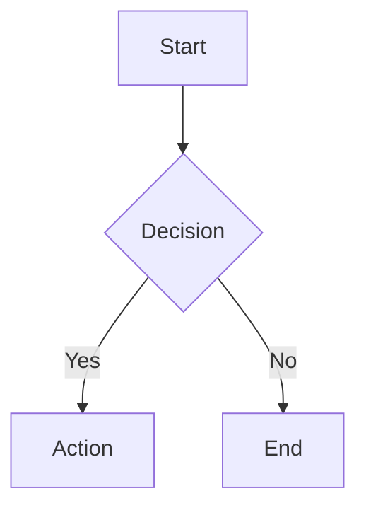
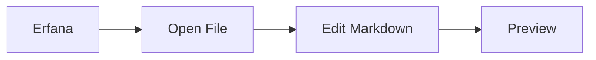
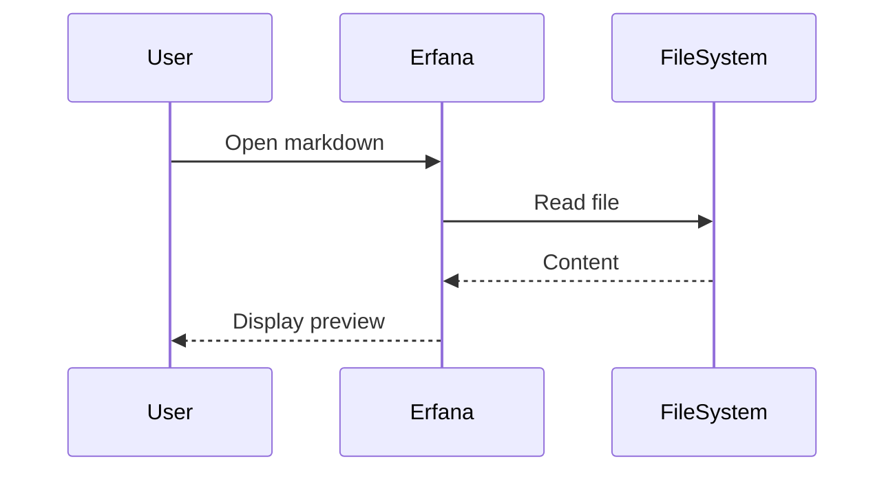

# Markdown Editing Features

## Monaco Editor Configuration

- Language: `markdown`
- Word wrap: `on`
- Line height: `20px` (compact)
- Font size: `13px` (compact)
- Padding: `8px` top/bottom (compact)
- Minimap: `disabled`
- Rulers: `[]` (none)

## Keyboard Shortcuts

**Monaco Built-in Shortcuts** (work when editor is focused):
- Standard text editing (Cmd/Ctrl+C/V/X/Z, etc.)
- Find/Replace (Cmd/Ctrl+F, Cmd/Ctrl+H)
- Multi-cursor (Alt+Click, Cmd/Ctrl+Alt+↑/↓)
- Save file (Cmd/Ctrl+S)

**⚠️ Global App Shortcuts**:
Application-level shortcuts like Cmd/Ctrl+B (toggle sidebar) override Monaco shortcuts. When these keys are pressed, they trigger app actions instead of editor actions.

See: [UI Components](./ui-components.md) for global keyboard shortcuts

## View Modes

1. **Editor Only** (📝): Focus on writing
2. **Split View** (⚡): Source + preview side-by-side with synchronized scrolling
3. **Preview Only** (👁️): Presentation mode

### Scroll Synchronization

In **Split View**, the editor and preview panes are bidirectionally synchronized - scrolling one automatically scrolls the other to the corresponding position.

**Features:**
- **Editor → Preview**: Scrolling in Monaco editor updates preview position
- **Preview → Editor**: Scrolling in preview updates editor position
- **Line Mapping**: Uses `data-line-start`, `data-line-end`, `data-line` attributes for precise positioning
- **Smooth Interpolation**: Linear interpolation between known points
- **Debouncing**: 50ms delay prevents scroll loops

**Technical Implementation:**
- Scroll map builds on view mode change (296 entries for CLAUDE.md)
- Maps editor line numbers to preview element positions
- Uses react-markdown's `node.position` API for AST line data
- Enhanced line range tracking for multi-line elements
- Attaches scroll listeners when scroll map is ready

**Files:**
- `MarkdownEditorPanel.tsx:217-301` - Scroll map + listeners
- `MarkdownPreview.tsx:21-28` - Line range extraction (extractLineRange)
- `MonacoMarkdownEditor.tsx` - Exposes scroll API

## Multi-File Tab System

Erfana supports editing multiple markdown files simultaneously with unique panels for each file.

### Features

- **Unique Panel per File**: Each opened file gets its own editor panel with independent state
- **React Key Prop**: `<MonacoMarkdownEditor key={currentFile.path} />` forces remount when switching files
- **Tab Management**: Multiple tabs can be open at once in the Dockview layout
- **Unsaved Changes Dialog**: Prompts before closing tabs with unsaved content

### Opening Files

- Single-click in Project Panel: Preview file
- Double-click in Project Panel: Open in dedicated editor panel
- Multiple files can be open simultaneously

**Implementation**: `MarkdownEditorPanel.tsx:314`

## Formatting Toolbar

Visual toolbar with 10 markdown formatting buttons (visible in editor and split views).

### Available Buttons

1. **Bold** - Wraps selection with `**text**`
2. **Italic** - Wraps selection with `*text*`
3. **Strikethrough** - Wraps selection with `~~text~~`
4. **Inline Code** - Wraps selection with `` `text` ``
5. **Code Block** - Wraps selection with triple backticks
6. **Insert Link** - Creates `[text](url)` format
7. **Insert Image** - Creates `` format
8. **Heading 1** - Adds `# ` prefix
9. **Bullet List** - Adds `- ` prefix to each line
10. **Numbered List** - Adds `1. ` prefix with incremental numbers

### Usage

- Click toolbar button to apply formatting
- Select text first for wrapping operations (bold, italic, code)
- Works with both text selections and empty cursor positions

**Files**:
- `MarkdownEditorPanel.tsx:236-306` (toolbar UI)
- `MonacoMarkdownEditor.tsx:81-224` (formatting methods)

## Document Statistics

Real-time statistics displayed in bottom bar for currently open file.

### Metrics Tracked

- **Words**: Word count (whitespace-delimited)
- **Characters**: Total character count (including spaces)
- **Lines**: Line count
- **Reading Time**: Estimated reading time (200 words/minute)
- **Selected Text**: Character count of current selection (when text is selected)

### Display Location

Bottom status bar in MarkdownEditorPanel, visible in all view modes.

**Implementation**:
- Calculation: `MarkdownEditorPanel.tsx:24-45` (calculateStats function)
- Display: `MarkdownEditorPanel.tsx:336-371` (document-stats component)
- Updates: Real-time via useMemo hook (line 66-69)

## Auto-Save

Automatic file saving with debounced writes to prevent excessive disk I/O.

### Behavior

- **Trigger**: Automatically saves 2 seconds after last edit
- **Indicator**: Shows "Auto-saving..." in toolbar during save
- **Manual Save**: Cmd/Ctrl+S still available for immediate save
- **Unsaved Changes**: Dot indicator (●) shown in tab title when file is modified

### Implementation Details

- Uses `setTimeout` with 2000ms delay
- Clears previous timer on each edit (debounce pattern)
- Only triggers when `currentFile.modified === true`
- Visual feedback via `isAutoSaving` state

**Code**: `MarkdownEditorPanel.tsx:115-135` (auto-save effect)

## Claude Code Integration

Right-click context menu in markdown preview for AI-powered text operations with automatic Copilot panel integration.

### Available Actions

1. **Elaborate** - Expands selected text with detail, examples, and context (sends to Terminal with auto-execute)
2. **Modify** - Custom modification with user input (interactive dialog, sends to Terminal with auto-execute)
3. **Send to Terminal** - Paste selection directly to terminal input (for custom workflows)

### Modify Action & Input Dialog

The **Modify** action provides a flexible way to transform selected text by collecting user instructions through an interactive dialog.

**Dialog Features:**
- **React Portal Overlay**: Renders at document.body level (entire UI, not just preview) for proper z-index layering
- **Source Preview**: Displays original markdown source (not rendered HTML) with 500 character truncation
- **Multiline Input**: Textarea with scrolling support (max-height: 200px)
- **Character Limit**: 2000 characters for modification instructions
- **Custom Scrollbar**: Dark theme scrollbar styling for consistency
- **Sharp Design**: No rounded corners (matches Erfana's design language)
- **Keyboard Shortcuts**:
  - `Cmd/Ctrl+Enter` - Submit modification prompt
  - `Esc` - Cancel and close dialog
- **Visual Tooltip**: Info icon (ⓘ) displays keyboard shortcuts on hover

**User Workflow:**
1. Right-click selected text in preview → **Modify**
2. Dialog appears showing truncated source (500 chars max)
3. Enter modification instructions (e.g., "make more concise", "add examples")
4. Press `Cmd/Ctrl+Enter` or click Submit
5. Prompt automatically sent to Terminal and executed with Claude Code

**Template Integration:**
- Uses `requiresInput: true` in template frontmatter
- User input available as `{{userInput}}` variable in template
- Combines with `autoExecute: true` for seamless Claude Code workflow

**Implementation**: `UserInputDialog.tsx` (React Portal component), `PreviewContextMenu.tsx` (dialog handling)

See: [Prompt Templates](./prompt-templates.md) for `requiresInput` configuration

### Prompt Template System

Context menu actions are powered by dynamic prompt templates:

**Template Files:** `src/renderer/src/prompts/templates/*.md`
- YAML frontmatter configuration (area, name, icon, target panel)
- Handlebars-style template body with variables
- CSP-compliant rendering (no eval, no Function constructor)
- Hot-reloadable in development

**Template Variables:**
- `{{selectedText}}` - Selected markdown text (from original source)
- `{{filePath}}` - Current file path
- `{{startLine}}`, `{{endLine}}` - Selection line range
- `{{fileRef}}` - File reference: `@/path/file.md:10-20`
- `{{lineRange}}` - Formatted: "line 10" or "lines 10-20"
- `{{userInput}}` - User input from dialog (if `requiresInput: true`)

**See:** [Prompt Templates](./prompt-templates.md) for creating custom templates

### File References & Source Reading

Selected text includes precise line number references:
- Single line: `@/path/to/file.md:42`
- Multi-line: `@/path/to/file.md:42-58`
- Claude Code automatically loads context from these references

**Source Line Reading:**
- `readSourceLines()` reads original markdown source (not rendered HTML)
- Ensures accurate text extraction for multi-element selections
- Line numbers from enhanced line range tracking system

### Line Range Tracking

All preview elements have precise line range attributes:

```html
<pre data-line-start="42" data-line-end="58" data-line="42">
  <!-- Code block spanning lines 42-58 -->
</pre>
```

**Attributes:**
- `data-line-start` - Start line (inclusive)
- `data-line-end` - End line (inclusive)
- `data-line` - Start line (legacy compatibility)

**Selection Algorithm:**
- Walks DOM from selection start/end points
- Finds nearest elements with line range attributes
- Handles multi-line elements (tables, code blocks, diagrams)
- No race conditions (reads fresh DOM on right-click)

**Files:** `MarkdownPreview.tsx:21-28` (extractLineRange), `MarkdownPreview.tsx:143-207` (getLineNumbersFromSelection)

### Technical Implementation

**Prompt Template System**:
- CSP-safe renderer (src/renderer/src/prompts/renderer.ts)
- YAML parser with js-yaml (src/renderer/src/prompts/parser.ts)
- Zod schema validation (src/renderer/src/prompts/schema.ts)
- Dynamic template registry (src/renderer/src/prompts/registry.ts)
- Helper functions (src/renderer/src/prompts/helpers.ts)

**Cross-Component Communication**:
- Uses Zustand store (`useCopilotStore`) for message passing
- `openPanelAndSendContent()` utility (src/renderer/src/utils/panelUtils.ts)
- Targets Copilot or Terminal panel based on template configuration

**React Portal**:
- Context menu rendered at document level for correct positioning
- Escapes containing blocks to avoid overflow issues
- Portal root: `#context-menu-root` in index.html

**Files**:
- `PreviewContextMenu.tsx` - Context menu, template rendering, source reading
- `MarkdownPreview.tsx` - Selection tracking, line range injection
- `panelUtils.ts` - Panel opening utilities

## Preview Features

### Supported Markdown

- GitHub-Flavored Markdown (GFM)
- Syntax-highlighted code blocks
- Tables with hover effects
- Task lists with checkboxes
- Blockquotes with accent border
- Auto-linked headings (for future TOC)
- **Mermaid diagrams** (flowcharts, sequence diagrams, class diagrams, and more)
- **HTML Embedding** (with security sanitization)

### Code Block Rendering

**Inline vs Block Detection:**
- **Inline code**: Single backtick `` `code` `` - no className, no newlines
- **Block code**: Triple backticks with/without language - contains newlines

**Detection Logic** (`MarkdownPreview.tsx:74`):
```typescript
const isInline = !className && typeof children === 'string' && !children.includes('\n')
```

**Rendering:**
- Plain code blocks (``` without language) render as unified `<pre>` blocks
- Code blocks with language (```javascript) get syntax highlighting
- Inline code renders as `<code className="inline-code">`

**Bug Fix** (commit 4ccd42f): Previously, plain code blocks without language identifiers were incorrectly treated as inline code, rendering line-by-line instead of as unified blocks.

### Mermaid Diagrams

Erfana supports **22 Mermaid diagram types** from the base Mermaid.js package (v11.12.0) for comprehensive visualization needs.

#### Supported Diagram Types (Complete List)

1. **Flowcharts** (`flowchart`) - Process flows, decision trees
2. **Sequence Diagrams** (`sequenceDiagram`) - Actor interactions over time
3. **Class Diagrams** (`classDiagram`) - OOP structures and relationships
4. **State Diagrams** (`stateDiagram-v2`) - State machines and transitions
5. **Entity Relationship Diagrams** (`erDiagram`) - Database models
6. **User Journey** (`journey`) - User experience flows
7. **Gantt Charts** (`gantt`) - Project timelines and schedules
8. **Pie Charts** (`pie`) - Proportional data visualization
9. **Quadrant Charts** (`quadrantChart`) - 4-quadrant analysis
10. **Requirement Diagrams** (`requirementDiagram`) - System requirements
11. **Git Graphs** (`gitGraph`) - Branch and commit history
12. **C4 Diagrams** (`C4Context`) - Software architecture contexts
13. **Mindmaps** (`mindmap`) - Hierarchical concepts and brainstorming
14. **Timelines** (`timeline`) - Chronological events
15. **Sankey Diagrams** (`sankey-beta`) - Flow and energy transfers
16. **XY Charts** (`xychart-beta`) - Data point plotting
17. **Block Diagrams** (`block-beta`) - System components
18. **Packet Diagrams** (`packet-beta`) - Network packet structures
19. **Kanban Boards** (`kanban`) - Task workflow management
20. **Architecture Diagrams** (`architecture-beta`) - System designs
21. **Radar Charts** (`radar-beta`) - Multi-dimensional data comparison
22. **Treemaps** (`treemap-beta`) - Hierarchical rectangles

**Note**: ZenUML is not included as it requires an external plugin (`@mermaid-js/mermaid-zenuml`).

See `test-mermaid.md` for examples of all 22 diagram types.

#### Usage

Use standard markdown code blocks with `mermaid` language identifier:

````markdown

````

#### Visual Design

Diagrams automatically use Erfana's dark theme:
- **Background**: `#2d2d30` (matches code blocks)
- **Accent Color**: `#4fc3f7` (cyan/blue)
- **Text**: `#d4d4d4` (light gray)
- **Borders**: `#555`, `#3c3c3c` (subtle contrast)
- **Layout**: Centered, responsive, horizontally scrollable

#### Error Handling

Invalid diagram syntax displays a user-friendly error message with:
- **Red error box** with clear error description
- **Bug report button** (🐛) in upper right corner - sends formatted error report to Terminal panel
- **Link to Mermaid documentation** for syntax help
- **No crashes** - gracefully handles syntax errors

**Bug Report Feature**:
- Appears only when diagram error occurs and file path is known
- Button matches panel toolbar styling (28px height, hover effects)
- Clicking generates formatted report with:
  - File reference with line range (`@/path/file.md:42-58`)
  - Full error message
  - Complete diagram code
- Report sent to Terminal panel for easy sharing with Claude Code
- Uses `mermaid-bug-report` template from prompt template system

**Implementation**: `MermaidDiagram.tsx:22-69` (bug report handler)

#### Example Diagrams

**Flowchart**:


**Sequence Diagram**:


**Implementation**: `MermaidDiagram.tsx`, `MarkdownPreview.tsx:73-76`

### HTML Rendering in Markdown

Erfana supports embedding HTML directly in Markdown documents with **automatic security sanitization**. This allows you to use HTML elements not available in standard Markdown while maintaining protection against XSS attacks.

#### When to Use HTML in Markdown

HTML rendering is useful when you need:
- **Semantic HTML5 elements** (details/summary for collapsible content, figure/figcaption for images with captions)
- **Styled containers** (divs with classes for custom layouts)
- **Complex layouts** (multi-column designs, centered content)
- **Interactive disclosure elements** (expandable sections)
- **Custom attributes** (data-* attributes for scripting, id for anchoring)

#### Allowed HTML Elements

The following HTML elements are safely allowed:

**Block Elements:**
- `<div>`, `<section>`, `<article>`, `<aside>`, `<main>` - Container elements
- `<details>`, `<summary>` - Collapsible content (HTML5)
- `<figure>`, `<figcaption>` - Images with captions
- `<table>`, `<thead>`, `<tbody>`, `<tr>`, `<th>`, `<td>` - Tables
- `<ul>`, `<ol>`, `<li>` - Lists
- `<blockquote>`, `<pre>` - Quoted and preformatted text
- `<hr>` - Horizontal rules
- `<header>`, `<footer>`, `<nav>` - Page structure

**Inline Elements:**
- `<span>`, `<em>`, `<strong>`, `<code>` - Text formatting
- `<a>` - Links
- `` - Images
- `<mark>`, `<time>`, `<address>` - Semantic inline elements

**Allowed Attributes:**
- Global: `id`, `class`, `title`, `lang`, `dir`, `role`, `aria-*`
- Element-specific: `href`, `src`, `alt`, `colspan`, `rowspan`, `type`, etc.
- Custom data attributes: `data-*` attributes

**Image Handling:**
- `` attributes must use HTTPS URLs (HTTP images blocked by CSP)
- Supports external CDNs: Unsplash, Picsum, etc.
- Image attributes preserved: `src`, `alt`, `title`, `width`, `height`
- Example: ``

#### Blocked Elements (Security)

The following dangerous elements are **always blocked**:

- `<script>` - JavaScript code
- `<iframe>` - Embedded content/frames
- `<style>` - Style sheets
- Event handlers: `onclick`, `onerror`, `onload`, etc.
- URLs like `javascript:` or `data:` with scripts
- Form elements (input, button, textarea) - rendering only

**Why?** These prevent XSS (Cross-Site Scripting) attacks by blocking potentially malicious content injection.

#### Basic Examples

**Collapsible Content:**
```html
<details>
<summary>Click to expand</summary>

This content is hidden until the user clicks the summary.

- You can use **markdown** inside
- HTML elements work here too

</details>
```

**Styled Container:**
```html
<div class="note-box">
<strong>Important:</strong> This div uses a CSS class for styling.
Multiple markdown paragraphs and *formatting* work here.
</div>
```

**Figure with Caption:**
```html
<figure>

<figcaption>System architecture diagram with components</figcaption>
</figure>
```

**Semantic Section:**
```html
<section id="features">
<h2>Features</h2>

- **Feature 1**: Description
- **Feature 2**: Description

<aside>
Pro tip: Consider the user experience when organizing content.
</aside>

</section>
```

#### HTML + Markdown Mixing

You can freely mix HTML and Markdown:

```markdown
# Main Title (Markdown)

<div class="intro">
Introduction paragraph with **bold markdown** and *italic text*.

- Markdown bullet list
- Still works here
- Inside HTML too
</div>

## Regular Markdown Section

This is normal markdown after the HTML section.
```

#### Line Tracking & Scroll Synchronization

All HTML elements (including those embedded in Markdown) automatically maintain **line tracking information** for:
- ✅ Editor ↔ Preview scroll synchronization
- ✅ Selection and context menu features (Modify, Elaborate)
- ✅ Accurate source mapping for multi-line elements

#### Styling Limitations

**Inline Styles:** By default, inline `style` attributes are sanitized for security. If you need custom styling:

**Option 1: Use CSS Classes (Recommended)**
```html
<div class="my-custom-class">
Custom styled content via external CSS
</div>
```

**Option 2: Configure Schema** (Advanced)
To allow inline styles, you would need to extend the sanitization schema in `MarkdownPreview.tsx`. This is a security decision that should be made carefully. See the code comments for configuration examples.

#### Nested HTML

HTML elements can be nested safely:
```html
<section>
  <article>
    <div class="content">
      **Nested content** with both HTML and Markdown
    </div>
  </article>
</section>
```

#### Browser Compatibility

HTML rendering uses browser-native HTML parsing, ensuring compatibility with:
- Chrome/Chromium (V8 engine)
- Firefox
- Safari
- All Electron-based browsers

#### Performance Considerations

- **Small HTML blocks**: No noticeable impact
- **Large/deeply nested HTML**: May add 10-30% rendering overhead due to HTML parsing
- **Recommendation**: Keep HTML blocks reasonable sized for optimal performance

#### Troubleshooting

**HTML elements not rendering?**
- Check that elements are on **separate lines** with blank lines between them and surrounding Markdown
- Verify the element is in the **allowed list** (see above)
- Check browser console for sanitization warnings

**Styling not applied?**
- Inline `style` attributes are sanitized by default
- Use CSS classes instead (create CSS in your Erfana theme or external files)
- Or extend the sanitization schema (advanced)

**Content missing or modified?**
- The HTML sanitizer removes dangerous content and attributes
- This is intentional for security
- Restructure your HTML to use allowed attributes

#### Implementation Details

**Files:**
- `src/renderer/src/components/Editor/MarkdownPreview.tsx:109-112` - Rehype plugins
- `src/renderer/src/components/Editor/MarkdownPreview.tsx:50-50` - Sanitization schema
- `src/renderer/src/components/Editor/MarkdownPreview.tsx:266-295` - HTML component support

**Libraries:**
- `rehype-raw` - Parses raw HTML in Markdown AST
- `rehype-sanitize` - Sanitizes dangerous content
- `hast-util-sanitize` - Provides the schema configuration

**Security:**
- All dangerous elements and attributes are removed
- DOM clobbering attacks prevented via ID prefixing
- CSP-compatible implementation
- No eval() or dangerous function execution

### Typography & Styling

**Professional Compact Design** (GitHub-inspired):
- Font family: Charter, Georgia, Cambria serif stack
- Body text: 15px, line-height 1.5, letter-spacing -0.003em
- Max width: 860px (optimal reading column, centered)
- Padding: 24px top, 32px sides, 20px bottom
- Compact spacing for efficient information density with professional aesthetic

**Dark Theme**:
- Background: `#1e1e1e`
- Text: `#d4d4d4`
- Headings: `#ffffff` with tight letter-spacing
- Code blocks: `#2d2d30` background
- Inline code: `#ce9178` color
- Links: `#4fc3f7` with hover underline
- Blockquotes: Italic serif, `#b8b8b8`, 3px left border

**Responsive**:
- Images scale to container
- External links open in default browser
- Hover effects on tables

## Additional Features

- Selection tracking for Claude integration (see Claude Code Integration above)
- Real-time preview updates as you type
- Responsive layout that adjusts to panel size

## Implementation Files

- `MonacoMarkdownEditor.tsx` - Editor component
- `MarkdownPreview.tsx` - Preview component
- `MarkdownEditorPanel.tsx` - Combined panel with view modes

See: [UI Components](./ui-components.md) | [Architecture](./architecture.md)
