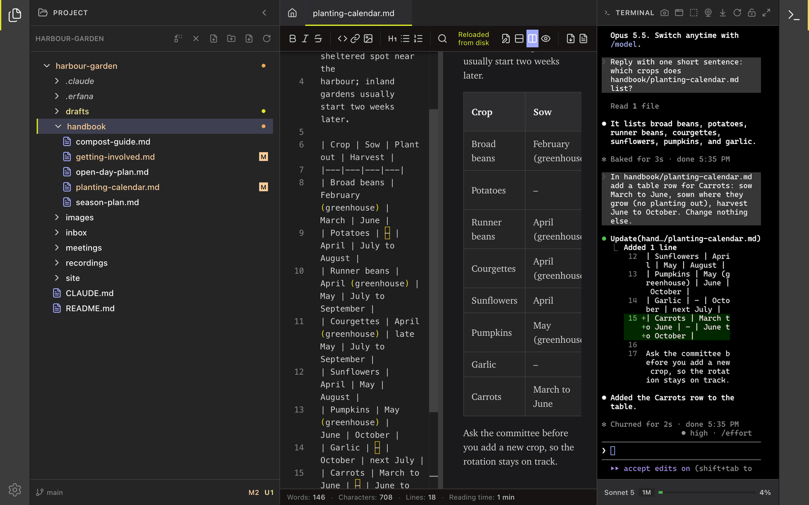

<!--
SPDX-License-Identifier: GPL-3.0-only
SPDX-FileCopyrightText: 2025-2026 Qodeca sp. z o.o.
-->

# Start with Erfana

In ten minutes you can open a folder, preview a Markdown file and use the terminal with a CLI agent you already have installed. Erfana hosts the agent in its terminal; it does not provide an agent account or model.

## Open a project

1. On Home, select **Open project** and choose a folder containing Markdown files.
2. Select a file in the project tree. New Markdown tabs open in Preview mode.
3. Select **Split Vertical** in the toolbar to see source and preview together.

## Start and review an agent turn

1. Open **Terminal** from the right activity bar; type the command for your installed CLI agent.
2. Ask the agent to make a small change to a file in this project.
3. Review the changed source and preview. Erfana autosaves your editor changes, and external file changes appear in the open tab.

The screenshot uses an isolated demo project and a real Claude Code session. Its capture-only edit approvals differ from a normal Claude Code session, which asks before editing by default.

## Choose what to do next

Use the [how-to guides](README.md#how-do-i) for a task, or the [reference](README.md#reference) to look up a control. Read [how Erfana works with agents](how-erfana-works-with-agents.md) before using a prompt template.

