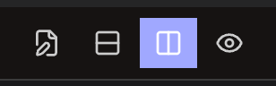
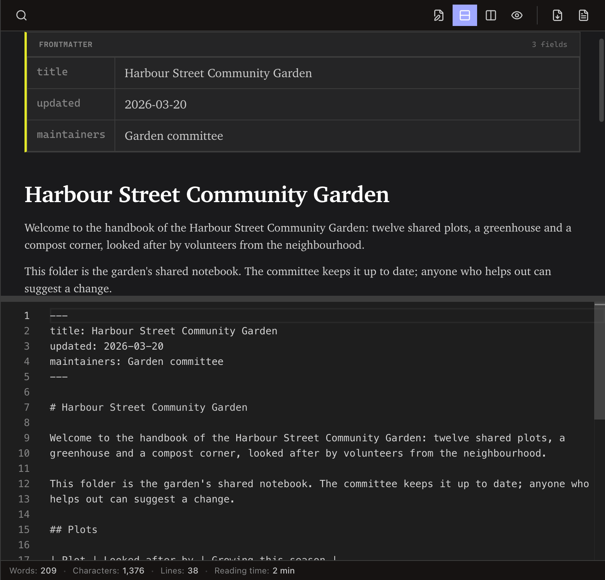
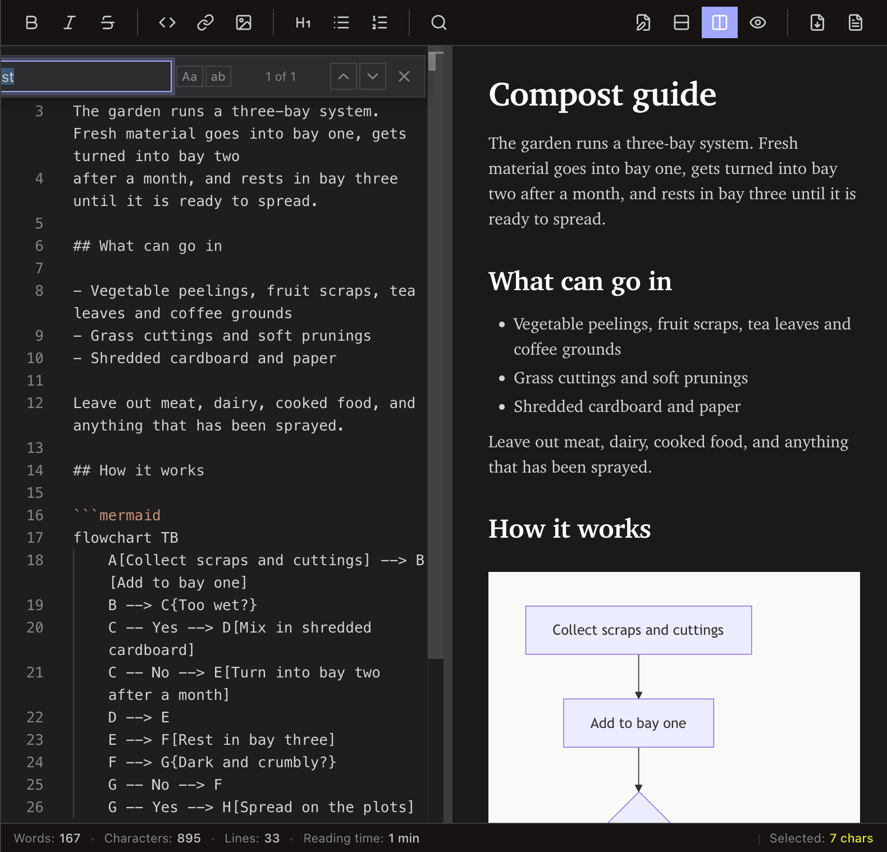
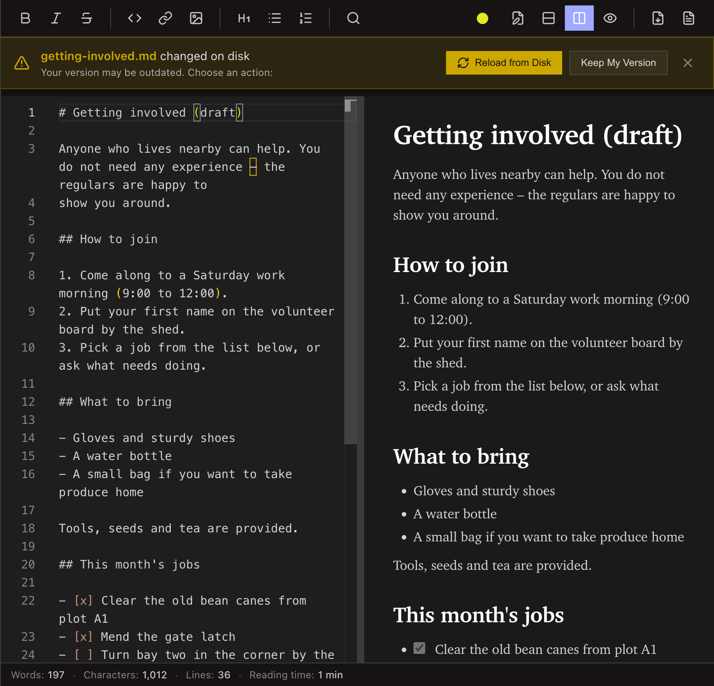
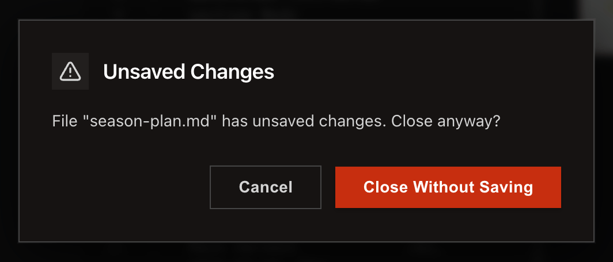

<!-- SPDX-License-Identifier: GPL-3.0-only -->
# Edit and preview Markdown

Use the view-mode buttons to work in the editor, preview, or both. Erfana autosaves after typing stops; when a file changes outside Erfana, choose **Reload from Disk** or **Keep My Version**.

**Before you start:** select a Markdown file in the project tree.

## Choose a view

1. Select **Editor Only**, **Split Horizontal**, **Split Vertical**, or **Preview Only** on the toolbar.
2. Use the formatting buttons or standard editor shortcuts while the editor has focus.
3. Select **Find** to search the open document.

## What happens next / If something goes wrong

The close prompt protects an unsaved buffer. Use [troubleshooting](../reference/troubleshooting.md) for an unavailable panel.

## Related

- [Editor reference](../reference/editor.md)
- [Markdown preview reference](../reference/markdown-preview.md)
