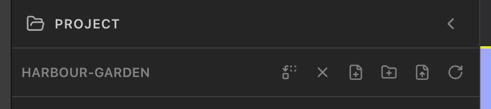

<!-- SPDX-License-Identifier: GPL-3.0-only -->
# Open a project

Open a folder to show its files and terminal. Select **Open project** on Home, then use **Change project** or **Close project** in the project header when needed.

