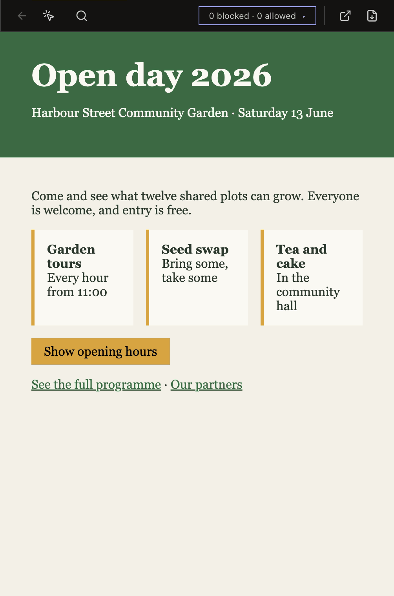
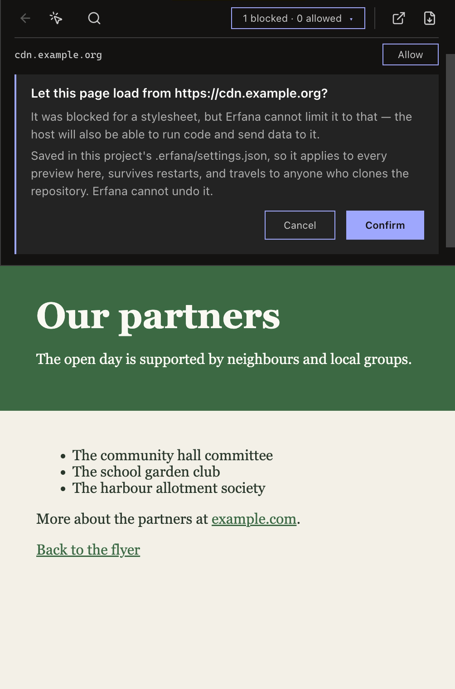
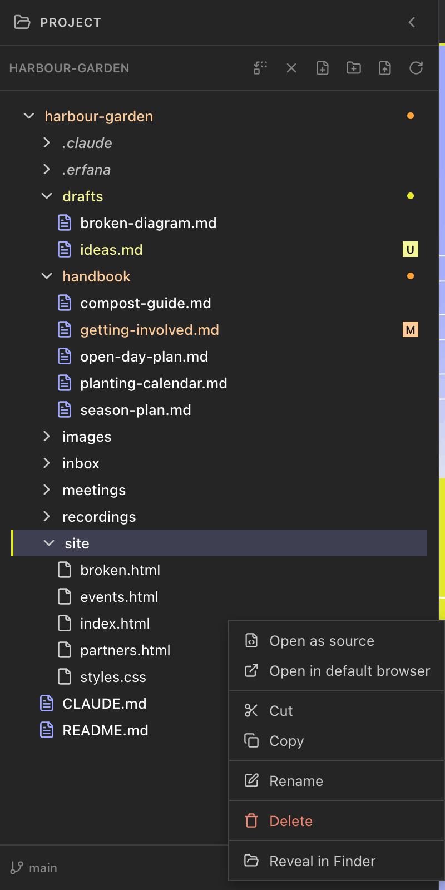

<!--
SPDX-License-Identifier: GPL-3.0-only
SPDX-FileCopyrightText: 2025-2026 Qodeca sp. z o.o.
-->

# Preview an HTML page

Open an HTML file to run its page in Erfana. Approve a remote host only when you trust it.

**Before you start:** ensure **Run HTML files** is enabled in Settings.

## Open and navigate a page

1. Select an HTML file in the project tree.
2. Use **Open as source** when a file should not run.
3. Use the preview toolbar for Back, Find, browser opening, and PDF export.
4. For a remote host, select **Allow**, then **Confirm** only after reviewing the host.

> [!NOTE]
> Approved remote hosts are stored per project and cannot be removed in the app.

## What happens next / If something goes wrong

Open the preview issues list for script errors, blocked hosts, links, and frames. A stopped preview offers Reload.

## Related

- [HTML preview reference](../reference/html-preview.md)
- [Settings reference](../reference/settings.md)
