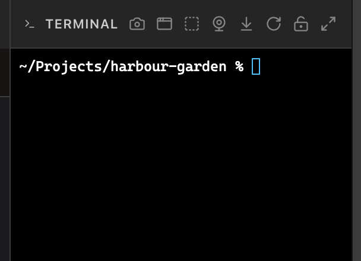
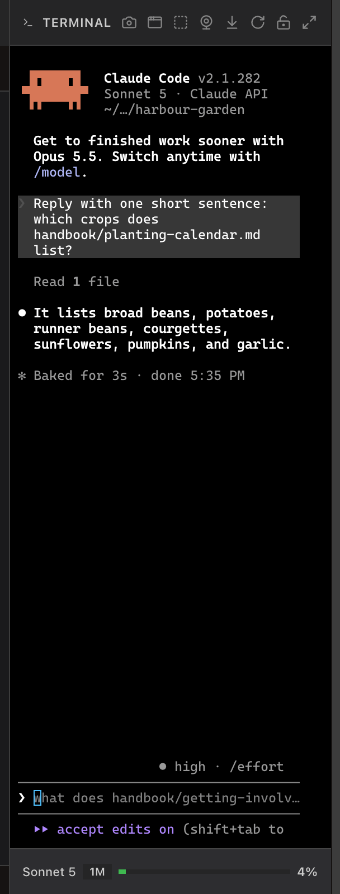
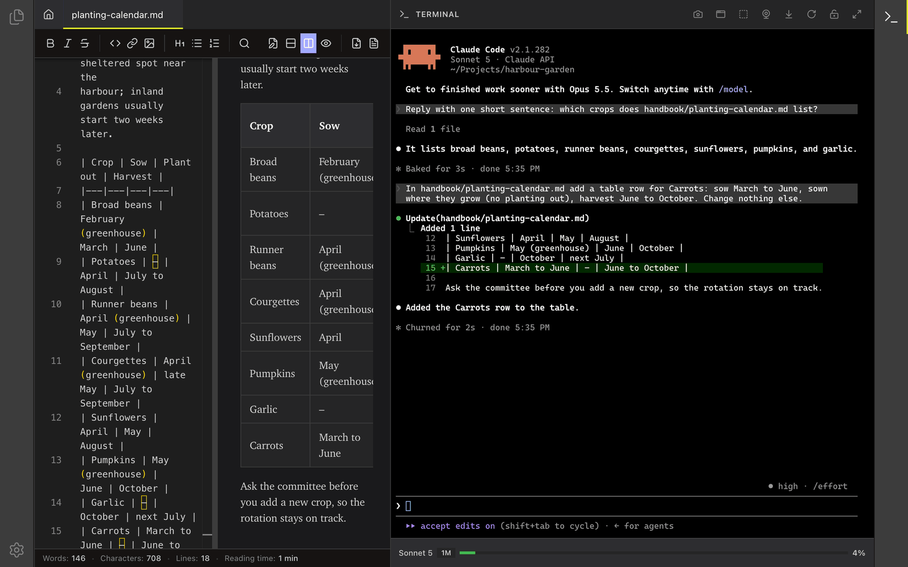
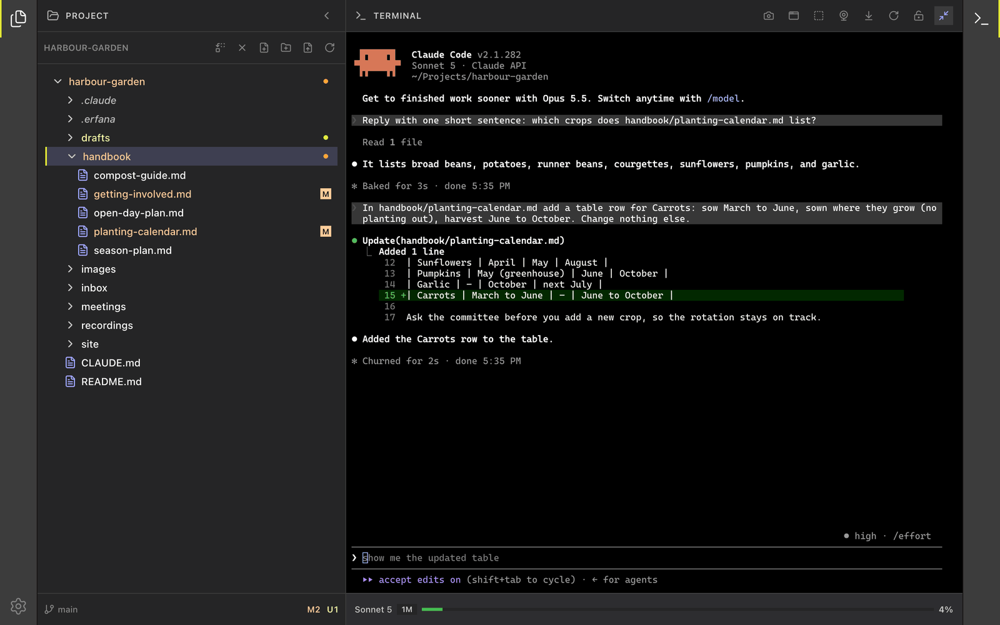

<!--
SPDX-License-Identifier: GPL-3.0-only
SPDX-FileCopyrightText: 2025-2026 Qodeca sp. z o.o.
-->

# Run an agent in the terminal

Use the terminal to run Claude Code or another CLI agent in your project. Review its edits in the editor or preview.

**Before you start:** open a project. The terminal is available only in a project window.

## Start an agent

1. Select **Terminal** in the right activity bar.
2. Select the terminal and type the command for your CLI agent.
3. Tell the agent which file to inspect or change.

By default, Claude Code asks before an edit. These capture screenshots used an isolated demo project configured to accept edits automatically.

## Review an edit

1. Watch the editor or preview after the agent finishes.
2. Open the changed file from the project tree if it is not already open.
3. Select **Maximize terminal** when you need more terminal space.

## What happens next / If something goes wrong

Use **Restart terminal** if a shell is stuck. For a terminal availability message, use [troubleshooting](../reference/troubleshooting.md).

## Related

- [Terminal reference](../reference/terminal.md)
- [Understand how Erfana works with your agent](../how-erfana-works-with-agents.md)
