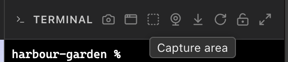
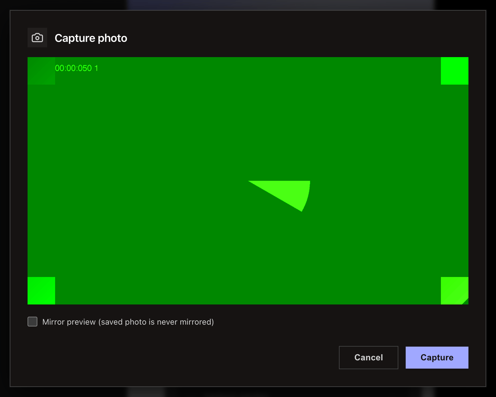

<!-- SPDX-License-Identifier: GPL-3.0-only -->
# Send a screenshot or photo to the agent

Use terminal-header capture buttons to paste a screen, window, area, or camera-photo path into the terminal.

**Before you start:** open a project and terminal. Grant macOS Screen Recording permission when the system asks.

## Capture an image

1. Select the terminal-header capture button for screen, window, or area.
2. Choose the requested display, window, or area.
3. The resulting path is pasted into the terminal for your agent.
4. Select the camera button to take a JPEG photo.

> [!NOTE]
> macOS shows a Screen Recording permission dialog. Windows uses its own window picker and area overlay.

## What happens next / If something goes wrong

Select **Open Screen Recording settings** or **Relaunch Erfana** from the permission dialog, then try again.

## Related

- [Terminal reference](../reference/terminal.md)
- [Windows differences](../reference/windows-differences.md)
