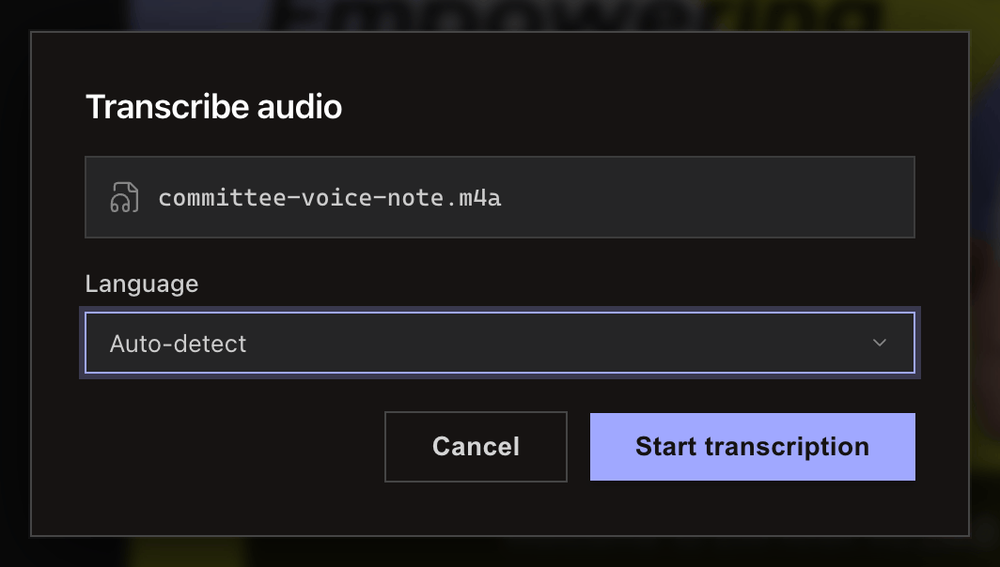

<!-- SPDX-License-Identifier: GPL-3.0-only -->
# Transcribe audio or video

Select an audio or video file and choose the transcription backend. OpenAI processing sends audio to its API; a supported local whisper.cpp model works offline.

