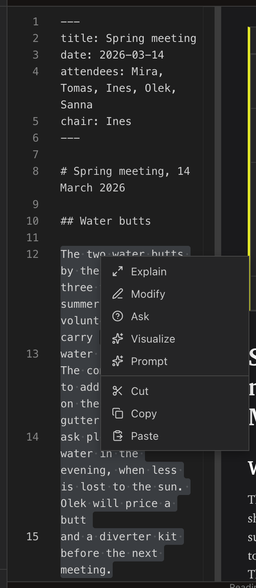
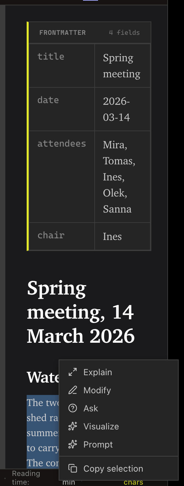
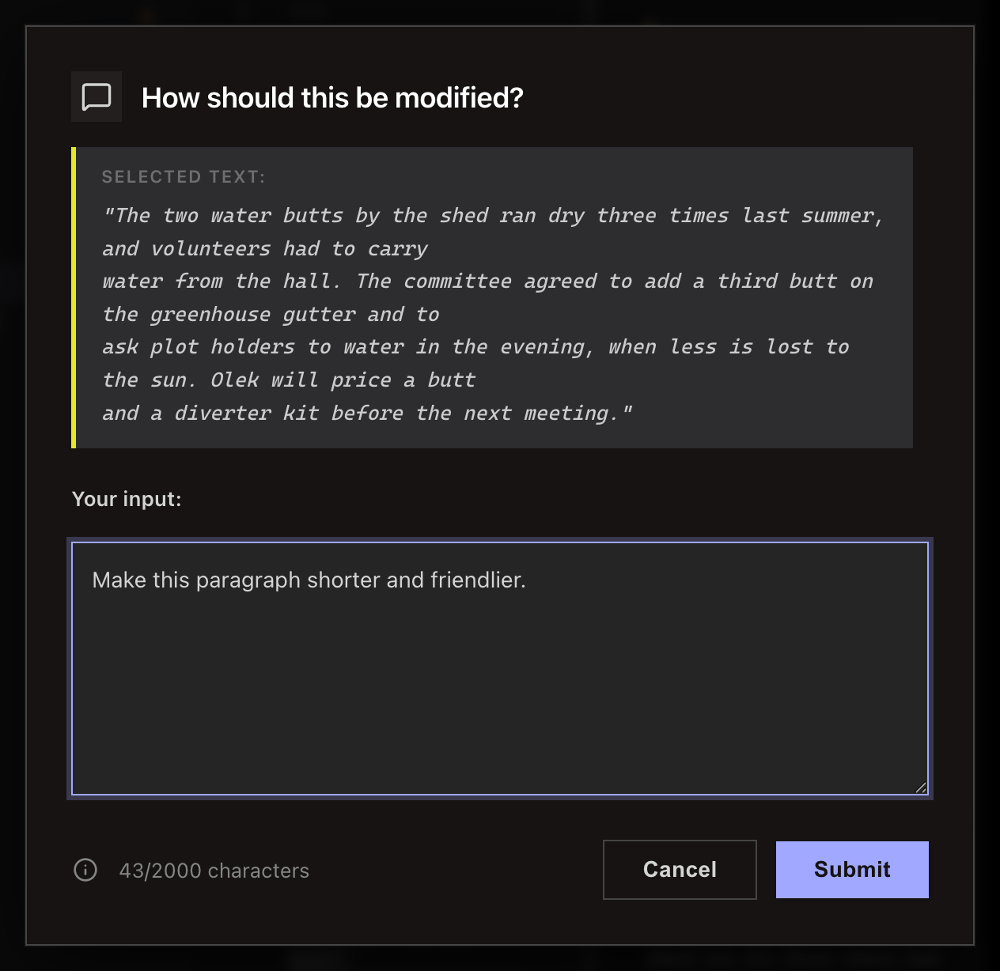
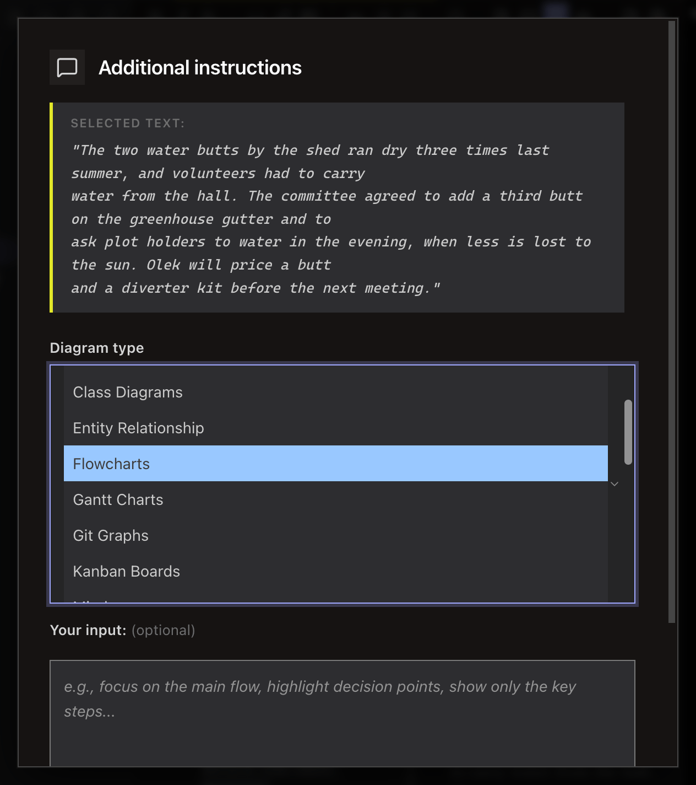
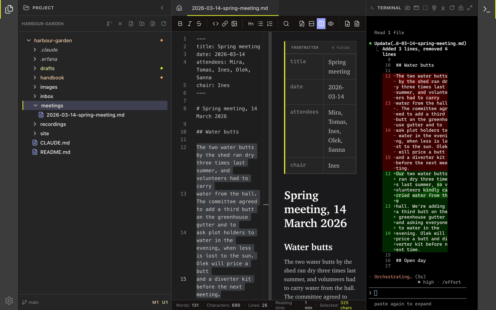

<!-- SPDX-License-Identifier: GPL-3.0-only -->
# Turn a selection into a prompt

Select text in the editor or preview, then use its context menu to send a prompt template to the terminal. **Modify** and **Visualize** can change the document; **Explain**, **Ask**, and **Prompt** do not.

The open diagram-type list is illustrative; choose one type in the app.

