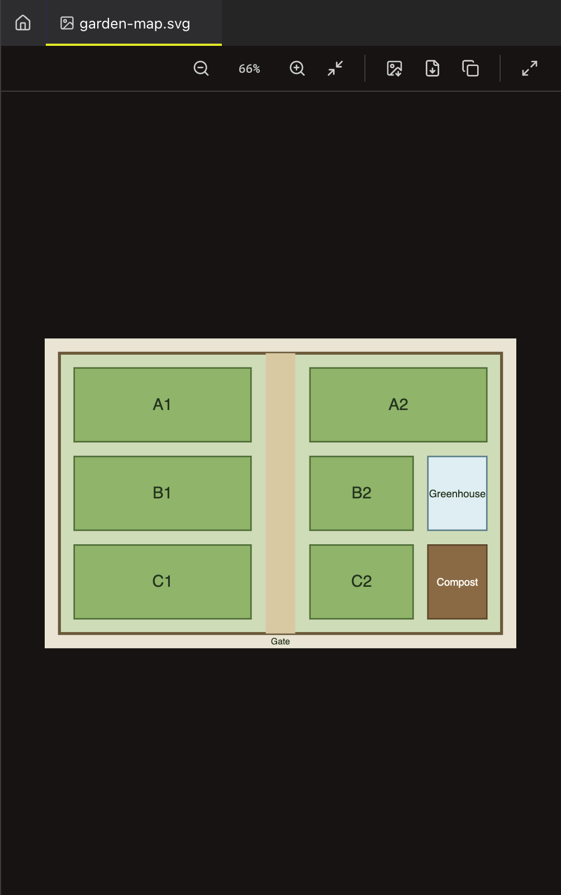
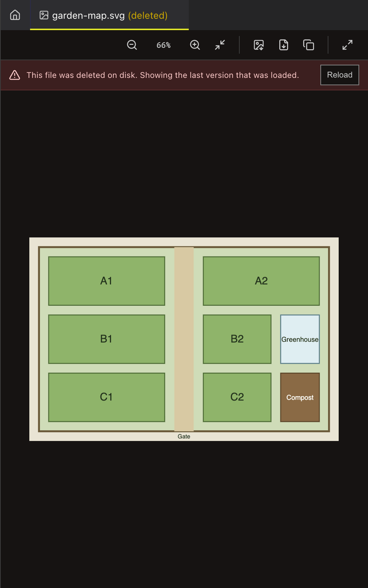

<!--
SPDX-License-Identifier: GPL-3.0-only
SPDX-FileCopyrightText: 2025-2026 Qodeca sp. z o.o.
-->

# View and export images

Open an image from the project tree, then zoom, fit, export, or copy it from the viewer toolbar.

**Before you start:** select a supported image file in an open project.

## View and export an image

1. Select the image in the tree.
2. Use zoom, fit, pan, or full-screen controls to inspect it.
3. Select export to make a PNG or PDF, or copy the image to the clipboard.

## What happens next / If something goes wrong

The viewer refreshes files that change on disk. If a file is deleted, select **Reload** after restoring it.

## Related

- [Image viewer reference](../reference/image-viewer.md)
- [Export reference](../reference/export.md)
