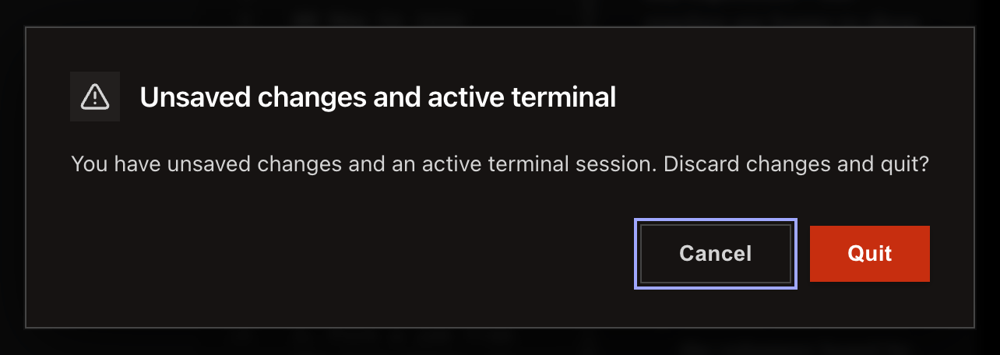

<!-- SPDX-License-Identifier: GPL-3.0-only -->
# Work in several windows

Select **File > New Window** to open another window. A project already open elsewhere focuses its existing window.

**Before you start:** save work you do not want to lose before quitting.

## Open and close windows

1. Select **File > New Window**.
2. Open one project in each window as needed.
3. Quit from the app menu or window controls.
4. Review the confirmation when a terminal is busy or a file has unsaved changes.

## What happens next / If something goes wrong

Cancel the quit confirmation to return to the window and save files. A crash recovery screen is covered in [troubleshooting](../reference/troubleshooting.md).

## Related

- [The Erfana window](../reference/the-erfana-window.md)
- [Files Erfana keeps](../reference/files-erfana-keeps.md)
