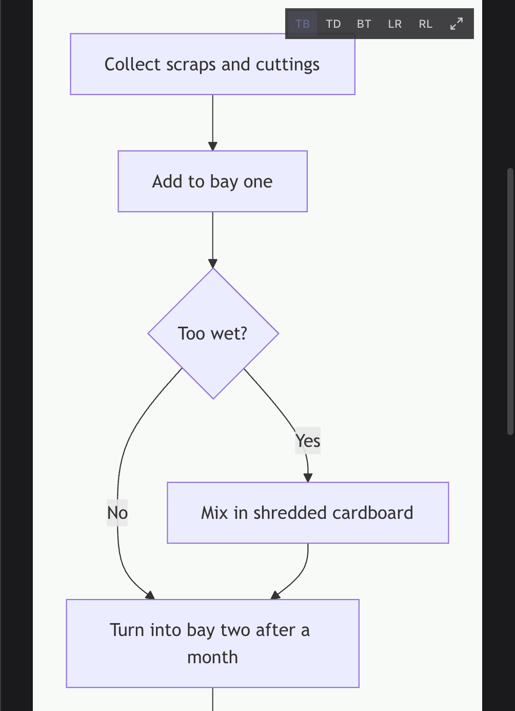
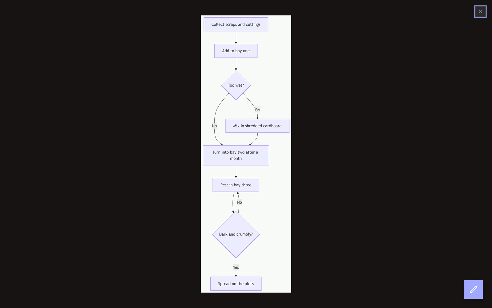
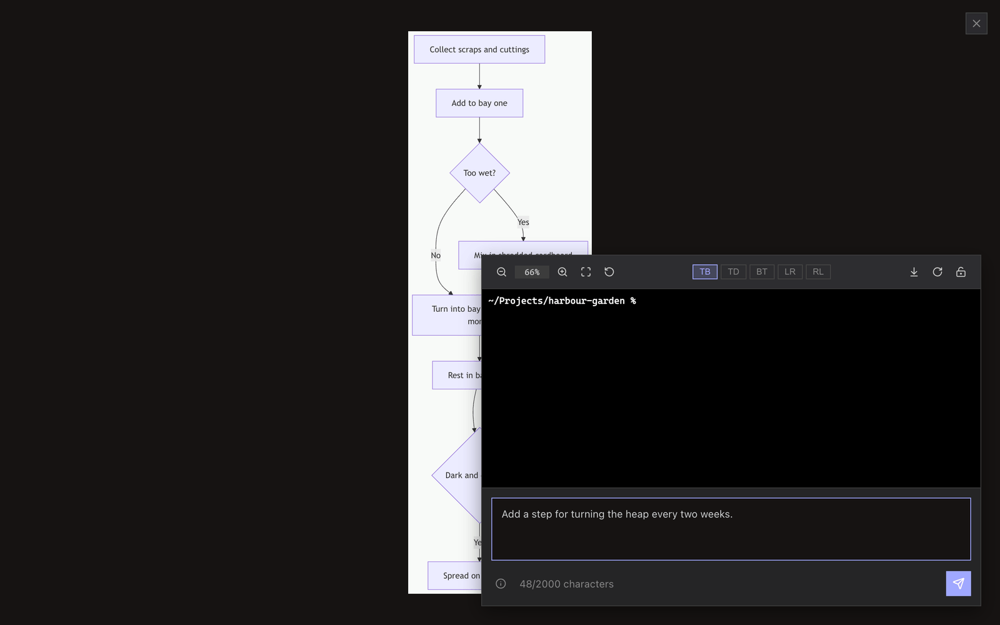
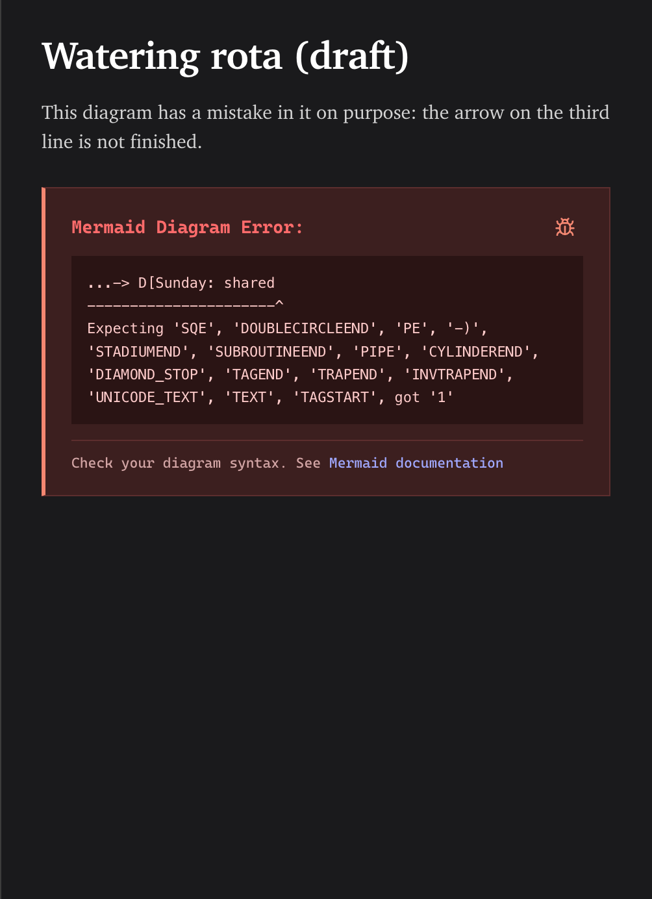

<!-- SPDX-License-Identifier: GPL-3.0-only -->
# Work with Mermaid diagrams

Write a Mermaid code block in Markdown, then use the diagram toolbar to change direction or open the viewer.

**Before you start:** open a Markdown file in Split or Preview view.

## View a diagram

1. Add a Mermaid code block to the document.
2. Select a direction in the diagram toolbar when the layout needs changing.
3. Select **View fullscreen** to zoom, fit, or reset the diagram.

## What happens next / If something goes wrong

Use the error box to send a bug-report template to the terminal agent, then correct the source block. See [troubleshooting](../reference/troubleshooting.md).

## Related

- [Markdown preview reference](../reference/markdown-preview.md)
- [Prompt templates reference](../reference/prompt-templates.md)
