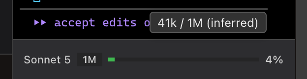

<!-- SPDX-License-Identifier: GPL-3.0-only -->
# Read Claude Code status

The terminal's context meter appears only while Claude Code runs. It reads Claude Code's transcripts and does not write Claude Code configuration; Erfana's terminal can run other CLI agents without this meter.

## Model and context meter

**What it does:** Shows the detected model, a 200k or 1M window badge when relevant, an estimated context-use percentage and a coloured bar. Below 30% is the low range, 30–60% the middle range, and 60% or above the high range. **How to reach it:** start `claude` in the terminal. It is informational; it does not change the agent's context window. Some deployments cap the 1M window and are still badged 1M; see [issue #48](https://github.com/qodeca/erfana/issues/48).

## Tooltip and limits

**What it does:** Hover the bar for exact token counts and the detected context-window size. If the window size was inferred, the tooltip says **(inferred)**. **How to reach it:** pointer over the Claude Code status area. On Windows, status can disappear after changing directory before starting `claude`; the terminal session itself continues. Meter values depend on the available Claude Code transcript format and can be unavailable without affecting the terminal.

The screenshot shows the bar; its native hover tooltip is not captured in the image.
