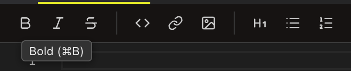

<!--
SPDX-License-Identifier: GPL-3.0-only
SPDX-FileCopyrightText: 2025-2026 Qodeca sp. z o.o.
-->

# Edit Markdown

Erfana uses a Monaco text editor with Markdown formatting, a separate Find bar, live preview and document statistics. New Markdown tabs open in Preview mode; select a toolbar mode to edit.

**On this page**

- [Editor commands](#editor-commands)
- [View modes and scroll sync](#view-modes-and-scroll-sync)
- [Formatting toolbar](#formatting-toolbar)
- [Find bar](#find-bar)
- [Statistics bar](#statistics-bar)
- [Save and close](#save-and-close)

## Editor commands

**What they do:** Monaco supports its command palette, multiple cursors, undo and redo, selection and line operations. **How to reach them:** Focus the editor; press <kbd>F1</kbd> for the palette. Use <kbd>Alt</kbd>+<kbd>↑/↓</kbd> to move a line, <kbd>Cmd</kbd>+<kbd>D</kbd> (Windows: <kbd>Ctrl</kbd>+<kbd>D</kbd>) to select the next match, and <kbd>Alt</kbd>+select on both platforms to add a cursor. Erfana provides its own Find bar, not Monaco's find widget.

## View modes and scroll sync

**What they do:** **Editor Only**, **Split Horizontal**, **Split Vertical** and **Preview Only** change the panes. Split views keep editor and preview scrolling together. **How to reach them:** the Markdown toolbar; the view modes have no dedicated shortcut.

## Formatting toolbar

**What it does:** Apply **Bold**, **Italic**, **Strikethrough**, **Inline Code**, **Insert Link**, **Insert Image**, **Heading 1**, **Bullet List**, or **Numbered List** to the selection. **How to reach it:** Switch to Editor or Split mode, then select the toolbar control. <kbd>Cmd</kbd>+<kbd>I</kbd> and <kbd>Cmd</kbd>+<kbd>K</kbd> (Windows: <kbd>Ctrl</kbd>) also apply italic and link. The Bold key overlaps the global sidebar binding; use the toolbar if needed.

## Find bar

**What it does:** Searches the open document; use next and previous controls, **Case sensitive**, and **Whole word**. **How to reach it:** <kbd>Cmd</kbd>+<kbd>F</kbd> (Windows: <kbd>Ctrl</kbd>+<kbd>F</kbd>). <kbd>Enter</kbd> and <kbd>Shift</kbd>+<kbd>Enter</kbd> move between matches, <kbd>Esc</kbd> closes it. With the find bar focused, <kbd>Cmd</kbd>+<kbd>Option</kbd>+<kbd>C</kbd>/<kbd>W</kbd> (Windows: <kbd>Alt</kbd>+<kbd>C</kbd>/<kbd>W</kbd>) toggle case sensitivity and whole word. See the [find-bar shortcut table](keyboard-shortcuts.md#editor-and-markdown-preview).

## Statistics bar

**What it does:** Shows word, character and line counts, estimated reading time, and selection length. **How to reach it:** Open a Markdown editor; select text for selection statistics.

## Save and close

**What it does:** Autosave writes after two seconds idle and during continued editing at least every 30 seconds. <kbd>Cmd</kbd>+<kbd>S</kbd> (Windows: <kbd>Ctrl</kbd>+<kbd>S</kbd>) saves the active buffer; <kbd>Cmd</kbd>+<kbd>W</kbd> (Windows: <kbd>Ctrl</kbd>+<kbd>W</kbd>) closes the active tab. An unsaved tab asks before closing. If the file changes outside Erfana, choose **Reload from Disk** or **Keep My Version**.
