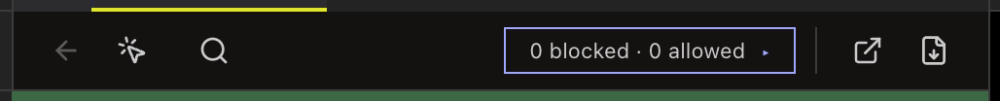

<!-- SPDX-License-Identifier: GPL-3.0-only -->
# Preview an HTML page

HTML preview runs a project page with its CSS and JavaScript in a sandboxed view. It is on by default; [**Run HTML files**](settings.md#html-preview) can turn it off so files open as source.

## Opening and limits

**What it does:** Select an HTML file to run it. Files in `node_modules`, `dist`, `out`, `coverage`, `.git`, or ignored paths open as source. At most three pages run at once; other previews freeze to a still image until active again. **How to reach it:** select a project `.html` file. See [the walkthrough](../how-to/preview-an-html-page.md).

## Toolbar and navigation

**What it does:** **Back** returns to the previous page; **Open links in this tab** changes link behavior; **Find** searches the page; the permission chip shows remote-host status; **Open in default browser** opens the page outside Erfana; **Export to PDF** saves it. **How to reach it:** toolbar above the page. Back/Forward keyboard navigation is <kbd>Cmd</kbd>+<kbd>[ / ]</kbd> (Windows: <kbd>Alt</kbd>+<kbd>←/→</kbd>). The tab keeps up to 50 history entries; external links ask before opening.

## Remote-host permission

**What it does:** A page requesting a remote host shows a permission band. Select **Allow**, then **Confirm** to approve it for this project. **How to reach it:** the band above the page. Approved origins are saved in `.erfana/settings.json`; there is no in-app revoke control. This approval is separate from the global **Run HTML files** switch.

## Live refresh and frames

**What it does:** CSS changes refresh in place; HTML or JavaScript changes reload the page. A preview watches up to 16 files. Same-project frames can nest to three levels, with up to 50 frames per page. **How to reach it:** save a watched project file while its page is open. Remote or disallowed frames are blocked and can appear in Preview issues.

## Find, issues and stopped state

**What they do:** **Find** searches the page; **Preview issues** reports script errors, blocked hosts, links and frames. A stopped preview offers **Reload**. **How to reach them:** toolbar and issue badge. Press <kbd>Enter</kbd> or <kbd>Space</kbd> on the focused page area to enter the page, and <kbd>Esc</kbd> to return to toolbar chrome; <kbd>Esc</kbd> closes an open find bar first.

## Zoom and PDF

**What they do:** **View > Actual Size / Zoom In / Zoom Out** apply to the focused page. <kbd>Cmd</kbd>+<kbd>S</kbd> (Windows: <kbd>Ctrl</kbd>+<kbd>S</kbd>) exports the page to PDF rather than saving HTML source. **How to reach them:** View menu, preview toolbar, or the active preview tab.
