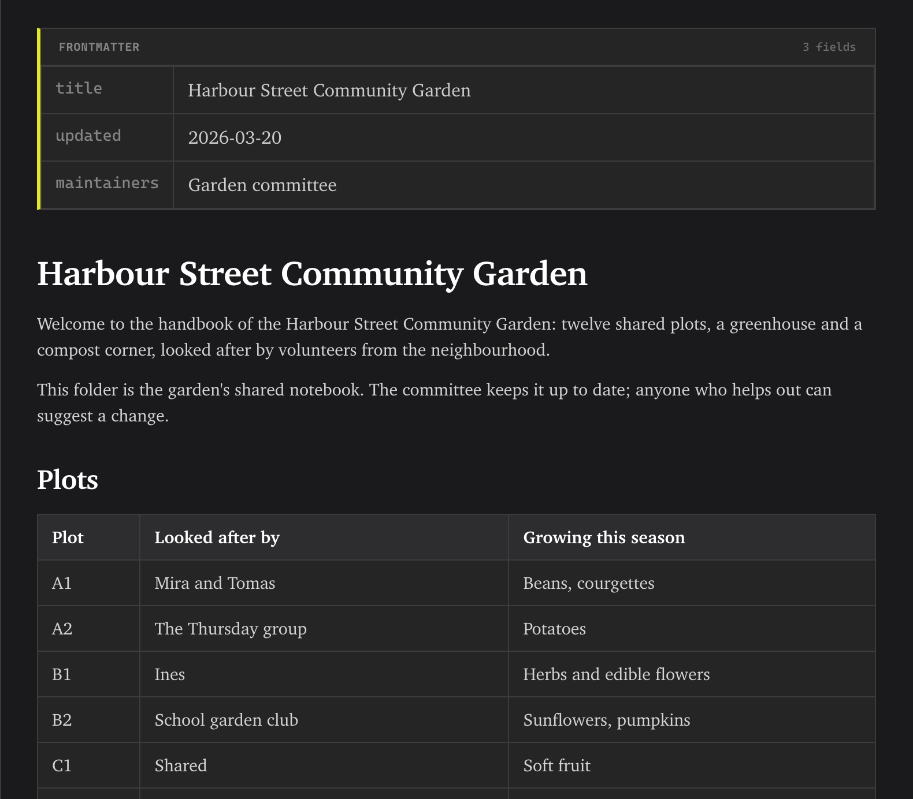

<!-- SPDX-License-Identifier: GPL-3.0-only -->
# Read the Markdown preview

Preview renders GitHub-style Markdown, frontmatter, links and Mermaid diagrams beside or instead of the editor. Raw HTML is handled by the Markdown renderer's safety rules.

## Markdown and frontmatter

**What it does:** Headings, tables, lists, code and other GitHub-style Markdown are rendered. YAML frontmatter at the top becomes a table rather than document prose. **How to reach it:** Open a Markdown file and choose **Preview Only** or a Split mode from the toolbar. **Preserve line breaks** in [Settings](settings.md#editor) is off by default and can show single newlines as breaks.

## Links

**What they do:** Heading anchors move within the document; links to project files open in Erfana; external URLs go to the operating system's browser. Unsafe destinations are blocked. **How to reach them:** Select a link in Preview. For selected preview text, the right-click menu offers **Copy selection** and prompt templates.

## Mermaid diagrams

**What they do:** Fenced Mermaid code renders as a diagram. Its toolbar changes direction and opens the full-screen viewer, where you can zoom, fit, reset and use **Edit diagram** chat with a terminal agent. **How to reach them:** Open a file containing a Mermaid block in Preview; see [the walkthrough](../how-to/work-with-mermaid-diagrams.md). Invalid syntax shows an error box with a bug-report action; see [troubleshooting](troubleshooting.md#mermaid-diagram-rendering-error).
