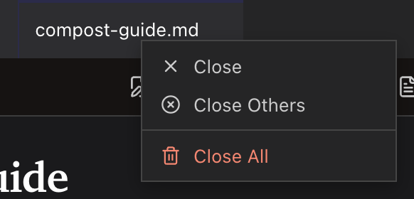
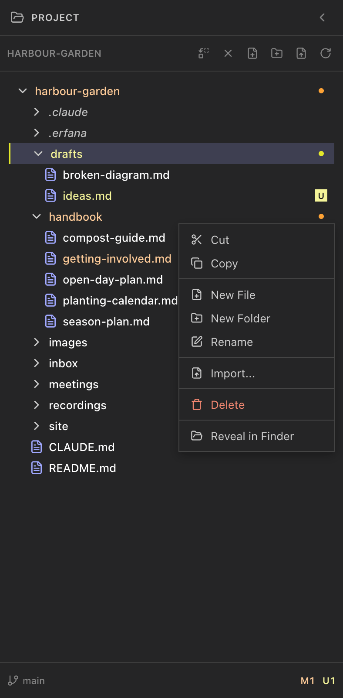

<!-- SPDX-License-Identifier: GPL-3.0-only -->
# Use menus

The app menu provides window, editing and view commands. Right-click menus act on the tab, tree item or selected text beneath the pointer; unavailable actions are disabled.

## Erfana menu (macOS)

**What it does:** **About** shows app information; **Hide**, **Hide Others**, **Show All**, and **Quit** use macOS window management. **How to reach it:** the **Erfana** menu in the system menu bar. **Limits:** macOS only; Windows puts **Quit** in **File**.

## File menu

**What it does:** **New Window** opens another Erfana window; on Windows, **Quit** exits. **How to reach it:** **File > New Window**, <kbd>Cmd</kbd>+<kbd>Shift</kbd>+<kbd>N</kbd> (Windows: <kbd>Ctrl</kbd>+<kbd>Shift</kbd>+<kbd>N</kbd>). A project already open in another window focuses that window.

## Edit menu

**What it does:** **Undo**, **Redo**, **Cut**, **Copy**, **Paste**, and **Select All** act on the focused editable control. **How to reach it:** **Edit** in the app menu. The actions are Electron's platform roles, so their available accelerators follow the operating system.

## View menu

**What it does:** **Reload** and **Force Reload** redraw the app; **Toggle Developer Tools** opens or closes developer tools; **Actual Size**, **Zoom In**, **Zoom Out** change zoom; **Toggle Full Screen** changes the window display. **How to reach it:** **View**. Zoom keys are <kbd>Cmd</kbd>+<kbd>0</kbd>, <kbd>Cmd</kbd>+<kbd>+</kbd>, <kbd>Cmd</kbd>+<kbd>-</kbd> (Windows: <kbd>Ctrl</kbd> in place of <kbd>Cmd</kbd>). When an HTML page has focus, zoom applies to that page first. Reloading can discard unsaved in-memory edits.

## Window menu

**What it does:** **Minimize** and **Zoom** manage the window; macOS also has **Bring All to Front**, while Windows has **Close**. **How to reach it:** **Window** in the app menu. Platform window-management keys follow the operating system.

## Tab context menu

**What it does:** **Close** closes this tab, **Close Others** closes the other tabs, and **Close All** closes all tabs. **How to reach it:** right-click a tab. Tabs with unsaved changes show a confirmation before closing.

## Project tree context menus

**What they do:** Folder menus offer **Cut**, **Copy**, **Paste** (when the clipboard has items), **New File**, **New Folder**, **Rename**, **Import…**, **Delete**, and **Reveal in Finder** or **Reveal in File Explorer**. File menus offer **Cut**, **Copy**, **Rename**, **Delete**, and **Reveal**. The HTML-file menu also offers **Open as source** and **Open in default browser**. **How to reach them:** right-click a file or folder in the tree. **Delete** asks for confirmation because it cannot be undone.

## Editor and preview context menus

**What they do:** With selected text, both menus offer **Explain**, **Modify**, **Ask**, **Visualize**, and **Prompt**; the editor also offers **Cut**, **Copy**, **Paste**, while Markdown Preview offers **Copy selection**. The prompt actions send text to the agent running in the terminal. **How to reach them:** right-click selected text in the editor or preview. See [prompt templates](prompt-templates.md).

## Terminal and text-box context menus

**What they do:** The terminal menu offers **Copy** and **Paste**; text inputs in dialogs offer **Cut**, **Copy**, and **Paste**. **How to reach them:** right-click in the relevant control. Copy requires a selection.
