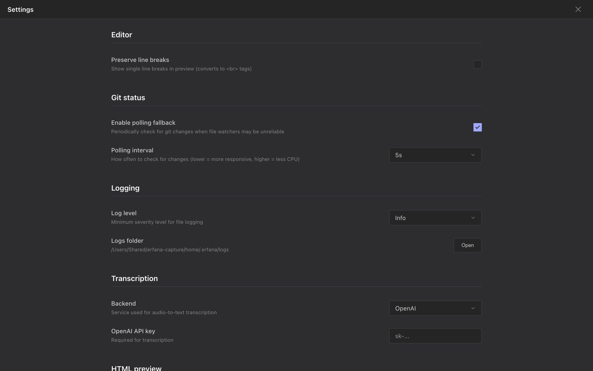
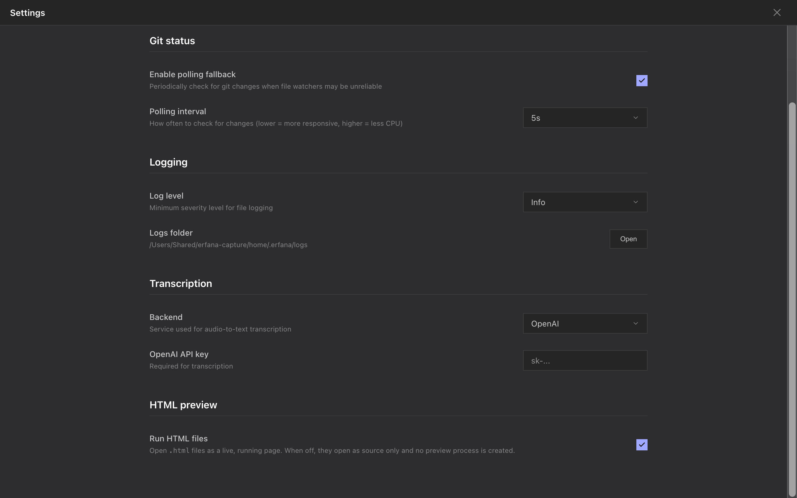
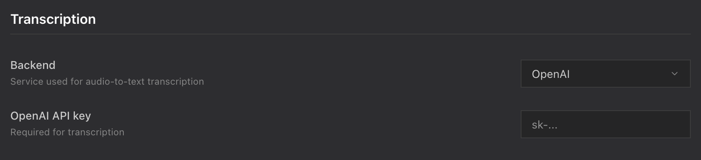

<!--
SPDX-License-Identifier: GPL-3.0-only
SPDX-FileCopyrightText: 2025-2026 Qodeca sp. z o.o.
-->

# Configure Erfana

Open **Settings** with the gear at the bottom of the left activity bar. <kbd>Esc</kbd> closes the overlay. Settings apply across projects unless a section says otherwise; there is no Settings keyboard shortcut.

**On this page**

- [Editor](#editor)
- [Git status](#git-status)
- [Logging](#logging)
- [Transcription](#transcription)
- [HTML preview](#html-preview)
- [Per-project settings](#per-project-settings)



## Editor

**What it does:** **Preserve line breaks** renders a single Markdown line break as a visible line break in Preview. **How to reach it:** **Settings > Editor**.

| Option | Default | Effect |
| --- | --- | --- |
| **Preserve line breaks** | Off | When on, single newlines render as line breaks. |

## Git status

**What it does:** Polling supplements file watcher events when they are unreliable. **How to reach it:** **Settings > Git status**.

| Option | Default | Effect |
| --- | --- | --- |
| **Enable polling fallback** | On | Periodically checks Git status. |
| **Polling interval** | 5 seconds | Choose 3, 5, 7 or 10 seconds. |

## Logging

**What it does:** Sets the minimum severity written to the app's log files. **How to reach it:** **Settings > Logging**.

| Option | Default | Effect |
| --- | --- | --- |
| **Log level** | Info | Choose Trace, Debug, Info, Warn, Error or Fatal. |
| **Logs folder** and **Open** | `~/.erfana/logs/` | Shows the resolved path and opens it in Finder or File Explorer. Logs are kept for seven days. |



## Transcription

**What it does:** Selects the service used by the [transcription dialog](import-and-transcription.md#transcribe-audio-or-video). **How to reach it:** **Settings > Transcription**.

| Option | Default | Effect |
| --- | --- | --- |
| **Backend** | OpenAI | Choose OpenAI API, which sends audio to that service, or **Local (whisper.cpp)**, which runs offline. Local is unavailable on Windows ARM64. |
| **OpenAI API key** | Empty | Enter a key for the OpenAI backend; **Remove key** deletes the stored key. |
| **Whisper model** | Base | For Local, choose Tiny, Base, Small, Medium or Large. |
| **Model status** / **Download model** | Model not downloaded until installed | Shows Ready or download progress for the selected local model; download it before using Local. |



## HTML preview

**What it does:** **Run HTML files** controls whether HTML files open as running pages. **How to reach it:** **Settings > HTML preview**.

| Option | Default | Effect |
| --- | --- | --- |
| **Run HTML files** | On | When off, HTML files open as source only; live previews stop and no preview process is started. |

Remote-host approvals belong to each project. An approved host is saved to `.erfana/settings.json`; the app currently has no remove-approval control. See [HTML preview](html-preview.md#remote-host-permission).

## Per-project settings

**What it does:** The optional `.erfana/settings.json` file in a project controls file visibility and preview permissions for that project. **How to reach it:** Edit that JSON file in the project; these entries have no Settings overlay controls.

| Key | Default | Effect |
| --- | --- | --- |
| `watcher.ignoreList` | Built-in ignored paths | Changes which paths the directory watcher ignores. |
| `tree.hiddenPatterns` | Built-in hidden patterns | Extends or replaces the patterns hidden from the tree. |
| `htmlPreview.allowlist.origins` | No added remote origins | Records remote hosts approved from the preview permission band. |

The two pattern settings accept `mode: "extend"` (the default, add to built-in patterns) or `mode: "replace"` (use only the listed patterns), with a `patterns` string array. For example:

```json
{ "tree": { "hiddenPatterns": { "mode": "extend", "patterns": ["notes.tmp"] } } }
```

Tree hidden patterns match entry names exactly: `notes.tmp` hides that name, while `*.tmp` does not act as a wildcard.

See [the contributor implementation notes](../../settings.md#storage) for storage details.
