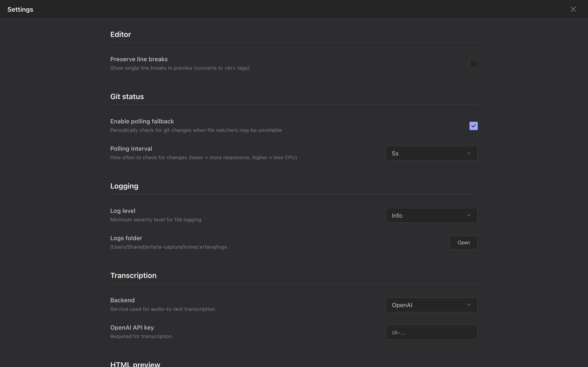
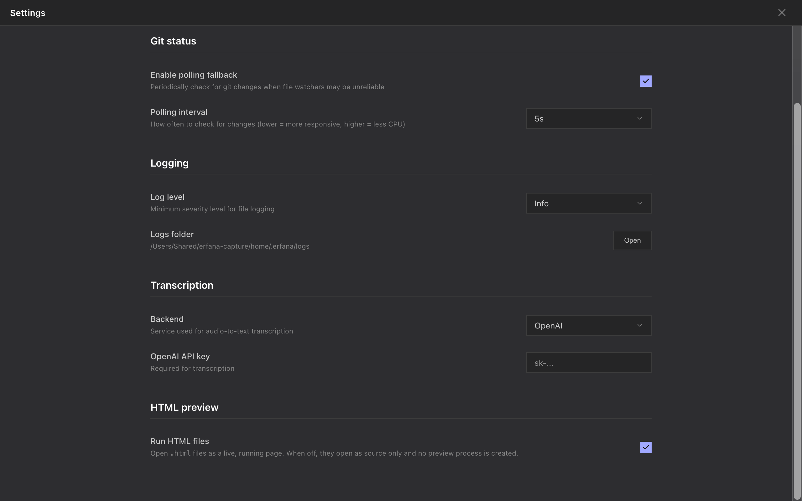
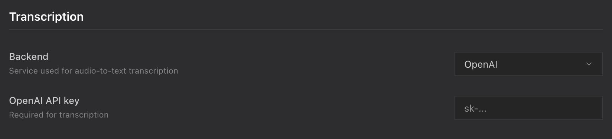

<!--
SPDX-License-Identifier: GPL-3.0-only
SPDX-FileCopyrightText: 2025-2026 Qodeca sp. z o.o.
-->

# Configure Erfana

Open **Settings** with the gear at the bottom of the left activity bar. <kbd>Esc</kbd> closes the overlay. Settings apply across projects unless a section says otherwise; there is no Settings keyboard shortcut.

**On this page**

- [Editor](#editor)
- [Git status](#git-status)
- [Logging](#logging)
- [Transcription](#transcription)
- [HTML preview](#html-preview)
- [Per-project settings](#per-project-settings)
- [Excluded folders](#excluded-folders)



## Editor

**What it does:** **Preserve line breaks** renders a single Markdown line break as a visible line break in Preview. **How to reach it:** **Settings > Editor**.

| Option | Default | Effect |
| --- | --- | --- |
| **Preserve line breaks** | Off | When on, single newlines render as line breaks. |

## Git status

**What it does:** Polling supplements file watcher events when they are unreliable. **How to reach it:** **Settings > Git status**.

| Option | Default | Effect |
| --- | --- | --- |
| **Enable polling fallback** | On | Periodically checks Git status. |
| **Polling interval** | 5 seconds | Choose 3, 5, 7 or 10 seconds. |

## Logging

**What it does:** Sets the minimum severity written to the app's log files. **How to reach it:** **Settings > Logging**.

| Option | Default | Effect |
| --- | --- | --- |
| **Log level** | Info | Choose Trace, Debug, Info, Warn, Error or Fatal. |
| **Logs folder** and **Open** | `~/.erfana/logs/` | Shows the resolved path and opens it in Finder or File Explorer. Logs are kept for seven days. |



## Transcription

**What it does:** Selects the service used by the [transcription dialog](import-and-transcription.md#transcribe-audio-or-video). **How to reach it:** **Settings > Transcription**.

| Option | Default | Effect |
| --- | --- | --- |
| **Backend** | OpenAI | Choose OpenAI API, which sends audio to that service, or **Local (whisper.cpp)**, which runs offline. Local is unavailable on Windows ARM64. |
| **OpenAI API key** | Empty | Enter a key for the OpenAI backend; **Remove key** deletes the stored key. |
| **Whisper model** | Base | For Local, choose Tiny, Base, Small, Medium or Large. |
| **Model status** / **Download model** | Model not downloaded until installed | Shows Ready or download progress for the selected local model; download it before using Local. |



## HTML preview

**What it does:** **Run HTML files** controls whether HTML files open as running pages. **How to reach it:** **Settings > HTML preview**.

| Option | Default | Effect |
| --- | --- | --- |
| **Run HTML files** | On | When off, HTML files open as source only; live previews stop and no preview process is started. |

Remote-host approvals belong to each project. An approved host is saved to `.erfana/settings.json`; the app currently has no remove-approval control. See [HTML preview](html-preview.md#remote-host-permission).

## Per-project settings

**What it does:** The optional `.erfana/settings.json` file in a project controls file visibility and preview permissions for that project. **How to reach it:** Edit that JSON file in the project; these entries have no Settings overlay controls.

| Key | Default | Effect |
| --- | --- | --- |
| `watcher.ignoreList` | Built-in ignored paths | Changes which paths the directory watcher ignores. |
| `tree.hiddenPatterns` | Built-in hidden patterns | Extends or replaces the patterns hidden from the tree. |
| `files.exclude` | Empty | Adds files and folders to leave out of Erfana completely, on top of your global list. See [Excluded folders](#excluded-folders). |
| `htmlPreview.allowlist.origins` | No added remote origins | Records remote hosts approved from the preview permission band. |

The two pattern settings accept `mode: "extend"` (the default, add to built-in patterns) or `mode: "replace"` (use only the listed patterns), with a `patterns` string array. For example:

```json
{ "tree": { "hiddenPatterns": { "mode": "extend", "patterns": ["notes.tmp"] } } }
```

Tree hidden patterns match entry names exactly: `notes.tmp` hides that name, while `*.tmp` does not act as a wildcard.

See [the contributor implementation notes](../../settings.md#storage) for storage details.

## Excluded folders

**What it does:** `files.exclude` leaves files and folders out of Erfana completely. An excluded folder is not shown in the project tree, not read when the tree loads, and not watched for changes – so a big folder of test output, caches or build results no longer slows down opening the project, and changes inside it do not refresh the tree. **How to reach it:** Edit the JSON by hand. There is no Settings overlay control.

| File | Applies to |
| --- | --- |
| `~/.erfana/settings.json` | Every project you open |
| `.erfana/settings.json` in a project | That project; its entries are added to the global list, and cannot remove a global entry |

For example, to leave out the scratch folder that test runs fill:

```json
{ "files": { "exclude": [".local/test-tmp"] } }
```

**How entries match.** Every entry is a path from the project root, written with `/` (a `\` is read as `/`). Letter case does not matter on macOS and Windows; on Linux it does.

| Entry | Leaves out |
| --- | --- |
| `.local/test-tmp` | That folder and everything inside it |
| `tmp` | Only `tmp` at the project root – not `src/tmp` |
| `/tmp` | The same as `tmp`: a leading `/` just means "from the project root" |
| `**/test-tmp` | Every folder named `test-tmp`, at any depth, and everything inside |
| `*.log` | `.log` files at the project root only |
| `**/*.log` | `.log` files anywhere |
| `build-?` | `build-1`, `build-a` and so on at the root: `?` is exactly one character |

- An entry without `*` or `?` names one path. An entry with them is a pattern: `*` is any run of characters inside one name, `?` is one character, and `**` on its own between slashes stands for any number of folders. `[`, `{` and `!` have no special meaning, so a folder called `[id]` can be excluded by its name.
- A trailing `/` or `/**`, and `./` segments, are ignored.
- The `.erfana` folder, and everything in it, is never excluded – so the settings file that hides things stays in the tree.

**Limits.** Each file can hold up to 256 entries and 4,096 characters of entries. One entry can be up to 256 characters, with at most 8 wildcards and 4 `**`. An entry is also refused when it is blank, is an absolute path (a drive letter such as `C:` or a `\\server` path), has a `..` step, contains one of `< > : " |` or a control character, or has nothing but wildcards (`*`, `**`). A refused entry is skipped, the rest of the list still applies, and the log gets a warning naming the file (`global` or `project`) and the entry's position in the list, counting from 0 – not its text. A malformed `files` section never stops a project from opening and never resets your other settings. Broken JSON anywhere in `~/.erfana/settings.json` is different: Erfana copies the file to `settings.json.bak` and resets every setting to its default. (Other mistakes in a project's `.erfana/settings.json`, such as broken JSON, still stop that project from opening, as before.)

**When changes apply.** A project's list is read each time the project opens: after editing it, close the project (or open another one) and open it again – choosing the project that is already open does not re-read its settings. The global file is read when Erfana starts: quit Erfana, edit `~/.erfana/settings.json`, then start Erfana again. Erfana saves that file from its own copy whenever you change a setting in the Settings overlay, so an edit made while Erfana is running can be overwritten.

**What it does not change:**

- **Git status still counts excluded files.** The git status bar reports the whole repository. If you do not want git to see a folder either, add it to `.gitignore` as well.
- A file inside an excluded folder that is already open in a tab keeps refreshing when it changes on disk.
- Nothing in the tree shows that something was excluded.

**Windows:** a folder nested inside another folder that starts to match a *pattern* in your list only after the project opened (for example a new `src/test-tmp` matching `**/test-tmp`) is not fully left out until you reopen the project: its changes are still ignored one by one, but very heavy churn there can cause an extra refresh of the whole tree. Path entries such as `.local/test-tmp` are not affected. See [Known issues § Excluded folders](../../known-issues.md#excluded-folders-filesexclude-known-limits) for the full list of limits.
