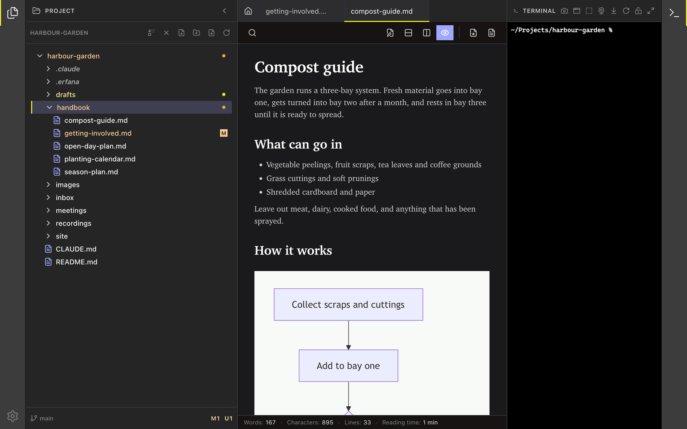

<!--
SPDX-License-Identifier: GPL-3.0-only
SPDX-FileCopyrightText: 2025-2026 Qodeca sp. z o.o.
-->

# Use the Erfana window

Erfana opens a project beside the editor and terminal. The Home tab and activity bars remain the main navigation controls.

**On this page**

- [Welcome and Home](#welcome-and-home)
- [Activity bars](#activity-bars)
- [Tabs](#tabs)
- [Status bars](#status-bars)

## Welcome and Home

**What it does:** With no project, the welcome view shows the app version, **Open project**, and up to five recent projects; a recent entry can be reopened or removed from the list. The **Home** tab remains available after opening a project. **How to reach it:** Launch Erfana or select the Home tab. The project panel also offers **Change project** and **Close project**. Closing a project returns to the welcome view; it does not delete the folder.

## Activity bars

**What they do:** The left bar opens **Project** and **Settings**. The right bar opens **Terminal** when a project is open. **How to reach them:** Select the icons on the window edges. Search is hidden; it is not an available feature.

The two tooltips are shown together only for this picture; in the app they appear one at a time.

## Tabs

**What they do:** Open files appear as tabs. A modified tab shows an unsaved marker; editor, image, and HTML-preview tabs can show **(deleted)** when their files disappear from disk. **How to reach them:** Select a tab; select its close control or middle-select it to close. Right-click for **Close**, **Close Others**, or **Close All**. A tab with unsaved changes asks before closing.

## Status bars

**What they do:** The editor statistics bar reports words, characters, lines, reading time and selection; the project Git bar reports branch and status. While Claude Code runs, a separate [Claude Code context meter](claude-code-status-bar.md) can appear. **How to reach them:** Open a Markdown file, the project tree, or a Claude Code terminal session respectively.
