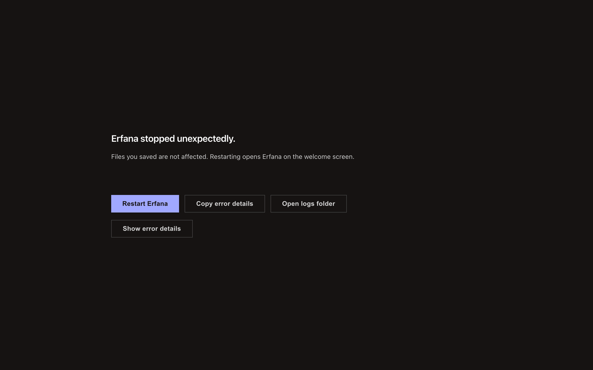
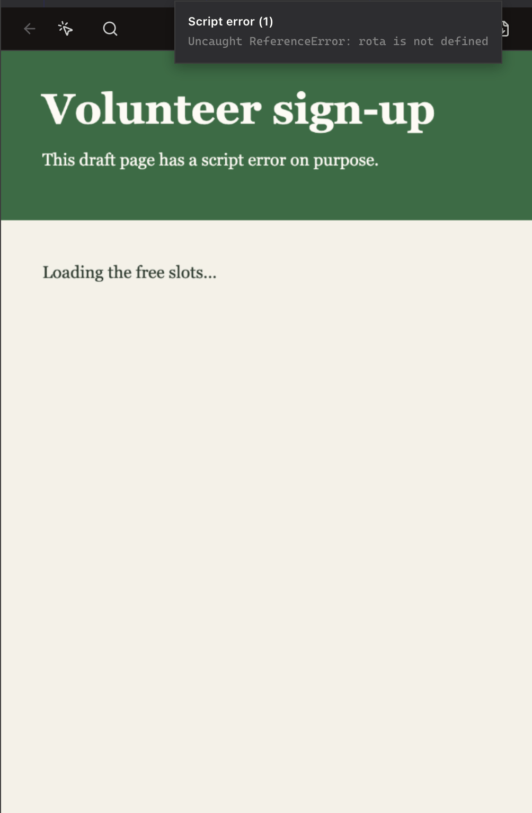

<!-- SPDX-License-Identifier: GPL-3.0-only -->
# Recover from problems

Erfana shows a recovery screen or a local panel message when a part of the interface fails. Saved project files remain on disk; an unsaved editor buffer can be lost after a whole-window crash.

## Erfana stopped unexpectedly

**What it does:** The crash screen contains a renderer failure and offers **Restart Erfana**, **Open logs folder**, and **Copy error details**. **How to reach it:** It appears after a whole-window rendering error; it is not a menu command. Copy the details into a bug report, open the logs for more context, then restart. Restart returns to the welcome screen and does not reopen the last project automatically. If Restart has no effect after about three seconds, quit and reopen the app. If the bridge to the main process failed, the screen may show instructions without buttons.

## Project tree unavailable

**What it does:** A tree error stays in the left panel while editor tabs and terminal can continue. **How to reach it:** The panel displays **Project tree unavailable** and a **Reload** button when drawing fails. Select **Reload**; if it repeats, open a different project or collect `combined.log` from **Settings > Logging > Open** for a bug report. A new project gets a fresh tree.

## Panel unavailable

**What it does:** A failed panel shows an unavailable message and **Reload** rather than taking down the window. **How to reach it:** It appears in that panel after an error. Reload the panel; if it fails again, collect the logs. The rest of the app can remain usable.

## Terminal not available

**What it does:** The terminal status panel reports that the terminal backend is unavailable. **How to reach it:** Open Terminal with the right activity bar or <kbd>Cmd</kbd>+<kbd>J</kbd> (Windows: <kbd>Ctrl</kbd>+<kbd>J</kbd>). Select **Recheck** after addressing the displayed cause; **Copy fix command** copies the suggested command for an installed development build. If the terminal still cannot start, include its message and log in a report.

## HTML preview stopped or reports issues

**What it does:** A stopped preview offers **Reload**. The **Preview issues** list names script failures, blocked remote hosts, links and frames. **How to reach it:** Open an HTML file; use the toolbar's issues control or the stopped-preview **Reload** action. Check the listed issue, correct the project file, and reload. A blocked remote host requires an explicit [permission](html-preview.md#remote-host-permission); a file in a protected build folder opens as source instead.

## Mermaid diagram rendering error

**What it does:** Invalid diagram syntax shows an error box instead of a diagram. **How to reach it:** Open Markdown Preview on a file with a Mermaid block. Check syntax and diagram type; the bug icon labeled **Report this error to Claude Code** sends a prepared report to the terminal, where Claude Code can help if it is running. The report does not repair the source by itself.

## File changed on disk

**What it does:** A conflict notice appears if the file changed outside Erfana while the editor has local changes. **How to reach it:** Select **Reload from Disk** to use the external version or **Keep My Version** to retain the editor buffer. Check both versions before choosing if you need to preserve edits. See [edit and preview Markdown](../how-to/edit-and-preview-markdown.md).
