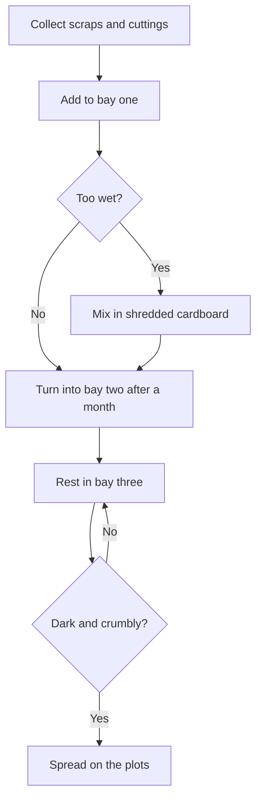

# Compost guide

The garden runs a three-bay system. Fresh material goes into bay one, gets turned into bay two
after a month, and rests in bay three until it is ready to spread.

## What can go in

- Vegetable peelings, fruit scraps, tea leaves and coffee grounds
- Grass cuttings and soft prunings
- Shredded cardboard and paper

Leave out meat, dairy, cooked food, and anything that has been sprayed.

## How it works

## Who looks after it

The Thursday group turns the bays once a month. If a bay smells bad, it needs air: turn it and
add dry material.
