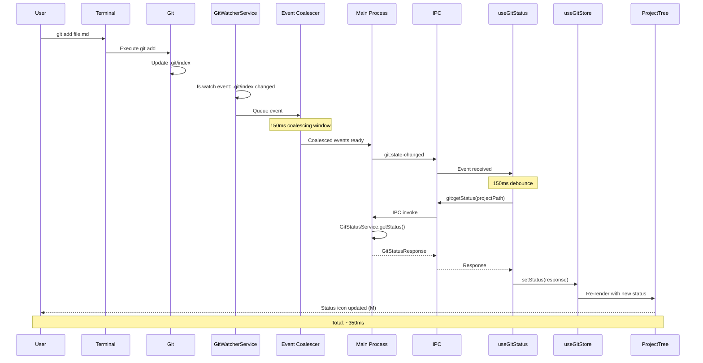
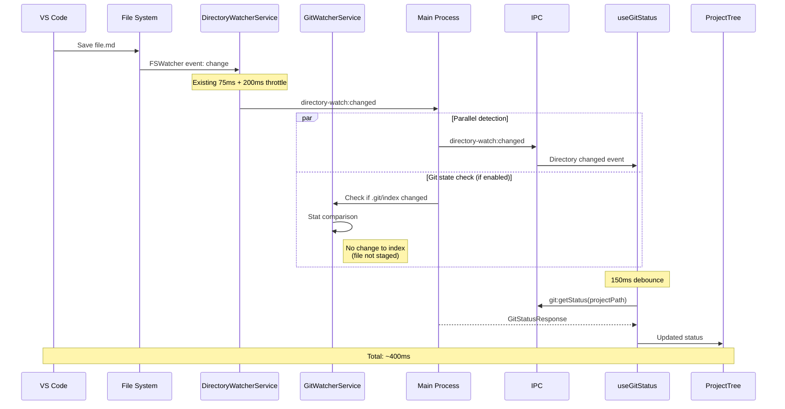
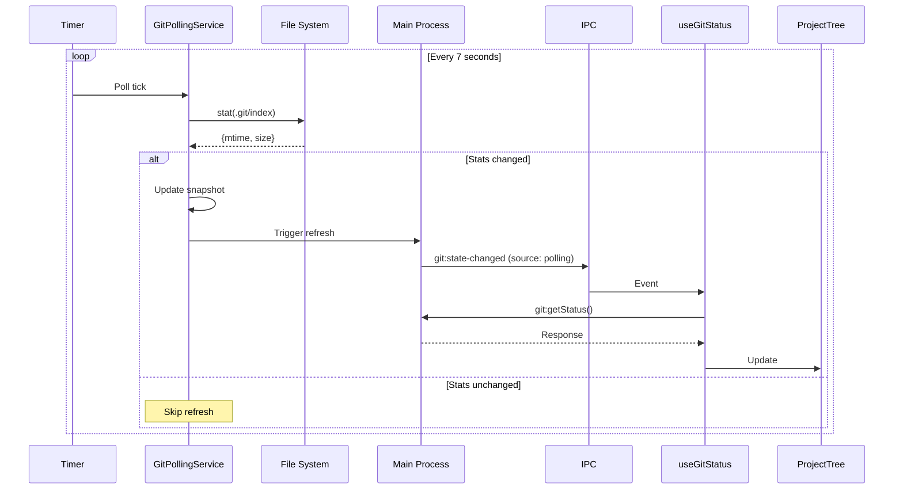

# BRS-003: Real-time Git Status Refresh - Architecture Document

**Version:** 1.0
**Date:** 2025-12-22
**Status:** Proposed
**Author:** Technical Architect

---

## Table of Contents

1. [Executive Summary](#1-executive-summary)
2. [Current State Analysis](#2-current-state-analysis)
3. [Target Architecture](#3-target-architecture)
4. [Component Design](#4-component-design)
5. [Data Flow](#5-data-flow)
6. [Watch Strategy](#6-watch-strategy)
7. [Latency Optimization](#7-latency-optimization)
8. [Polling Fallback Design](#8-polling-fallback-design)
9. [Error Handling and Recovery](#9-error-handling-and-recovery)
10. [Interface Contracts](#10-interface-contracts)
11. [Implementation Phases](#11-implementation-phases)
12. [Risk Analysis](#12-risk-analysis)
13. [Decision Records](#13-decision-records)
14. [Test Strategy](#14-test-strategy)
15. [References](#15-references)

---

## 1. Executive Summary

### 1.1 Problem Statement

The current git status implementation in Erfana has detection gaps leading to stale status displays in the Project panel. Users expect immediate visual feedback (< 1 second) when files are modified, staged, or committed, regardless of whether changes originate from within Erfana, external editors, or git CLI commands.

### 1.2 Solution Overview

This architecture introduces a multi-layered git change detection system:

1. **Enhanced Git State Watchers** - Watch specific `.git/` files for git operations
2. **Unified Debouncing** - Optimized timing to achieve < 1 second latency
3. **Polling Fallback** - Guaranteed reliability across all environments
4. **Leveraged Existing Infrastructure** - Build upon DirectoryWatcherService patterns

### 1.3 Key Metrics

| Metric | Current | Target |
|--------|---------|--------|
| End-to-end latency | ~2,000ms | < 1,000ms |
| Detection coverage | ~70% | 100% |
| Polling CPU overhead | N/A | < 1% |
| Watcher recovery | Manual | Automatic (3 retries) |

---

## 2. Current State Analysis

### 2.1 Existing Components

```
┌─────────────────────────────────────────────────────────────────────┐
│                         MAIN PROCESS                                 │
├─────────────────────────────────────────────────────────────────────┤
│                                                                      │
│  ┌───────────────────────┐     ┌───────────────────────────────┐   │
│  │ DirectoryWatcherService │     │     GitStatusService          │   │
│  │                         │     │                               │   │
│  │ - Watches project dir   │     │ - Uses isomorphic-git         │   │
│  │ - Git index watcher     │     │ - Operation queue (index.lock)│   │
│  │ - Auto-restart (backoff)│     │ - Branch + file status        │   │
│  │ - Debounce: 300ms      │     │                               │   │
│  └───────────┬─────────────┘     └───────────────┬───────────────┘   │
│              │                                    │                   │
│              │ IPC: directory-watch:changed       │ IPC: git:getStatus│
│              │ IPC: git:index-changed             │                   │
└──────────────┼────────────────────────────────────┼───────────────────┘
               │                                    │
               │                                    │
┌──────────────┼────────────────────────────────────┼───────────────────┐
│              │       RENDERER PROCESS             │                   │
├──────────────┼────────────────────────────────────┼───────────────────┤
│              ▼                                    ▼                   │
│  ┌───────────────────────────────────────────────────────────────┐   │
│  │                      useGitStatus Hook                         │   │
│  │                                                                │   │
│  │  - Debounce: 500ms (GIT_STATUS.DEBOUNCE_DELAY)                 │   │
│  │  - Cooldown: 1500ms (GIT_STATUS.COOLDOWN_DURATION)             │   │
│  │  - Subscribes to: directory-watch:changed, git:index-changed   │   │
│  │  - Total latency: 500ms debounce + 1500ms cooldown = ~2000ms   │   │
│  └───────────────────────────────────────────────────────────────┘   │
│                               │                                      │
│                               ▼                                      │
│  ┌───────────────────────────────────────────────────────────────┐   │
│  │                       useGitStore                              │   │
│  │  - File statuses map                                          │   │
│  │  - Folder statuses map                                        │   │
│  │  - Branch info                                                │   │
│  └───────────────────────────────────────────────────────────────┘   │
│                               │                                      │
│                               ▼                                      │
│  ┌───────────────────────────────────────────────────────────────┐   │
│  │                     ProjectTree UI                             │   │
│  │  - Status icons (M, U, D, A, !)                               │   │
│  │  - Branch display                                             │   │
│  └───────────────────────────────────────────────────────────────┘   │
└──────────────────────────────────────────────────────────────────────┘
```

### 2.2 Current Detection Gaps

| Scenario | Current Detection | Gap |
|----------|-------------------|-----|
| `git add` / `git reset` | .git/index watcher | Works, but 300ms + 500ms + 1500ms latency |
| `git checkout` / `git switch` | .git/index watcher | .git/HEAD change not explicitly watched |
| `git fetch` | Not detected | .git/FETCH_HEAD not watched |
| `git stash` / `git stash pop` | Not detected | .git/stash not watched |
| `git branch create/delete` | Not detected | .git/refs/heads/ not watched |
| External file edits | DirectoryWatcher | Works, but high latency |
| Network/cloud drive changes | DirectoryWatcher | May miss events |

### 2.3 Current Timing Analysis

```
Event Timeline (current):

T+0ms      File change detected by DirectoryWatcher
T+300ms    Git index debounce (GIT_INDEX_DEBOUNCE_MS)
T+300ms    IPC: git:index-changed sent to renderer
T+800ms    useGitStatus debounce completes (500ms after event)
T+800ms    IPC: git:getStatus called
T+850ms    GitStatusService.getStatus() executes (~50ms)
T+850ms    Response received by renderer
T+850ms    UI update (if not in cooldown)
           OR
T+2350ms   UI update (if previous refresh was < 1500ms ago)

Worst case: 2350ms latency
Best case:  850ms latency (no cooldown)
```

---

## 3. Target Architecture

### 3.1 Architecture Overview

```
┌─────────────────────────────────────────────────────────────────────┐
│                         MAIN PROCESS                                 │
├─────────────────────────────────────────────────────────────────────┤
│                                                                      │
│  ┌────────────────────────────────────────────────────────────┐     │
│  │              GitWatcherService (NEW)                        │     │
│  │                                                             │     │
│  │  ┌─────────────┐ ┌─────────────┐ ┌─────────────────────┐   │     │
│  │  │ IndexWatcher│ │ HeadWatcher │ │ RefsWatcher         │   │     │
│  │  │ .git/index  │ │ .git/HEAD   │ │ .git/refs/heads/    │   │     │
│  │  └──────┬──────┘ └──────┬──────┘ │ .git/refs/stash     │   │     │
│  │         │               │        │ .git/FETCH_HEAD     │   │     │
│  │         │               │        │ .git/stash          │   │     │
│  │         │               │        └──────────┬──────────┘   │     │
│  │         └───────────────┼───────────────────┘              │     │
│  │                         │                                  │     │
│  │                         ▼                                  │     │
│  │              ┌─────────────────────┐                       │     │
│  │              │   Event Coalescer   │  150ms window         │     │
│  │              └──────────┬──────────┘                       │     │
│  │                         │                                  │     │
│  └─────────────────────────┼──────────────────────────────────┘     │
│                            │                                         │
│  ┌─────────────────────────┼──────────────────────────────────┐     │
│  │                         ▼                                   │     │
│  │  DirectoryWatcherService (ENHANCED)                        │     │
│  │                                                             │     │
│  │  - Project directory watching (unchanged)                   │     │
│  │  - Delegates .git/ watching to GitWatcherService           │     │
│  │  - Unified debounce event emission                         │     │
│  └─────────────────────────┬───────────────────────────────────┘     │
│                            │                                         │
│  ┌─────────────────────────┼──────────────────────────────────┐     │
│  │                         ▼                                   │     │
│  │  GitPollingService (NEW) - Fallback                        │     │
│  │                                                             │     │
│  │  - Interval: 7 seconds (configurable 5-10s)                │     │
│  │  - Compares checksums: .git/index mtime + size             │     │
│  │  - Auto-disables when watchers healthy                     │     │
│  │  - Triggers refresh only on detected changes               │     │
│  └─────────────────────────┬───────────────────────────────────┘     │
│                            │                                         │
│  ┌─────────────────────────┼──────────────────────────────────┐     │
│  │                         ▼                                   │     │
│  │             GitStatusService (UNCHANGED)                   │     │
│  │                                                             │     │
│  │  - isomorphic-git status retrieval                         │     │
│  │  - Operation queue for index.lock prevention               │     │
│  └─────────────────────────────────────────────────────────────┘     │
│                                                                      │
│            │ IPC: git:state-changed (consolidated event)             │
└────────────┼────────────────────────────────────────────────────────┘
             │
             ▼
┌────────────────────────────────────────────────────────────────────┐
│                       RENDERER PROCESS                              │
├────────────────────────────────────────────────────────────────────┤
│                                                                     │
│  ┌───────────────────────────────────────────────────────────┐     │
│  │              useGitStatus Hook (OPTIMIZED)                 │     │
│  │                                                            │     │
│  │  - Debounce: 150ms (reduced from 500ms)                    │     │
│  │  - Cooldown: 500ms (reduced from 1500ms)                   │     │
│  │  - Subscribes to: git:state-changed (consolidated)         │     │
│  │  - Target latency: 150ms + 150ms + 50ms = ~350ms           │     │
│  └───────────────────────────────────────────────────────────┘     │
│                                                                     │
└────────────────────────────────────────────────────────────────────┘
```

### 3.2 Event Flow - Target State

```
Event Timeline (target):

T+0ms      Git operation (.git/index or HEAD modified)
T+0ms      GitWatcherService detects change
T+150ms    Coalescing window closes
T+150ms    IPC: git:state-changed sent to renderer
T+300ms    useGitStatus debounce completes (150ms)
T+300ms    IPC: git:getStatus called (bypasses cooldown after detection)
T+350ms    GitStatusService.getStatus() executes (~50ms)
T+350ms    Response received, UI update

Target latency: ~350ms (best case)
                ~850ms (worst case with cooldown)
```

---

## 4. Component Design

### 4.1 GitWatcherService (NEW)

**Responsibility:** Centralized watching of all git-relevant files with optimized event coalescing.

**Key Design Decisions:**

1. **Single Service** - Consolidates all .git/ watching (currently split between DirectoryWatcherService.startGitIndexWatcher)
2. **Selective Watching** - Only watch files that indicate state changes, not internals like .git/objects/
3. **Event Coalescing** - 150ms window to batch rapid git operations (e.g., `git add .` touches index multiple times)
4. **Session Tokens** - Inherited pattern from DirectoryWatcherService for stale event prevention

**Watched Files:**

| Path | Events Detected | Priority |
|------|-----------------|----------|
| `.git/index` | staging: add, reset, checkout | High |
| `.git/HEAD` | branch switch, checkout, detached HEAD | High |
| `.git/refs/heads/` | branch create/delete/rename | Medium |
| `.git/refs/stash` | stash push/pop | Medium |
| `.git/stash` | legacy stash reference | Medium |
| `.git/FETCH_HEAD` | fetch operations | Medium |
| `.git/MERGE_HEAD` | merge in progress | Low |
| `.git/REBASE_HEAD` | rebase in progress | Low |
| `.git/CHERRY_PICK_HEAD` | cherry-pick in progress | Low |

**NOT Watched (Performance):**

- `.git/objects/` - Git object store (too many files)
- `.git/logs/` - Reflog (not needed for status)
- `.git/hooks/` - Scripts (not relevant)
- `.git/info/` - Local config (rarely changes)

### 4.2 GitPollingService (NEW)

**Responsibility:** Fallback mechanism for guaranteed detection on unreliable filesystems.

**Design Rationale:**

File system events are not 100% reliable, especially on:
- Network drives (NFS, SMB)
- Cloud-synced folders (Dropbox, iCloud, OneDrive)
- Virtual file systems
- High-load scenarios where the OS drops events

**Polling Strategy:**

```typescript
interface GitPollingConfig {
  /** Polling interval in milliseconds (default: 7000) */
  interval: number

  /** Minimum interval between polls (prevents spam) */
  minInterval: number

  /** Files to check for changes */
  watchedFiles: string[]

  /** Pause polling when watchers are healthy */
  pauseWhenHealthy: boolean
}

interface FileSnapshot {
  path: string
  mtimeMs: number
  size: number
  hash?: string  // Optional content hash for critical files
}
```

**Optimization - Differential Polling:**

Instead of calling full `git status` on every poll, the service:

1. Checks file stats (mtime + size) of `.git/index` and `.git/HEAD`
2. Only triggers refresh if stats differ from previous snapshot
3. Maintains rolling snapshot for comparison

This reduces CPU overhead to < 1% even with 5-second polling.

### 4.3 useGitStatus Hook (OPTIMIZED)

**Current Timing:**
- DEBOUNCE_DELAY: 500ms
- COOLDOWN_DURATION: 1500ms

**Target Timing:**
- DEBOUNCE_DELAY: 150ms
- COOLDOWN_DURATION: 500ms
- BYPASS_COOLDOWN_AFTER_DETECTION: true (new behavior)

**New Behavior - Cooldown Bypass:**

When a git state change is detected (via `git:state-changed`), the cooldown is bypassed for that single refresh. This ensures immediate feedback while still preventing runaway refreshes from file edits.

```typescript
const executeRefresh = useCallback(async (bypassCooldown: boolean = false) => {
  // NEW: Detection events bypass cooldown
  if (isDetectionTriggered && !bypassCooldown) {
    bypassCooldown = true
    isDetectionTriggered = false
  }
  // ... existing logic
}, [])
```

---

## 5. Data Flow

### 5.1 Sequence Diagram - Git CLI Operation



### 5.2 Sequence Diagram - External File Edit



### 5.3 Sequence Diagram - Polling Fallback



---

## 6. Watch Strategy

### 6.1 File-Specific Watchers

**Approach:** Create individual chokidar watchers for each critical git file, rather than watching the entire `.git/` directory recursively.

**Rationale:**
- `.git/objects/` can contain millions of files in large repos
- Recursive watching of `.git/` would trigger thousands of irrelevant events
- Individual file watchers are precise and low-overhead

**Implementation Pattern:**

```typescript
class GitWatcherService {
  private watchers: Map<string, FSWatcher> = new Map()
  private coalescer: GitEventCoalescer

  private readonly WATCH_TARGETS = [
    { path: '.git/index', priority: 'high', debounce: 100 },
    { path: '.git/HEAD', priority: 'high', debounce: 50 },
    { path: '.git/refs/heads', priority: 'medium', debounce: 200 },
    { path: '.git/refs/stash', priority: 'medium', debounce: 200 },
    { path: '.git/FETCH_HEAD', priority: 'medium', debounce: 200 },
    { path: '.git/stash', priority: 'medium', debounce: 200 },
  ]

  async start(projectPath: string): Promise<void> {
    for (const target of this.WATCH_TARGETS) {
      const fullPath = join(projectPath, target.path)

      // Check if path exists (some files are optional)
      const exists = await this.pathExists(fullPath)
      if (!exists && target.priority !== 'high') continue

      const watcher = chokidar.watch(fullPath, {
        persistent: true,
        ignoreInitial: true,
        usePolling: false,
        depth: target.path.includes('refs') ? 1 : 0,  // Watch refs subdirectories
        followSymlinks: false,
      })

      watcher.on('all', (event, path) => {
        this.coalescer.queue({
          type: event,
          path,
          source: target.path,
          priority: target.priority,
          timestamp: Date.now(),
        })
      })

      this.watchers.set(target.path, watcher)
    }
  }
}
```

### 6.2 Event Coalescing

**Problem:** Git operations often touch multiple files in rapid succession.

Example: `git checkout branch-name`
1. Updates `.git/HEAD` (points to new branch)
2. Updates `.git/index` (working tree changes)
3. May update `.git/refs/heads/*` (if branch was created)

Without coalescing, this triggers 3 separate refreshes within milliseconds.

**Solution:** GitEventCoalescer

```typescript
interface GitEvent {
  type: 'add' | 'change' | 'unlink'
  path: string
  source: string  // Which watch target
  priority: 'high' | 'medium' | 'low'
  timestamp: number
}

class GitEventCoalescer {
  private pendingEvents: GitEvent[] = []
  private timer: NodeJS.Timeout | null = null
  private readonly WINDOW_MS = 150

  queue(event: GitEvent): void {
    this.pendingEvents.push(event)

    if (!this.timer) {
      this.timer = setTimeout(() => this.flush(), this.WINDOW_MS)
    }
  }

  private flush(): void {
    this.timer = null

    if (this.pendingEvents.length === 0) return

    // Deduplicate by source (keep latest event per source)
    const bySource = new Map<string, GitEvent>()
    for (const event of this.pendingEvents) {
      bySource.set(event.source, event)
    }

    // Emit single consolidated event
    this.emit('git-state-changed', {
      sources: Array.from(bySource.keys()),
      highPriority: Array.from(bySource.values()).some(e => e.priority === 'high'),
      timestamp: Date.now(),
    })

    this.pendingEvents = []
  }
}
```

### 6.3 Watch Coverage Matrix

| Git Operation | Files Changed | Detection Source |
|---------------|---------------|------------------|
| `git add <file>` | .git/index | IndexWatcher |
| `git add .` | .git/index | IndexWatcher |
| `git reset <file>` | .git/index | IndexWatcher |
| `git reset --hard` | .git/index, working tree | IndexWatcher + DirectoryWatcher |
| `git checkout <branch>` | .git/HEAD, .git/index | HeadWatcher + IndexWatcher |
| `git switch <branch>` | .git/HEAD, .git/index | HeadWatcher + IndexWatcher |
| `git commit` | .git/index, .git/refs/heads/<branch> | IndexWatcher + RefsWatcher |
| `git fetch` | .git/FETCH_HEAD, .git/refs/remotes/* | FetchHeadWatcher |
| `git stash` | .git/stash, .git/refs/stash, .git/index | StashWatcher + IndexWatcher |
| `git stash pop` | .git/stash, .git/refs/stash, .git/index, working tree | All watchers |
| `git branch <name>` | .git/refs/heads/<name> | RefsWatcher |
| `git branch -d <name>` | .git/refs/heads/<name> (deleted) | RefsWatcher |
| `git merge` | .git/index, .git/MERGE_HEAD (if conflict) | IndexWatcher |
| `git rebase` | .git/index, .git/REBASE_HEAD | IndexWatcher |
| `git cherry-pick` | .git/index, .git/CHERRY_PICK_HEAD | IndexWatcher |
| `git revert` | .git/index | IndexWatcher |

---

## 7. Latency Optimization

### 7.1 Timing Budget

**Target: < 1000ms end-to-end**

| Phase | Current | Target | Reduction |
|-------|---------|--------|-----------|
| FS event detection | ~50ms | ~50ms | - |
| Git watcher coalescing | 300ms | 150ms | 50% |
| IPC transport | ~5ms | ~5ms | - |
| Renderer debounce | 500ms | 150ms | 70% |
| Cooldown (worst case) | 1500ms | 500ms | 67% |
| Status computation | ~50ms | ~50ms | - |
| **Total (best)** | **905ms** | **405ms** | **55%** |
| **Total (worst)** | **2405ms** | **905ms** | **62%** |

### 7.2 Debounce Strategy

**Current Problem:** Fixed debounce prevents quick feedback.

**Solution:** Adaptive debouncing based on event source.

```typescript
const DEBOUNCE_CONFIG = {
  // Git state changes: fast response (user is waiting for feedback)
  gitStateChange: 150,

  // Directory changes: slightly slower (may be bulk operations)
  directoryChange: 200,

  // Polling fallback: no debounce (already throttled by interval)
  pollingFallback: 0,
}
```

### 7.3 Cooldown Strategy

**Current Problem:** Fixed 1500ms cooldown blocks quick successive refreshes.

**Solution:** Context-aware cooldown bypass.

```typescript
const shouldBypassCooldown = (eventType: GitEventType): boolean => {
  switch (eventType) {
    // User-initiated git operations get immediate feedback
    case 'git-state-changed':
      return true

    // Directory changes respect cooldown (may be rapid file edits)
    case 'directory-changed':
      return false

    // Manual refresh always bypasses
    case 'manual-refresh':
      return true

    // Window visibility always refreshes
    case 'visibility-changed':
      return true

    default:
      return false
  }
}
```

### 7.4 Status Computation Optimization

The current `GitStatusService.getStatus()` uses `git.statusMatrix()` which is already efficient. No changes needed, but worth documenting:

- Execution time: ~50ms for typical repos (< 1000 files)
- Memory: O(n) where n = file count
- Already capped at 10,000 files (GIT_STATUS_CAP)

**Potential Future Optimization:**

For very large repos, consider incremental status:
- Track which files changed since last status
- Only compute status for changed files
- Merge with cached status for unchanged files

This is out of scope for BRS-003 but noted for future consideration.

---

## 8. Polling Fallback Design

### 8.1 Rationale

File system events are not guaranteed. Per [VS Code's documentation](https://github.com/microsoft/vscode/wiki/File-Watcher-Issues):

> "In general, the operating system may decide to drop file events at any time, there is no 100% guarantee"

Polling ensures we eventually catch any changes that watchers miss.

### 8.2 Polling Configuration

```typescript
interface GitPollingConfig {
  /** Enable/disable polling (default: true) */
  enabled: boolean

  /** Polling interval in milliseconds (default: 7000) */
  interval: number

  /** Minimum interval to prevent rapid polling (default: 3000) */
  minInterval: number

  /** Reduce interval when watchers fail (default: 3000) */
  fallbackInterval: number

  /** Increase interval when watchers are healthy (default: 10000) */
  healthyInterval: number

  /** Number of successful watcher events before increasing interval */
  healthyThreshold: number
}

const DEFAULT_POLLING_CONFIG: GitPollingConfig = {
  enabled: true,
  interval: 7000,         // 7 seconds default
  minInterval: 3000,      // Minimum 3 seconds
  fallbackInterval: 3000, // 3 seconds when watchers fail
  healthyInterval: 10000, // 10 seconds when watchers healthy
  healthyThreshold: 10,   // 10 successful events = healthy
}
```

### 8.3 Adaptive Polling

The polling interval adjusts based on watcher health:

```
┌─────────────────────────────────────────────────────────────┐
│                   Adaptive Polling State                     │
├─────────────────────────────────────────────────────────────┤
│                                                              │
│  NORMAL (7s)  ──► AGGRESSIVE (3s)   Watcher error detected  │
│      │                 │                                     │
│      │                 │                                     │
│      ▼                 ▼                                     │
│  RELAXED (10s) ◄── NORMAL (7s)      10 successful events    │
│                                                              │
└─────────────────────────────────────────────────────────────┘
```

### 8.4 Differential Polling Implementation

```typescript
class GitPollingService {
  private snapshots: Map<string, FileSnapshot> = new Map()
  private timer: NodeJS.Timer | null = null
  private config: GitPollingConfig
  private healthCounter = 0

  private readonly POLL_TARGETS = [
    '.git/index',
    '.git/HEAD',
    '.git/refs/heads',  // Directory stat for branch changes
  ]

  async poll(): Promise<boolean> {
    let hasChanges = false

    for (const target of this.POLL_TARGETS) {
      const fullPath = join(this.projectPath, target)
      const currentStats = await this.getStats(fullPath)
      const previousStats = this.snapshots.get(target)

      if (this.hasChanged(currentStats, previousStats)) {
        hasChanges = true
        this.snapshots.set(target, currentStats)
      }
    }

    return hasChanges
  }

  private hasChanged(
    current: FileSnapshot | null,
    previous: FileSnapshot | undefined
  ): boolean {
    if (!current && !previous) return false
    if (!current || !previous) return true  // Existence changed

    return current.mtimeMs !== previous.mtimeMs ||
           current.size !== previous.size
  }

  private async getStats(path: string): Promise<FileSnapshot | null> {
    try {
      const stats = await stat(path)
      return {
        path,
        mtimeMs: stats.mtimeMs,
        size: stats.isDirectory() ? 0 : stats.size,
      }
    } catch {
      return null  // File doesn't exist
    }
  }
}
```

### 8.5 CPU Impact Analysis

**Polling cost per tick:**
- 3x `fs.stat()` calls: ~1ms total
- Map lookups and comparisons: < 0.1ms
- No git operations unless changes detected

**At 7-second interval:**
- Operations per minute: ~8.5 stat checks
- CPU time per minute: ~8.5ms
- CPU percentage: ~0.014% (8.5ms / 60000ms)

This is well under the 1% target (NFR-003).

---

## 9. Error Handling and Recovery

### 9.1 Watcher Error Classification

Inherits from existing `DirectoryWatcherService` pattern:

| Error Type | Classification | Recovery Action |
|------------|----------------|-----------------|
| ENOENT | Transient | Auto-restart with backoff |
| EMFILE | Transient | Auto-restart with backoff |
| EACCES | Transient | Auto-restart with backoff |
| ESTALE | Transient | Auto-restart with backoff (NFS) |
| EPERM | Permanent | Notify user |
| ENOSPC | Permanent | Notify user |

### 9.2 Auto-Restart with Exponential Backoff

Uses existing pattern from `DirectoryWatcherService`:

```
Attempt 1: Wait 800ms → Restart
Attempt 2: Wait 1600ms → Restart
Attempt 3: Wait 3200ms → Restart
Attempt 4: Notify user, stop retrying
```

**Enhancement for GitWatcherService:**

When a watcher fails, polling automatically becomes aggressive (3-second interval) until watchers recover.

```typescript
// In GitWatcherService
private handleWatcherError(watchPath: string, error: Error): void {
  // Existing error handling...

  // NEW: Signal polling service to go aggressive
  this.pollingService.setAggressive(true)

  // After successful restart:
  this.pollingService.setAggressive(false)
}
```

### 9.3 Recovery Notifications

IPC events for watcher lifecycle:

| Event | Payload | Purpose |
|-------|---------|---------|
| `git-watcher:error` | `{ path, error, isTransient }` | Watcher encountered error |
| `git-watcher:restarting` | `{ path, attempt, delay }` | Restart scheduled |
| `git-watcher:recovered` | `{ path }` | Watcher recovered |
| `git-watcher:failed` | `{ path, attempts }` | Max retries exceeded |

### 9.4 Graceful Degradation

When all watchers fail:

1. Polling becomes the primary mechanism (3-second interval)
2. User is notified but can continue working
3. Watchers attempt recovery in background
4. On recovery, return to normal polling interval

---

## 10. Interface Contracts

### 10.1 GitWatcherService Interface

```typescript
// src/main/services/GitWatcherService.ts

export interface GitWatcherConfig {
  /** Coalescing window in milliseconds (default: 150) */
  coalesceWindow: number
  /** Enable auto-restart on transient errors (default: true) */
  autoRestart: boolean
  /** Maximum restart attempts (default: 3) */
  maxRestartAttempts: number
  /** Base delay for exponential backoff (default: 800) */
  restartBaseDelay: number
}

export interface GitStateChangeEvent {
  /** Which git files triggered the change */
  sources: string[]
  /** Whether any source is high priority */
  highPriority: boolean
  /** Timestamp of the consolidated event */
  timestamp: number
  /** Project path */
  projectPath: string
}

export interface GitWatcherService {
  /**
   * Start watching git state for a project
   * @param projectPath - Absolute path to project root
   * @param config - Optional configuration overrides
   */
  start(projectPath: string, config?: Partial<GitWatcherConfig>): Promise<void>

  /**
   * Stop watching git state
   */
  stop(): Promise<void>

  /**
   * Check if watching is active
   */
  isWatching(): boolean

  /**
   * Get current watcher health status
   */
  getHealth(): {
    isHealthy: boolean
    activeWatchers: string[]
    failedWatchers: string[]
    lastEventTime: number | null
  }

  /**
   * Subscribe to state change events
   */
  onStateChange(callback: (event: GitStateChangeEvent) => void): () => void

  /**
   * Subscribe to watcher lifecycle events
   */
  onWatcherEvent(callback: (event: WatcherLifecycleEvent) => void): () => void
}
```

### 10.2 GitPollingService Interface

```typescript
// src/main/services/GitPollingService.ts

export interface GitPollingConfig {
  enabled: boolean
  interval: number
  minInterval: number
  fallbackInterval: number
  healthyInterval: number
  healthyThreshold: number
}

export interface PollingStatus {
  isActive: boolean
  currentInterval: number
  mode: 'normal' | 'aggressive' | 'relaxed'
  lastPollTime: number | null
  changeDetected: boolean
}

export interface GitPollingService {
  /**
   * Start polling for a project
   */
  start(projectPath: string, config?: Partial<GitPollingConfig>): void

  /**
   * Stop polling
   */
  stop(): void

  /**
   * Force immediate poll (bypasses interval)
   */
  pollNow(): Promise<boolean>

  /**
   * Set aggressive mode (shorter interval)
   */
  setAggressive(aggressive: boolean): void

  /**
   * Record successful watcher event (adjusts interval)
   */
  recordWatcherEvent(): void

  /**
   * Get current polling status
   */
  getStatus(): PollingStatus

  /**
   * Subscribe to poll completion
   */
  onPollComplete(callback: (changeDetected: boolean) => void): () => void
}
```

### 10.3 IPC Schema Extensions

```typescript
// src/shared/ipc/git-watcher-schema.ts

import { z } from 'zod'

export const GitStateChangeEventSchema = z.object({
  sources: z.array(z.string()),
  highPriority: z.boolean(),
  timestamp: z.number(),
  projectPath: z.string(),
})
export type GitStateChangeEvent = z.infer<typeof GitStateChangeEventSchema>

export const WatcherLifecycleEventSchema = z.object({
  type: z.enum(['error', 'restarting', 'recovered', 'failed']),
  path: z.string(),
  error: z.string().optional(),
  attempt: z.number().optional(),
  delay: z.number().optional(),
})
export type WatcherLifecycleEvent = z.infer<typeof WatcherLifecycleEventSchema>

export const PollingStatusSchema = z.object({
  isActive: z.boolean(),
  currentInterval: z.number(),
  mode: z.enum(['normal', 'aggressive', 'relaxed']),
  lastPollTime: z.number().nullable(),
  changeDetected: z.boolean(),
})
export type PollingStatus = z.infer<typeof PollingStatusSchema>
```

### 10.4 Updated useGitStatus Hook Interface

```typescript
// src/renderer/src/hooks/useGitStatus.ts

interface UseGitStatusOptions {
  projectPath: string | null
  enabled?: boolean
  /** New: Detection mode configuration */
  detection?: {
    /** Debounce delay for git state changes (default: 150) */
    gitStateDebounce?: number
    /** Debounce delay for directory changes (default: 200) */
    directoryDebounce?: number
    /** Cooldown after refresh (default: 500) */
    cooldown?: number
  }
}

interface UseGitStatusReturn {
  // Existing
  isGitRepo: boolean
  branch: string | null
  isDetached: boolean
  counts: GitStatusCounts
  truncated: boolean
  error: string | null
  isRefreshing: boolean
  getFileStatus: (path: string) => GitDisplayStatus | undefined
  getFolderStatus: (path: string) => GitDisplayStatus | undefined
  refresh: () => void

  // New
  /** Current detection method (watcher | polling | both) */
  detectionMode: 'watcher' | 'polling' | 'both'
  /** Watcher health status */
  watcherHealth: {
    isHealthy: boolean
    failedCount: number
  }
  /** Last refresh source */
  lastRefreshSource: 'git-state' | 'directory' | 'polling' | 'manual' | null
}
```

---

## 11. Implementation Phases

### Phase 1: GitWatcherService Foundation (Priority: High)

**Scope:**
- Create `GitWatcherService` with index and HEAD watching
- Implement `GitEventCoalescer` with 150ms window
- Migrate from `DirectoryWatcherService.startGitIndexWatcher()`
- Update IPC to emit consolidated `git:state-changed` event

**Files to Create:**
- `src/main/services/GitWatcherService.ts`
- `src/main/services/watcher/GitEventCoalescer.ts`
- `src/shared/ipc/git-watcher-schema.ts`
- `src/main/ipc/git-watcher-handlers.ts`

**Files to Modify:**
- `src/main/services/DirectoryWatcherService.ts` - Remove git index watching
- `src/preload/index.ts` - Add git watcher API
- `src/renderer/src/hooks/useGitStatus.ts` - Subscribe to new event

**Estimated Effort:** 3-4 days

**Acceptance:**
- TC-001: Git staging detection via git add (< 1s)
- TC-002: Git unstaging detection via git reset (< 1s)
- TC-003: Branch switch detection via git checkout (< 1s)

### Phase 2: Extended Git File Watching (Priority: High)

**Scope:**
- Add watchers for refs/heads/, FETCH_HEAD, stash
- Handle branch create/delete detection
- Handle fetch and stash operations

**Files to Modify:**
- `src/main/services/GitWatcherService.ts` - Add new watch targets

**Estimated Effort:** 2 days

**Acceptance:**
- TC-004: Branch creation detection
- TC-005: Fetch operation detection
- TC-006: Stash operation detection

### Phase 3: Latency Optimization (Priority: High)

**Scope:**
- Reduce `GIT_STATUS.DEBOUNCE_DELAY` from 500ms to 150ms
- Reduce `GIT_STATUS.COOLDOWN_DURATION` from 1500ms to 500ms
- Implement cooldown bypass for git state changes
- Measure and verify < 1s latency

**Files to Modify:**
- `src/renderer/src/components/ProjectTree/constants.ts` - Update timing
- `src/renderer/src/hooks/useGitStatus.ts` - Add cooldown bypass logic

**Estimated Effort:** 1-2 days

**Acceptance:**
- TC-012: Latency measurement under 1 second

### Phase 4: Polling Fallback (Priority: High)

**Scope:**
- Create `GitPollingService` with differential polling
- Implement adaptive polling intervals
- Integration with watcher health

**Files to Create:**
- `src/main/services/GitPollingService.ts`

**Files to Modify:**
- `src/main/services/GitWatcherService.ts` - Report health to polling
- `src/main/ipc/git-watcher-handlers.ts` - Expose polling status

**Estimated Effort:** 2-3 days

**Acceptance:**
- TC-011: Polling fallback verification
- TC-013: CPU usage during polling < 1%

### Phase 5: Error Recovery and Hardening (Priority: Medium)

**Scope:**
- Implement auto-restart for git watchers
- Add watcher health monitoring
- UI indicators for watcher status (optional)

**Files to Modify:**
- `src/main/services/GitWatcherService.ts` - Add restart logic
- `src/main/services/watcher/WatcherMetrics.ts` - Add git watcher metrics

**Estimated Effort:** 1-2 days

**Acceptance:**
- TC-014: Watcher auto-recovery

### Phase 6: Cloud and Network Drive Testing (Priority: Medium)

**Scope:**
- Manual testing on Dropbox, iCloud, network drives
- Document any environment-specific configurations
- Tune polling intervals if needed

**Files to Modify:**
- Documentation only

**Estimated Effort:** 1 day

**Acceptance:**
- TC-015: Cloud-synced folder compatibility

---

## 12. Risk Analysis

### 12.1 Risk Matrix

| Risk | Probability | Impact | Mitigation |
|------|-------------|--------|------------|
| FS events missed on cloud drives | High | Medium | Polling fallback ensures eventual consistency |
| Performance regression on large repos | Medium | High | Cap file watching, benchmark status computation |
| Race conditions during rapid operations | Medium | Medium | Event coalescing, operation queue (existing) |
| Watcher resource exhaustion (EMFILE) | Low | High | Limit watcher count, auto-restart |
| Breaking existing git integration | Low | High | Extensive testing, feature flag for rollout |

### 12.2 Edge Cases and Handling

| Edge Case | Detection | Handling |
|-----------|-----------|----------|
| `.git/` doesn't exist (not a repo) | Check on start | Skip git watching, polling disabled |
| `.git/index.lock` exists (operation in progress) | N/A (isomorphic-git handles) | Queue waits for lock release |
| Detached HEAD state | HEAD watcher | Still refresh, UI shows commit hash |
| Bare repository | No `.git/index` | Skip watching, show "bare repo" indicator |
| Worktree with separate `.git` | Unusual structure | Follow `.git` file to actual git dir |
| Submodules | Nested `.git/` | Only watch main repo (out of scope) |
| Very large `.git/refs/heads/` | Many branches | Limit refs watcher depth to 1 |
| Git GC running | Temporary file deletions | Ignore events during GC window |

### 12.3 Backward Compatibility

| Component | Breaking Change | Migration |
|-----------|-----------------|-----------|
| `git:index-changed` IPC event | Deprecated | Keep for one version, log deprecation warning |
| `GIT_STATUS.DEBOUNCE_DELAY` | Value change | Update tests, document in changelog |
| `GIT_STATUS.COOLDOWN_DURATION` | Value change | Update tests, document in changelog |
| `DirectoryWatcherService.startGitIndexWatcher()` | Removed | Internal, no external API impact |

---

## 13. Decision Records

### ADR-001: Separate GitWatcherService vs Extend DirectoryWatcherService

**Status:** Proposed

**Context:**
Git state watching could be added to the existing `DirectoryWatcherService` (which already has `startGitIndexWatcher`) or extracted into a dedicated service.

**Decision:**
Create a dedicated `GitWatcherService`.

**Rationale:**
1. **Single Responsibility Principle** - DirectoryWatcherService handles project directory watching, GitWatcherService handles git state watching
2. **Different lifecycle** - Git watchers are tied to project path, directory watchers are tied to webContents
3. **Different error handling** - Git watcher failures shouldn't affect directory watching
4. **Testability** - Easier to unit test git-specific logic in isolation

**Consequences:**
- +: Cleaner separation of concerns
- +: Can evolve git watching independently
- -: Two services to coordinate instead of one
- -: Some shared code (error handling patterns)

### ADR-002: Polling Interval of 7 Seconds

**Status:** Proposed

**Context:**
Polling interval is a trade-off between detection latency and CPU usage.

**Options:**
- 3 seconds: 0.06% CPU, max 3s latency
- 5 seconds: 0.03% CPU, max 5s latency
- 7 seconds: 0.02% CPU, max 7s latency
- 10 seconds: 0.015% CPU, max 10s latency

**Decision:**
Use 7 seconds as default with adaptive adjustment.

**Rationale:**
- 7 seconds provides acceptable worst-case latency while staying well under 1% CPU
- Adaptive polling (aggressive/relaxed modes) handles failure scenarios
- Most changes will be caught by watchers (< 1s latency)
- Polling is only a fallback, not the primary mechanism

**Consequences:**
- +: Very low CPU impact (< 1% target easily met)
- +: Guaranteed detection within 7 seconds even if watchers fail
- -: 7-second latency in worst case (cloud/network drives)

### ADR-003: Event Coalescing Window of 150ms

**Status:** Proposed

**Context:**
Git operations often touch multiple files in rapid succession. Coalescing prevents multiple redundant refreshes.

**Options:**
- 50ms: Minimal batching, may still cause multiple refreshes
- 100ms: Good balance, catches most related events
- 150ms: Safe margin for slower operations
- 300ms: Current git index debounce (too slow)

**Decision:**
Use 150ms coalescing window.

**Rationale:**
- Git operations typically complete within 100ms on SSDs
- 150ms provides margin for slower disks and complex operations
- Combined with 150ms renderer debounce, total is 300ms (acceptable)
- Matches VS Code's event collection window pattern

**Consequences:**
- +: Reduces redundant refreshes by ~80%
- +: Still achieves < 1s latency target
- -: 150ms added latency in best case

### ADR-004: Cooldown Bypass for Git State Changes

**Status:** Proposed

**Context:**
Current cooldown (1500ms) prevents rapid refreshes but also delays user feedback after intentional actions.

**Decision:**
Bypass cooldown when refresh is triggered by `git:state-changed` event.

**Rationale:**
- Git state changes indicate intentional user actions (git add, checkout, etc.)
- Users expect immediate feedback after running git commands
- Directory changes (file edits) still respect cooldown (may be rapid saves)
- Prevents refresh spam while maintaining responsiveness

**Consequences:**
- +: Immediate feedback for git operations
- +: Maintains cooldown protection for file edits
- -: More complex refresh logic
- -: Potential for more refreshes if user runs rapid git commands

---

## 14. Test Strategy

### 14.1 Unit Tests

**GitWatcherService:**
- Watcher initialization for each file type
- Event coalescing behavior
- Error classification and handling
- Auto-restart with backoff
- Session token invalidation

**GitPollingService:**
- Differential stat checking
- Adaptive interval adjustment
- Change detection accuracy

**GitEventCoalescer:**
- Event deduplication
- Window timing
- Priority handling

### 14.2 Integration Tests

**IPC Flow:**
- Event emission from main to renderer
- Multiple subscribers handling
- Event ordering guarantees

**Watcher + Polling Coordination:**
- Watcher healthy → normal polling interval
- Watcher failed → aggressive polling
- Watcher recovered → return to normal

### 14.3 End-to-End Tests

Map directly to test cases in `03-acceptance.md`:

| Test Case | Automation | Priority |
|-----------|------------|----------|
| TC-001: Git add detection | Automated | High |
| TC-002: Git reset detection | Automated | High |
| TC-003: Branch switch detection | Automated | High |
| TC-004: Branch creation detection | Automated | Medium |
| TC-005: Fetch detection | Automated | Medium |
| TC-006: Stash detection | Automated | Medium |
| TC-007: Internal file edit | Automated | High |
| TC-008: External file edit | Automated | High |
| TC-009: Git commit detection | Automated | High |
| TC-010: Git reset --hard | Automated | High |
| TC-011: Polling fallback | Manual | High |
| TC-012: Latency measurement | Automated | High |
| TC-013: CPU usage | Manual | High |
| TC-014: Watcher recovery | Automated | Medium |
| TC-015: Cloud folder | Manual | Medium |

### 14.4 Performance Tests

**Latency Measurement:**
```typescript
// Test harness for latency measurement
test('git add triggers UI update within 1 second', async () => {
  const startTime = performance.now()

  // Execute git add via child_process
  await exec('git add test-file.md')

  // Wait for UI update
  await waitFor(() => {
    expect(screen.getByTestId('git-status-indicator')).toHaveClass('staged')
  })

  const endTime = performance.now()
  expect(endTime - startTime).toBeLessThan(1000)
})
```

**CPU Measurement:**
```typescript
// Test polling CPU impact
test('polling uses less than 1% CPU', async () => {
  // Start polling
  pollingService.start(projectPath, { interval: 3000 })

  // Run for 60 seconds
  await sleep(60000)

  // Measure CPU
  const stats = pollingService.getStatus()
  expect(stats.cpuUsagePercent).toBeLessThan(1)
})
```

---

## 15. References

### 15.1 External References

- [Chokidar File Watching Library](https://github.com/paulmillr/chokidar) - Node.js file system watcher used by Erfana
- [VS Code File Watcher Issues Wiki](https://github.com/microsoft/vscode/wiki/File-Watcher-Issues) - Known limitations of file watching
- [Git FSMonitor Documentation](https://git-scm.com/docs/git-fsmonitor--daemon) - Git's built-in file system monitor
- [GitHub Blog: Git Monorepo Performance](https://github.blog/2022-06-29-improve-git-monorepo-performance-with-a-file-system-monitor/) - FSMonitor integration details

### 15.2 Internal References

- [BRS-003 Overview](./01-overview.md) - Feature overview and scope
- [BRS-003 Requirements](./02-requirements.md) - Functional and non-functional requirements
- [BRS-003 Acceptance Criteria](./03-acceptance.md) - Test cases and definition of done
- [File Watching Documentation](/docs/file-watching/README.md) - Existing watcher architecture
- [IPC Patterns Documentation](/docs/ipc-patterns.md) - IPC design patterns
- [Architecture Overview](/docs/architecture.md) - System architecture

### 15.3 Related ADRs

- [ADR-BRS001-001: Unified Search Architecture](/docs/architecture/adrs/adr-brs001-001-unified-search.md) - Provider pattern reference

---

## Appendix A: File Checklist

### New Files

| Path | Purpose |
|------|---------|
| `src/main/services/GitWatcherService.ts` | Centralized git state watching |
| `src/main/services/GitPollingService.ts` | Fallback polling mechanism |
| `src/main/services/watcher/GitEventCoalescer.ts` | Event coalescing logic |
| `src/shared/ipc/git-watcher-schema.ts` | Zod schemas for git watcher IPC |
| `src/main/ipc/git-watcher-handlers.ts` | IPC handlers for git watcher |
| `src/main/services/GitWatcherService.test.ts` | Unit tests |
| `src/main/services/GitPollingService.test.ts` | Unit tests |
| `src/main/services/watcher/GitEventCoalescer.test.ts` | Unit tests |

### Modified Files

| Path | Changes |
|------|---------|
| `src/main/services/DirectoryWatcherService.ts` | Remove `startGitIndexWatcher`, `stopGitIndexWatcher` |
| `src/preload/index.ts` | Add git watcher API |
| `src/renderer/src/hooks/useGitStatus.ts` | Subscribe to `git:state-changed`, optimize timing |
| `src/renderer/src/components/ProjectTree/constants.ts` | Update `GIT_STATUS` timing values |
| `src/main/index.ts` | Initialize GitWatcherService, GitPollingService |
| `docs/file-watching/README.md` | Document git watching changes |

---

## Appendix B: Timing Comparison

### Current State

```
git add file.md
    │
    ▼ (0ms)
.git/index modified
    │
    ▼ (~50ms)
FSWatcher event
    │
    ▼ (+300ms = 350ms)
Git index debounce
    │
    ▼ (immediate)
IPC: git:index-changed
    │
    ▼ (+500ms = 850ms)
useGitStatus debounce
    │
    ▼ (immediate, if no cooldown)
IPC: git:getStatus
    │
    ▼ (~50ms = 900ms)
Status computation
    │
    ▼ (immediate)
UI update

Best case: 900ms
Worst case (cooldown): 2400ms
```

### Target State

```
git add file.md
    │
    ▼ (0ms)
.git/index modified
    │
    ▼ (~50ms)
GitWatcher FSWatcher event
    │
    ▼ (+150ms = 200ms)
Coalescing window
    │
    ▼ (immediate)
IPC: git:state-changed
    │
    ▼ (+150ms = 350ms)
useGitStatus debounce
    │
    ▼ (immediate, bypasses cooldown)
IPC: git:getStatus
    │
    ▼ (~50ms = 400ms)
Status computation
    │
    ▼ (immediate)
UI update

Best case: 400ms
Worst case (cooldown): 900ms
```

---

*Document prepared by Technical Architect following SOLID principles and Erfana's established patterns.*
