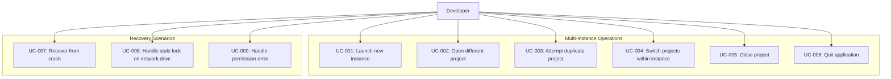
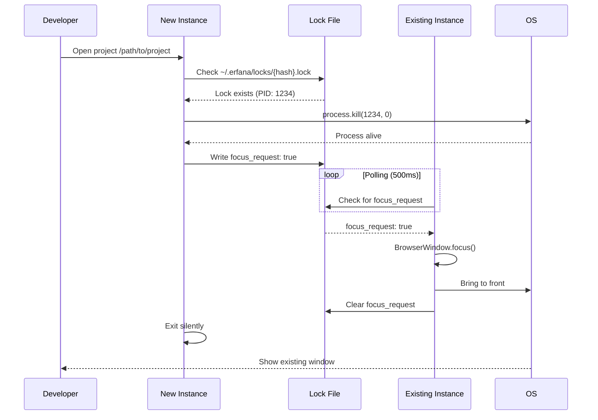
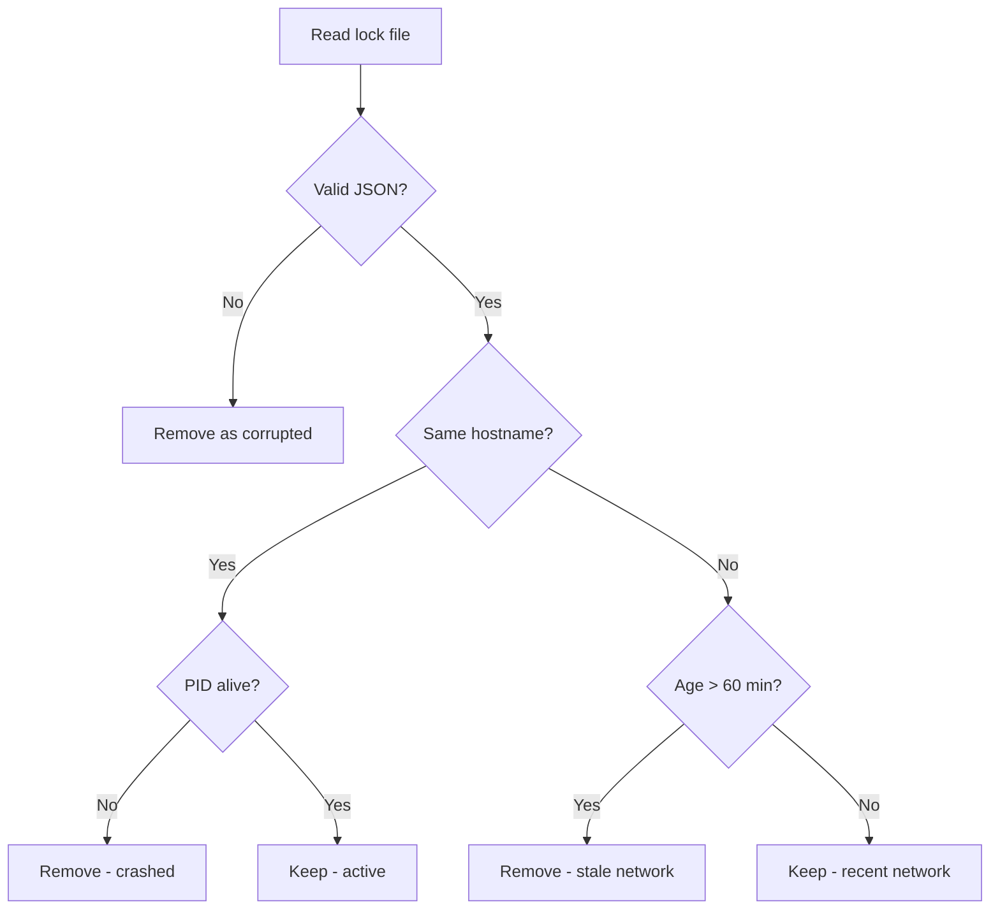

# BRS-010: Use cases

## Actors

| Actor | Description |
|-------|-------------|
| Developer | Primary user working on multiple projects |
| System | Erfana application (main process) |
| Electron | Electron runtime managing processes |
| OS | Operating system (macOS, Windows, Linux) |

## Use case diagram



## Use cases

### UC-001: Launch new instance

| Field | Value |
|-------|-------|
| ID | UC-001 |
| Title | Launch new instance |
| Actor | Developer |
| Priority | P0 |
| Preconditions | Erfana is installed on the system |
| Postconditions | New Erfana window is visible and ready |

**Main flow:**

1. Developer launches Erfana (dock icon, spotlight, start menu)
2. System creates new Electron process
3. System initializes main window
4. System displays welcome screen or last project (per settings)
5. Developer sees new Erfana window

**Alternative flows:**

- **A1**: If settings specify "restore last project", system attempts to open it (see UC-002)

---

### UC-002: Open different project

| Field | Value |
|-------|-------|
| ID | UC-002 |
| Title | Open different project in instance |
| Actor | Developer |
| Priority | P0 |
| Preconditions | Erfana instance is running |
| Postconditions | Project is open and lock is held |

**Main flow:**

1. Developer selects File > Open Folder or uses Recent Projects
2. System resolves path to canonical form (`fs.realpath`)
3. System computes SHA-256 hash of canonical path
4. System checks for existing lock at `~/.erfana/locks/{hash}.lock`
5. No lock exists - System creates lock file with current instance info
6. System opens project tree and initializes watchers
7. Developer sees project files

**Alternative flows:**

- **A1**: Lock exists but stale (see UC-007) - System removes stale lock, continues from step 5
- **A2**: Lock exists and active (see UC-003) - System focuses existing window
- **A3**: Lock directory doesn't exist - System creates it with 0700 permissions
- **A4**: Lock creation fails (permission error) - See UC-009

**Lock file content:**

```json
{
  "instanceId": "abc123",
  "pid": 12345,
  "timestamp": "2025-12-25T17:12:00.000Z",
  "hostname": "developer-mac.local",
  "path": "/Users/dev/projects/frontend"
}
```

---

### UC-003: Attempt duplicate project

| Field | Value |
|-------|-------|
| ID | UC-003 |
| Title | Attempt to open project already open elsewhere |
| Actor | Developer |
| Priority | P0 |
| Preconditions | Project is already open in another Erfana instance |
| Postconditions | Existing window is focused, no new window remains |

**Main flow:**

1. Developer attempts to open project (same as UC-002 steps 1-4)
2. System finds active lock file with different instanceId
3. System verifies lock owner process is alive (`process.kill(pid, 0)`)
4. Process is alive - System writes focus request to lock file
5. Lock owner instance detects focus request (via polling)
6. Lock owner instance calls `BrowserWindow.focus()` or platform API
7. OS brings lock owner window to foreground
8. New instance exits silently (no error dialog)
9. Developer sees existing window with their project

**Alternative flows:**

- **A1**: Process check fails (crashed) - Lock is stale, see UC-007
- **A2**: Focus request times out (5 seconds) - Show minimal notification "Could not focus window", allow open
- **A3**: Path is symlink to already-open project - Canonical path match detected, focus existing

**Sequence diagram:**



---

### UC-004: Switch projects within instance

| Field | Value |
|-------|-------|
| ID | UC-004 |
| Title | Switch to different project in same instance |
| Actor | Developer |
| Priority | P0 |
| Preconditions | Instance has a project open |
| Postconditions | Old lock released, new lock acquired |

**Main flow:**

1. Developer selects different project (File > Open Folder or Recent)
2. System releases lock for current project
3. System acquires lock for new project (UC-002 flow)
4. System closes current project watchers
5. System opens new project
6. Developer sees new project

**Alternative flows:**

- **A1**: Unsaved changes in current project - System prompts to save/discard first
- **A2**: New project already open elsewhere - Focus existing (UC-003)
- **A3**: Lock release fails - Log warning, continue with switch

---

### UC-005: Close project

| Field | Value |
|-------|-------|
| ID | UC-005 |
| Title | Close current project |
| Actor | Developer |
| Priority | P0 |
| Preconditions | Instance has a project open |
| Postconditions | Lock is released, window shows welcome screen |

**Main flow:**

1. Developer selects File > Close Project
2. System handles unsaved changes prompt (if any)
3. System releases lock synchronously
4. System closes file watchers
5. System clears project state
6. System shows welcome screen
7. Developer sees welcome screen

---

### UC-006: Quit application

| Field | Value |
|-------|-------|
| ID | UC-006 |
| Title | Quit Erfana application |
| Actor | Developer |
| Priority | P0 |
| Preconditions | Instance is running |
| Postconditions | All locks released, process terminated |

**Main flow:**

1. Developer quits (Cmd+Q, window close, dock quit)
2. System receives `before-quit` event
3. System handles unsaved changes prompt (if any)
4. System releases all held locks synchronously
5. System closes all windows
6. Electron process terminates
7. Developer sees app is closed

**Alternative flows:**

- **A1**: User cancels quit (unsaved changes) - Abort quit, continue running
- **A2**: Lock release fails - Log warning, continue with quit
- **A3**: Force quit (kill -9) - Lock remains, cleaned on next startup

---

### UC-007: Recover from crash

| Field | Value |
|-------|-------|
| ID | UC-007 |
| Title | Recover from previous instance crash |
| Actor | System |
| Priority | P1 |
| Preconditions | Previous instance crashed, lock file remains |
| Postconditions | Stale lock is cleaned up |

**Main flow:**

1. System starts new instance
2. During initialization, system scans `~/.erfana/locks/` directory
3. For each lock file:
   a. Parse JSON content
   b. Check if hostname matches current machine
   c. If match: Check if PID is alive (`process.kill(pid, 0)`)
   d. If process dead: Remove lock file
4. System logs cleaned locks for debugging
5. System continues with normal startup

**Alternative flows:**

- **A1**: Hostname mismatch (network drive) - Check timestamp, if >60 min old, remove
- **A2**: Invalid JSON in lock file - Remove as corrupted
- **A3**: Permission error reading lock - Skip with warning

**Stale detection logic:**



---

### UC-008: Handle stale lock on network drive

| Field | Value |
|-------|-------|
| ID | UC-008 |
| Title | Handle lock from different machine on network drive |
| Actor | Developer |
| Priority | P2 |
| Preconditions | Project on network drive, lock from different hostname |
| Postconditions | Appropriate action taken based on lock age |

**Main flow:**

1. Developer opens project on network drive (NFS/SMB)
2. System finds lock file with different hostname
3. System checks lock timestamp
4. Timestamp is >60 minutes old - System removes stale lock
5. System acquires new lock
6. Developer can work on project

**Alternative flows:**

- **A1**: Timestamp <60 minutes - Show warning "Project may be open on {hostname}"
- **A2**: User confirms override - Remove lock, acquire new one
- **A3**: User cancels - Don't open project

---

### UC-009: Handle permission error

| Field | Value |
|-------|-------|
| ID | UC-009 |
| Title | Handle lock-related permission error |
| Actor | Developer |
| Priority | P2 |
| Preconditions | Filesystem permissions prevent lock operations |
| Postconditions | Project opened with degraded protection |

**Main flow:**

1. Developer opens project
2. System attempts to create/check lock
3. Permission error occurs (EACCES)
4. System logs warning with details
5. System shows unobtrusive notification: "Could not create project lock"
6. System opens project anyway (degraded mode)
7. Developer can work, but no duplicate protection

**Note**: This scenario is rare (home directory permissions issue) but should not block workflow.

## Use case summary

| UC | Name | Priority | Requirements covered |
|----|------|----------|---------------------|
| UC-001 | Launch new instance | P0 | FR-001, FR-003 |
| UC-002 | Open different project | P0 | FR-002, FR-009, FR-010, FR-011, FR-012 |
| UC-003 | Attempt duplicate project | P0 | FR-016, FR-017, FR-018, FR-019 |
| UC-004 | Switch projects | P0 | FR-024, FR-027 |
| UC-005 | Close project | P0 | FR-023 |
| UC-006 | Quit application | P0 | FR-025, FR-026 |
| UC-007 | Recover from crash | P1 | FR-029, FR-030, FR-034, FR-035 |
| UC-008 | Network drive stale lock | P2 | FR-031, FR-032, FR-033 |
| UC-009 | Permission error | P2 | FR-042, FR-043 |
