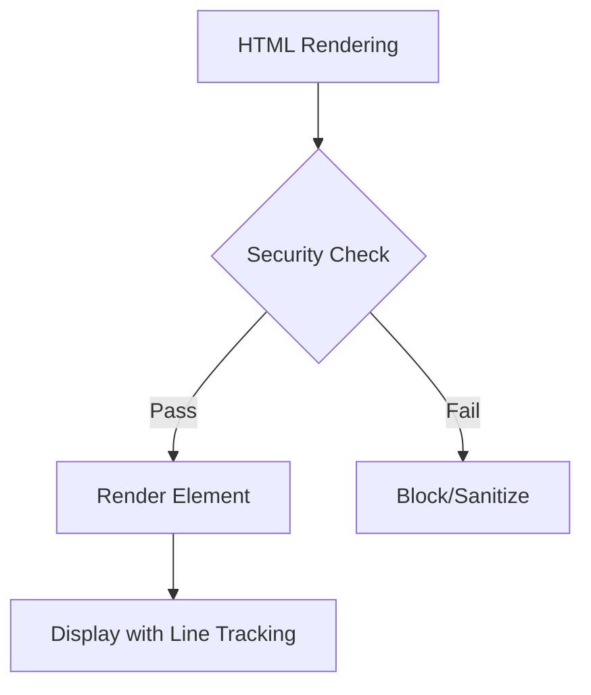

# HTML Rendering Test Document

This document comprehensively tests all edge cases of HTML rendering in ERFANA's Markdown Preview.

## 1. Basic HTML Block Elements

### Div Container
<div class="note-block">
This is a div container with a class attribute. The sanitizer should preserve the class but prefix it with security measures.
</div>

### Section Element
<section id="test-section">
<h3>Section Header</h3>
<p>This is content inside a section element. Section is an HTML5 semantic element for thematic grouping.</p>
</section>

### Article Element
<article>
<h3>Article Title</h3>
<p>This is an article element, typically used for self-contained content like blog posts or news items.</p>
</article>

### Aside Element (Sidebar)
<aside>
<strong>Note:</strong> This is an aside element, often used for sidebars or supplementary information.
</aside>

## 2. Mixed Markdown and HTML

### Markdown inside HTML Block
<div class="markdown-mix">
This paragraph is inside HTML with **markdown bold** and *markdown italic* syntax.

- Bullet item 1
- Bullet item 2
- Bullet item 3

Regular markdown paragraph following the list.
</div>

### HTML alongside Markdown
This is normal markdown paragraph.

<span style="color: var(--accent-primary);">This is a styled span element</span> mixed with markdown text.

More markdown here after the HTML element.

## 3. Nested HTML Elements

<section class="nested-example">
<div class="inner-container">
<article>
<h3>Deeply Nested Content</h3>
<p>This demonstrates nested HTML elements: section > div > article > p</p>
<aside>
Nested aside element inside article inside div inside section.
</aside>
</article>
</div>
</section>

## 4. HTML5 Semantic Elements

### Details and Summary (Collapsible Content)

<details>
<summary>Click to expand detailed information</summary>

This content is hidden by default and reveals when you click the summary.

- Hidden bullet point 1
- Hidden bullet point 2
- Hidden bullet point 3

You can use **markdown** inside details too!
</details>

### Figure and Caption

<figure>

<figcaption>This is a figure caption describing the image above.</figcaption>
</figure>

### Mark Element

This text contains <mark>highlighted text</mark> using the mark element.

## 5. Line Tracking Test Cases

### Case 1: Single-line HTML
<div>Single line div element</div>

### Case 2: Multi-line HTML Block
<div class="multi-line">
Line 1 of multi-line div
Line 2 of multi-line div
Line 3 of multi-line div
</div>

### Case 3: HTML with Mixed Content
<section>
<h3>Mixed Content Section</h3>
This has both text and markdown:
- **Bold item**
- *Italic item*
- `Code item`
</section>

## 6. Data Attributes and Custom Attributes

<div data-test="example" data-line-number="test-data">
This div has custom data attributes that should be preserved by the sanitizer (with user-content- prefixing for security).
</div>

## 7. HTML5 Input Elements

<details>
<summary>Interactive Forms (Limited)</summary>

<label>
Checkbox (read-only in preview):
<input type="checkbox" disabled />
</label>

<label>
Radio Button (read-only in preview):
<input type="radio" disabled />
</label>

Note: Form elements are read-only in the preview for security reasons.
</details>

## 8. Security Test Cases (Should be Blocked)

### ⚠️ These should NOT render or execute:

#### Script Tag (BLOCKED)
```html
<script>alert('XSS attempt')</script>
```

#### Event Handler (BLOCKED)
<div onclick="alert('onclick blocked')">
This div has an onclick handler that should be blocked
</div>

#### JavaScript URL (BLOCKED)
<a href="javascript:alert('JS URL blocked')">This link should be blocked</a>

#### Style Tag (BLOCKED)
```html
<style>body { background: red; }</style>
```

#### Iframe (BLOCKED)
```html
<iframe src="https://example.com"></iframe>
```

#### SVG with Event Handler (BLOCKED)
```html
<svg onload="alert('SVG blocked')"></svg>
```

## 9. CSS and Styling Limitations

### Inline Styles (Default: Limited)
<div style="color: red;">
This text uses inline style attribute.
Note: Styles are sanitized and some properties may be blocked.
</div>

### Classes (Preserved)
<div class="custom-class another-class">
Classes are preserved but are prefixed with 'user-content-' for security.
</div>

### ID Attributes (Prefixed for Security)
<div id="my-section">
ID attributes are prefixed with 'user-content-' to prevent DOM clobbering attacks.
</div>

## 10. Table Elements in HTML

<table>
<thead>
<tr>
<th>Header 1</th>
<th>Header 2</th>
<th>Header 3</th>
</tr>
</thead>
<tbody>
<tr>
<td>Cell 1-1</td>
<td>Cell 1-2</td>
<td>Cell 1-3</td>
</tr>
<tr>
<td>Cell 2-1</td>
<td>Cell 2-2</td>
<td>Cell 2-3</td>
</tr>
</tbody>
</table>

## 11. Lists in HTML

<ul>
<li>Unordered list item 1</li>
<li>Unordered list item 2
<ul>
<li>Nested unordered item</li>
</ul>
</li>
<li>Unordered list item 3</li>
</ul>

<ol>
<li>Ordered list item 1</li>
<li>Ordered list item 2</li>
<li>Ordered list item 3</li>
</ol>

## 12. Code Blocks with HTML

```html
<div class="example">
  <p>HTML inside a code block should be displayed as text, not rendered</p>
</div>
```

```javascript
// JavaScript code block (HTML should not execute here)
const div = document.createElement('div');
div.innerHTML = '<script>alert("This is text in JS code")</script>';
```

## 13. Selection and Context Menu Testing

Select this text in a **div element** and try the context menu:

<div class="test-selection">
Try selecting text here (both in the div and surrounding text) and use the right-click context menu to test the Modify and Elaborate features.
</div>

Select this text **outside the div** to verify line tracking works across HTML and markdown boundaries.

## 14. Mermaid Diagram (Should Still Work)



## 15. Complex Real-World Example

<section class="documentation">
<div class="note-box">
<h4>Important Note</h4>
<p>
This is a complex real-world documentation pattern combining HTML structure with markdown content.
</p>
</div>

<aside>
<strong>Pro Tip:</strong> You can use both HTML and markdown together for flexible content creation.
</aside>

### Sub-section with HTML and Markdown

<article>
This article element contains:

- **Markdown lists**
- *Formatted text*
- `code examples`
- Regular paragraphs

<details>
<summary>Additional Details</summary>

This demonstrates nesting all these elements together in a realistic documentation scenario.

```javascript
// Code in details
const example = "Realistic use case"
```
</details>
</article>

</section>

## 16. Edge Cases Summary

| Feature | Status | Notes |
|---------|--------|-------|
| Block elements | ✅ Works | div, section, article, aside, main |
| Inline elements | ✅ Works | span, em, strong, mark |
| Semantic elements | ✅ Works | details, summary, figure, figcaption |
| Line tracking | ✅ Works | All HTML elements have line data |
| Scroll sync | ✅ Works | Should sync with editor |
| Context menu | ✅ Works | Selection spanning HTML + markdown |
| Script tags | ✅ Blocked | Security protection |
| Event handlers | ✅ Blocked | Security protection |
| Mermaid diagrams | ✅ Works | Not affected by HTML changes |
| Data attributes | ✅ Works | Preserved with sanitization |

## 17. Performance Stress Test

This section has many HTML elements to test performance:

<section>
<div>
<article>Element 1</article>
<aside>Element 2</aside>
<div>Element 3</div>
<section>Element 4</section>
</div>
</section>

<section>
<div>
<article>Element 5</article>
<aside>Element 6</aside>
<div>Element 7</div>
<section>Element 8</section>
</div>
</section>

<section>
<div>
<article>Element 9</article>
<aside>Element 10</aside>
<div>Element 11</div>
<section>Element 12</section>
</div>
</section>

---

## Summary

This test document covers:
- ✅ Basic HTML block elements
- ✅ Mixed markdown and HTML
- ✅ Nested HTML structures
- ✅ HTML5 semantic elements
- ✅ Line tracking and scroll synchronization
- ✅ Security (blocked XSS attempts)
- ✅ Styling limitations
- ✅ Real-world documentation patterns
- ✅ Edge cases and performance

**To test this document:**
1. Open it in ERFANA
2. Verify HTML elements render correctly
3. Test selection and context menu with HTML elements
4. Scroll and verify sync works
5. Try security attempts - they should be blocked
6. Verify Mermaid diagrams still work
7. Check line tracking data in DevTools
