# Comprehensive Mermaid Diagram Test File

This file tests **22 diagram types** supported by the base Mermaid.js package (v11.12.0).

---

## 0. User Journey (Erfana Workflow)

Maps the daily workflow of using Erfana for project management.

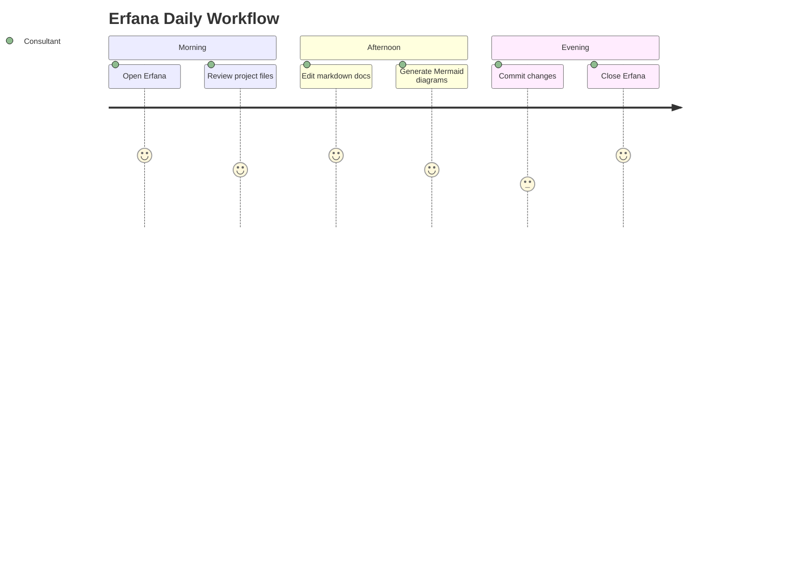
```mermaid
journey
    title Erfana Daily Workflow
    section Morning
        Open Erfana: 5: Consultant
        Review project files: 4: Consultant
    section Afternoon
        Edit markdown docs: 5: Consultant
        Generate Mermaid diagrams: 4: Consultant
    section Evening
        Commit changes: 3: Consultant
        Close Erfana: 5: Consultant
```

---

## 1. Flowchart

Visualizes process flows and decision trees with standardized shapes and directional arrows. Flowcharts excel at representing sequential logic, conditional branching, loops, and parallel processes. They're ideal for documenting algorithms, business workflows, troubleshooting procedures, and system architectures. The diagram supports multiple node shapes (rectangles for processes, diamonds for decisions, circles for start/end points), various arrow styles for different flow types, and subgraphs for organizing complex processes into logical groupings. Flowcharts are the most versatile Mermaid diagram type, suitable for both technical and non-technical audiences.

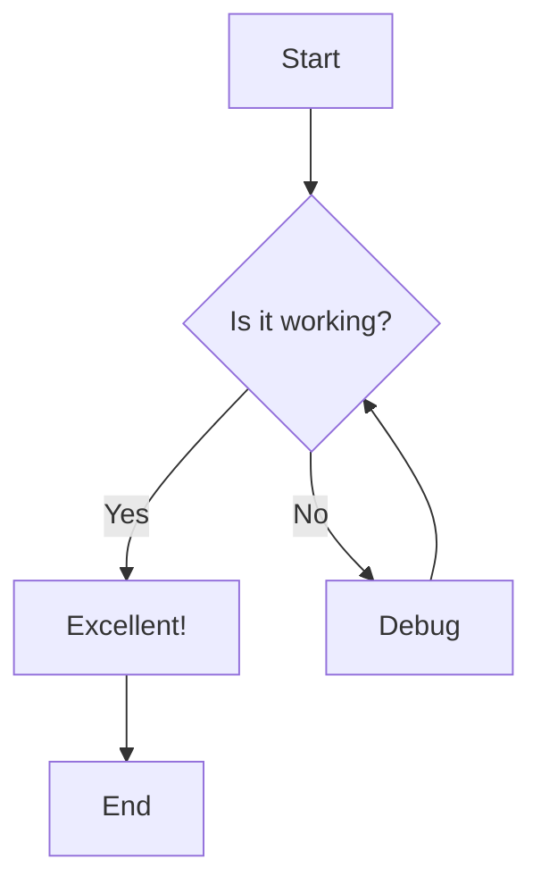
```mermaid
flowchart TD
    A[Start] --> B{Is it working?}
    B -->|Yes| C[Excellent!]
    B -->|No| D[Debug]
    D --> B
    C --> E[End]
```

---

## 2. Sequence Diagram

Depicts interactions between objects/actors over time.

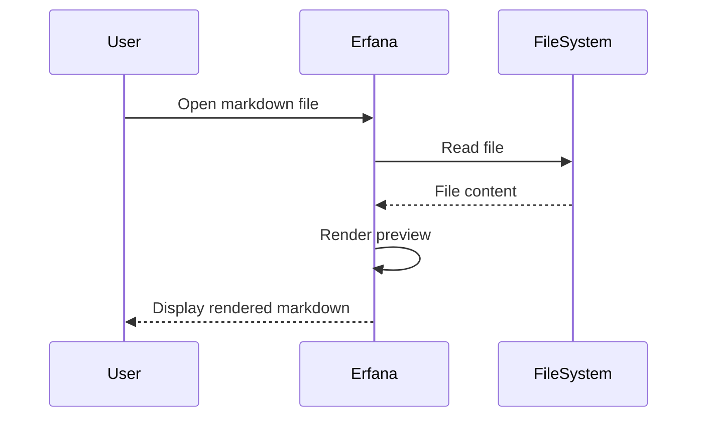
```mermaid
sequenceDiagram
    participant User
    participant Erfana
    participant FileSystem
    User->>Erfana: Open markdown file
    Erfana->>FileSystem: Read file
    FileSystem-->>Erfana: File content
    Erfana->>Erfana: Render preview
    Erfana-->>User: Display rendered markdown
```

---

## 3. Class Diagram

Represents software class structures and relationships.

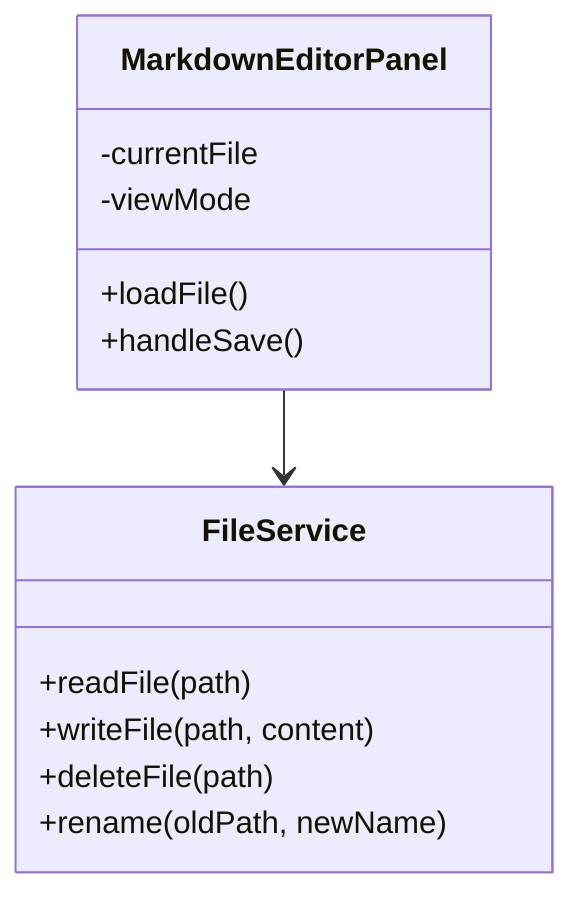
```mermaid
classDiagram
    class FileService {
        +readFile(path)
        +writeFile(path, content)
        +deleteFile(path)
        +rename(oldPath, newName)
    }
    class MarkdownEditorPanel {
        -currentFile
        -viewMode
        +loadFile()
        +handleSave()
    }
    MarkdownEditorPanel --> FileService
```

---

## 4. State Diagram

Shows system states and state transitions.

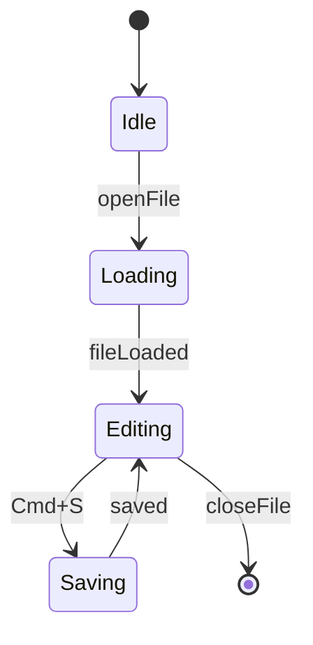
```mermaid
stateDiagram-v2
    [*] --> Idle
    Idle --> Loading: openFile
    Loading --> Editing: fileLoaded
    Editing --> Saving: Cmd+S
    Saving --> Editing: saved
    Editing --> [*]: closeFile
```

---

## 5. Entity Relationship Diagram

Illustrates database/data model relationships.

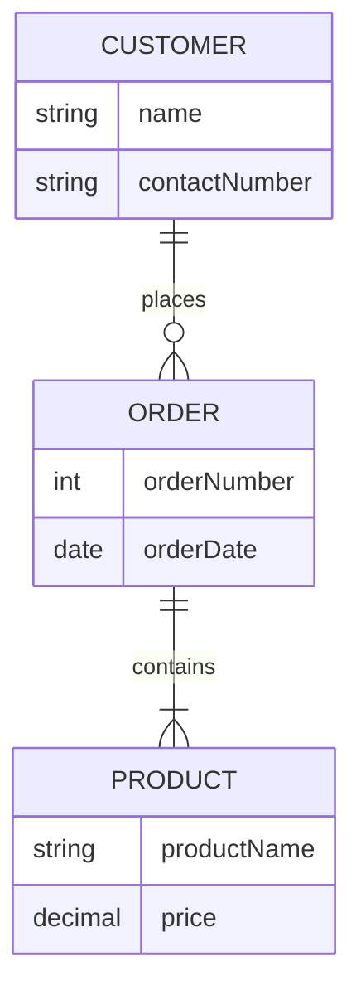
```mermaid
erDiagram
    CUSTOMER ||--o{ ORDER : places
    ORDER ||--|{ PRODUCT : contains
    CUSTOMER {
        string name
        string contactNumber
    }
    ORDER {
        int orderNumber
        date orderDate
    }
    PRODUCT {
        string productName
        decimal price
    }
```

---

## 6. User Journey

Maps user experiences and interactions.

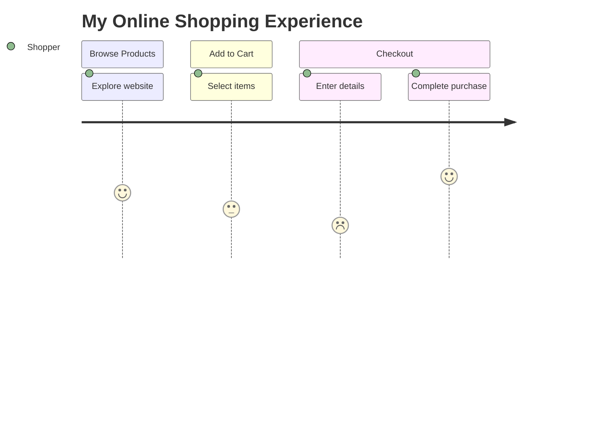
```mermaid
journey
    title My Online Shopping Experience
    section Browse Products
        Explore website: 4: Shopper
    section Add to Cart
        Select items: 3: Shopper
    section Checkout
        Enter details: 2: Shopper
        Complete purchase: 5: Shopper
```

---

## 7. Gantt Chart

Tracks project timelines and task schedules.

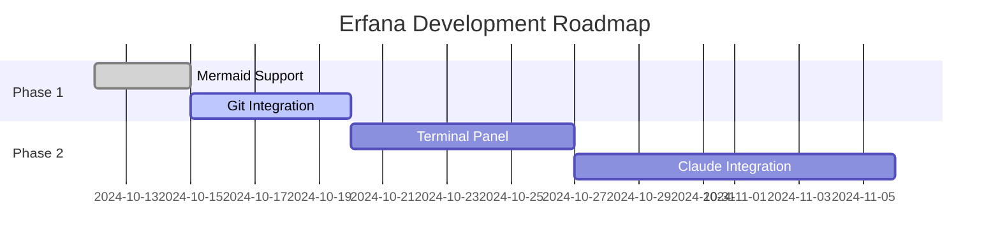
```mermaid
gantt
    title Erfana Development Roadmap
    dateFormat  YYYY-MM-DD
    section Phase 1
    Mermaid Support    :done, 2024-10-12, 3d
    Git Integration    :active, 2024-10-15, 5d
    section Phase 2
    Terminal Panel     :2024-10-20, 7d
    Claude Integration :2024-10-27, 10d
```

---

## 8. Pie Chart

Displays proportional data in circular segments.

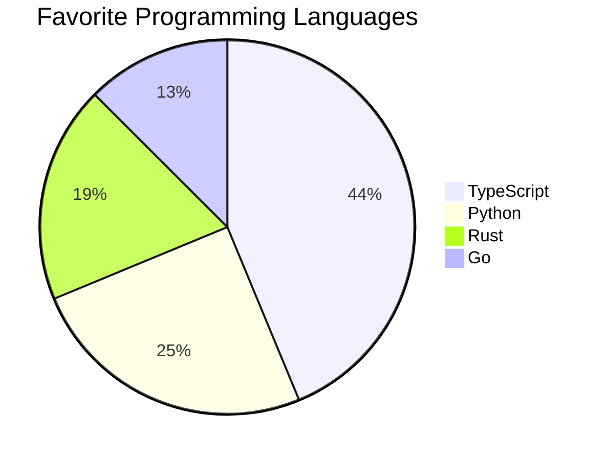
```mermaid
pie
    title Favorite Programming Languages
    "TypeScript" : 350
    "Python" : 200
    "Rust" : 150
    "Go" : 100
```

---

## 9. Quadrant Chart

Categorizes items across four quadrants.

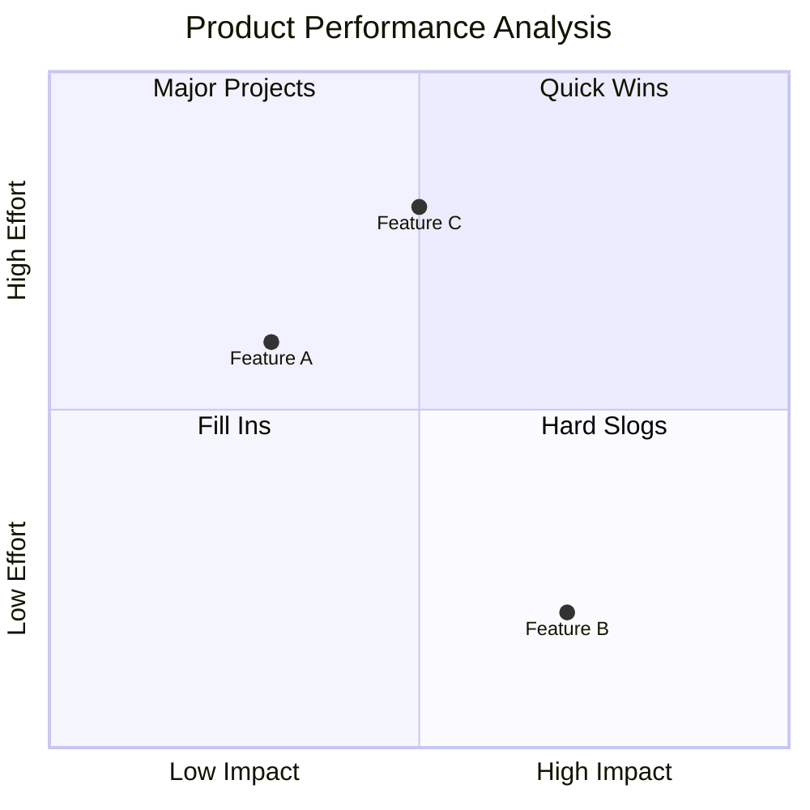
```mermaid
quadrantChart
    title Product Performance Analysis
    x-axis Low Impact --> High Impact
    y-axis Low Effort --> High Effort
    quadrant-1 Quick Wins
    quadrant-2 Major Projects
    quadrant-3 Fill Ins
    quadrant-4 Hard Slogs
    Feature A: [0.3, 0.6]
    Feature B: [0.7, 0.2]
    Feature C: [0.5, 0.8]
```

---

## 10. Requirement Diagram

Visualizes system requirements and dependencies.

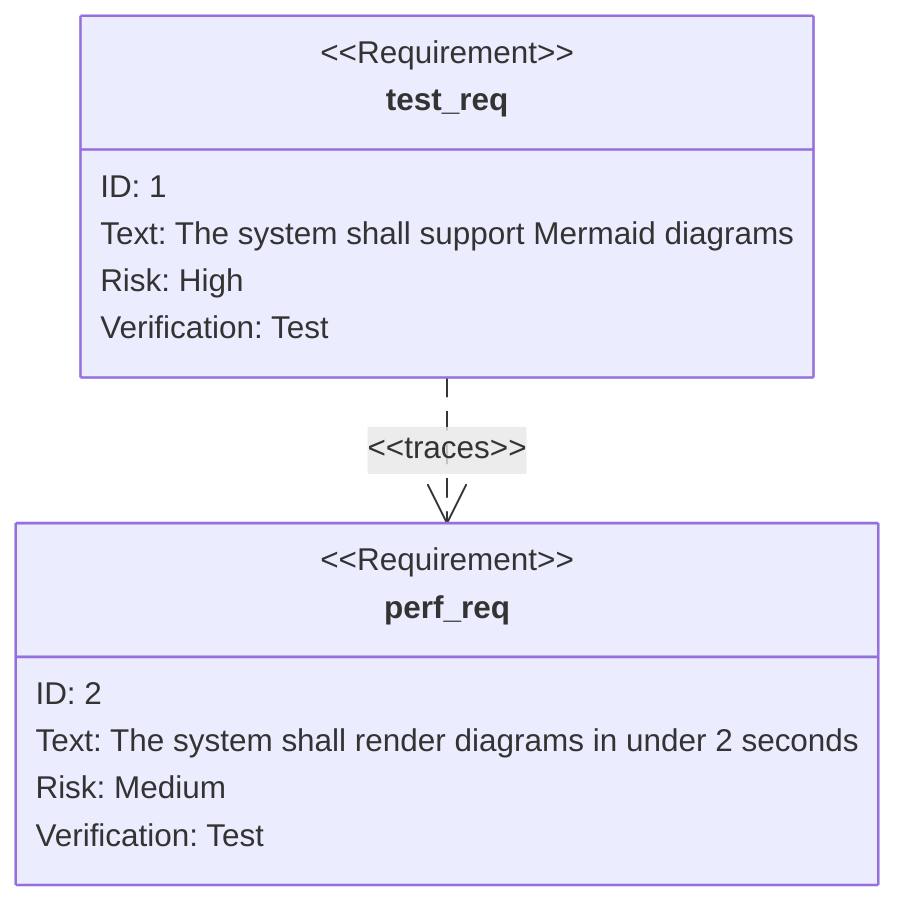
```mermaid
requirementDiagram
    requirement test_req {
        id: 1
        text: "The system shall support Mermaid diagrams"
        risk: high
        verifymethod: test
    }
    requirement perf_req {
        id: 2
        text: "The system shall render diagrams in under 2 seconds"
        risk: medium
        verifymethod: test
    }
    test_req - traces -> perf_req
```

---

## 11. Git Graph

Shows Git repository branch and commit history.

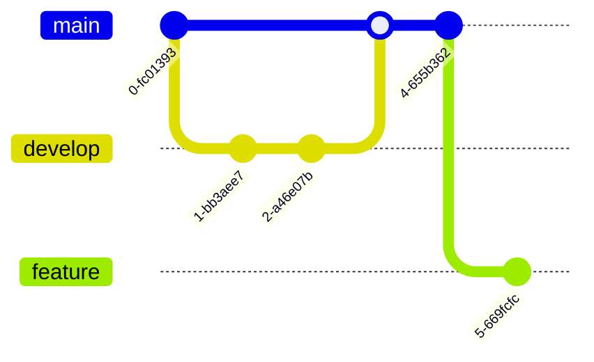
```mermaid
gitGraph
    commit
    branch develop
    checkout develop
    commit
    commit
    checkout main
    merge develop
    commit
    branch feature
    checkout feature
    commit
```

---

## 12. C4 Context Diagram

Represents software architecture at different abstraction levels.

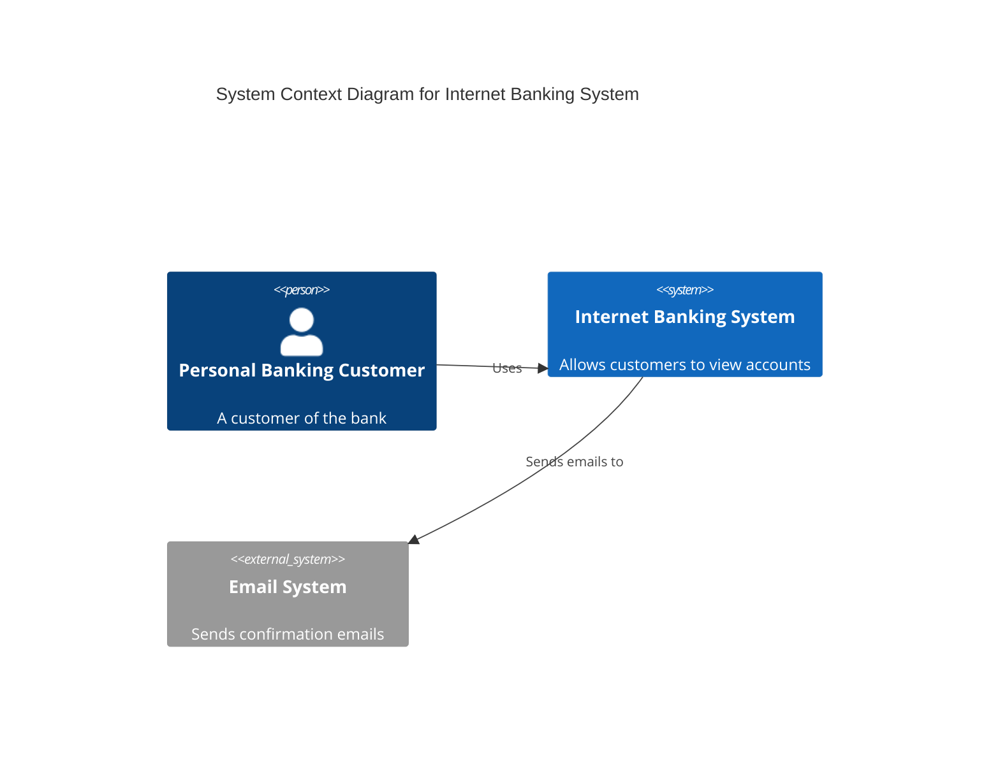
```mermaid
C4Context
    title System Context Diagram for Internet Banking System

    Person(customer, "Personal Banking Customer", "A customer of the bank")
    System(banking_system, "Internet Banking System", "Allows customers to view accounts")
    System_Ext(email_system, "Email System", "Sends confirmation emails")

    Rel(customer, banking_system, "Uses")
    Rel(banking_system, email_system, "Sends emails to")
```

---

## 13. Mindmap

Displays hierarchical information and brainstorming concepts.

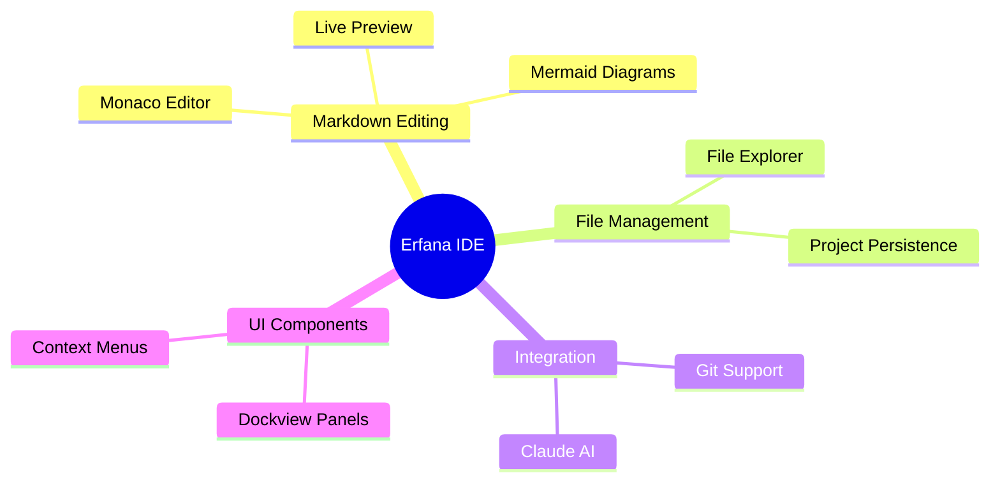
```mermaid
mindmap
    root((Erfana IDE))
        Markdown Editing
            Monaco Editor
            Live Preview
            Mermaid Diagrams
        File Management
            File Explorer
            Project Persistence
        Integration
            Git Support
            Claude AI
        UI Components
            Dockview Panels
            Context Menus
```

---

## 14. Timeline

Chronologically presents events or milestones.

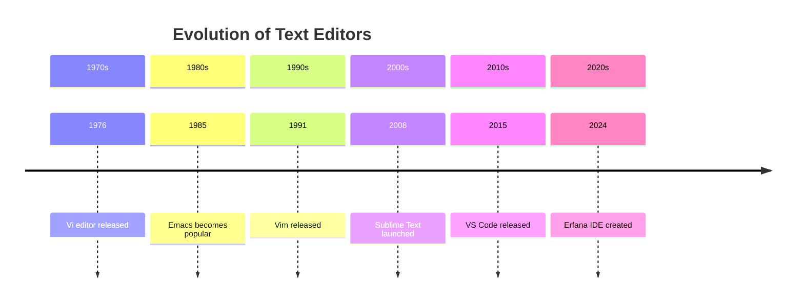
```mermaid
timeline
    title Evolution of Text Editors
    section 1970s
        1976 : Vi editor released
    section 1980s
        1985 : Emacs becomes popular
    section 1990s
        1991 : Vim released
    section 2000s
        2008 : Sublime Text launched
    section 2010s
        2015 : VS Code released
    section 2020s
        2024 : Erfana IDE created
```

---

## 15. Sankey Diagram

Visualizes flow and energy transfers.

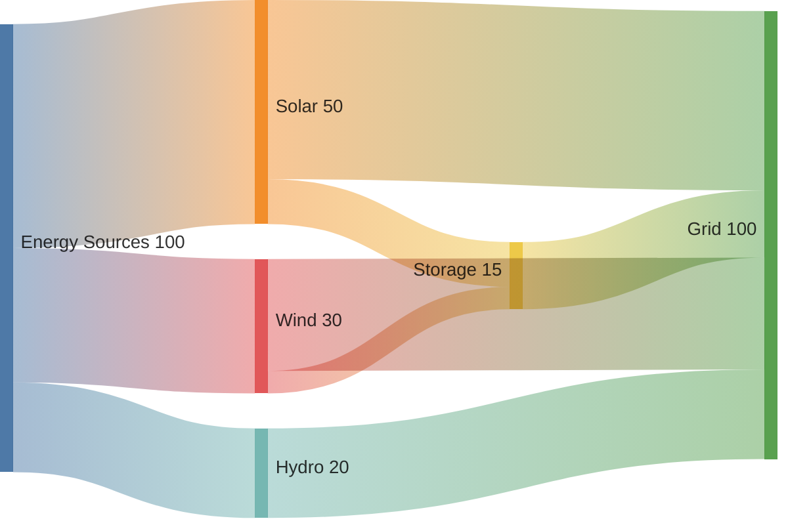
```mermaid
sankey-beta
    Energy Sources,Solar,50
    Energy Sources,Wind,30
    Energy Sources,Hydro,20
    Solar,Grid,40
    Solar,Storage,10
    Wind,Grid,25
    Wind,Storage,5
    Hydro,Grid,20
    Storage,Grid,15
```

---

## 16. XY Chart

Plots data points on X and Y axes.

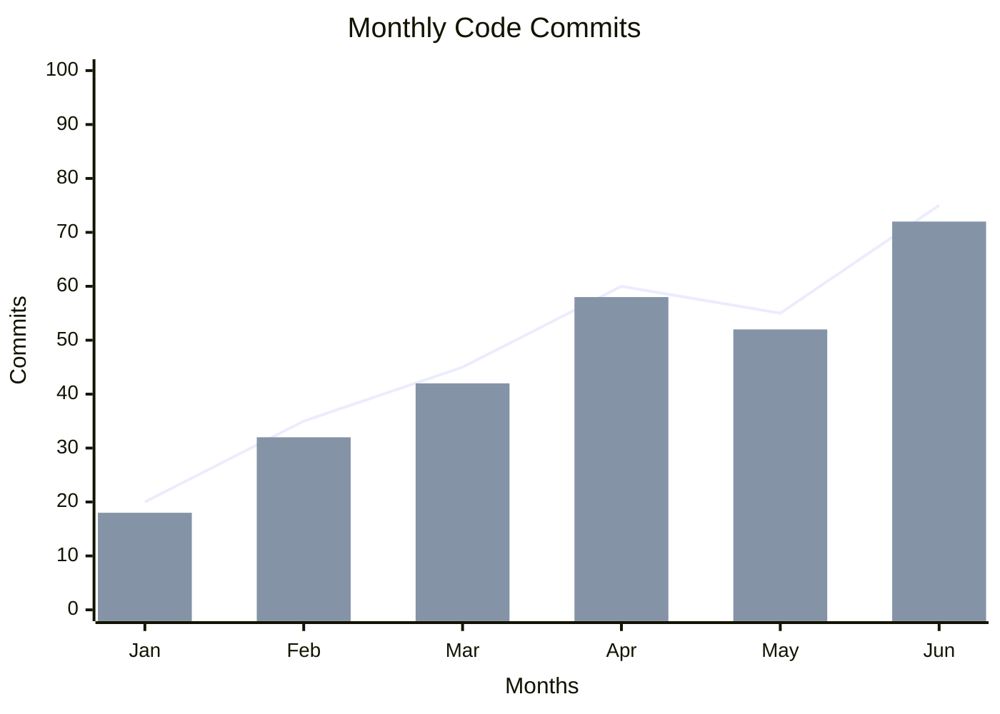
```mermaid
xychart-beta
    title "Monthly Code Commits"
    x-axis "Months" ["Jan", "Feb", "Mar", "Apr", "May", "Jun"]
    y-axis "Commits" 0 --> 100
    line [20, 35, 45, 60, 55, 75]
    bar [18, 32, 42, 58, 52, 72]
```

---

## 17. Block Diagram

Shows system components and their connections.

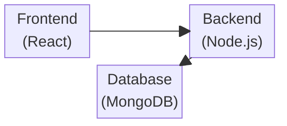
```mermaid
block-beta
    columns 3
    Frontend["Frontend\n(React)"]
    space
    Backend["Backend\n(Node.js)"]
    space
    Database["Database\n(MongoDB)"]
    space
    Frontend --> Backend
    Backend --> Database
```

---

## 18. Packet Diagram

Illustrates network packet structures.

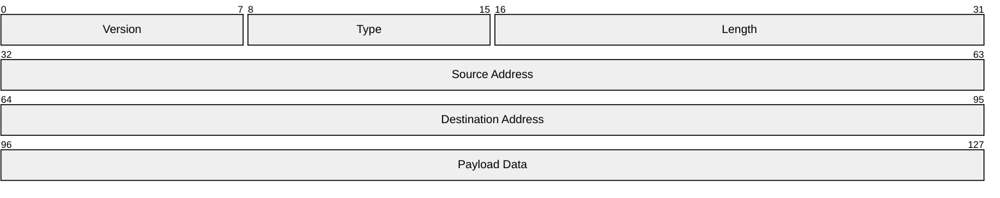
```mermaid
packet-beta
    0-7: "Version"
    8-15: "Type"
    16-31: "Length"
    32-63: "Source Address"
    64-95: "Destination Address"
    96-127: "Payload Data"
```

---

## 19. Kanban Board

Represents workflow management and task progression.

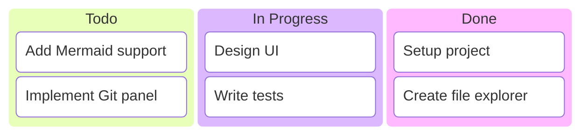
```mermaid
kanban
    Todo
        task1[Add Mermaid support]
        task2[Implement Git panel]

    In Progress
        task3[Design UI]
        task4[Write tests]

    Done
        task5[Setup project]
        task6[Create file explorer]
```

---

## 20. Architecture Diagram

Depicts system architectural designs.

```mermaid
architecture-beta
    group cloud(cloud)[Cloud Infrastructure]
        service web(server)[Web Server] in cloud
        service db(database)[Database] in cloud
        service cache(disk)[Cache] in cloud

    service user(internet)[Users]

    user:R --> L:web
    web:R --> L:db
    web:B --> T:cache
```

---

## 21. Radar Chart (Spider Chart)

Displays multi-dimensional performance or comparison data.

```mermaid
radar-beta
    title Developer Skills Assessment
    axis TypeScript, React, NodeJS, Design, Testing, DevOps
    curve Developer1{85, 90, 75, 60, 70, 55}
    curve Developer2{70, 80, 90, 50, 85, 75}
    curve Developer3{95, 85, 80, 70, 65, 60}
```

---

## 22. Treemap

Shows hierarchical data as nested rectangles.

```mermaid
treemap-beta
    "Project Files"
        "Source Code"
            "Components": 45
            "Services": 30
            "Utils": 15
        "Tests"
            "Unit Tests": 25
            "Integration Tests": 20
        "Documentation"
            "API Docs": 10
            "User Guides": 8
```

---

## Invalid Syntax Test

This diagram has intentional errors to test error handling:

```mermaid
graph TD
    A --> B
    Missing closing brace {
```

---

## End of Test

✅ **If all 22 diagrams above (except the last error test) render correctly, Mermaid integration is fully operational!**

### Supported Diagram Types Summary

1. ✓ Flowchart - Process flows
2. ✓ Sequence Diagram - Actor interactions
3. ✓ Class Diagram - OOP structures
4. ✓ State Diagram - State machines
5. ✓ ER Diagram - Database models
6. ✓ User Journey - UX flows
7. ✓ Gantt Chart - Project timelines
8. ✓ Pie Chart - Proportional data
9. ✓ Quadrant Chart - 4-quadrant analysis
10. ✓ Requirement Diagram - System requirements
11. ✓ Git Graph - Git history
12. ✓ C4 Diagram - Architecture contexts
13. ✓ Mindmap - Hierarchical concepts
14. ✓ Timeline - Chronological events
15. ✓ Sankey - Flow visualization
16. ✓ XY Chart - Data plotting
17. ✓ Block Diagram - System components
18. ✓ Packet Diagram - Network packets
19. ✓ Kanban - Task boards
20. ✓ Architecture - System design
21. ✓ Radar Chart - Multi-dimensional data
22. ✓ Treemap - Hierarchical rectangles

**Note**: ZenUML is not included as it requires an external plugin (`@mermaid-js/mermaid-zenuml`) not included in the base Mermaid package.

**Mermaid.js Version**: 11.12.0
**Last Updated**: 2024-10-12
