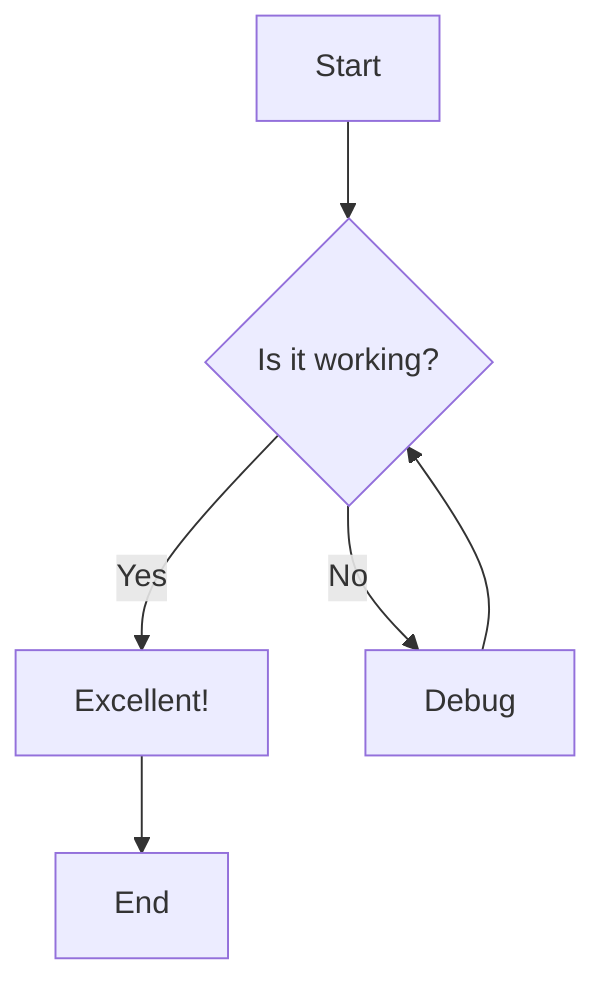
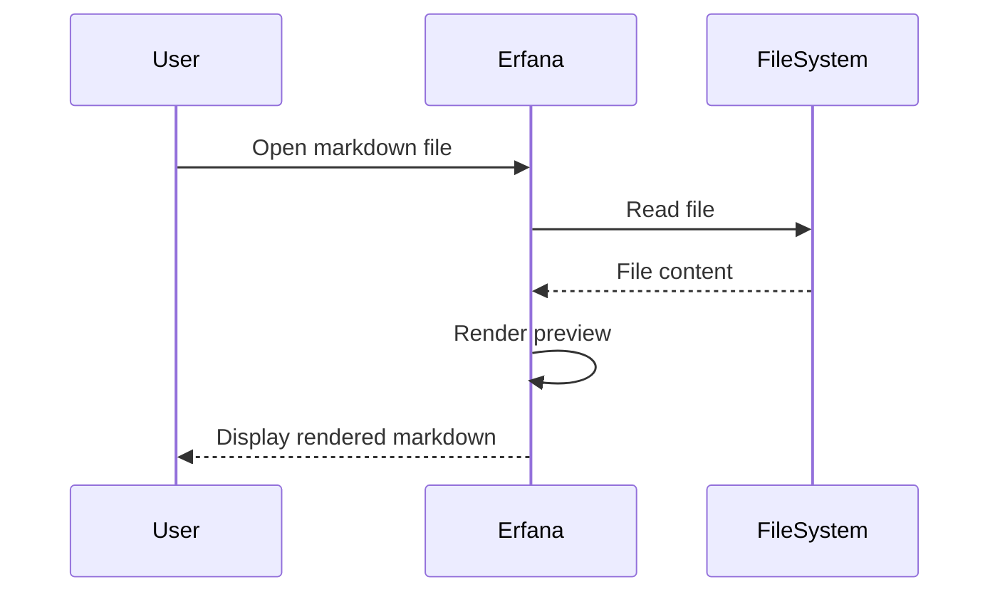
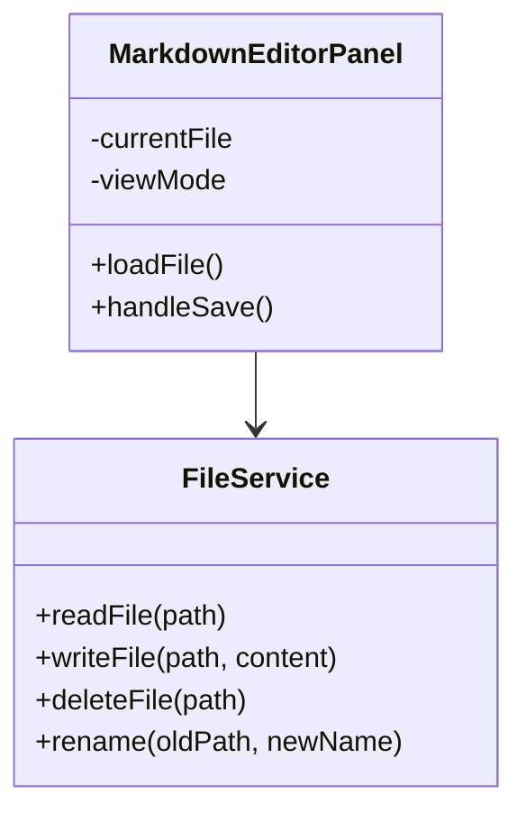
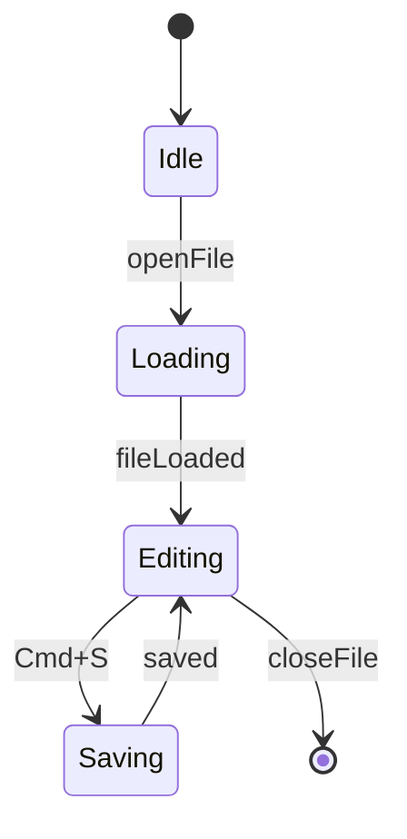
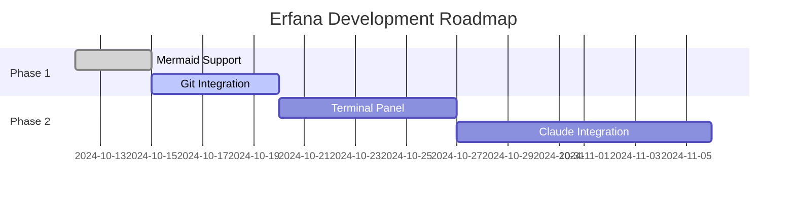

# Mermaid Diagram Test File

This file tests Mermaid diagram rendering in Erfana.

## Flowchart



## Sequence Diagram



## Class Diagram



## State Diagram



## Gantt Chart



## Invalid Syntax Test

This should show an error:

```mermaid
graph TD
    A --> B
    Missing closing brace {
```

## End of Test

If all diagrams except the last one render correctly, Mermaid integration is successful!
