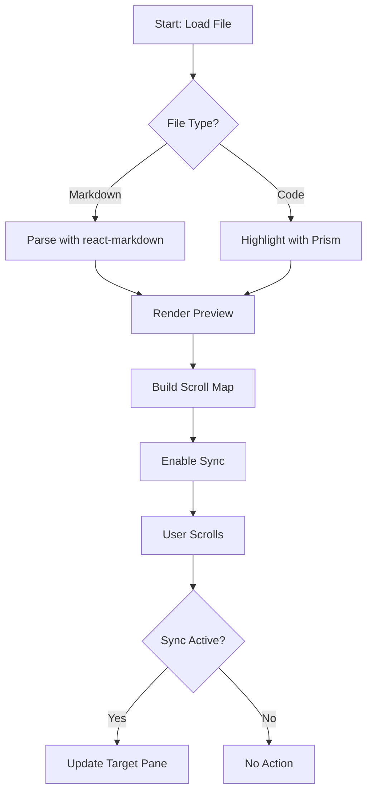
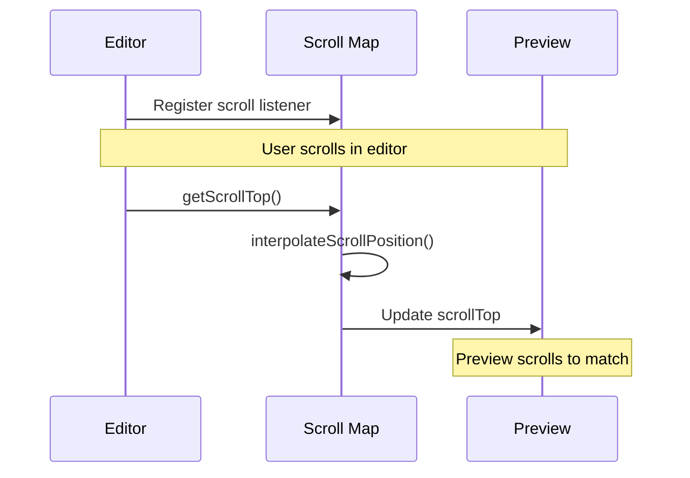
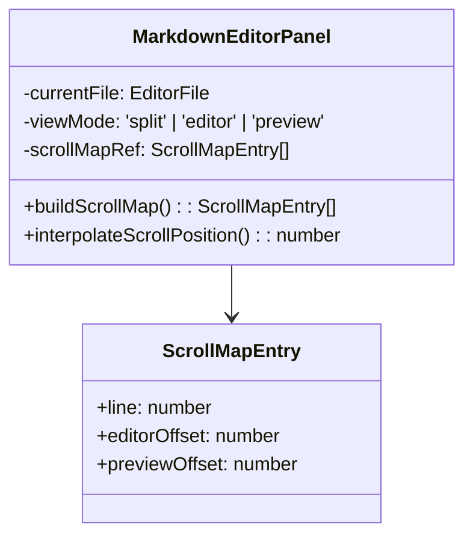

# Scroll Synchronization Test Document

This document tests the improved scroll synchronization with fixes for:
1. Container padding accounting (using getBoundingClientRect)
2. Dynamic content waiting (images, Mermaid diagrams)
3. Accurate offset calculation

## Section 1: Plain Text

This is section 1 with just plain text. Scroll synchronization should work smoothly here with no dynamic content to wait for.

Lorem ipsum dolor sit amet, consectetur adipiscing elit. Sed do eiusmod tempor incididunt ut labore et dolore magna aliqua. Ut enim ad minim veniam, quis nostrud exercitation ullamco laboris nisi ut aliquip ex ea commodo consequat.

Duis aute irure dolor in reprehenderit in voluptate velit esse cillum dolore eu fugiat nulla pariatur. Excepteur sint occaecat cupidatat non proident, sunt in culpa qui officia deserunt mollit anim id est laborum.

## Section 2: Code Block

Here's a code block that should align properly with scroll sync:

```python
def fibonacci(n):
    """Calculate the nth Fibonacci number"""
    if n <= 0:
        return 0
    elif n == 1:
        return 1
    else:
        return fibonacci(n-1) + fibonacci(n-2)

# Test the function
for i in range(10):
    print(f"F({i}) = {fibonacci(i)}")
```

This code block should take up several lines in the preview, and scroll sync should accurately map editor lines to preview positions.

## Section 3: Multiple Lists

- Item 1
- Item 2
  - Nested item 2a
  - Nested item 2b
- Item 3

1. First numbered item
2. Second numbered item
3. Third numbered item

### Nested Lists

- Feature A
  - Sub-feature A1
  - Sub-feature A2
    - Detail A2i
    - Detail A2ii
- Feature B
  - Sub-feature B1

## Section 4: External Image Test

This section tests image loading and scroll sync accuracy:


The image above should load before the scroll map is built. Scroll synchronization should account for the image height properly.

Another placeholder image:


## Section 5: Mermaid Diagram - Flowchart

Here's a flowchart that renders asynchronously:



The diagram above renders asynchronously. With the fix, scroll map waits for it to complete before building.

## Section 6: Multiple Diagrams

### First Diagram - Sequence



### Second Diagram - Class



## Section 7: HTML Elements

Here's some HTML content mixed with Markdown:

<div style="border: 1px solid #ccc; padding: 16px; margin: 16px 0; background-color: #f5f5f5;">
  <strong>Important Note:</strong> This is an HTML div element. HTML elements are now properly tracked with line numbers for scroll synchronization.
</div>

<details>
<summary>Click to expand collapsible content</summary>

This collapsible section tests whether HTML5 details/summary elements work with scroll sync:

- Point 1
- Point 2
- Point 3

And here's some more text inside the collapsible section that should all have proper line tracking.

</details>

## Section 8: Mixed Content

This section combines everything:

- Regular markdown list
- With **bold** and *italic*

<section>
  <h3>HTML Section</h3>
  <p>Some HTML content here</p>
</section>

```javascript
// Code block in mixed content
console.log('Testing scroll sync with mixed content');
```

And back to markdown:

- Another list item
- Final item

## Section 9: Large Content

This section contains more content to test scroll accuracy across long documents:

### Subsection 9.1

Lorem ipsum dolor sit amet, consectetur adipiscing elit. Sed do eiusmod tempor incididunt ut labore et dolore magna aliqua.

### Subsection 9.2

Ut enim ad minim veniam, quis nostrud exercitation ullamco laboris nisi ut aliquip ex ea commodo consequat.

### Subsection 9.3

Duis aute irure dolor in reprehenderit in voluptate velit esse cillum dolore eu fugiat nulla pariatur.

```bash
#!/bin/bash
# Long code block to test sync accuracy

for i in {1..20}; do
    echo "Line $i of code"
    echo "Testing scroll map accuracy"
    echo "With multiple lines"
    echo "To verify sync works"
done

echo "Done"
```

### Subsection 9.4

Excepteur sint occaecat cupidatat non proident, sunt in culpa qui officia deserunt mollit anim id est laborum.

## Section 10: Final Test

End of document. Scroll sync should work smoothly from start to finish, with accurate positioning throughout.

Key improvements tested:
- ✅ Container padding accounting (24px top padding)
- ✅ Dynamic content loading (images and Mermaid diagrams)
- ✅ getBoundingClientRect() for accurate positioning
- ✅ Scroll map rebuilt after dynamic content ready
- ✅ Mixed content (HTML, code, diagrams, images)
